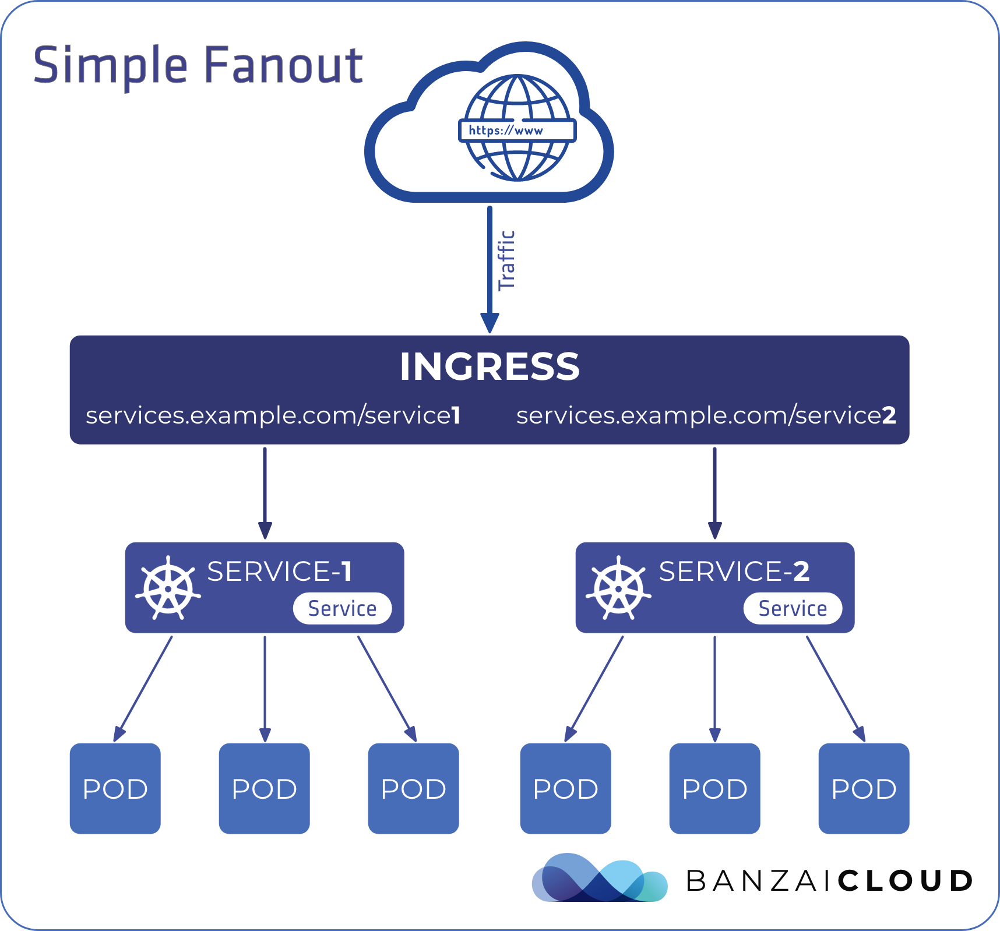
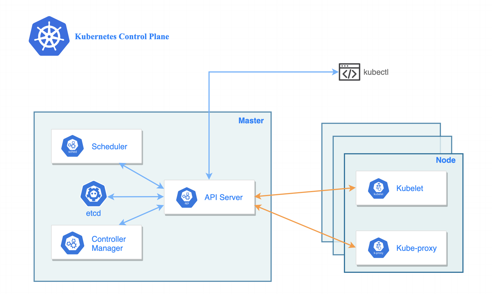
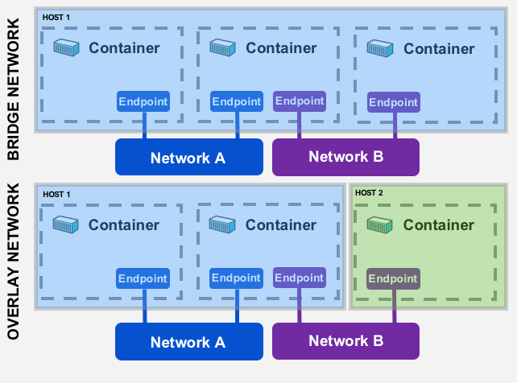
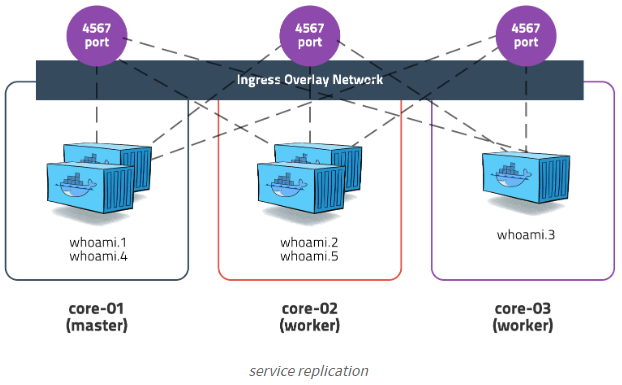

# 12장 컨테이너 오케스트레이션: 도커 스웜과 쿠버네티스

운영 환경에서 애플리케이션은 컨테이너에서 실행되지만, 여러 대의 도커 호스트와 컨테이너를 관리해주는 관리 레이어가 한 층 추가된다. 이 관리 레이어를 오케스트레이션이라고 하며, 주요 오케스트레이션 도구로 도커 스웜과 쿠버네티스가 있다.

## 12.1 컨테이너 오케스트레이션 도구란?

오케스트레이션 도구란 기본적으로 `클러스터` 를 구성하는 여러 대의 호스트 컴퓨터를 의미한다. 오케스트레이션 도구는 컨테이너를 관리하고, 서비스를 제공하기 위한 작업을 여러 컴퓨터에 분배하며, 네트워크 트래픽 부하를 고르게 분산시키고, 상태가 불량한 컨테이너를 새 컨테이너로 교체하는 일을 담당한다.

✅ 오케스트레이션 도구는 컨테이너에 네트워크 관련 기능, 설정값, 스토리즈도 제공한다.



```docker
- 명령행 도구 & API
	- 클러스터가 마치 하나의 대상인 것처럼 명령행 도구와 API를 통해 명령을 보내고 쿼리를 요청한다.

- INGRESS 
	- HTTP/HTTPS로 클러스터에 접근하는 공개 엔드포인트

- SERVICE
	- 여러 개의 파드(Pods) 사이에 네트워크 트래픽을 분산시키는 역할
```

## 12.2 도커 스웜으로 클러스터 만들기

✅ 도커 엔진을 스웜 모드로 전환한다.

```docker
$ docker swarm init
Swarm initialized: current node (p95t66n6ui8v6y7u911098bv5) is now a manager.

To add a worker to this swarm, run the following command:

    docker swarm join --token SWMTKN-1-0q1zocaa83ukzrurr8b1ygrweetwiwa22hdz3ujghbt1d6spof-bl1nn06d0mto7dl0j10qdq23l 192.168.65.3:2377

To add a manager to this swarm, run 'docker swarm join-token manager' and follow the instructions.
```

✅ 클러스터에 속한 컴퓨터는 매니저와 워커라는 두 가지 역할 중 하나를 맡는다.



```docker
Master Node
- 클러스터를 관리하는 작업을 직접 수행한다.
- etcd: 쿠버네티스의 모든 클러스터 데이터를 저장하는 분산 키-값 저장소
- API 서버(Kube-apiserver): 쿠버네티스 API를 노출하는 구성요소
- 스케줄러(Kube-scheduler): 워커 노드 중 어디에 파드를 배치할지 결정하는 구성요소

Worker Node
- 매니저의 스케줄링에 따라 컨테이너를 실행하고 그 상태를 매니저에 보고하는 역할
- kubelet: 각 노드에서 실행되며, 마스터 노드와 통신하여 파드를 시작, 중지, 그리고 관리하는 구성요소
- kube-proxy: 각 노드에서 실행되며, 쿠버네티스 서비스의 네트워크 프록시를 제공하는 구성요소
```

✅ 스웜에 노드를 추가하려면, 스웜에 들어가기 위한 참가 토큰을 매니저로부터 발급받아야 한다.

```docker
# 워커 노드로 스웜에 참여하기 위한 명령을 화면에 출력
docker swarm join-token worker

# 매니저 노드로 스웜에 참여하기 위한 명령을 화면에 출력
docker swarm join-token manager

# 스웜에 참여 중인 노드의 목록을 출력
docker node ls
```

## 12.3 도커 스웜 서비스로 애플리케이션 실행하기

### Docker Swarm - Service

- 기본적인 배포 단위로, 기동할 이미지, 컨테이너 수, 설정 등을 정의한 것
- docker service create 명령어를 사용하여 생성하며, --replicas 옵션을 사용하여 동일 이미지를 기동할 컨테이너 수를 지정할 수 있다.
    
    ```docker
    $ docker service create --name timecheck --replicas 1 diamo/ch12-timecheck:1.0
    
    $ docker service ls
    ☁  ~  docker service ls
    ID             NAME        MODE         REPLICAS   IMAGE                       PORTS
    xxgvd721l831   timecheck   replicated   1/1        diamol/ch12-timecheck:1.0
    ```
    

✅ 도커 스웜이 레플리카 수를 유지해준다.

```docker
☁  ~  docker container ls
CONTAINER ID   IMAGE                       COMMAND                  CREATED         STATUS         PORTS     NAMES
7c469f770d54   diamol/ch12-timecheck:1.0   "dotnet TimeCheck.dll"   2 minutes ago   Up 2 minutes             timecheck.1.ny83r1wk3bnbdptz97hvqbufi

# 컨테이너 중단 및 삭제
☁  ~  docker container stop 7c469f770d54
7c469f770d54
☁  ~  docker container rm 7c469f770d54
7c469f770d54

# 컨테이너 자동 생성
☁  ~  docker container ls
CONTAINER ID   IMAGE                       COMMAND                  CREATED         STATUS                  PORTS     NAMES
f8303b8613c0   diamol/ch12-timecheck:1.0   "dotnet TimeCheck.dll"   6 seconds ago   Up Less than a second             timecheck.1.x0apmx5mzrksnktyfdsumlkd3
```

✅ 스웜 모드에서는 docker service 명령을 사용해 애플리케이션을 관리한다.

```docker
# 최근 10초간의 로그를 출력한다.
docker service logs --since 10s timecheck

# 서비스의 정보 중 이미지 정보를 출력한다.
docker service inspect timecheck -f '{{.Spec.TaskTemplate.ContainerSpec.Image}}'
```

✅ 도커 스웜은 애플리케이션 정의를 저장할 공간을 갖지 않는다.

로컬 컴퓨터에 YAML 파일을 갖고 있지 않아도 원격에서 애플리케이션을 관리할 수 있다. 서비스 정의를 변경하면 스웜이 레플리카를 하나씩 새로운 것으로 교체하며 변경 사항을 적용한다.

```docker
# 서비스에 사용된 이미지 버전을 수정한다.
☁  ~  docker service ls
ID             NAME        MODE         REPLICAS   IMAGE                       PORTS
xxgvd721l831   timecheck   replicated   1/1        diamol/ch12-timecheck:1.0

☁  ~  docker service update --image diamol/ch12-timecheck:2.0 timecheck
timecheck
overall progress: 1 out of 1 tasks
1/1: running   [==================================================>]
verify: Service converged
 
☁  ~  docker service ps timecheck
ID             NAME              IMAGE                       NODE             DESIRED STATE   CURRENT STATE             ERROR                         PORTS
3m4pkf2m77qu   timecheck.1       diamol/ch12-timecheck:2.0   docker-desktop   Running         Running 12 seconds ago
x0apmx5mzrks    \_ timecheck.1   diamol/ch12-timecheck:1.0   docker-desktop   Shutdown        Shutdown 15 seconds ago
ny83r1wk3bnb    \_ timecheck.1   diamol/ch12-timecheck:1.0   docker-desktop   Shutdown        Failed 13 minutes ago     "task: non-zero exit (143)"

☁  ~  docker service logs --since 20s timecheck
timecheck.1.3m4pkf2m77qu@docker-desktop    | App version: 2.0; time check: 14:05.59
timecheck.1.3m4pkf2m77qu@docker-desktop    | App version: 2.0; time check: 14:06.04
timecheck.1.3m4pkf2m77qu@docker-desktop    | App version: 2.0; time check: 14:06.09
timecheck.1.3m4pkf2m77qu@docker-desktop    | App version: 2.0; time check: 14:06.14
timecheck.1.3m4pkf2m77qu@docker-desktop    | App version: 2.0; time check: 14:06.19
```

✅ 롤링 업데이트

모든 컨테이너 오케스트레이션 도구는 애플리케이션을 업데이트할 때 애플리케이션을 중단시키지 않고 점진적으로 컨테이너를 교체해 나가는 `롤링 업데이트 방식` 을 사용한다.

- 신 버전 컨테이너에서 문제가 발생하면 업데이트 자동 중단
- 명령 한 번으로 이전 버전으로 롤백 가능
    
    ```docker
    ☁  ~  docker service update --rollback timecheck
    timecheck
    rollback: manually requested rollback
    overall progress: rolling back update: 1 out of 1 tasks
    1/1: running   [>                                                  ]
    verify: Service converged
    
    ☁  ~  docker service ps timecheck
    ID             NAME              IMAGE                       NODE             DESIRED STATE   CURRENT STATE             ERROR                         PORTS
    kxrll47fwk4z   timecheck.1       diamol/ch12-timecheck:1.0   docker-desktop   Running         Running 14 seconds ago
    3m4pkf2m77qu    \_ timecheck.1   diamol/ch12-timecheck:2.0   docker-desktop   Shutdown        Shutdown 14 seconds ago
    x0apmx5mzrks    \_ timecheck.1   diamol/ch12-timecheck:1.0   docker-desktop   Shutdown        Shutdown 8 minutes ago
    ny83r1wk3bnb    \_ timecheck.1   diamol/ch12-timecheck:1.0   docker-desktop   Shutdown        Failed 22 minutes ago     "task: non-zero exit (143)"
    ```
    

## 12.4 클러스터 환경에서 네트워크 트래픽 관리하기

### overlay network

클러스터에 속한 모든 노드를 연결하는 가상 네트워크다.

오버레이 네트워크에 연결된 서비스는 서비스 이름을 도메인 네임 삼아 다른 서비스와 통신할 수 있다.

✅ 스웜의 네트워크는 클러스터 전체를 연결하면서도 애플리케이션에서는 서로 독립적인 환경을 제공해야 한다.

- 오버레이 네트워크는 스웜을 구성하는 모든 노드를 연결한다.
- 같은 네트워크에 연결된 서비스에 속한 컨테이너끼리만 서로 통신할 수 있다.



```docker
Bridge 네트워크: 단일 호스트에서 컨테이너 간의 네트워크 연결을 제공한다.
Overlay 네트워크: 여러 호스트에 분산된 컨테이너 간의 네트워크 연결을 제공한다.
```

✅ 도커 스웜에서는 모든 레플리카가 하나의 주소를 공유한다.

도커 스웜은 서비스 접근에 대한 신뢰성을 높이고 부하를 잘 분산시키기 위해 VIP 네트워크를 사용한다.

1. 스웜 모드에서 서비스를 실행해 오버레이 네트워크에 연결하기
    
    ```docker
    ☁  ~  docker network create --driver overlay iotd-net
    tgx5nt2ybyukz6u3q7i8wnqyi
    ☁  ~  docker service create --detach --replicas 3 --network iotd-net --name iotd diamol/ch09-image-of-the-day
    p4ggfbyfuvg2p8tdqmfndj2s2
    
    ☁  ~  docker service ls
    ID             NAME      MODE         REPLICAS   IMAGE                                 PORTS
    p4ggfbyfuvg2   iotd      replicated   3/3        diamol/ch09-image-of-the-day:latest
    
    ☁  ~  docker service create --detach --replicas 2 --network iotd-net --name accesslog diamol/ch09-access-log
    xbd8f6vic1c1dwl8dvoto3i7m
    
    ☁  ~  docker service ls
    ID             NAME        MODE         REPLICAS   IMAGE                                 PORTS
    xbd8f6vic1c1   accesslog   replicated   2/2        diamol/ch09-access-log:latest
    p4ggfbyfuvg2   iotd        replicated   3/3        diamol/ch09-image-of-the-day:latest
    ```
    
2. API 서비스에 대해 DNS 조회를 요청한다.
    
    ```docker
    ☁  ~  docker exec -it 840f196401d9 /bin/sh
    /app #
    /app # nslookup iotd
    nslookup: can't resolve '(null)': Name does not resolve
    
    Name:      iotd
    Address 1: 10.0.1.2
    /app #
    /app #
    /app # nslookup accesslog
    nslookup: can't resolve '(null)': Name does not resolve
    
    Name:      accesslog
    Address 1: 10.0.1.7
    ```
    

### Ingress networking

인그레스 네트워크는 스웜을 구성하는 모든 노드가 서비스가 공개한 포트를 감시하는 방식으로 동작한다. 

- 컨테이너가 실행 중이 아닌 노드에 요청이 들어오면 요청을 처리하지 못하기 때문에 처리할 수 있는 다른 노드로 요청을 포워딩한다.
- 요청이 도달한 노드에서 컨테이너가 여러 개 실행 중이라면, 도커 엔진이 컨테이너 간에 고르게 요청을 배분한다.
