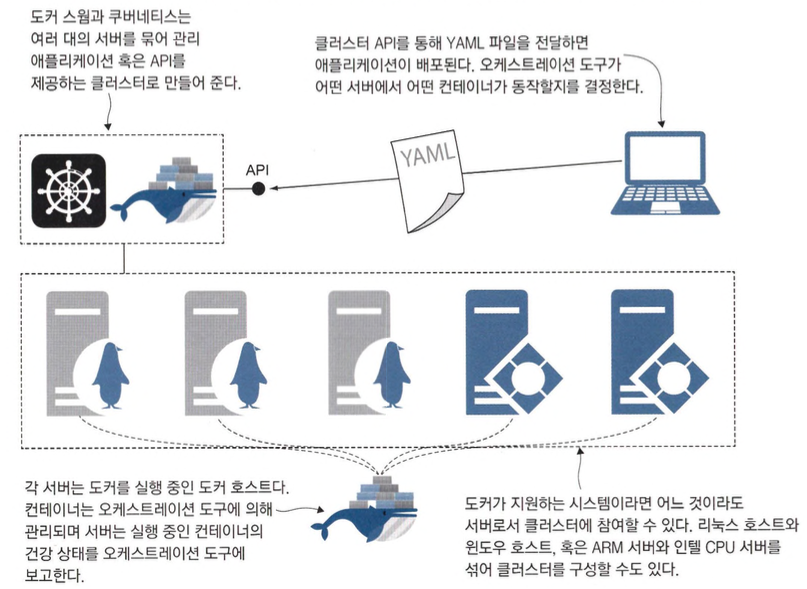
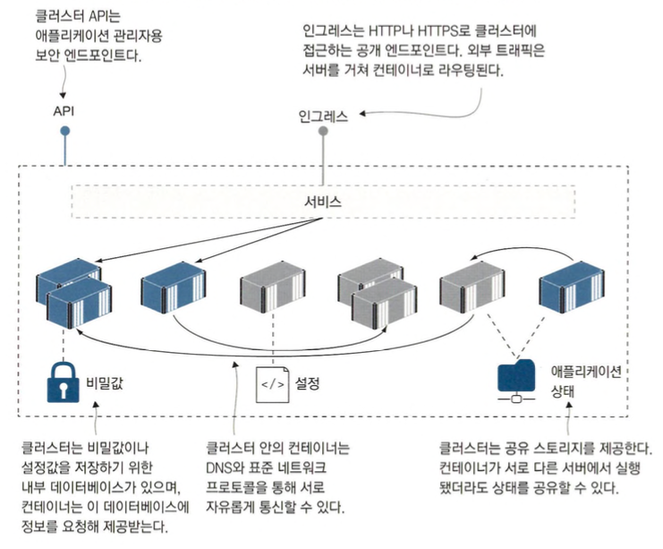
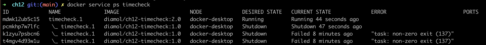
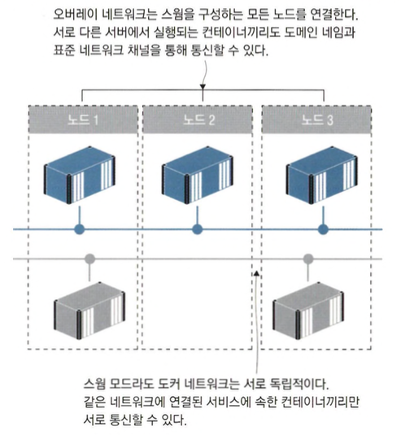
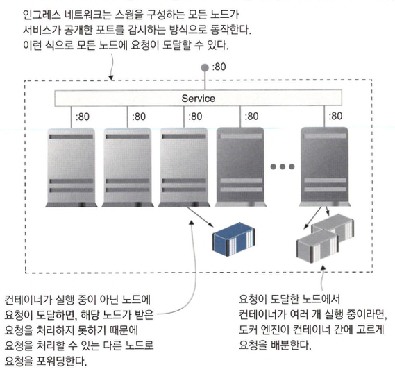

# 컨테이너 오케스트레이션: 도커 스웜과 쿠버네티스

- 도커 스웜은 도커에 내장되어 있는 기능입니다.
- 쿠베네티스를 익히기전에 도커 스웜을 익혀두면 쿠버네티스 학습이 수월하다고 합니다.

## 컨테이너 오케스트레이션 도구란?

- 오케스트레이션 도구란 기본적으로 클러스터를 구성하는 여러 대의 호스트 컴퓨터를 의미합니다.
- 여러 대의 호스트에 도커를 설치해 클러스터를 만들고 이들 컴퓨터를 오케스트레이션 플랫폼(스웜이나 쿠버네티스)에 등록하여 사용합니다.



- 어떤 서버가 고장 나면 컨테이너 일부가 손실되어도 클러스터가 다른 서버에서 대체 컨테이너를 실행합니다.



- 오케스트레이션 도구가 각 서버. 네트워크. 스토리지 장치의 세부 사항을 가려줍니다.
- 케스트레이션 계층이 컨테이너까지 이어지는 트래픽 라우팅을 담당해서 클러스터가 마치 하나의 대상인 것처럼 명령행 도구와 API를 통해 명령을 보내고 쿼리를 요청해 사용할 수 있습니다.

## 도커 스웜으로 클러스터 만들기

```shell
docker swarm init
```

- 클러스터에 속한 컴퓨터는 매니저와 워커라는 두 가지 역할 중 하나를 맡습니다.
- 위 명령어 입력시 클러스터를 참여시킬수 있는 join 명령어가 출력됩니다.
- 매니저
  - 클러스터를 관리하는 작업
  - 클러스터 데이터베이스
  - 사용자가 YAML 파일을 전달하기 위해 사용하는 API
  - 컨테이너 모니터링과 스케줄링
- 워커
  - 컨테이너를 실행하고 그 상태를 주기적으로 매니저에 보고하는 역할
- 스웜에 추가된 컴퓨터를 노드라고 부르며 매니저로부터 참가토큰을 발급받아 참여할 수 있습니다.(단 같은 네트워크 상에 있어야함)

```shell
docker swarm join-token worker
docker swarm join-token manager
docker node ls
```

- 각각 워커와 매니저 토큰을 조회하는 명령어, 참가 노드를 확인하는 명령어입니다.
- 단일 노드 스웜도 노드가 여러 개인 스웜과 같은 방식으로 동작하지만 스케일링이 안됩니다.
- 도커 스웜이 쿠버네티스보다 좋은 점은 클러스터를 구성하고 관리하는 작업이 단순합니다.

## 도커 스웜 서비스로 애플리케이션 실행하기

```shell
docker service create --name timecheck --replicas 1 diamol/ch12-timecheck:1.0
docker service ls
```

- 여기서 서비스는 컨테이너와 거의 동일하지만 서비스의 경우 여러개의 레플리카를 가질 수 있습니다.

```shell
docker service ps timecheck
docker ps
docker rm -f $(docker ps --last 1 -q)
docker service ps timecheck
```

- 레플리카는 평범한 도커 컨테이너이므로 `docker container`명령어를 사용할 수 있습니다.
- 레플리카를 삭제하니 도커 스웜이 컨테이너가 부족하다고 판단하고 대체 컨테이너를 실행하는것을 확인할 수 있습니다.

```shell
docker service logs --since 10s timecheck
docker service inspect timecheck -f '{{.Spec.TaskTemplate.ContainerSpec.Image}}'
```

- service 부명령어를 이용해서 container 로그나 정보를 출력할 수 있습니다.
- 도커 컴포즈는 어플리케이션 정의는 도커 컴포즈 파일에만 있는것에 반해 도커 스웜은 클러스터에 저장됩니다.

```shell
docker service update --image diamol/ch12-timecheck:2.0 timecheck
docker service ps timecheck
docker service logs --since 20s timecheck
```

- `update` 명령어로 버전을 할 수 있습니다.



- 오케스트레이션 도구는 애플리케이션을 업데이트할 때 애플리케이션을 중단시키지 않고 점진적으로 컨테이너를 교체해 나가는 롤링 업데이트 방식을 사용하는데 래풀라카가 여려개라면 무중단 배포가 가능합니다.
- 컨테이너 교체시 두개 씩 교체하거나 먼저 교체된 컨테이너가 정상인지 체크 후 교체도 가능합니다.

```shell
docker service update --rollback timecheck
docker service ps timecheck
docker service logs --since 25s timecheck
```

- 도커 스웜의 데이터베이스는 이전 버전의 서비스 정의 내용이 남아 있으므로 명령 한 번으로 이전 버전으로 롤백할 수 있습니다.

## 클러스터환경에서 네트워크 트래픽 관리하기

- 컴포넌트는 도메인 네임으로 서로를 식별하며, 도커 DNS 서버가 도메인 네임을 조회해 IP 주소를 알려주면 이 IP 주소로 트래픽을 전달되고 컨테이너는 응답합니다.(TCP/IP 방식)
- 스웜 모드에서는 오버레이 네트워크(클러스터에 속한 모든 노드를 연결하는 가상 네트워크)를 사용할 수 있습니다.



```shell
docker service rm timecheck
docker network create --driver overlay iotd-net
docker service create -d --replicas 3 --network iotd-net --name iotd diamol/ch09-image-of-the-day
docker service create -d --replicas 2 --network iotd-net --name accesslog diamol/ch09-access-log
docker service ls
```

- 천문api 3EA와 로그 api 2EA를 실행시켜 `iotd-net`에 연결시킵니다.

```shell
docker exec -it $(docker ps --last 1 -q) sh
nslookup iotd
nslookup accesslog
```

- 컨테이너에 접근하여 IP주소를 확인할 수 있습니다.
- 각 서비스마다 하나의 IP만 출력되는데 이 IP 주소는 가상 IP 주소로 서비스에 속하는 모든 레플리카가 공유하는 주소입니다.(VIP 네트워킹)



- 서비스를 생성할 때 공개할 포트를 지정하기만 하면 인그레스 네트워크를 사용할 수 있습니다.

```shell
docker service create -d --name image-gallery --network iotd-net -p 8010:80 --replicas 2 diamol/ch09-image-gallery
docker service ls
```

- image-gallery web을 2EA로 실행하고 8010 port를 공개합니다.

## 도커 스웜과 쿠버네티스 중 무엇을 사용할까?

- 쿠버네티스의 경우 애저, AWS, 구글 클라우드 등 다양한 매니지드 서비스가 있는 반면 도커 스웜은 없다.
- 반복적인 클러스터 생성의 경우 간편한 도커 스웜이 유리합니다.
- 애플리케이션을 클라우드 환경에 배포하고 있다면. 쿠버네티스가 더 적합/온프레미스 환경이라면 관리 면에서 스웜이 훨씬 간편
- 학습면에서는 도커스웜이 유리
- 기능면에서는 쿠버네티스가 유리(신규 기능도 쿠베네티스가 계속 업데이트)
- 결국은 쿠버네티스로 가지만 초기에는 도커스웜으로 시작하는것도 나쁘지 않다.
