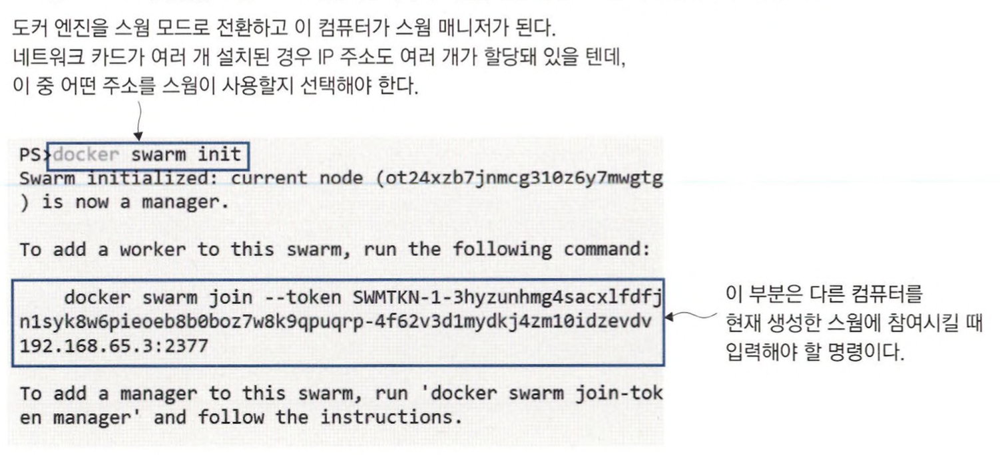

# 컨테이너 오케스트레이션 도구

운영 환경은 단일 호스트로만 구성되지 않는다. 서비스 운영을 위한 시스템은 고가용성을 요구하는데, 이 때문에 오케스트레이션이 필요해진다. <br>
오케스트레이션 도구란 **클러스터를 구성하는 여러 대의 호스트 컴퓨터**를 의미한다. <br>
오케스트레이션 도구는 컨테이너를 관리하고, 서비스를 제공하기 위한 작업을 여러 컴퓨터에 분배하며, <br>
네트워크 트래픽 부하를 고르게 분산시키고, 상태가 불량한 컨테이너를 새 컨테이너로 교체하는 일을 담당한다.

여러 대의 호스트에 도커를 설치해 클러스터를 만들고 나면, 이들 컴퓨터를 오케스트레이션 플랫폼(스웜이나 쿠버네티스)에 등록한다. <br>
그 이후는 CLI나 웹 UI를 통해 원격에서 클러스터를 관리할 수 있다.


<br>

> 클러스터에는 클러스터에 배포된 애플리케이션에 대한 모든 정보가 담긴 분산 데이터베이스와 어떤 컨테이너를 어떤 호스트에서 실행할지 배정하는 스케줄러, <br>
> 클러스터를 구성하는 호스트 간에 주기적으로 연락 신호를 주고받는 시스템이 있는데, 이는 클러스터의 신뢰성을 확보하는 수단이 된다. <br>
> 클러스터에 애플리케이션을 배포하려면 클러스터에 YAML 파일을 전달하면 된다. <br>
> 그러면 클러스터가 애플리케이션 구성 정보를 저장하고 그에 맞춰 동원 가능한 서버에서 컨테이너를 생성해 애플리케이션을 실행한다. <br>
> 어떤 서버가 고장나면 컨테이너 일부가 손실되겠지만, 클러스터가 다른 서버에서 대체 컨테이너를 실행한다.

<br>


우리는 클러스터가 마치 하나의 대상인 것처럼 CLI와 API를 통해 명령을 보내고 쿼리를 요청해 사용한다. <br>
호스트 대수와 상관없이 똑같은 명령을 사용하고 YAML 파일을 전달해 애플리케이션을 배포할 수 있다.


<br>
<hr>


# 도커 스웜으로 클러스터 만들기

*도커 스웜은 도커 엔진에 포함돼 있어 별도의 설치가 필요 없고, 도커 엔진을 스웜 모드로 전환해 클러스터를 초기화하면 된다.*

```bash
# 도커 엔진을 스웜 모드로 전환하면 매니저 역할을 맡은 단일 노드를 가진 클러스터가 만들어진다.
docker swarm init
```



> 매니저는 클러스터를 관리하는 작업을 직접 수행한다. <br>
> 클러스터 데이터베이스도 매니저 노드에 저장되며, 사용자가 YAML 파일을 전달하기 위해 사용하는 API, 컨테이너 모니터링과 스케줄링 모두 매니저 노드가 수행한다. <br>
> 이와 달리 워커는 매니저의 스케줄링에 따라 컨테이너를 실행하고 그 상태를 주기적으로 매니저에 보고하는 역할을 하는데. 매니저도 워커의 역할을 수행할 수는 있다.

스웜을 만들고 나면 원하는 만큼 컴퓨터를 스웜에 추가할 수 있다. *(스웜에 추가된 컴퓨터를 노드 라고 부른다.)* <br>
스웜에 노드로 추가하려면, 해당 컴퓨터가 스웜과 같은 네트워크상에 있어야 하고 스웜에 들어가기 위한 패스워드 역할을 하는 토큰을 매니저로부터 발급받아야 한다.

```bash
# 워커 노드로 스웜에 참여하기 위한 명령을 화면에 출력
docker swarm join-token worker

# 매니저 노드로 스웜에 참여하기 위한 명령을 화면에 출력
docker swarm join-token manager

# 스웜에 참여 중인 노드의 목록을 출력
docker node ls
```


<br>

> 단일 노드 스웜도 노드가 여러 개인 스웜과 같은 방식으로 동작한다. <br>
> 다만 노드가 하나인 만큼 노드가 여러 개인 스웜에 비해 높은 가용성을 가질 수 없으며 컨테이너 수를 원하는 만큼 증가시키는 스케일링이 불가능하다는 점이다.


<br>
<hr>

# 도커 스웜 서비스로 애플리케이션 실행

도커 스웜 환경에서는 컨테이너를 직접 실행할 필요가 없다. *(서비스를 배포하면 스웜이 대신 컨테이너를 실행해 준다.)* <br>
서비스는 컨테이너를 추상화한 개념이고, 하나의 서비스가 여러 개의 컨테이너로 배포될 수 있다.

서비스는 컨테이너와 같은 정보로 정의된다. (이미지, 환경 변수, 공개 포트 등) <br>
차이점으로는 여러 개의 레플리카(서비스와 똑같이 설정되지만 스웜상의 여러 노드에 흩어져 배치될 수 있다)를 가질 수 있다.

````bash
docker service create --name timecheck --replicas 1 diamol/ch12-timecheck:1.0

docker service ls
````


<br>

````bash
docker service ps timecheck

docker container ls

docker container rm -f $(docker container ls --last 1 -q)

docker service ps timecheck
````


<br>

> 도커 엔진을 스웜 모드로 전환했다면. 애플리케이션을 서비스로 보고 각각의 컨테이너를 관리하는 것은 스웜에 맡겨야 한다. <br>
> docker service 명령을 사용해 레플리카의 로그를 확인하거나 서비스의 구성을 확인할 수 있다.


```bash
# 최근 10초간 로그 출력
docker service logs --since 10s timecheck

# 서비스의 정보 중 이미지 정보 출력
docker service inspect timecheck -f '{{.Spec.TaskTemplate.ContainerSpec.Image}}'
```


**서비스를 하나의 대상으로 취급해 레플리카의 로그를 확인하거나 서비스 자체의 구성 정보를 확인할 수 있다.**

<br>

> 서비스 전체의 구성 정보는 클러스터에 저장돼 있으므로, service inspect 명령을 입력하면 확인할 수 있다. <br>
> 클러스터 데이터베이스에 있는 정보들은 암호화돼 모든 매니저 노드마다 복제본이 위치한다. <br>
> 스웜 모드에서는 애플리케이션 정의가 클러스터에 저장되어서, 로컬 컴퓨터에 YAML 파일을 갖고 있지 않아도 원격에서 애플리케이션을 관리할 수 있다.

<br>

```bash
# 서비스에 사용된 이미지 버전 수정
docker service update --image diamol/ch12-timecheck:2.0 timecheck

docker service ps timecheck

docker service logs --since 20s timecheck
```

**서비스를 업데이트하면 점진적 롤링 업데이트 방식으로 새로운 버전의 애플리케이션이 배치된다.**


<br>

```bash
# 이전 버전으로 롤백
docker service update --rollback timecheck

docker service ps timecheck
```


<br>
<hr>


# 클러스터 환경에서 네트워크 트래픽 관리

스웜 모드의 네트워크는 표준 TCP/IP 방식이다. <br>
컴포넌트는 도메인 네임으로 서로를 식별하며, 도커 DNS 서버가 도메인 네임을 조회해 IP 주소를 알려주면 이 IP 주소로 트래픽을 전달한다.

서로 다른 노드를 신경쓰지 않고 컨테이너 간 통신이 가능하게 하기 위해 다양한 네트워크 로직이 있다. <br>
스웜 모드에서는 **오버레이 네트워크**라는 새로운 형태의 도커 네트워크를 사용할 수 있다. <br>
이는 클러스터에 속한 모든 노드를 연결하는 가상 네트워크이고, 오버레이 네트워크에 연결된 서비스 이름을 도메인 네임 삼아 다른 서비스와 통신할 수 있다.


<br>

> 오버레이 네트워크와 일반적인 도커 네트워크의 차이점이 한 가지 더 있다. <br>
> 도커 컴포즈로 하나의 서비스를 여러 컨테이너로 스케일링 하고, 서비스에 대한 DNS 질의를 하면 모든 컨테이너의 IP 주소가 응답에 포함됐다. <br>
> 이 중 어느 IP 주소로 실제 트래픽이 전달될지는 서비스를 사용하는 쪽(컨슈머)의 몫이었다. <br>
> 스웜에서 실행한 서비스는 수백 개의 레플리카를 가질 수도 있기 때문에 이런 방식은 제대로 된 스케일링이라 할 수 없다. <br>
> **이런 경우 오버레이 네트워크에서는 서비스를 가리키는 가상 IP 주소 하나를 반환한다.**

<br>

```bash
docker service rm timecheck

# 새로운 오버레이 네트워크 생성
docker network create --driver overlay iotd-net

# 애플리케이션의 API 서비스와
docker service create -d --replicas 3 --network iotd-net --name iotd diamol/ch09-image-of-the-day

# 로그 API를 실행해 같은 네트워크에 연결
docker service create -d --replicas 2 --network iotd-net --name accesslog diamol/ch09-access-log

docker service ls
```


<br>

```
# 컨테이너에 터미널로 접속
docker container exec -it $(docker container ls --last 1 -q) sh

# DNS 조회
nslookup iotd
nslookup accesslog
```

**서비스가 여러 개의 컨테이너를 실행함에도 각 서비스마다 IP 주소가 하나씩 조회**


> 클라이언트가 이 IP 주소로 요청을 보내면, 운영체제의 네트워크 계층에서 이 IP 주소의 종착점이 여러 곳임을 파악하고 그 중 하나를 결정해 준다.

<br>

도커 스웜은 서비스 접근에 대한 신뢰성을 높이고 부하를 잘 분산시키기 위해 VIP 네트워크를 사용한다. <br>
이러한 네트워크의 동작은 클러스터를 스케일링하거나 애플리케이션을 스케일링하게 되면 훨씬 더 복잡해진다. <br>
**도커 스웜에서는 노드 속 컨테이너로 트래픽을 라우팅하기 위해 인그레스 네트워킹을 사용한다.**


<br>

서비스의 포트를 공개하면 인그레스 네트워크가 기본적으로 적용된다.

```bash
docker service create -d --name image-gallery --network iotd-net --publish 8010:80 --replicas 2 diamol/ch09-image-gallery

docker service ls
```


<br>
<hr>


# 도커 스웜 vs 쿠버네티스

도커 스웜은 상대적으로 기능이 간단한 컨테이너 오케스트레이션 도구로 설계됐다. <br>
네트워크와 서비스의 개념을 도커 컴포즈에서 차용해, 오케스트레이션 도구로서 도커 엔진에 적용했다.

쿠버네티스는 주요 클라우드 서비스에서 매니지드 서비스 형태로 제공된다. <br>
azure, aws, gcp에서 cli나 클릭으로 여러 대의 노드를 갖춘 쿠버네티스 클러스터를 생성할 수 있다. <br>
클라우드 서비스에서는 클러스터의 생성부터 노드 역할을 하는 가상 머신의 관리까지 맡아 준다.


