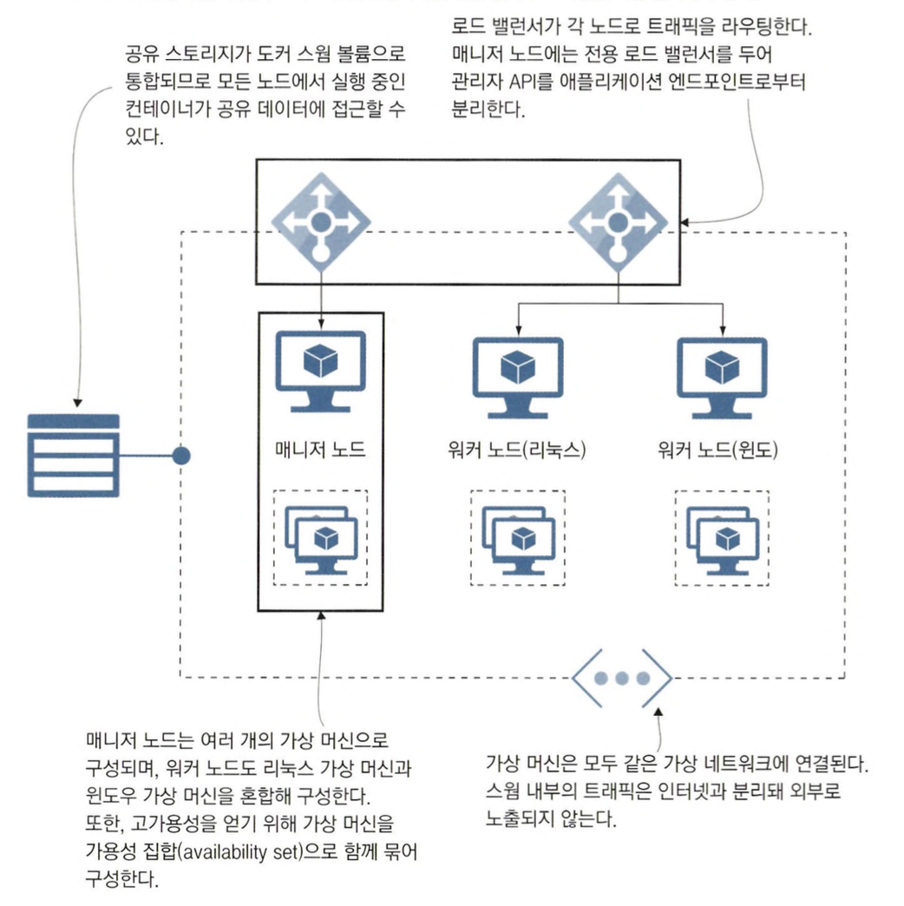

# 컨테이너 오케스트레이션 : 도커 스웜과 쿠버네티스

## 컨테이너 오케스트레이션 도구란?

### 운영 환경에서의 컨테이너 관리

도커 컴포즈는 단일 도커 호스트에서 컨테이너를 실행하기 위한 도구였습니다.

하지만 운영 환경은 단일 호스트로만 구성되지 않습니다.

단일 호스트 환경에서는 호스트 한 대만 고장을 일으켜도 전체 애플리케이션이 중단 됩니다.

서비스 운영을 위한 시스템은 고가용성을 요구하는데 이 때문에 오케스트레이션이 필요해집니다.

오케스트레이션 도구는 `컨테이너를 관리하고, 서비스를 제공하기 위한 작업을 여러 컴퓨터에 분배하며, 네트워크 트래픽 부하를 고르게 분산시키고, 상태가 불량한 컨테이너를 새 컨테이너로 교체하는 일을 담당`합니다.

여러 대의 호스트에 도커를 설치해 클러스터를 만들고 나면, 이들 컴퓨터를 오케스트레이션 플랫폼에 등록합니다.

그 다음부터는 명령해 도구나 웹 UI를 통해 원격에서 클러스터를 관리할 수 있습니다.

### 오케스트레이션 도구 구성

다음은 오케스트레이션이 적용된 인프라스트럭처를 나타낸 것 입니다.


오케스트레이션 도구에는 컨테이너의 잠재력을 한층 더 살릴 수 있는 기능이 있습니다.

- 클러스터에 배포된 애플리케이션에 대한 모든 정보가 담긴 분산 데이터베이스와
- 어떤 컨테이너를 어떤 호스트에서 실행할지 배정하는 스케줄러
- 클러스터를 구성하는 호스트 간에 주기적으로 연락 신호를 주고 받는 시스템

이러한 시스템을 통해 클러스터의 신뢰성을 확보하는 기본적인 수단이 됩니다.

### 오케스트레이션 도구를 이용한 배포 과정

클러스터에 애플리케이션을 배포하기 위해서는 다음과 같은 과정을 거칩니다.

1. 클러스터에 설정 정보가 담긴 YAML 파일 전달
2. 클러스터가 애플리케이션 구성 정보를 저장하고 그에 맞춰 동원 가능한 서버에서 컨테이너를 생성해 애플리케이션을 실행
3. 애플리케이션이 실행되면 클러스터는 애플리케이션 실행 상태가 유지되도록 관리
4. 어떤 컨테이너가 고장날 경우 클러스터가 대체 컨테이너 실행

위와 같이 복잡한 컨테이너 관리는 모두 오케스트레이션 도구가 대신 해줍니다.

우리는 YAML에 원하는 애플리케이션 상태를 작성하기만 하면 되며, 어떤 서버에서 몇 개의 컨테이너를 실행해야 할지는 신경쓰지 않아도 됩니다.

### 오케스트레이션 도구에서의 설정 관리

오케스트레이션 도구는 추가로 네트워크, 애플리케이션 설정, 데이터 저장 등의 기능도 제공합니다.


추가적으로 오케스트레이션 도구를 사용하면 각 서버, 네트워크, 스토리지 장치의 세부 사항을 가려줍니다.

우리는 클러스터가 마치 하나의 대상인 것처럼 요청하고 사용할 수 있습니다.

## 도커 스웜으로 클러스터 만들기

### 도커 스웜 초기화

도커 스웜은 도커 엔진에 포함되어 있어 별도의 설치가 필요 없습니다.

도커 엔진을 스웜모드로 전환해 클러스터를 초기화하면 됩니다.

```yaml
docker swarm init
```

출력 결과를 보면 도커 스웜이 초기화되고 내 컴퓨터가 클러스터 매니저가 되는 것을 볼 수 있습니다.

클러스터에 속한 컴퓨터는 매니저와 워커라는 두 가지 역할 중 하나를 맡습니다.

<aside>
💡 출력된 내용 중에 다른 컴퓨터를 클러스터에 워커로 참여시키기 위한 명령어도 나옵니다.

</aside>

### 매니저와 워커

매니저는 `클러스터를 관리하는 작업을 직접 수행`합니다.

`클러스터 데이터베이스`도 매니저 노드에 저장되며, `사용자가 YAML 파일을 전달하기 위해 사용하는 API`도 매니저 노드에서 동작하고 `컨테이너 모니터링과 스케줄링` 모두 매니저 노드가 수행합니다.

워커는 `매니저의 스케줄링에 따라 컨테이너를 실행하고 그 상태를 주기적으로 매니저에 보고하는 역할`을 합니다.

<aside>
💡 매니저도 워커의 역할을 수행할 수는 있습니다.

</aside>

### 스웜에 컴퓨터 추가하기

스웜을 만들고 나면 원하는 만큼 컴퓨터를 스웜에 추가할 수 있습니다.

`스웜에 추가된 컴퓨터를 노드`라고 부릅니다.

스웜에 노드로 추가하려면 다음과 같은 조건이 필요 합니다.

- 해당 컴퓨터가 스웜과 같은 네트워크 상에 있어야 합니다.
- 스웜에 들어가기 위한 패스워드 역할을 하는 참가 토큰을 매니저로부터 발급받아야 합니다.

매니저 노드에 접근 가능하면 매니저용 혹은 워커용 참가 토큰을 출력하거나 스웜에 현재 참여중인 목록을 볼 수 있습니다.

```bash
# 워커 노드로 스웜에 참여하기 위한 명령을 화면에 출력
docker swarm join-token worker

# 매니저 노드로 스웜에 참여하기 위한 명령을 화면에 출력
docker swarm join-token manager

# 스웜에 참여 중인 노드의 목록을 출력
docker node ls
```

### 단일 노드 스웜과 멀티 노드 스웜

단일 노드 스웜도 노드가 여러 개인 스웜과 같은 방식으로 동작합니다.

다른 점이 있다면, 노드가 하나인 만큼 노드가 여러 개인 스웜에 비해 높은 가용성을 가질 수 없으며 컨테이너 수를 원하는 만큼 증가시키는 스케일링이 불가능하다는 점입니다.

다음은 단일 노드 스웜과 노드가 여러 개인 스웜을 비교한 그림입니다.


### 도커 스웜이 쿠버네티스보다 관리가 쉽다

도커 스웜이 쿠버네티스보다 나은 점 중 하나는 클러스터를 구성하고 관리하는 작업이 단순하다는 것 입니다.

수십 대 정도 규모의 스웜은 각 호스트마다 도커를 설치하고 매니저 노드를 맡을 컴퓨터에서 docker swarm init 명령을 한 번 실행한 다음, 나머지 노드에서 docker swarm join 명령을 실행하는 정도면 만들 수 있습니다.

## 도커 스웜 서비스로 애플리케이션 실행하기

### 도커 스웜으로 컨테이너 실행하기

도커 스웜 환경에서는 컨테이너를 직접 실행할 필요가 없습니다.

서비스를 배포하면 스웜이 대신 컨테이너를 실행해 줍니다.

서비스는 컨테이너를 추상화한 개념으로, 하나의 서비스가 여러 개의 컨테이너로 배포될 수 있습니다.

다음은 도커 스웜으로 컨테이너를 하나 실행하는 서비스를 만드는 예시입니다.

```bash
docker service create --name timecheck --replicas 1 diamol/ch12-timecheck:1.0

docker service ls
```

서비스는 도커의 일급 객체이지만, `서비스를 다루려면 도커 엔진이 스웜모드이거나 스웜 매니저로 연결되어야 합니다.`

다음은 docker service ls의 결과입니다.

```bash
ID             NAME        MODE         REPLICAS   IMAGE                       PORTS
mgbe08ykzno4   timecheck   replicated   1/1        diamol/ch12-timecheck:1.0
```

위의 결과를 보면 replicas라는 단어를 볼 수 있습니다.

`서비스를 구성하는 컨테이너를 레플리카`라고 부릅니다.

### 도커 스웜에서 컨테이너를 삭제하는 경우 동작

도커 스웜으로 관리하는 경우 컨테이너를 삭제하면 도커 스웜이 자동으로 복구하게 됩니다.

다음은 컨테이너를 삭제하는 예제입니다.

```bash
docker container rm -f $(docker container ls --last 1 -q)
```

다음 명령어로 어떻게 되었는지 확인해봅시다.

```bash
docker service ps timecheck

ID             NAME              IMAGE                       NODE             DESIRED STATE   CURRENT STATE           ERROR                         PORTS
8sgn121aqs00   timecheck.1       diamol/ch12-timecheck:1.0   docker-desktop   Running         Running 4 seconds ago                                 
upqm7jcvzsao    \_ timecheck.1   diamol/ch12-timecheck:1.0   docker-desktop   Shutdown        Failed 10 seconds ago   "task: non-zero exit (137)"
```

위의 결과를 확인해보면 스웜이 컨테이너 개수가 부족한 것을 확인하고 자동으로 컨테이너를 생성하게 되었습니다.

### 도커 스웜으로 이미지 버전 변경하기

도커 스웜에서 서비스 정의를 변경하면 스웜이 레플리카를 하나씩 새로운 것으로 교체하며 변경 사항을 적용합니다.

```bash
docker service update --image diamol/ch12-timecheck:2.0 timecheck
```

다음과 같이 확인해보면 새로운 버전으로 잘 교체된 것을 볼 수 있습니다.

```bash
docker service ps timecheck
ID             NAME              IMAGE                       NODE             DESIRED STATE   CURRENT STATE             ERROR                         PORTS
r08hn0fxuzaj   timecheck.1       diamol/ch12-timecheck:2.0   docker-desktop   Running         Running 34 seconds ago                                  
8sgn121aqs00    \_ timecheck.1   diamol/ch12-timecheck:1.0   docker-desktop   Shutdown        Shutdown 37 seconds ago                                 
upqm7jcvzsao    \_ timecheck.1   diamol/ch12-timecheck:1.0   docker-desktop   Shutdown        Failed 5 minutes ago      "task: non-zero exit (137)"
```

### 도커 스웜에서 배포 전략

`도커 스웜은 애플리케이션을 업데이트할 때 애플리케이션을 중단하지 않고 점진적으로 교체해나가는 롤링 업데이트 방식을 사용`합니다.

도커 스웜에서는 한 번에 한 레플리카씩 교체하는 방식을 사용하는데, 애플리케이션을 여러 개의 레플리카로 실행했다면 요청을 중단 없이 처리할 수 있습니다.

다음은 롤링 업데이트가 진행 중인 서비스 상태를 나타낸 것 입니다.


### 도커 스웜에서 롤백

만약 배포 중 문제가 발생했을 경우 이전 버전으로 롤백이 필요할 수 있습니다.

도커 스웜에서 다음과 같은 방법으로 롤백할 수 있습니다.

```bash
docker service update --rollback timecheck
```

레플리카 상태를 확인해보면 다음과 같습니다.

```bash
docker service ps timecheck                                      
ID             NAME              IMAGE                       NODE             DESIRED STATE   CURRENT STATE             ERROR                         PORTS
tw90wrvyrxtq   timecheck.1       diamol/ch12-timecheck:1.0   docker-desktop   Running         Running 29 seconds ago                                  
r08hn0fxuzaj    \_ timecheck.1   diamol/ch12-timecheck:2.0   docker-desktop   Shutdown        Shutdown 29 seconds ago                                 
8sgn121aqs00    \_ timecheck.1   diamol/ch12-timecheck:1.0   docker-desktop   Shutdown        Shutdown 5 minutes ago                                  
upqm7jcvzsao    \_ timecheck.1   diamol/ch12-timecheck:1.0   docker-desktop   Shutdown        Failed 10 minutes ago     "task: non-zero exit (137)"
```

롤백 과정도 업데이트와 같이 롤링 업데이트를 진행합니다.

### 스웜모드에서는 주로 서비스를 다룬다

스웜 모드에서는 컨테이너 자체보다는 서비스를 주로 다루게 됩니다.

서비스 외에도 스웜 모드에서 다루게 되는 도커 리소스가 몇 가지 더 있지만, 핵심이 되는 것들은 전과 같은 방법으로 사용할 수 있습니다.

스웜모드에서도 컨테이너는 도커 네트워크를 통해 통신하면 외부 트래픽은 공개된 포트로만 컨테이너로 전달됩니다.

## 클러스터 환경에서 네트워크 트래픽 관리하기

### 스웜 모드의 네트워크

컨테이너에서 실행되는 애플리케이션의 입장에서 스웜 모드의 네트워크는 표준 TCP/IP 방식입니다.

컴포넌트는 도메인 네임으로 서로를 식별하며, 도커 DNS 서버가 도메인 네임을 조회해 IP 주소를 알려 주면 이 IP 주소로 트래픽을 전달합니다.

스웜 모드에서는 서로 다른 노드에서 실행 중인 컨테이너 간에 요청과 응답을 주고받을 수 있지만, 컨테이너와 컨테이너에서 실행 중인 애플리케이션을 이를 신경 쓸 필요가 없습니다.

### 오버레이 네트워크

스웜모드에서는 오버레이 네트워크라는 새로운 형태의 도커 네트워크를 사용할 수 있습니다.

오버레이 네트워크는 `클러스터에 속한 모든 노드를 연결하는 가상 네트워크`입니다.

오버레이 네트워크에 연결된 서비스는 서비스 이름을 도메인 네임 삼아 다른 서비스와 통신할 수 있습니다.

다음은 오버레이 네트워크에서 동작하는 애플리케이션을 설명하는 그림입니다.


오버레이 네트워크와 일반적인 도커 네트워크의 차이점은 한 가지 더 있습니다.

`일반적인 도커 네트워크는 DNS 질의시 모든 컨테이너의 IP 주소가 응답에 포함`되었습니다.

`오버레이 네트워크에서는 서비스를 가리키는 가상 IP 주소 하나를 반환`합니다.

다음은 오버레이 네트워크를 사용하는 예시입니다.

```bash
docker service rm timecheck

docker network create --driver overlay iotd-net

docker service create --detach --replicas 3 --network iotd-net --name iotd diamol/ch09-image-of-the-day

docker service create --detach --replicas 2 --network iotd-net --name accesslog diamol/ch09-access-log

docker service ls
```

다음은 명령 결과입니다.

```bash
ID             NAME        MODE         REPLICAS   IMAGE                                 PORTS
ica6ha55efsw   accesslog   replicated   2/2        diamol/ch09-access-log:latest         
ddkfxk2hcoe2   iotd        replicated   3/3        diamol/ch09-image-of-the-day:latest
```

이제 가상 IP를 확인하기 위해 다음과 같이 명령어를 입력해봅시다.

```bash
docker container exec -it $(docker container ls --last 1 -q) sh

# 컨테이너 접속 후
nslookup iotd
nslookup accesslog
```

조회를 해보면 하나의 IP만 조회되는 것을 볼 수 있습니다.

### VIP(Virtual IP)

`도커 스웜은 서비스 접근에 대한 신뢰성을 높이고 부하를 잘 분산시키기 위해 VIP 네트워크를 사용`합니다.

서비스 간 통신 문제를 디버깅할 때는 이 점을 잘 기억해야 합니다.

### 인그레스 네트워킹

스웜 모드 역시 클러스터로 들어오는 트래픽을 처리하는 복잡한 과정을 이 같은 방식으로 드러내지 않고 숨겨 둡니다.

이러한 네트워크의 동작은 클러스터를 스케일링 하거나 애플리케이션 스케일링하게 되면 훨씬 더 복잡해집니다.

예를 들어, 열 개 레플리카로 실행되는 웹 애플리케이션이 있다고 합시다.

클러스터의 노드가 20개라면, 웹 애플리케이션 컨테이너를 실행하지 않는 노드가 있을 수 있습니다.

그런데 스웜은 클러스터에 인입되는 요청을 웹 애플리케이션 컨테이너를 실행중인 노드로만 전달해야 합니다.

반대로 클러스터의 노드가 다섯개 뿐이었다면 한 노드에서도 컨테이너를 여러개 실행 중일 것이므로 한 노드에서 실행 중인 컨테이너끼리도 로드 밸런싱을 해야 합니다.

도커 스웜은 `인그레스 네트워킹을 이용해 이런 문제를 해결`합니다.

다음은 인그레스 네트워킹의 동작 방식입니다.


다음과 같이 서비스를 생성할 때 공개할 포트를 지정하기만 하면 인그레스 네트워크를 사용할 수 있습니다.

```bash
docker service create --detach --name image-gallery --network iotd-net --publish 8010:80 --replicas 2 diamol/ch09-image-gallery
```


## 도커 스웜과 쿠버네티스 중 무엇을 사용할까?

### 쿠버네티스

- 주요 클라우드 서비스에서 매니지드 서비스 형태로 제공되기 때문에 편리하게 클러스터를 관리할 수 있습니다.
- 확장성이 뛰어나 클라우드 사업자가 로드 밸런서, 스토리지 등과 같은 애플리케이션 배포를 지원하는 자사 프로덕트와 통합하기에 유리합니다.

### 도커스웜

- 도커 스웜은 매니지드 서비스 형태로 제공하는 클라우드 사업자가 없기 때문에 직접 클러스터를 구축해야 합니다.
- 쿠버네티스와 달리 확장성이 부족해 자사 프로덕트와 통합하기 어렵습니다.
- YAML 파일이 쿠버네티스에 비해 좀 더 간결합니다.

### 도커 스웜을 직접 운영할 시 필요한 자원



### 쿠버네티스와 도커 스웜 중 선택할 때 선정 기준

기본적으로 컨테이너 오케스트레이션 도구를 새로 도입하려고 한다면 먼저 도커 스웜을 도입하고 쿠버네티스로 이전하는 방안을 추천합니다.

다음은 추가로 참고할만한 기준입니다.

- 인프라스트럭쳐
    - 애플리케이션을 클라우드 환경에 배포하고 있다면 쿠버네티스가 더 적합합니다.
    - 온프레미스 환경이라면 스웜이 훨씬 편리합니다.
    - 현재 조직의 기술 기반이 완전히 윈도우 기반이라면 스웜을 선택해야 리눅스를 도입하지 않을 수 있습니다.
- 학습 곡선
    - 스웜은 도커와 도커 컴포즈의 연장선상에 있기 때문에 학습 부하면에서 스웜으로 이전하는게 유리합니다.
    - 쿠버네티스는 추가적으로 학습해야하는 내용이 많습니다.
- 기능
    - 쿠버네티스의 사용법이 복잡한 이유는 그만큼 세세하게 설정할 수 있는 기능이 많기 때문입니다.
        - 예를 들어 블루 그린 배포나 자동 스케일링, 역할 기반 접근 제어 같은 기능은 쿠버네티스에는 쉽게 적용할 수 있습니다.
    - 스웜에는 이러한 다양한 기능을 적용하기 까다롭습니다.
- 미래를 위한 투자
    - 쿠버네티스의 오픈 소스 커뮤니티는 매우 활동적이고 규모도 업계 최대입니다.
    - 스웜은 신규 기능이 추가되지 않은지 오래되었습니다.

하지만 결국 종착점은 쿠버네티스가 될 확률이 높습니다.

하지만 당장 서둘러 쿠버네티스를 사용할 필요는 없으며 현재 상황에 가장 적합한 기술을 선택하는 것이 좋습니다.