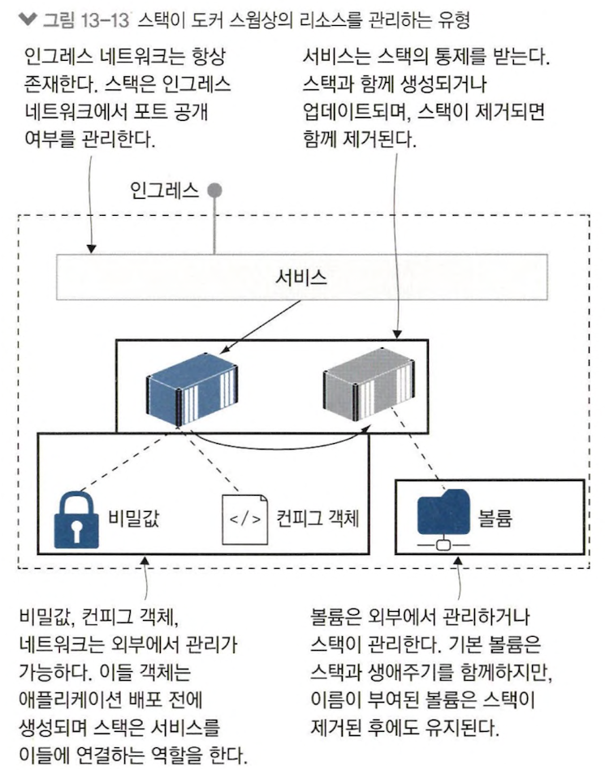

# 13장 도커 스웜 스택으로 분산 애플리케이션 배포하기

## 13.1 도커 컴포즈를 사용한 운영 환경

> `스택` : 서비스, 네트워크, 볼륨 등 여러 개의 도커 리소스를 묶어 만든 리소스<br>
> swarm 에서 application 배포 시 스택 생성

#### 실습) 컴포즈 파일을 스택으로 배포하기. 배포 이후 실행중인 서비스 상태 확인


<table>
<tr>
<td align="center">명령어</td><td align="center">설명</td>
</tr>
<tr>
<td>

```shell
docker stack deploy -c ./todo-list/v1.yml todo
```
</td>
<td>
컴포즈 파일로 스택 배포
</td>
</tr>
<tr>
<td>

```shell
docker stack ls
```
</td>
<td>
스택 목록 중 새롭게 생성된 스택 확인
</td>
</tr>
<tr>
<td>

```shell
docker service ls
```
</td>
<td>
서비스 목록 확인해 새로 생성된 서비스 확인
</td>
</tr>
</table>

#### 도커 컴포즈 파일 내 스웜 배포 설정 추가

```yaml
services:
  todo-web:
    image: diamol/ch06-todo-list
    ports:
      - 8080:80
    deploy:
      replicas: 2
      resources:
        limits:
          cpus: "0.50"
          memory: 100M
```

- 하나의 레플리카가 cpu 코어 한 개의 50%, 메모리 100MB 점유할 수 있도록 제한


- 기존 스택과 같은 이름으로 스택 정의하여 배포하면 기존 스택 새로운 상태로 업데이트
- 업데이트로 레플리카 교체 &rarr; 교체된 레플리카는 Shutdown 상태로 변경

#### 실습) to-do application stack에서 실행중인 서비스와 태스크 확인 후 스택 제거


> swarm stack은 애플리케이션 그룹화에 사용

- stack 명령어로 여러 애플리케이션을 하나의 대상으로 다룸 &rarr; 각 서비스나 서비스 레플리카 목록 조회 및 전체 삭제 가능
- stack 태스크 목록에서 기존, 신규 레플리카 모두 확인 가능
- 컴포즈 파일 내 네트워크가 정의되지 않아 스택 제거하면 기본 생성된 네트워크까지 스택에 속한 모든 리소스 삭제

## 13.2 컨피그 객체를 이용한 설정값 관리


#### 실습) to-do application 설정값을 json 형태로 컨피그 객체 만들어 배포


<table>
<tr>
<td align="center">cat</td><td align="center">docker config inspect</td>
</tr>
<tr>
<td>

```json
{
  "Logging": {
    "LogLevel": {
      "Default": "Information",
      "Microsoft": "Warning",
      "Microsoft.Hosting.Lifetime": "Warning"
    }
  },
  "AllowedHosts": "*",
  "Database": {
    "Provider": "Postgres"
  }
}
```
</td>
<td>

```json
ID:                     pq2gbmy6ebgit2fihshccz9nq
Name:                   todo-list-config
Created at:             2023-06-28 14:59:26.459490549 +0000 utc
Updated at:             2023-06-28 14:59:26.459490549 +0000 utc
Data:
{
  "Logging": {
    "LogLevel": {
      "Default": "Information",
      "Microsoft": "Warning",
      "Microsoft.Hosting.Lifetime": "Warning"
    }
  },
  "AllowedHosts": "*",
  "Database": {
    "Provider": "Postgres"
  }
}

```
</td>
</tr>
</table>

#### config 객체를 컨테이너 파일 시스템을 통해 서비스에 전달

<table>
<tr>
<td align="center">정의</td><td align="center">구조</td>
</tr>
<tr>
<td>

```yaml
services:
  todo-web:
    image: diamol/ch06-todo-list
    ports:
      - 8080:80
    configs:
      - source: todo-list-config
        target: /app/config/config.json
    secrets:
      - source: todo-list-secret
        target: /app/config/secrets.json

configs:
  todo-list-config:
    external: true
```
</td>
<td>

</td>
</tr>
</table>

- 서비스 레플리카가 될 컨테이너 실행과 함께 config `/app/config/config.json` 이동
- `external` : 해당 리소스가 이미 클러스터에 저장되어 있음
- config 객체 배포 후 애플리케이션 배포 &rarr; 애플리케이션 컨테이너 여러개 생성해도 config 공유 가능

## 13.3 비밀값을 이용한 대외비 설정 정보 관리하기

> `비밀값` : 클러스터 관리를 받는 스웜 리소스

- 로컬 파일로부터 생성 후 클러스터 DB에 저장했다가 서비스 정의에서 비밀값 참조하면 실행된 컨테이너 파일 시스템에 비밀값 전달
- 비밀값이 컨테이너에 전달된 상태에만 복호화 &rarr; 항상 암호화 상태


- 비밀값 정보를 보더라도 원래 내용 알 수 없음
- 비밀값은 실제 사용하는 컨테이너 안에서만 조회 가능

#### 수정 불가능한 config & 비밀키

- config, 비밀값 수정 불가능 &rarr; 클러스터에서 config, 비밀값 한번 만들면 내용 불변
- 내용 변경할 필요 생기면 새로운 객체 생성

1. 변경된 내용을 담은 새로운 config, 비밀값을 새로운 이름으로 생성
2. 컴포즈 파일 정의 새로운 이름으로 변경
3. 변경된 컴프조 파일로 스택 배포

&rArr; 설정값 수정하려면 서비스 업데이트 필요 &rarr; 컨테이너도 새롭게 교체
but, 쿠베에선 클러스터에 저장된 기존 값 수정 가능 &rarr; 애플리케이션마다 수정값 감지 못할 수 있어 컨테이너 교체 가능성 존재

## 13.4 스웜에서 볼륨 사용하기

> 볼륨이란, 컨테이너와 별개의 생애주기를 갖는 스토리지 단위

- 컨테이너 외부에 존재하는 리소스
- 애플리케이션 업데이트 &rarr; 컨테이너 교체 &rarr; 볼륨 새 컨테이너에 연결 &rarr; 새 컨테이너 실행하더라도 데이터 유지



```shell
# 노드 식별자를 찾아 해당 노드에 레이블 부여
docker node update --label-add storage=raid $(docker node ls -q)
```

```yaml
services:
  todo-db:
    image: diamol/postgres:11.5
    volumes:
      - todo-db-data:/var/lib/postgresql/data
    deploy:
      placement:
        constraints:
          - node.labels.storage == raid
...

volumes:
  todo-db-data:
```

- swarm 기본 볼륨 드라이버로 로컬 디스크 볼륨 생성
- 애플리케이션 배포하면 레플리카는 스토리지 레이블이 일치하는 노드에서만 실행
- todo-db-data 이름으로 로컬 볼륨을 생성해 데이터 저장

## 13.5 클러스터는 스택을 어떻게 관리하는가?

- `stack` : 애플리케이션 구성 요소 모아 놓은 논리적 객체
- 스택에는 서비스 간 의존 관계 정의 x
- 이미지에 health check와 dependency check를 포함시켜 의존 관계 구현<br>
&rArr; a.k.a `자기 수복 가능 애플리케이션`