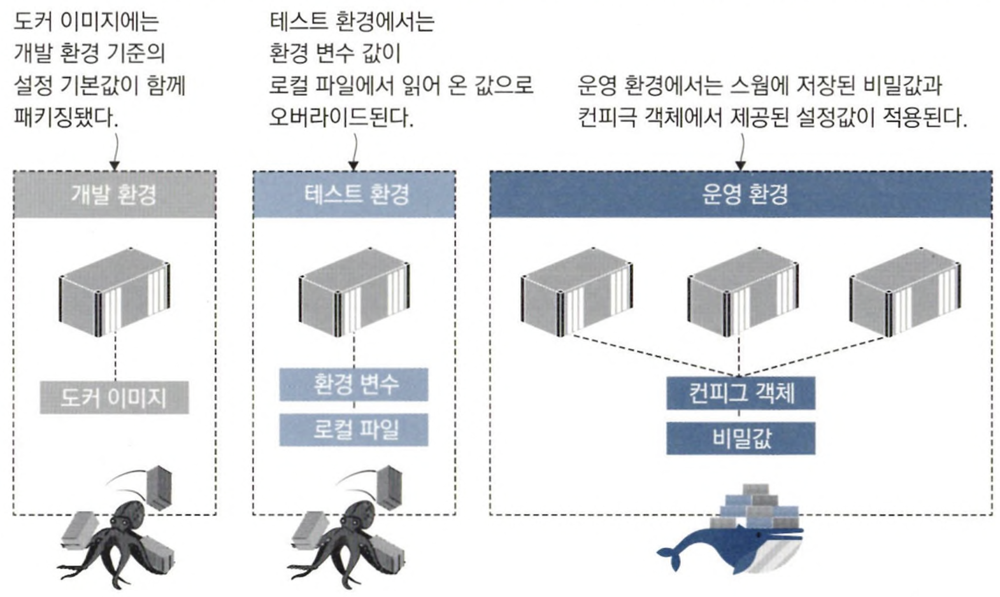
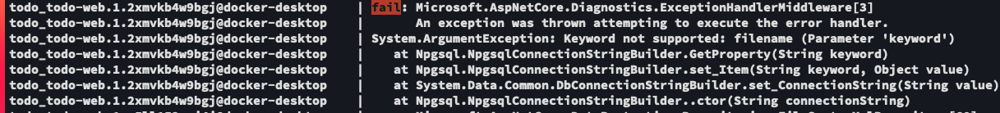
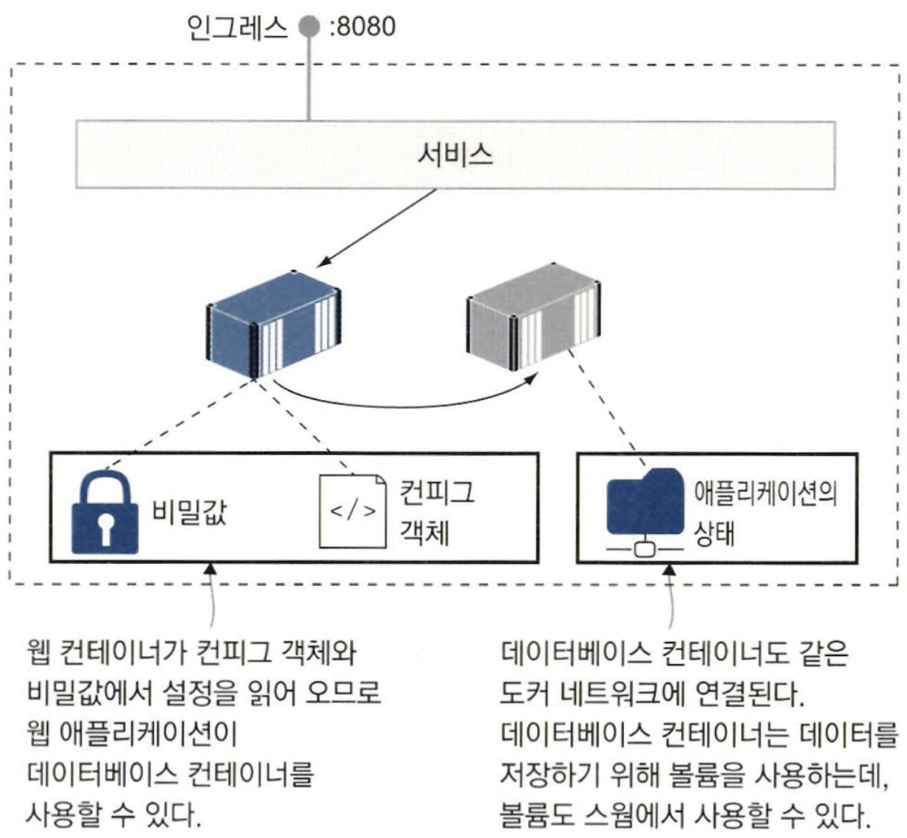
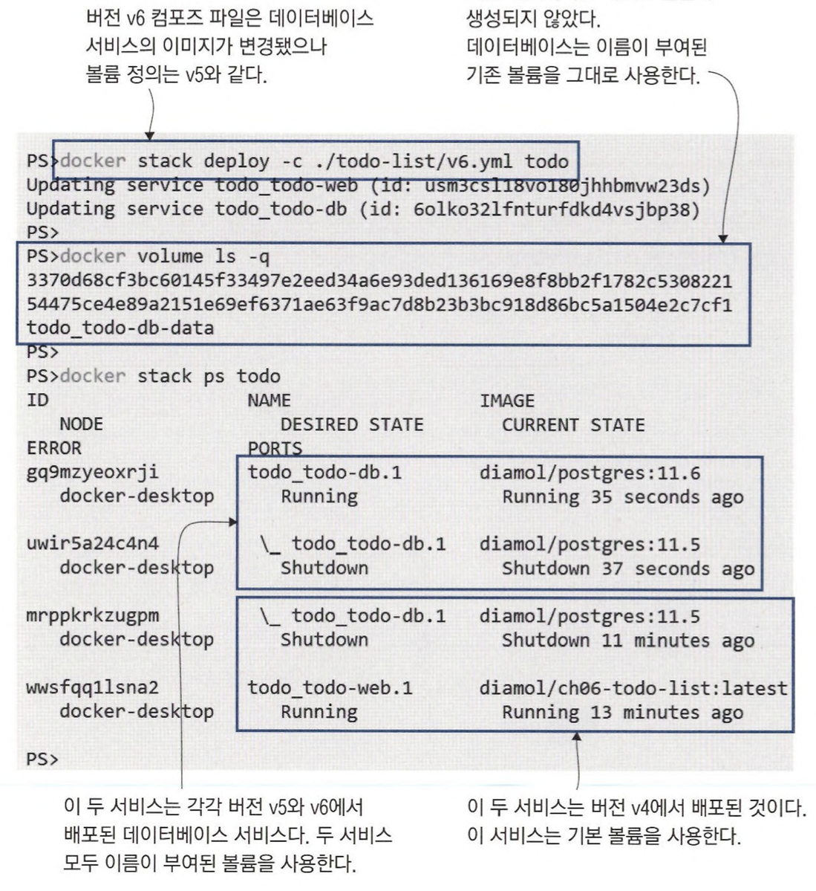
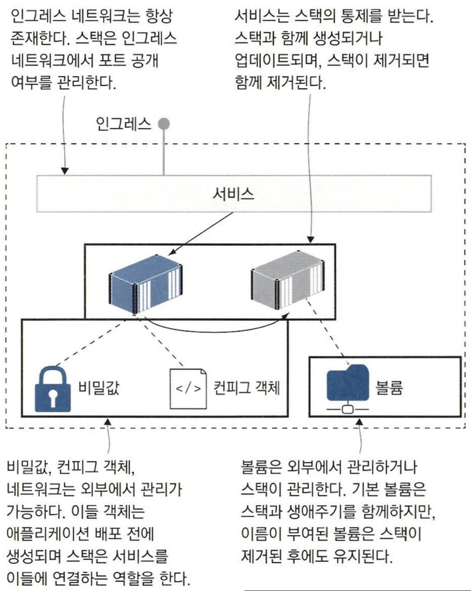

# 13장 도커 스웜 스택으로 분산 애플리케이션 배포하기
스웜은 도커 컴포즈 문법을 사용해 애플리케이션의 구성 요소를 정의한 다음 매니저 노드에 YAML 파일을 전달하면 네트워크나 서비스 등을 정의된 대로 만들어 준다.

## 13.1 도커 컴포즈를 사용한 운영 환경

도커 스웜은 컴포즈를 만날 때 진정한 위력을 발휘한다. 운영 환경에서 개발 및 테스트 환경과 동일한 파일 포맷을 사용할 수 있기 때문이다.

```docker
📌 Docker Stack

Docker 스택은 Docker Swarm 모드에서 여러 서비스를 그룹화하는 방법을 제공합니다. 
Docker 스택은 여러 서비스를 함께 배포하고, 스케일링하고, 업데이트하는 등의 작업을 쉽게 수행할 수 있도록 해주는 도구입니다. 
Docker 스택은 도커 컴포즈 파일을 기반으로 하며, 여러 서비스와 그에 관련된 네트워크 및 볼륨을 함께 정의하고 관리합니다.
```

```bash
# 컴포즈 파일로 스택을 배포한다.
$ docker stack deploy -c v1.yml todo

# 스택의 목록에서 새로 생성된 스택을 확인한다.
$ docker stack ls
Creating network todo_default
Creating service todo_todo-web

# 서비스의 목록을 확인해 새로 생성된 서비스를 확인한다.
$ docker service ls
ID             NAME            MODE         REPLICAS   IMAGE                          PORTS
g42srcuhomd4   todo_todo-web   replicated   1/1        diamol/ch06-todo-list:latest   *:8080->80/tcp
```

✅ 생성된 리소스 확인하기

```bash
1. [service] todo_todo-web

2. [network] todo_default
$ docker network ls
8b64ab79dd45   none              null      local
hxn1f90ml5fa   todo_default      overlay   swarm
...

# 
$ docker network inspect todo_default
[
    {
        "Name": "todo_default",
        "Id": "hxn1f90ml5fappwi2lu9slv65",
        "Created": "2023-06-25T09:04:51.167602176Z",
        "Scope": "swarm",
        "Driver": "overlay",
        "EnableIPv6": false,
        "IPAM": {
            "Driver": "default",
            "Options": null,
            "Config": [
                {
                    "Subnet": "10.0.4.0/24",
                    "Gateway": "10.0.4.1"
                }
            ]
        },
        ...
        "Containers": {
            "b6500bce89bd5ebab937e964072008d24485713db325cdff89241ccf0966ebef": {
                "Name": "todo_todo-web.1.o5ll152owi4ic0pq3nx4y1oib",
                "EndpointID": "4cdfad3b51ff2526a19c6def4dcff171acff85cf94fd3e7159e80bd0f68b5cb9",
                "MacAddress": "02:42:0a:00:04:03",
                "IPv4Address": "10.0.4.3/24",
                "IPv6Address": ""
            },
            "lb-todo_default": {
                "Name": "todo_default-endpoint",
                "EndpointID": "07cb5088dcf6affcb66ac2e17a8f2741f98c74dde7d15747172e4d6a3f576ca3",
                "MacAddress": "02:42:0a:00:04:04",
                "IPv4Address": "10.0.4.4/24",
                "IPv6Address": ""
            }
        },
        ...
    }
]
```

❓lb-todo_default

```bash
`lb-todo_default`는 Docker Swarm의 내장된 Load Balancer입니다. 
이것은 Docker의 라우팅 메쉬(Routing Mesh) 기능의 일부로, 각 서비스에 대한 요청을 받아 적절한 노드로 라우팅합니다.

라우팅 메쉬는 모든 Swarm 노드에서 서비스에 대한 요청을 수신하고 해당 요청을 실제로 서비스를 실행하는 노드로 라우팅합니다. 
이를 통해, 클라이언트는 어느 노드에 연결하든 동일한 서비스에 액세스할 수 있습니다.

`lb-todo_default`는 `todo_default` 네트워크의 Load Balancer를 나타내며, 이것은 `todo` 스택의 일부로 배포되었습니다(`com.docker.stack.namespace`: `todo`). 
이 네트워크에 연결된 컨테이너 간의 통신을 가능하게하고, Docker Swarm의 다른 노드에 있는 컨테이너로의 네트워킹 라우팅도 가능하게 합니다.

따라서, `lb-todo_default`는 `todo_default` 네트워크에 대한 모든 인바운드 트래픽을 적절한 서비스로 라우팅하는 데 사용됩니다. 
이 네트워크의 생성은 `todo` 서비스가 Docker Swarm에서 배포될 때 자동으로 발생했을 것입니다.
```

### Deploy property 추가해 자원 사용량 제한하기

서비스가 차지할 수 있는 계산 자원에 대한 상한을 설정해 두면 악의적인 레플리카가 해당 노드의 계산 자원을 고갈시키는 것을 방지할 수 있다.

```yaml
services:
	todo-web:
		image: diamol/ch06-todo-list
		ports:
			- 8080:80
		deploy:
			replicas: 2
			resources:
				limits:
					cpus: "0.50"
					memory: 100M
```

```bash
$ docker service ps todo_todo-web
ID             NAME                  IMAGE                          NODE             DESIRED STATE   CURRENT STATE            ERROR     PORTS
2rqfcagvxnnl   todo_todo-web.1       diamol/ch06-todo-list:latest   docker-desktop   Running         Running 8 seconds ago              
o5ll152owi4i    \_ todo_todo-web.1   diamol/ch06-todo-list:latest   docker-desktop   Shutdown        Shutdown 8 seconds ago             
355at1k93nhp   todo_todo-web.2       diamol/ch06-todo-list:latest   docker-desktop   Running         Running 11 seconds ago
```

### 스웜 스택으로 애플리케이션 관리하기

스웜 스택은 애플리케이션을 그룹화하는 방법으로 활용한다.

클러스터는 일반적으로 많은 수의 애플리케이션을 실행하기 떄문에 애플리케이션도 그룹으로 만들어 관리해야 한다.

```bash
# 스택의 서비스 목록 확인
$ docker stack services todo
ID             NAME            MODE         REPLICAS   IMAGE                          PORTS
g42srcuhomd4   todo_todo-web   replicated   2/2        diamol/ch06-todo-list:latest   *:8080->80/tcp

# 각 서비스의 레플리카 목록 확인
$ docker stack ps todo
ID             NAME                  IMAGE                          NODE             DESIRED STATE   CURRENT STATE            ERROR     PORTS
2rqfcagvxnnl   todo_todo-web.1       diamol/ch06-todo-list:latest   docker-desktop   Running         Running 5 minutes ago              
o5ll152owi4i    \_ todo_todo-web.1   diamol/ch06-todo-list:latest   docker-desktop   Shutdown        Shutdown 5 minutes ago             
355at1k93nhp   todo_todo-web.2       diamol/ch06-todo-list:latest   docker-desktop   Running         Running 5 minutes ago

# 스택 제거
$ docker stack rm todo
```

`클러스터 데이터베이스` 에 애플리케이션에 대한 모든 정의가 들어 있기 때문에 따로 컴포즈 파일이 없어서 스택의 모든 리소스를 관리할 수 있다.

매니저 노드는 모두 이 데이터베이스의 복본을 갖고 있기 때문에 다른 리소스에 대한 정보를 안전하게 보관할 수 있다.

## 13.2 컨피그 객체를 이용한 설정값 관리

컨피그 객체는 컨테이너가 설정값을 클러스터에서 읽어 올 수 있게 해 주는 강력한 기능을 가진 리소스이자 애플리케이션 배포와 설정 관리를 분리해 주는 역할도 한다.



```bash
# 로컬에 위치한 JSON 파일로 컨피고 객체를 만든다.
$ docker config create todo-list-config configs/config.json

# 컨피그 객체의 설정값을 확인한다.
$ docker config ls
```

- 컨피그 객체는 JSON 외에도 XML, 키-값 쌍, 바이너리 파일까지 다양한 데이터 포맷을 담을 수 있다.
- 컨피그 객체는 스웜에 의해 컨테이너 파일 시스템 내의 파일로서 전달된다.
- 컨피그 객체는 민감한 데이터를 보관하기 위한 수단이 아니다.
    - 스웜 데이터베이스에서 이 파일 내용은 암호화되지 않는다.
- 컨피그 객체를 관리하는 워크플로는 이 설정 값을 사용하는 애플리케이션 관리 워크플로와는 완전히 별개다.

```bash
# 컨피그 객체 확인 시 pretty 플래그를 사용하면 객체의 내용을 볼 수 있다.
$ docker config inspect --pretty todo-list-config
ID:			yotfxw4pbrgw0s7u54g9og5ot
Name:			todo-list-config
Created at:            	2023-06-25 10:42:30.805040555 +0000 utc
Updated at:            	2023-06-25 10:42:30.805040555 +0000 utc
Data:
{
  "Logging": {
    "LogLevel": {
      "Default": "Information",
      "Microsoft": "Warning",
      "Microsoft.Hosting.Lifetime": "Warning"
    }
  },
  "AllowedHosts": "*",
  "Database": {
    "Provider": "Postgres"
  }
}
```

📌 컨피그 객체는 컨테이너 파일 시스템을 통해 서비스에 전달된다.

- `external: true` : 해당 리소스가 이미 클러스터에 저장돼 있음을 의미

```yaml
services:
	todo-web:
		image: diamol/ch06-todo-list
		ports:
			- 8080:80
		configs:
			- source: todo-list-config
				target: /app/config/config.json

configs:
	todo-list-config:
		external: true
```

🔥 데이터베이스 접속에 필요한 정보가 제공되지 않았기 때문에 데이터베이스 접속에 실패한다.

```bash
$ docker service logs g42srcuhomd4
```



## 13.3 비밀값을 이용한 대외비 설정 정보 관리하기

### 비밀값을 사용하는 워크플로

1. 비밀 값을 로컬 파일로 부터 생성한다.
2. 클러스터 데이터베이스에 저장한다.
3. 서비스 정의에서 비밀값을 참조한다.
4. 컨테이너의 파일 시스템에 비밀 값이 전달된다.

비밀값을 사용하는 워크플로 중 비밀값이 컨테이너에 전달된 상태에서만 복호화된 비밀값을 볼 수 있다.

```bash
# 로컬에 위치한 JSON 파일의 내용으로 비밀값을 생성한다.
$ docker secret create todo-list-secret ./todo-list/secrets/secrets.json

# 새로만든 비밀값의 정보를 확인한다.
$ docker secret inspect --pretty todo-list-secret
```

📌 비밀값과 컨피그 객체를 사용해 애플리케이션 설정하기

```yaml
services:
	todo-web:
		image: diamol/ch06-todo-list
		ports:
			- 8080:80
		configs:
			- source: todo-list-config
				target: /app/config/config.json
		secrets:
			- source: todo-list-secret
				target: /app/config/secrets.json

secrets:
	todo-list-secrets:
		external: true
```

✅ 데이터 베이스는 처음 만들어진 레플리카로 동작 중인 반면 웹 서비스는 비밀값과 컨피그 객체로 설정된 새로운 레플리카로 동작한다.

```bash
$ docker stack ps todo
ID             NAME                  IMAGE                          NODE             DESIRED STATE   CURRENT STATE                 ERROR     PORTS
zn5s5frsxilw   todo_todo-db.1        diamol/postgres:11.5           docker-desktop   Running         Running 23 minutes ago
bm0zjrxtj5gg   todo_todo-web.1       diamol/ch06-todo-list:latest   docker-desktop   Running         Running about a minute ago
2xmvkb4w9bgj    \_ todo_todo-web.1   diamol/ch06-todo-list:latest   docker-desktop   Shutdown        Shutdown about a minute ago
2rqfcagvxnnl    \_ todo_todo-web.1   diamol/ch06-todo-list:latest   docker-desktop   Shutdown        Shutdown 23 minutes ago
o5ll152owi4i    \_ todo_todo-web.1   diamol/ch06-todo-list:latest   docker-desktop   Shutdown        Shutdown 47 minutes ago
```

✅ 애플리케이션의 전체 인프라스트럭처 구조



### 꼭 알아둘 점 🔥

컨피그 객체와 비밀값은 수정이 불가하다.

만약 내용을 변경할 필요가 생긴다면 새로운 컨피그 객체나 비밀값을 만들어야 한다.

- 변경된 내용을 담은 새로운 컨피고 혹은 비밀값을 기존의 것과 다른 이름으로 만든다.
- 컴포즈 파일의 정의에 사용된 컨피그 객체 혹은 비밀값의 이름을 새로 만든 이름으로 바꾼다.
- 변경된 컴포즈 파일로 스택을 배포한다.

결국 설정값을 수정하려면 서비스를 업데이트해야한다. 즉, 컨테이너도 새 것으로 교체해야 한다.

컨테이너를 주기적으로 교체해야 하므로 퍼시스턴시를 위해 `도커 볼륨`이 필요해진다.

## 13.4 스웜에서 볼륨 사용하기

클러스터는 여러 개의 노드로 구성되고, 이들 노드는 각각 디스크가 있어서 이 디스크에 로컬 볼륨을 저장한다. 업데이트에도 데이터를 유지하는 가장 간단한 방법은 이 로컬 볼륨을 이용하는 것이다.

하지만, 이 방법으로도 해결되지않는 문제가 있다. 어떤 레플ㄹ리카를 대체하는 새로운 레플리카가 이전 레플리카와 다른 노드에서 실행되는 경우다.

이 문제는 서비스가 데이터가 있는 특정 노드에서만 실행되게끔 고정하면 해결된다.

📌 가상의 스토리지 유형 정보를 레이블로 노드에 부여한다.

```bash
$ docker node update --label-add storage=raid $(docker node ls -q)
```

📌 스웜에서 실행하는 서비스에 볼륨 마운트 및 제약 사항 설정하기

- 데이터베이스 레플리카는 스토리지 레이블이 일치하는 노드에서만 실행된다.
- 이 노드는 todo-db-data라는 이름으로 로컬 볼륨을 생성해 이 볼륨에 데이터가 저장된다.
- 기본 볼륨은 스택을 제거하면 삭제되지만, 이름이 부여된 볼륨은 스택을 제거해도 삭제되지 않는다.

```bash
services:
	todo-db:
		image: diamol/postgres:11.5
		volumes:
			- todo-db-data:/var/lib/postgresql/data
				deploy:
					placement:
						constraints:
							- node.labels.storage == raid

volumes:
	todo-db-data:
```

📌 데이터베이스 서비스를 업데이트해도 이전 데이터는 새로운 데이터베이스 컨테이너에 그래도 남아 있다.



레플리카마다 데이터가 다를 수도 있는 로컬 볼륨은 여러 노드에 걸쳐 상태를 공유해야 하는 애플리케이션에서는 사용할 수 없다.

도커는 볼륨 드라이버에 플러그인 시스템을 채용하고 있어 스웜에서 클라우드 스토리지나 데이터센터의 스토리지 장비를 분산 스토리지로 사용하게끔 설정할 수 있다. 이들 볼륨을 설정하는 방법은 인프라스트럭처 환경에 따라 다르지만, 서비스에 볼륨을 연결하는 형태를 취하는 것은 어떤 환경이든 동일하다.

## 13.5 클러스터는 스택을 어떻게 관리하는가?

스택 : 클러스터가 관리를 담당하는 리소스의 모임.

- 스택에는 서비스 간의 의존 관계를 정의하는 기능이 없다.
- 자기 수복 기능 애플리케이션
    - 이미지에 헬스 체크와 디펜던시 체크를 포함시켜 애플리케이션이 정상적으로 실행할 수 없는 경우에는 컨테이너를 조기 종료시킨다.
    - 이런 방법으로 컨테이너 재시작 혹은 대체로 인해 애플리케이션에서 일어나는 문제를 수복할 수 있다.

### 스택이 도커 스웜상의 리소스를 관리하는 유형

```bash
- 볼륨
	- 기본 볼륨
		- 스택과 생애 주기를 함께한다.
  - 이름이 붙은 볼륨
		- 스택 배포와 함께 볼룸이 생성되지만, 이 볼륨은 스택을 제거해도 삭제되지 않는다.

- 비밀값, 컨피그 객체
	- 클러스터 데이터베이스에 저장된다.
  - 해당 객체를 사용하는 컨테이너가 실행될 때 전달된다.
  - 읽기 위주 객체로, 수정이 불가하다.

- 네트워크
	- 관리자가 명시적으로 네트워크 생성 가능하다.
	- 스웜이 자동으로 네트워크 생성하기도 한다.
	- 모든 스택은 컴포즈 파일에 네트워크가 정의되지 않았더라도 
		자신이 포함한 서비스를 연결한 네트워크와 함께 배포된다.

- 서비스
	- 스택과 생애 주기를 함께한다.
	- 스웜이 서비스를 모니터링하며 서비스 수준이 정상치를 유지하는지 확인하고 관리한다.
```

