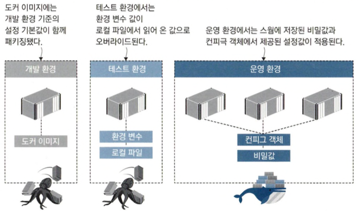
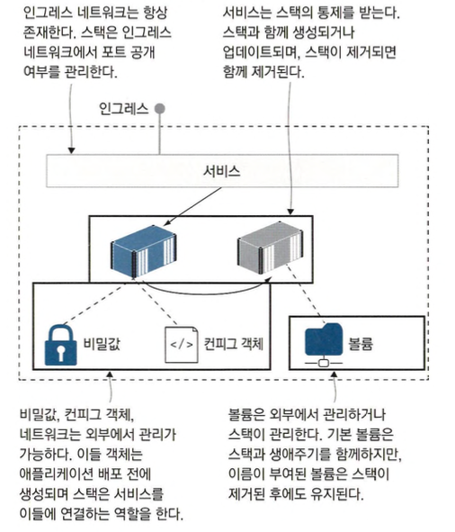

# 도커 스웜 스택으로 분산 애플리케이션 배포하기

## 도커 컴포즈를 사용한 운영 환경

- 스웜 모드에서는 애플리케이션을 배포할 때 스택을 만드는데 스택은 서비스, 네트워크, 볼륨등 여러개의 도커 리소르를 묶어 만든 리소스를 말합니다.

```shell
docker stack deploy -c ./todo-list/v1.yml todo
docker stack ls
docker service ls
```

- 컴포즈 파일을 클러스터에 전달하면 매니저가 기본 네트워크를 생성하고 나서 서비스를 생성합니다.
- 스택은 스웜 모드의 일급 리소스입니다.
- 별도의 추가 설정 없이 컴포즈 파일만으로 스웜에 애플리케이션을 배포할 수 있습니다.

```sehll
docker stack deploy -c ./todo-list/v2.yml todo
docker service ps todo_todo_web
```

- cpu, memory 제약을 건 컴포즈 파일로 update합니다.
- `docker service ps` 명령어를 통해 서비스의 레플리카 상태를 확인할 수 있습니다.
- 도커 컨테이너는 상한치를 지정하지 않는 한 호스트 컴퓨터의 CPU와 메모리를 무제한으로 사용 할 수 있기에 제약을 걸어야합니다.

```
docker stack services todo
docker stack ps todo
docker stack rm todo
```

- 클러스터 데이터베이스에 애플리케이션에 대한 모든 정의가 들어 있기 때문에 따로 컴포즈 파일이 없어도 스택의 모든 리소스를 관리할 수 있습니다.
- 컴포즈 파일에 포함된 애플리케이션 설정값도 클러스터 데이터베이스에 저장됩니다.

## 컨피그 객체를 이용한 설정값 관리

- 클러스터에 저장되는 도커 컨피그(config) 객체를 이용해 운영 환경에서 애플리케이션에 설정값을 제공할 수 있습니다.



```shell
docker config create todo-list-config ./todo-list/configs/config.json
docker config ls
```

- docker config 객체를 생성하고 확인하는 예제입니다.
- 컨피그 객체는 JSON 외에도 XML, 키-값 쌍. 바이너리 파일까 지 다양한 데이터 포맷을 담을 수 있습니다.
- 컨피그 객체는 스웜에 의해 컨테이너 파일 시스템 내의 파 일로서 전달되며 애플리케이션 입장에서는 직접 파일을 업로드한 것과 같은 효과가 있습니다.

```shell
docker config inspect --pretty todo-list-config
```

- 컨피그 객체를 확인하면 설정 파일의 내용을 그대로 볼 수 있습니다. 이는 컨피그 객체는 민감한 데이터를 보관하는 수단이 아니라는 얘기입니다.

```shell
docker stack deploy -c ./todo-list/v3.yml todo
docker stack services todo
```

- 컨피그 객체를 통해 PostresSQL DB를 사용하도록 설정한 예제입니다.

## 비밀값을 이용한 대외비 설정 정보 관리하기

- 비밀값은 로컬 파일로부터 생성한 후. 클러스터 데이터베이스에 저장했다가 서비스 정의에서 비밀값을 참조 하면 실행된 컨테이너의 파일 시스템에 비밀값의 값이 전달합니다.
- 비밀값이 컨피그 객체와 가장 크게 다른 점은 비밀값을 사용하는 워크플로 중 비밀값이 컨테이너에 전달된 상태에서만 복호화된 비밀값을 볼 수 있습니다.

```shell
docker secret create todo-list-secret ./todo-list/secrets/secrets.json
docker secret inspect --pretty todo-list-secret
```

- 비밀값을 설정하고 출력하지만 값이 안나오는걸 확인할 수 있습니다.

```shell
docker stack deploy -c ./todo-list/v4.yml todo
docker stack ps todo
```

- 여기서 보면 `todo_todo-web`과 `todo_todo-db`이 업데이트 되었다고 RUNNING 시간은 web만 엡데이트 된걸로 나옵니다.
- 클러스터에서 컨피그 객체와 비밀값을 한번 만들면 수정이 불가능하고 새로 만들어야합니다.(쿠버네티스에서는 클러스터에 저장된 기존 컨피그 객체나 비밀값을 수정 가능)

## 스웜에서 볼륨 사용하기

```shell
docker node update --label-add storage=raid $(docker node ls -q)
```

- 노드의 식별자를 찾아 해당 노드에 레이블를 부여하는 예제입니다.

```shll
docker volume ls -q
docker stack deploy -c ./todo-list/v5.yml todo
docker volume ls -q
```

- `todo-list`애플리케이션을 볼륨마운트설정이되어있는 도커컴포즈를 파일을 이용해 업데이트 하는 예제입니다.
- `docker volume prune`를 사용하면 불필요한 볼륨을 제거할 수 있습니다.

```shell
docker stack deploy -c ./todo-list/v6.yml todo
docker stack ps todo
docker volume ls -q
```

- Postgres DB를 업데이트하는 도커컴포즈 예제통해 엡데이트합니다.
- 로컬 볼륨에 저장된 데이터는 모든 노드에 복제되지 않기 때문에 디스크를 데이터 캐시 정도로 사용 한다면 로컬 볼륨으로도 상관없지만 레플리카마다 데이터가 다를 수도 있는 로컬 볼륨은 여러 노드에 걸쳐 상태를 공유해야 하는 애플리케이션에서는 사용할 수 없습니다.

## 클러스터는 스택을 어떻게 관리하는가?


