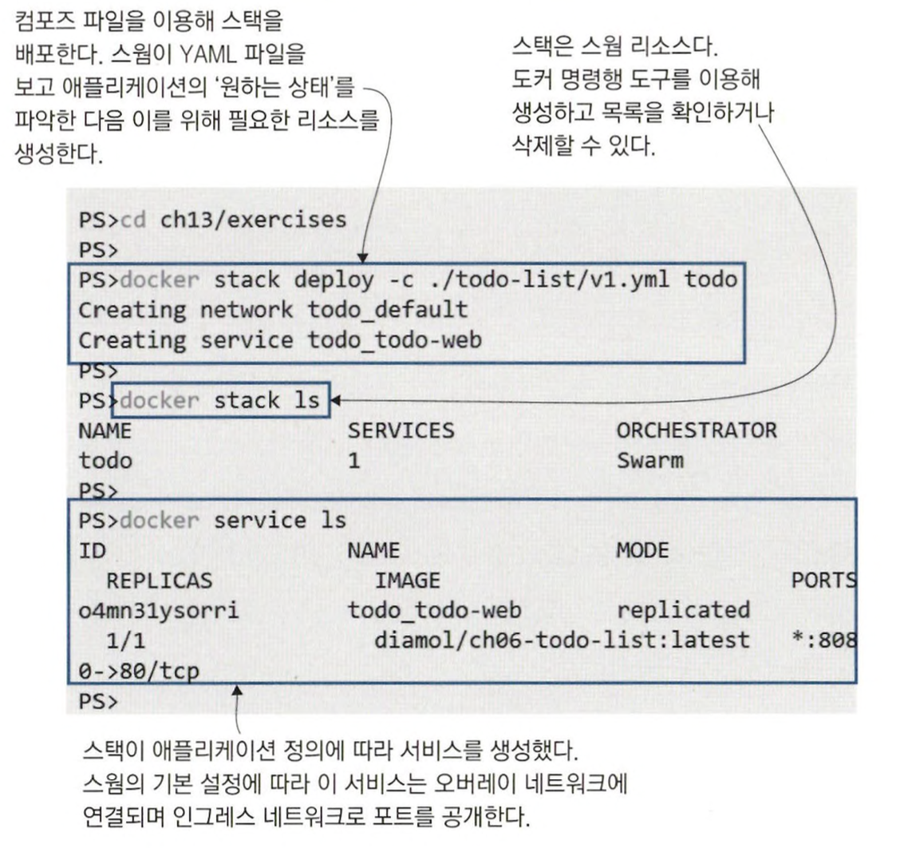

# 도커 스웜 스택으로 분산 애플리케이션 배포

> 12장에서는 CLI를 사용했지만, 실무에서는 매니저 노드에 직접 접속해서 명령을 입력하지 않는다. <br>
> 실무에서는 애플리케이션을 YAML 파일로 정의해 매니저 노드에 이 파일을 전달하는 방법을 쓴다. <br>
> 그 정의를 받고 어떻게 실행할지는 오케스트레이션 도구가 결정한다.

<br>
<hr>

## 도커 컴포즈를 사용한 운영 환경

```yaml
# 스웜 배포를 위한 컴포즈 파일 예제
version: "3.7"

services:
  todo-web:
    image: diamol/ch06-todo-list
    ports:
      - 8080:80
```

도커 컴포즈와 이 파일을 사용하면 단일 서버에 애플리케이션이 배포된다. <br>
스웜에도 동일한 파일을 사용해 애플리케이션을 배포할 수 있다. <br>
**스웜 모드에서는 애플리케이션을 배포할 때 스택을 만든다. 스택이란 서비스, 네트워크, 볼륨 등 여러 개의 도커 리소스를 묶어 만든 리소스를 말한다.**

```bash
cd ch13/exercises

docker stack deploy -c ./todo-list/v1.yml todo

docker stack ls

docker service ls
```



> 별도의 추가 설정 없이 컴포즈 파일만으로 스웜에 애플리케이션을 배포할 수 있다. <br>
> 스웜에 노드가 두 개 이상이라면 고가용성을 확보할 수 있다.

<br>

```yaml
# 도커 컴포즈 파일에 스웜 배포 설정을 추가한 예
services: 
  todo-web:
    image: diamol/ch06-todo-list
    ports:
      - 8080:80
    deploy:
      replicas: 2
      resources:
        limits:
          cpus: "0.50"
          memory: 1O0M
```

한 레플리카가 CPU 코어의 경우 코어 한 개의 50%, 메모리의 경우 100MB까지 점유할 수 있도록 설정했다. <br>
스웜 스택에 업데이트를 적용하는 방법도 수정된 yaml 파일을 매니저 노드에 전달하면 그 내용 그대로 애플리케이션에 반영된다.

<br>


```bash
# 수정된 yaml 파일을 스웜에 전달
docker stack deploy -c ./todo-list/v2.yml todo

docker service ps todo_todo-web
```


> 도커 컨테이너는 상한치를 지정하지 않으면 호스트 컴퓨터의 CPU와 메모리를 무제한으로 사용할 수 있다. <br>
> 운영 환경에서는 버그나 악의적인 사용자가 시스템 자원을 고갈시키는 일이 없도록 제약을 둬야 한다. 

<br>

스웜 스택은 애플리케이션을 그룹화하는 방법으로 활용된다. <br>
클러스터는 많은 수의 애플리케이션을 실행하기 때문에 애플리케이션도 그룹으로 만들어 관리해야 한다. <br>
CLI로 stack 명령을 사용해 여러 애플리케이션을 하나의 대상으로 다루고, 서비스의 레플리카 목록을 보거나 애플리케이션 전체를 한꺼번에 제거할 수도 있다.

````bash
# 스택의 서비스 목록 확인
docker stack services todo

# 각 서비스의 레플리카 목록 확인
docker stack ps todo

# 스택 제거
docker stack rm todo
````


> 클러스터 데이터베이스에 애플리케이션에 대한 모든 정의가 들어 있기 때문에 컴포즈 파일이 없어도 스택의 모든 리소스를 관리할 수 있다. <br>
> 매니저 노드는 모두 이 데이터베이스의 복사본을 갖고 있기 때문에 다른 리소스에 대한 정보를 안전하게 보관할 수 있다.

<br>
<hr>

## config 객체를 이용한 설정값 관리

컨테이너에서 실행된 애플리케이션은 설정값을 컨테이너를 실행한 플랫폼에서 받아 와야 한다. <br>
클러스터에 저장되는 docker config 객체를 이용해 운영 환경에서 애플리케이션에 설정값을 제공하는 방법이 있다. <br>
아래는 config 객체의 동작 과정이다.


스웜에서는 설정값을 위해 docker config 객체가 쓰인다. <br>
이는 설정값을 클러스터에서 읽어 올 수 있게 해주고, 애플리케이션 배포와 설정 관리를 분리해주기도 한다.

```bash
# 로컬의 JSON 파일로 config 객체 생성
docker config create todo-list-config ./todo-list/configs/config.json

# config 객체의 설정값 확인
docker config ls
```

config 객체는 JSON, XML, key-value, binary의 다양한 데이터 포맷을 담을 수 있다. <br>
config 객체는 스웜에 의해 컨테이너 파일 시스템 내의 파일로서 전달된다.


> config 객체는 CLI로 생성, 삭제, 확인이 모두 가능하고 이를 확인해 보면 설정 파일의 내용을 그대로 볼 수 있다. <br>
> 그래서 민감한 데이터를 보관하기 위한 수단은 아니다. (웜 데이터베이스에서도 이 파일 내용은 암호화되지 않는다.)

<br>

```bash
# config 객체 확인
docker config inspect --pretty todo-list-config
```


<br>

```yaml
# config 객체로부터 설정값을 도입하도록 수정
services: 
  todo-web:
    image: diamol/ch06-todo-list 
    ports:
      - 8080:80
    configs:
      - source: todo-list-config 
    target: /app/config/config.json
    
    
configs: 
  todo-list-config:
    external: true
```

```bash
docker stack deploy -c ./todo-list/v3.yml todo

docker stack services todo
```


> 애플리케이션이 config 객체를 통해 PostgreSQL 데이터베이스를 사용하도록 설정됐다. <br>
> 근데 config 객체만으로 DB 접속에 필요한 자세한 정보가 제공되지 않아서, DB 접속에는 실패했다. (**민감한 데이터는 config 객체에 보관하면 안된다.**)

<br>
<hr>

## 비밀값을 이용해 대외비 설정 정보 관리

비밀값은 클러스터의 관리를 받는 스웜 리소스다. <br>
로컬 파일로부터 생성한 후, 클러스터 DB에 저장했다가 서비스 정의에서 비밀값을 참조하면 실행된 컨테이너의 파일 시스템에 비밀값이 전달된다. <br>
비밀값이 config 객체와 다른 점은 비밀값이 컨테이너에 전달된 상태에서만 복호화된 비밀값을 볼 수 있다는 것이다.

그 외의 경우에는 비밀값이 항상 암호화된 상태로 존재한다. <br>
평소에는 클러스터 DB에 암호화돼 보관되다가 해당 비밀값을 사용하는 컨테이너를 실행할 노드로만 전달된다. <br>
그리고 비밀값을 사용할 컨테이너 안에서만 복호화된다.

```bash
# 로컬에 위치한 JSON 파일의 내용으로 비밀값 생성
docker secret create todo-list-secret ./todo-list/secrets/secrets.json

# 비밀값 정보 확인
docker secret inspect --pretty todo-list-secret
```


<br>

```yaml
# 비밀값과 config 객체를 사용해 애플리케이션 설정
services: 
  todo-web:
    image: diamol/ch06-todo-list 
    ports:
      - 8080:80 
    configs:
      - source: todo-list-config 
        target: /app/config/config.json
    secrets:
      - source: todo-list-secret
        target: /app/config/secrets.json
        
        
secrets: 
  todo-list-secret:
    external: true
```

```bash
docker stack deploy -c ./todo-list/v4.yml todo

docker stack ps todo
```


> 비밀값과 config 객체는 매니저 노드에 위치한 분산형 DB에 저장돼 필요로 하는 어느 노드라도 이를 사용할 수 있다. <br>
> 스택은 오버레이 네트워크를 구성해 컨테이너가 어느 노드에서 실행됐는지와 무관하게 서로 통신할 수 있게 한다. <br>
> 서비스는 인그레스 네트워크를 사용해 웹 레플리카가 어느 노드에 있는 서비스 컨테이너라도 호출 할 수 있게 해 준다.

<br>

config 객체와 비밀값은 수정이 불가능하다. <br>
만약 내용을 변경할 필요가 생긴다면 새로운 config 객체나 비밀값을 만들어야 한다.

결국 설정값을 수정하려면 서비스를 업데이트해야 한다. <br>
쿠버네티스에서는 클러스터에 저장된 기존 config 객체나 비밀값을 수정할 수 있다. *(애플리케이션마다 설정 파일 확인 하는지 안하는지에 따라 다르긴 함)* <br>


<br>
<hr>

## 스웜에서 볼륨 사용

컴포즈 파일의 서비스 정의에 볼륨 마운트를 정의하면, 레플리카에서 볼륨을 로컬 파일 시스템의 디렉터리처럼 사용할 수 있다. <br>
클러스터는 여러 개의 노드로 구성되고, 이들 노드는 각각 디스크가 있어서 이 디스크에 로컬 볼륨을 저장한다. <br>
업데이트에도 데이터를 유지하는 가장 간단한 방법은 이 로컬 볼륨을 이용하는 것이다.

하지만 이 방법에는 문제가 있다. <br>
어떤 레플리카를 대체하는 새로운 레플리카가 이전 레플리카와 다른 노드에서 실행되는 경우다. <br>
이런 경우엔 새 레플리카는 기존 레플리카가 사용하던 로컬 볼륨에 접근할 수 없다. <br>
이를 해결하려면 노드에 레이블을 부여하고 컴포즈 파일에서 해당 노드에서만 레플리카를 실행하도록 강제하면 된다.

<br>

```bash
# 노드의 식별자를 찾아 해당 노드에 레이블을 부여
# 이를 이용해 서비스 레플리카가 실행되는 노드를 제한 가능
docker node update --label-add storage=raid $(docker node ls -q)
```

```yaml
# 스웜에서 실행하는 서비스에 볼륨 마운트 및 제약 사항 설정
services: 
  todo-db:
    image: diamol/postgres:11.5 
    volumes:
      - todo-db-data:/var/lib/postgresql/data
    deploy:
      placement:
        constraints:
          - node.labels.storage == raid


volumes:
  todo-db-data:
```

```bash
# 노드에 존재하는 모든 볼륨의 식별자 목록 출력
docker volume ls -q

docker stack deploy -c ./todo-list/v5.yml todo

docker volume ls -q
```


> 이렇게 배포한 애플리케이션은 스택을 제거하더라도 레이블이 붙은 노드 자체가 남아 있기만 하면 데이터를 유실하지 않는다. <br>
> 컨테이너가 교체되어도 새 컨테이너 역시 같은 노드에서 같은 볼륨을 연결해 사용한다. 

<br>

> 로컬 볼륨에 저장된 데이터는 모든 노드에 복제되지 않기 때문에, 레플리카마다 데이터가 다를 수도 있는 로컬 볼륨은 <br>
> 여러 노드에 걸쳐 상태를 공유해야 하는 애플리케이션에서는 사용할 수 없다.

<br>
<hr>

## 클러스터는 스택을 어떻게 관리하는가

도커 스웜에서 말하는 스택은 클러스터가 관리를 담당하는 리소스의 모임이다. <br>
운영 환경의 스택은 다양한 리소스로 구성되는데, 오케스트레이션 도구는 리소스를 약간씩 다른 방법으로 관리한다.


<br>

- 스웜도 볼륨을 생성, 삭제할 수 있다.
  - 서비스 이미지에 볼륨의 정의가 포함된 경우 스택도 기본 볼륨을 생성하지만, 기본 볼륨은 스택을 제거하면 함께 제거된다.
  - 스택 정의에 이름이 붙은 볼륨을 사용하면 스택 배포와 함께 볼륨이 생성되지만, 이 볼륨은 스택을 제거해도 삭제되지 않는다.
- 비밀값과 config 객체는 설정값이 든 파일을 클러스터에 업로드하는 방법으로 생성한다.
  - 이들은 클러스터 DB에 저장됐다가 사용하는 컨테이너가 실행될 때 해당 컨테이너로 전달된다.
  - 이들은 read-only로 수정이 불가능하다.
  - 스웜 환경에서 애플리케이션 설정 관리는 배포 프로세스와 별개다.
- 네트워크는 애플리케이션과 별도로 관리된다.
  - 관리자가 명시적으로 네트워크를 생성할 수도 있고 필요할 때마다 스웜이 네트워크를 생성하기도 한다.
  - 모든 스택은 컴포즈 파일에 네트워크가 정의되지 않았더라도 자신이 포함한 서비스를 연결할 네트워크와 함께 배포된다.
- 서비스는 스택이 배포될 때 생성되거나 제거된다.
  - 서비스가 실행 중일 때는 스웜이 서비스를 모니터링하며 서비스 수준이 정상치를 유지하는지 확인한다.
  - 헬스 체크를 통해 이상이 검출된 컨테이너는 새로운 컨테이너로 교체된다.


