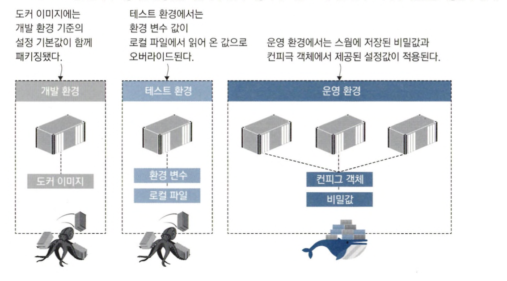
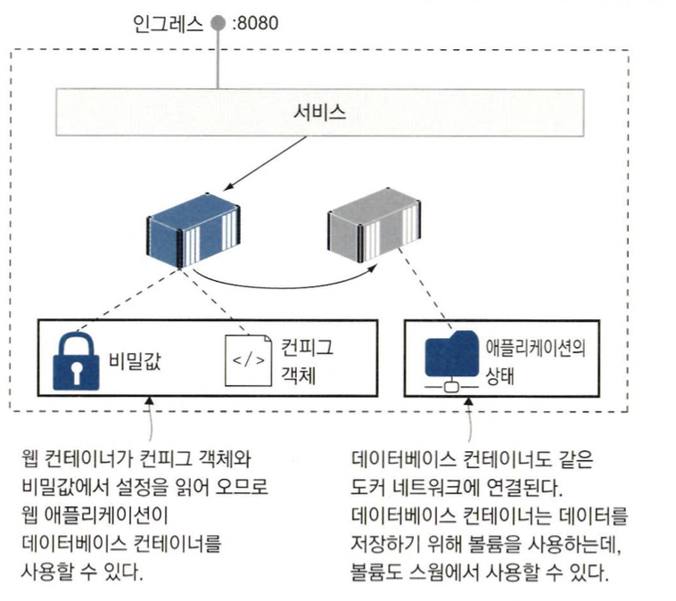
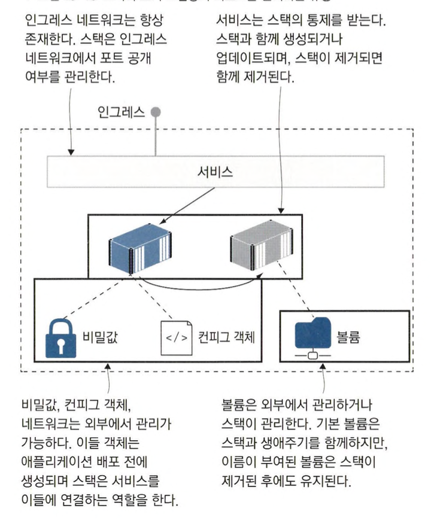

# 도커 스웜 스택으로 분산 애플리케이션 배포하기

## 도커 컴포즈를 사용한 운영 환경

### 도커 컴포즈로 작성한 내용을 스택으로 배포하기

도커 스웜은 도커 컴포즈 파일을 사용하여 컨테이너들을 배포할 수 있습니다.

`docker-compose` 명령어를 사용했을 때 처럼 도커 컴포즈 파일을 사용하여 배포하면 애플리케이션에 접근할 수 있게 됩니다.

일반적으로 스웜 모드에서는 애플리케이션을 배포할 때 스택을 만들어 배포합니다.

스택이란 `서비스, 네트워크, 볼륨 등 여러 개의 도커 리소스를 묶어 만든 리소스`를 말합니다.

스택은 다음과 같이 배포할 수 있습니다.

```bash
docker stack deploy -c ./todo-list/v1.yml todo
```

다음 명령어를 사용하면 스택 목록을 볼 수 있습니다.

```bash
docker stack ls
```

```bash
NAME      SERVICES
todo      1
```

다음과 같이 명령을 이용하면 스택을 이용하여 배포한 서비스들을 볼 수 있습니다.

```bash
docker service ls 
```

```bash
ID             NAME            MODE         REPLICAS   IMAGE                          PORTS
swo1m20ax9lr   todo_todo-web   replicated   1/1        diamol/ch06-todo-list:latest   *:8080->80/tcp
```

### 멀티 노드로 고가용성 확보하기

스웜에 노드가 두 개 이상이라면 고가용성을 확보할 수 있습니다.

서비스 레플리카를 실행 중인 노드가 고장이 나도 남아 있는 노드에서 대체 레플리카를 실행해 애플리케이션을 복구하게 됩니다.

해당 기능을 사용하기 위해서는 컴포즈 파일에 deploy 항목을 추가해주어야 합니다.

<aside>
💡 deploy 항목은 스택으로 배포해야할 때 적용되며 도커 컴포즈로 실행할때는 deploy 항목이 무시될 뿐 실행은 정상적으로 됩니다.

</aside>

다음은 deploy 파일 예시입니다.

```yaml
version: "3.7"

services:
  todo-web:
    image: diamol/ch06-todo-list
    ports:
      - 8080:80
    deploy:
      replicas: 2
      resources:
        limits:
          cpus: "0.50"
          memory: 100M
```

위의 파일을 보면 deploy 항목을 통해 다음과 같은 설정을 한 것을 볼 수 있습니다.

- replicas : 실행할 컨테이너의 수
- resources.remits.cpus : 최대 성능으로 동작시 사용할 CPU (현재는 1개의 코어의 50% 만큼 사용)
- resources.remits.memory : 최대 성능으로 동작시 사용할 Memory (100MB)

수정한 컴포즈 파일을 적용하기 위해서 다음 명령을 사용할 수 있습니다.

```bash
docker stack deploy -c ./v2.yml todo
```

레플리카 상태를 확인하면 다음과 같습니다.

```bash
docker service ps todo_todo-web
```

```bash
ID             NAME                  IMAGE                          NODE             DESIRED STATE   CURRENT STATE             ERROR     PORTS
tkfm0mf2exaz   todo_todo-web.1       diamol/ch06-todo-list:latest   docker-desktop   Running         Running 16 seconds ago              
2lwwb5aebly7    \_ todo_todo-web.1   diamol/ch06-todo-list:latest   docker-desktop   Shutdown        Shutdown 17 seconds ago             
6netilsx5gd5   todo_todo-web.2       diamol/ch06-todo-list:latest   docker-desktop   Running         Running 20 seconds ago
```

기존 레플리카는 컴포즈 파일에 추가한 자원 설정으로 인해 새로운 컨테이너로 교체된 것을 볼 수 있습니다.

<aside>
💡 도커 컨테이너는 상한치를 지정하지 않는 이상 호스트 컴퓨터의 CPU와 메모리를 무제한으로 사용하므로 제약을 두는 것이 좋습니다.

</aside>

### 스택을 통해 애플리케이션 그룹화하기

클러스터는 일반적으로 많은 수의 애플리케이션을 실행하기 때문에 애플리케이션도 그룹으로 만들어 관리해야 합니다.

도커 명령행에서 stack 명령을 사용해 여러 애플리케이션을 하나의 대상으로 다루며, 각 서비스나 서비스의 레플리카 목록을 보거나 애플리케이션 전체를 한꺼번에 제거할 수도 있습니다.

```bash
# 스택의 서비스 목록 확인
docker stack services todo

# 각 서비스의 레플리카 목록 확인
docker stack ps todo

# 스택 제거
docker stack rm todo
```

## 컨피그 객체를 이용한 설정값 관리

### 도커 컨피그 객체를 이용하여 애플리케이션에 설정값 제공하기

스웜에서는 설정값을 위해 도커 컨피그 객체가 쓰입니다.

`컨피그 객체는 컨테이너가 설정값을 클러스터에서 읽어 올 수 있게 해주는 강력한 기능을 가진 리소스`이자 `애플리케이션 배포와 설정 관리를 분리해 주는 역할`도 합니다.



개발 조직에서는 `API 키, 데이터베이스 서버 패스워드, SSL 인증서 등 모든 비밀값에 접근 권한을 갖고 설정 관리를 전담하는 팀을 두는 경우`가 많습니다.

또한, 이들 비밀값은 애`플리케이션을 실행하는 환경과 망 분리된 보안 시스템에 저장`됩니다.

따라서 설정 전담 팀은 `중앙 보안 시스템에 저장된 값을 애플리케이션 플랫폼에 전달할 수단이 필요`합니다.

스웜에는 이런 상황에서 컨피그 객체를 사용합니다.

다음은 설정 컨피그 객체를 만드는 예시입니다.

```bash
# 로컬에 위치한 JSON 파일로 컨피그 객체를 만든다
# docker config create {객체 이름} {파일 경로}
docker config create todo-list-config ./configs/config.json
```

다음 명령어를 사용하여 컨피그 객체를 확인할 수 있습니다.

```bash
docker config ls
```

```bash
ID                          NAME               CREATED          UPDATED
gy51flwp4kq54wdb718yulua2   todo-list-config   19 seconds ago   19 seconds ago
```

컨피그 객체는 다음과 같은 다양한 데이터 포맷들을 사용할 수 있습니다.

- JSON
- XML
- key-value
- 바이너리 파일

컨피그 객체는 스웜에 의해 컨테이너 파일 시스템 내의 파일로 전달되고 애플리케이션 입장에서는 직접 파일을 업로드 한 것처럼 사용할 수 있습니다.

### 컨피그 객체 내용 확인하기

컨피그 객체로 만든 설정은 도커 명령어를 통해 그대로 데이터를 확인할 수 있습니다.

<aside>
💡 컨피그 객체는 데이터를 그대로 평문으로 저장하기 때문에 민감한 데이터를 저장하는 수단으로 사용하기에는 적합하지 않습니다.

</aside>

다음은 컨피그 객체의 내용을 확인하는 명령입니다.

```bash
# 컨피그 객체 확인 명령
# docker config inspect --pretty {컨피그 객체 이름}
docker config inspect --pretty todo-list-config
```

```bash
ID:                     gy51flwp4kq54wdb718yulua2
Name:                   todo-list-config
Created at:             2023-06-25 05:47:12.648666095 +0000 utc
Updated at:             2023-06-25 05:47:12.648666095 +0000 utc
Data:
{
  "Logging": {
    "LogLevel": {
      "Default": "Information",
      "Microsoft": "Warning",
      "Microsoft.Hosting.Lifetime": "Warning"
    }
  },
  "AllowedHosts": "*",
  "Database": {
    "Provider": "Postgres"
  }
}
```

### 컴포즈 파일에서 지정된 컨피그 객체 사용하기

서비스는 컴포즈 파일에 지정된 컨피그 객체를 사용할 수 있습니다.

다음은 도커 컴포즈 파일에서 컨피그 파일을 사용하는 예시입니다.

```yaml
services:
  todo-web:
    image: diamol/ch06-todo-list
    ports:
      - 8080:80
    configs:
      - source: todo-list-config
        target: /app/config/config.json

configs:
  todo-list-config:
    external: true
```

<aside>
💡 설정 값을 읽는 경로를 작성할때 상대경로, 절대경로 둘다 사용가능하지만 운영체제에 따라 달라질 수도 있기 때문에 명시적으로 지정하는 것이 확실합니다.

</aside>

## 비밀값을 이용하여 대외비 설정 정보 관리하기

### 도커 스웜에서의 비밀값

비밀값은 클러스터의 관리를 받는 스웜 리소스입니다.

비밀값은 로컬 파일로 생성 후, 클러스터 데이터베이스에 저장했다가 서비스 정의에서 비밀값 참조하면 실행된 컨테이너의 파일 시스템에 비밀값의 값이 전달됩니다.

비밀값이 컨피그 객체와 가장 크게 다른 점은 `비밀값을 사용하는 워크플로 중 비밀값이 컨테이너에 전달된 상태에서만 복호화된 비밀값을 볼 수 있다는 것` 입니다.

그 외의 경우에는 `비밀값이 항상 암호화된 상태로 존재`합니다.

### 도커 스웜에서 비밀값 사용하기

다음은 비밀값을 생성하고 정보를 확인하는 예시입니다.

```bash
# docker secret create {비밀값 이름} {비밀값 경로}
docker secret create todo-list-secret ./secrets/secrets.json
```

다음은 비밀값의 정보를 확인하는 예제입니다.

```bash
# docker secret inspect --pretty {비밀값 이름}
docker secret inspect --pretty todo-list-secret
```

```bash
ID:              tq6p3kxru2mc9n85bv963dgoz
Name:              todo-list-secret
Driver:            
Created at:        2023-06-25 07:48:30.35226038 +0000 utc
Updated at:        2023-06-25 07:48:30.35226038 +0000 utc
```

다음은 비밀값을 사용하는 예시입니다.

```yaml
services:
  todo-web:
    image: diamol/ch06-todo-list
    ports:
      - 8080:80
    configs:
      - source: todo-list-config
        target: /app/config/config.json
    secrets:
      - source: todo-list-secret
        target: /app/config/secrets.json

secrets:
  todo-list-secret:
    external: true
```

비밀값을 사용하는 서비스는 다음과 같이 동작합니다.



### 컨피그 객체와 비밀값의 수정은 불가능하다

클러스터에서 `컨피그 객체와 비밀값을 한번 만들고 나면 내용이 변하지 않습니다.`

만약, `내용을 변경할 필요가 생긴다면 새로운 컨피그 객체나 비밀값을 만들어야 합니다.`

변경하기 위해서는 다음과 같은 과정을 거쳐야 합니다.

1. 변경된 내용을 담은 새로운 컨피그 객체 혹은 비밀값을 기존의 것과 다른 이름으로 만듭니다.
2. 컴포즈 파일의 정의에 사용된 컨피그 객체 혹은 비밀값의 이름을 새로 만든 이름으로 바꿉니다.
3. 변경된 컴포즈 파일로 스택을 배포합니다.

결국 설정값을 수정하기 위해 서비스를 업데이트 해야합니다. (스택을 배포해야하기 때문)

<aside>
💡 쿠버네티스에서는 클러스터에 저장된 기존 컨피그 객체나 비밀값을 수정할 수 있습니다.
단, 애플리케이션마다 설정 파일의 변화를 확인하지 않는 경우가 있을 수 있으므로 컨테이너를 교체하는 상황이 필요할 수 있습니다.

</aside>

하지만 서비스를 업데이트하는 것을 너무 두렵게 생각할 필요는 없습니다.

애플리케이션에 새로운 기능을 추가하거나 보안 업데이트 등의 작업을 할때도 컨테이너를 교체하는 작업을 진행해야하고 이를 위해 롤링 업데이트 같은 무중단 배포 방식을 사용하는 것 이기 때문입니다.

## 스웜에서 볼륨사용하기

### 도커 볼륨

볼륨은 컨테이너와 별개의 생명주기를 갖는 스토리지의 단위입니다.

모든 stateful 애플리케이션에서 데이터 저장에 볼륨을 사용할 수 있습니다.

볼륨은 마치 컨테이너 시스템의 일부처럼 사용 가능하지만, 사실은 컨테이너 외부에 존재하는 리소스입니다.

애플리케이션을 업데이트하면 컨테이너가 교체되면서 볼륨은 새 컨테이너에 연결됩니다.

그리고 새 컨테이너가 실행되면 이전 컨테이너가 갖고 있던 데이터를 그대로 유지합니다.

### 도커 스웜에서의 볼륨

도커 스웜에서도 마찬가지로 컴포즈 파일의 서비스 정의에 볼륨 마운트를 정의하여 로컬 파일시스템의 디렉터리 처럼 사용할 수 있습니다.

하지만 데이터가 저장되는 방식에 큰 차이가 있습니다.

클러스터는 여러 개의 노드로 구성되고, 이들 노드는 각각 디스크가 있어서 이 디스크에 로컬 볼륨을 저장합니다.

업데이트에도 데이터를 유지하는 가장 간단한 방법은 이 로컬 볼륨을 이용하는 것입니다.

하지만 로컬 볼륨을 이용하는 방식은 새 레플리카가 기존 레플리카에 접근할 수 없기 때문에 `레플리카가 교체되는 상황에서 문제가 발생`합니다.

이런 문제는 서비스가 데이터가 있는 특정 노드에서만 실행되게끔 고정하면 해결됩니다.

<aside>
💡 단 이 방식은 레플리카를 여러 개 실행하지 않고 서버 고장이 일어나지 않는 상황이어야 합니다.

</aside>

다음은 특정 노드에서만 실행되게끔하기 위해 레이블을 부여하고 강제로 지정하는 예시입니다.

```yaml
docker node update --label-add storage=raid $(docker node ls -q)
```

다음은 도커 컴포즈 파일에서 수정하는 예시입니다.

```yaml
todo-db:
    image: diamol/postgres:11.5
    environment:
      PGDATA: "/var/lib/postgresql/data/pgdata"
    volumes:
      - todo-db-data:/var/lib/postgresql/data
    deploy:
      replicas: 1
      resources:
        limits:
          cpus: "0.50"
          memory: 500M
      placement:
        constraints:
          - node.labels.storage == raid

volumes:
  todo-db-data:
```

### 도커 스웜에서 볼륨 사용시 주의사항

`로컬 볼륨에 저장된 데이터는 모든 노드에 복제되지 않는 다는 점을 기억`해두어야 합니다.

디스크를 데이터 캐시 용도로 사용하면 로컬 볼륨으로도 별 문제가 없지만 여러 노드에 걸쳐 공유해야 하는 애플리케이션에서는 사용할 수 없습니다.

도커는 볼륨 드라이버에 플러그인 시스템을 채용하고 있어 스웜에서 클라우드 스토리지나 데이터센터의 스토리지 장비를 분산 스토리지로 사용하게끔 설정할 수 있습니다.

## 클러스터는 스택을 어떻게 관리하는가?

### 도커스웜에서의 스택

도커 스웜에서 말하는 `스택은 클러스터가 관리를 담당하는 리소스의 모임`입니다.

운영 환경의 스택은 다양한 리소스로 구성되는데, 오케스트레이션 도구는 이들 리소스를 비슷하지만 약간씩 다른 방법으로 관리합니다.


### 도커 스웜이 스택을 어떻게 관리하는지

- 스웜은 볼륨을 생성하고 삭제할 수 있습니다.
    - 서비스 이미지에 볼륨의 정의가 포함된 경우 스택도 기본 볼륨을 생성하지만, 기본 볼륨은 스택을 제거하면 함께 제거됩니다.
    - 스택 정의에 이름이 붙은 볼륨을 사용하면 스택 배포와 함께 볼륨이 생성되지만, 이 볼륨은 스택을 제거해도 삭제되지 않습니다.
- 비밀값과 컨피그 객체는 설정값이 든 파일을 클러스터에 업로드하는 방법으로 생성합니다.
    - 비밀값과 컨피그 객체는 클러스터 데이터베이스에 저장됐다가 이 비밀값이나 컨피그 객체를 사용하는 컨테이너가 실행될 때 해당 컨테이너로 전달됩니다.
    - 비밀값과 컨피그 객체는 전형적인 읽기 위주 객체로, 수정이 불가능합니다.
    - 스웜 환경에서 애플리케이션 설정 관리는 배포 프로세스와 별개입니다.
- 네트워크는 애플리케이션과 별도로 관리됩니다.
    - 관리자가 명시적으로 네트워크를 생성할 수 도 있고 필요할 때마다 스웜이 네트워크를 생성하기도 합니다.
    - 모든 스택은 컴포즈 파일에 네트워크가 정의되지 않았더라도 자신이 포함된 서비스를 연결할 네트워크와 함께 배포됩니다.
- 서비스는 스택이 배포될 때 생성되거나 제거됩니다.
    - 서비스가 실행 중일 때는 스웜이 서비스를 모니터링하며 서비스 수준이 정상치를 유지하는지 확인합니다.
    - 헬스 체크를 통해 이상이 검출된 컨테이너는 새로운 컨테이너로 교체되며, 고장을 일으킨 노드에서 실행 중이던 컨테이너도 마찬가지로 교체됩니다.