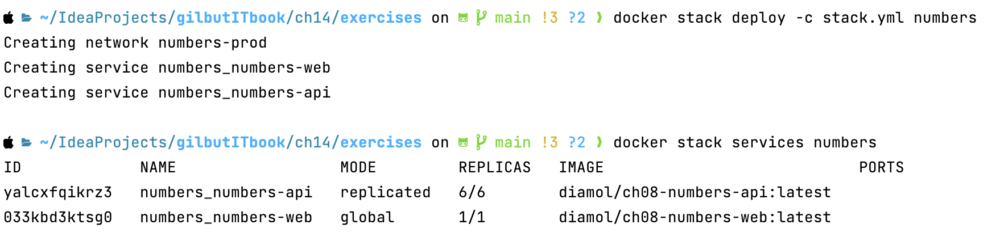
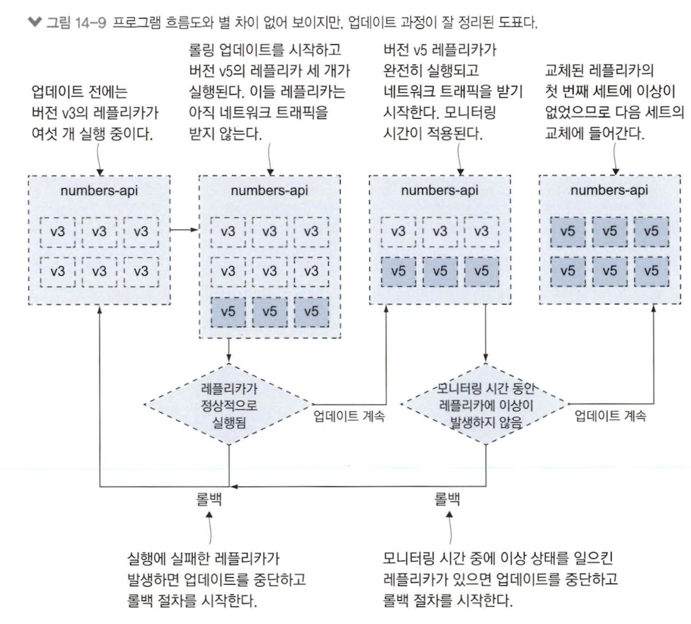
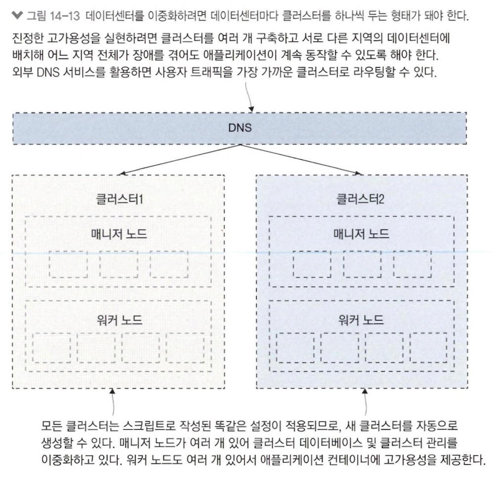

# 14장 업그레이드와 롤백을 이용한 업데이트 자동화

## 14.1 도커를 사용한 애플리케이션 업그레이드 프로세스

#### 실습) 도커 스웜 모드로 하여 컴포즈 파일을 병합하고 스택 배포

```shell
# core compose file과 override file 병합
docker compose -f ./numbers/docker-compose.yml -f ./numbers/prod.yml config > stack.yml

# 병합된 compose file로 stack 배포
docker stack deploy -c stack.yml numbers

# 스택 서비스 정보 확인
docker stack services numbers
```



> global 모드는 ingress network를 우회하기 위한 목적으로 사용 &rarr; reverse proxy에서 주로 사용

- 한 노드에 레플리카 한 개만 실행되는 global 모드 서비스와 레플리카 6개로 실행되는 replicated 모드 서비스 각각 하나씩 실행

```yaml
numbers-web:
  ports:
    - target: 80
      published: 80
      mode: host      # ingress network 대신 host 80 port 연결
  deploy:
    mode: global      # 해당 서비스는 한 노드에서 한 개 컨테이너만 실행
```

- global 모드 서비스는 ingress network 대신 host network 사용
- ingress network 내 routing overhead &darr; 가능

## 14.2 운영 환경을 위한 롤링 업데이트 설정하기

```yaml
numbers-api:
  deploy:
    update_config:
      parallelism: 3
      monitor: 60s
      failure_action: rollback
      order: start-first
```

- `parallelism` : 한 번에 교체하는 레플리카 수
  - 한 번에 세 대 컨테이너 교체
  - 일반적으로 30% 설정
- `monitor` : 다음 컨테이너 교체로 넘어가기 전에 새로 실행한 컨테이너 이상 여부 모니터링 시간
  - 헬스 체크 포함된 경우 해당 시간 필요
  - 헬스 체크가 2~3번 진행될 수 있는 시간 설정
  - 해당 시간 증가시키면 롤링 배포 신뢰도 &uarr;
  - 단순히 시간을 증가시킨다고 신뢰도가 올라가는게 맞나..? 🤔
- `failure_action` : monitor 시간 이내 헬스 체크 실패하거나 컨테이너가 실행 되지 않아 롤링 배포 실패한 경우 조치 정의 &rarr; rollback
- `order` : 레플리카 교체 절차 순서 ex) start_first : 기존 레플리카 제거 전 새 레플리카 먼저 검증

## 14.3 서비스 롤백 설정하기

> application 배포 중 장애 발생 시 가능한 한 빨리 이전 버전으로 롤백

```yaml
numbers-api:
  deploy:
    update_config:
      parallelism: 6
      monitor: 0s
      failure_action: continue
      order: start-first
```

- 교체 레플리카를 6으로 지정해 이상 상태에 있는 레플리카 한 번에 교체
- `start-first` 를 통해 기존 레플리카 종료를 신경쓰지 않고 새 레플리카 실행
- 이전 버전에 문제가 없다는 점을 가정 &rarr; 롤백하면 무조건 성공



## 14.4 클러스터의 중단 시간

#### drain mode

> 컨테이너 유지 보수 모드

- 컨테이너 장애 발생으로 인해 종료 후 다른 노드에서 실행한 컨테이너로 교체 원함
- 유지 보수 모드로 전환해 재부팅 주기 도래 전까지 컨테이너 실행 x

#### leader manager

> HA 모델에서 클러스터를 통제하는 역할

- HA 구성 위해 매니저 노드가 둘 이상 필요하지만 하나의 노드만 실제로 통제 &rarr; 리더 매니저
- 리더 매니저 승계는 다수결로 진행되어 항상 홀수 숫자 유지 필요
- 매니저 노드를 상실하게 되어 짝수인 경우 워커 노드를 매니저 노드로 승격 가능

## 14.5 스웜 클러스터의 고가용성

> 데이터 센터를 분리하여 HA 구성 확보



- 매니저 노드는 데이터 센터 A, 워커 노드는 A, B, C &rarr; 네트워크 지연 시간 발생 가능
- 클러스터를 여러개 구성하여 HA 확보