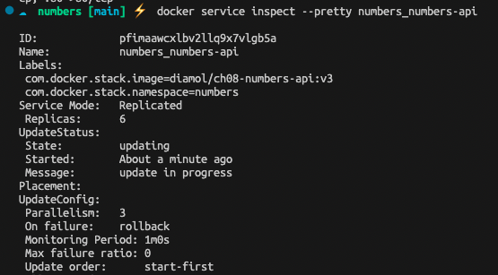
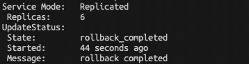
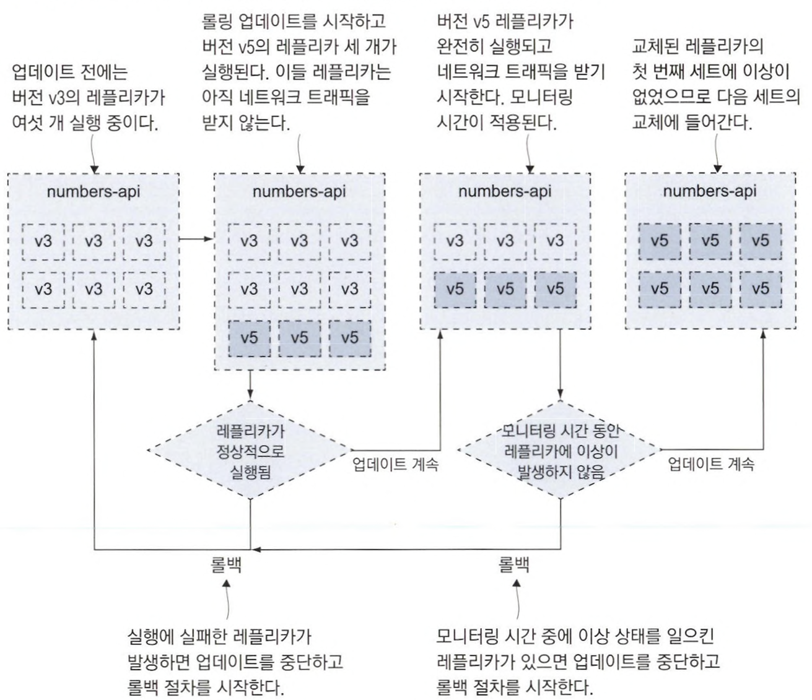
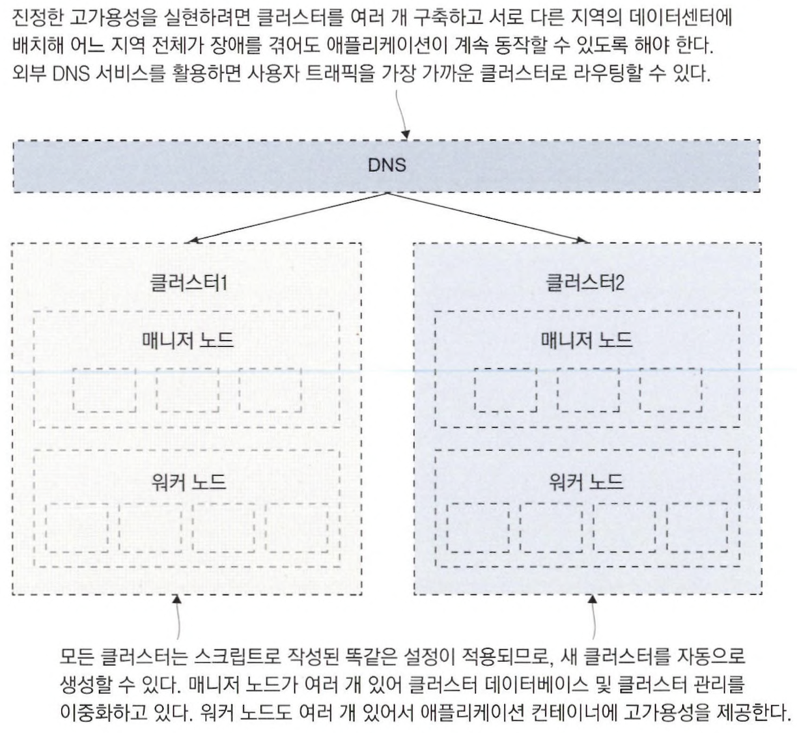

# 14장 업그레이드와 롤백을 이용한 업데이트 자동화

## 14.1 도커를 사용한 애플리케이션 업그레이드 프로세스

배포 주기는 애플리케이션 버전을 제외하고 최소한 다음 네 가지 주기를 고려해야 한다.

- 의존 모듈의 업데이트
- 애플리케이션 코드를 컴파일하는 데 사영하는 SDK 업데이트
- 애플리케이션이 동작하는 플랫폼의 업데이트
- 운영체제 업데이트

빌드에 대한 신뢰감은 성공적인 배포가 계속돼야만 쌓을 수 있다. 이 과정의 핵심은 `애플리케이션 헬스 체크`다.

헬스 체크 없이는 애플리케이션이 자기 수복성을 가질 수 없고 안전한 업데이트와 롤백도 불가능하다.

📌 컴포즈 파일을 병합하고 병합한 파일로 스택을 배포한다.

- global 모드 : global 모드로 동작하는 서비스는 한 노드에 레플리카를 하나만 실행한다.
    - 이 모드는 인그레스 네트워크를 우회하기 위한 목적으로 사용된다.
    - 리버스 프록시 같은 상황에서 유용하게 사용할 수 있는 모드다.

```bash
# 코어 컴포즈 파일과 오버라이드 파일을 병합한다.
$ docker-compose -f ./numbers/docker-compose.yml -f ./numbers/prod.yml config > stack.yml

# 병합된 컴포즈 파일로 스택을 배포한다.
$ docker stack deploy -c stack.yml numbers
Creating network numbers-prod
Creating service numbers_numbers-api
Creating service numbers_numbers-web

# 스택의 서비스 정보를 확인한다.
$ docker stack services numbers
ID             NAME                  MODE         REPLICAS   IMAGE                            PORTS
pfimaawcxlbv   numbers_numbers-api   replicated   6/6        diamol/ch08-numbers-api:latest
7t6ysg260p90   numbers_numbers-web   global       1/1        diamol/ch08-numbers-web:latest
```


✅ global 모드 서비스는 인그레스 네트워크 대신 호스트 네트워크를 사용할 수 있다.

```yaml
numbers-web:
	ports:
		- target: 80
			published: 80
			mode: host

	deploy:
		mode: global
```

- `mode: global`
    - deploy 항목에 이 필드 설정을 추가하면 해당 서비스는 한 노드에서 한 개의 컨테이너만 실행된다.
    - 레플리카의 수는 노드의 수와 같으므로 클러스터에 새로 추가된 노드에도 컨테이너가 실행된다.
- `mode: host`
    - ports 항목에 이 필드 설정을 추가하면 해당 서비스를 인그레스 네트워크 대신 호스트의 80번 포트와 연결한다.
    - 한 노드에 레플리카 하나만으로도 무방한 가벼운 웹 애플리케이션인 경우
    - 네트워크 성능이 매우 중요해서 인그레스 네트워크 내 라우팅에 따른 오버헤드를 제거하고 싶은 경우
    

📌 헬스 체크 기능이 포함돼있는 v2를 배포한다.

```bash
# 헬스 체크, 운영 환경 설정 오버라이드 파일과 v2 버전 파일을 병합한다.
$ docker-compose -f docker-compose.yml -f prod.yml -f prod-healthcheck.yml -f v2.yml --log-level ERROR config > stack.yml

# 스택을 업데이트한다.
$ docker stack deploy -c stack.yml numbers

# 스택의 레플리카 상태를 확인한다.
$ docker stack ps numbers
```

- 서비스 업데이트는 기존 컨테이너를 먼저 종료하고 새 컨테이너를 실행하는 식의 `롤링 업데이트` 방식이다.
- 기존 컨테이너가 호스트 컴퓨터의 포트를 계속 연결하고 있다면 새 컨테이너를 실행할 수 없기 때문이다.

### 롤링 업데이트

- 레플리카는 하나씩 교체된다.
- 새 컨테이너가 정상적으로 실행되는지 확인이 끝난 후 다음 컨테이너 업데이트에 들어간다.
- 새 컨테이너를 실행하기 전에 먼저 기존 컨테이너를 종료한다.
- 새 컨테이너가 정상적으로 시작되지 않으면 전체 업데이트가 중단된다.

## 14.2 운영 환경을 위한 롤링 업데이트 설정하기

롤링 업데이트의 세세한 방식은 컴포즈 파일 내 서비스 정의의 `deploy` 항목에서 설정할 수 있다.

📌 롤링 업데이트 커스텀 설정의 예

```yaml
numbers-api:
	deploy:
		update_config:
			parallelism: 3
			monitor: 60s
			failure_action: rollback
			order: start-first
```

- parallelism : 한 번에 교체하는 레플리카의 수
- monitor : 다음 컨테이너 교체로 넘어가기 전에 새로 실행한 컨테이너의 이상 여부를 모니터링하는 시간
- failure_action : monitor에 설정한 시간 이내에 헬스 체크가 실패하거나 컨테이너가 실행되지 않아 롤링 업데이트가 실패한 경우 취해야하는 조치
- order : 레플리카를 교체하는 절차의 순간
    - start_first : 기존 레플리카를 제거하기 전에 새 레플리카를 먼저 검증한다.

📌 롤링 업데이트에 새로 변경된 설정을 적용한다.

```bash
$ docker-compose.yml -f docker-compose.yml -f prod.yml -f prod-healthcheck.yml -f prod-updateconfig.yml -f v3.yml --log-level ERROR config > stack.yml

$ docker stack deploy -c stack.yml numbers

$ docker stack ps numbers
```

📌 무작위 숫자 API 서비스의 정보에서 현재 업데이트 상태를 확인한다.

```bash
$ docker service inspect --pretty numbers_numbers-api
```



## 14.3 서비스 롤백 설정하기

애플리케이션을 이전 상태로 되돌리는 것은 `서비스 단위` 로 이루어 진다.

📌 업데이트 설정이 제대로 됐다면, 업데이트 실패 여부를 파악해 실패 시 이전 버전으로 롤백이 일어난다.



📌 업데이트 실패 시 최대한 빨리 이전 버전으로 돌아가는 롤백 설정

```yaml
numbers-api:
	deploy:
		rollback_config:
			parallelism: 6
			monitor: 0s
			failure_action: continue
			order: start-first
```

- start-first
    - 기존 레블리카 종료를 신경 쓰지 않고 먼저 새 레플리카를 실행한다.
- monitor: 0s
    - 롤백이 실패하더라도 다음 레플리카를 교체할 것이므로 모니터링 시간이 불필요하다.

📌 v3 ~ v5까지의 업데이트 과정 정리



## 14.4 클러스터의 중단 시간

디스크, 네트워크, 전원 등에 이상이 발생하기 때문에 컨테이너를 실행하는 것은 각각의 컴퓨터이므로 중단 시간이 발생할 수 있다.

`드레인 모드(drain mode)` 

- Swarm 스케줄러는 이 노드에 새로운 작업을 할당하지 않는다.
- 현재 실행 중인 작업이 종료되거나 실패하면, 그 작업은 다른 노드에 재배치된다.

`리더 매니저`

- 스웜은 능동-수동 고가용성 모델을 따르기 때문에 클러스터를 실제로 통제하는 매니저는 하나이다.
- 리더 매니저가 고장 나면 리더 매니저 승계한다.

## 14.5 스웜 클러스터의 고가용성

여러 지역의 데이터센터에 걸쳐 하나의 클러스터를 구성하는 방법으로 고가용성을 확보하려는 경우가 있다.

- 매니저 노드 - 데이터 센터 A / 워커 노드 - 데이터 센터 A, B, C
- `네트워크 지연 시간` 문제가 발생할 수 있다.
    - 데이터 센터 A와 B 사이 심각한 네트워크 지연 발생
    매니저 노드는 데이터센터 C의 워커 노드로 재배치

✅ 지역을 아우르는 거대한 규모의 장애에도 애플리케이션이 계속 동작해야할 필요가 있다면,,,,,,
⇒ 클러스터를 여러 개 구성해야 한다.

📌 데이터 센터를 이중화하려면 데이터센터마다 클러스터를 하나씩 두는 형태가 되어야 한다. </br>
