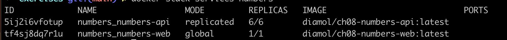
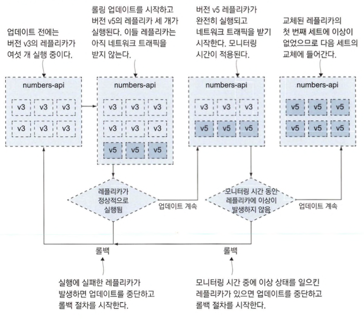
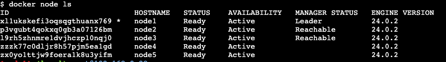
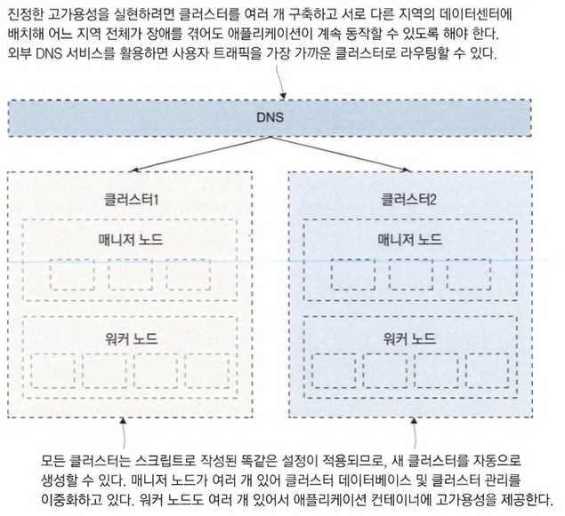

# 업그레이드와 롤백을 이용한 업데이트 자동화

- 컨테이너에서 실행되는 애플리케이션을 오케스트레이션 도구와 조합하면 무중단 업데이트가 가능합니다.

## 도커를 사용한 애플리케이션 업그레이드 프로세스

- 배포 주기는 애플리케이션 버전을 제외하고도 최소한 다음 네 가지 주기를 고려해야합니다.
  - 의존 모듈의 업데이트
  - SDK 업데이트
  - 플랫폼의 업데이트
  - 운영체제 업데이트

```shell
docker-compose -f ./numbers/docker-compose.yml -f ./numbers/prod.yml config > stack.yml
docker stack deploy -c stack.yml numbers
docker stack services numbers
```

- 예제 yml을 병합하여 `stack.yml`를 만들고 실행하는 예제입니다.
- `stack.yml` name 필드를 제거하고 들여쓰기 수정이 필요함
- `published` string -> number로 변경 필요함



- global 모드로 동작하는 서비스는 한 노드에 레플리카를 하나만 실행되며 인그레스 네트워크를 우회하기 위한 목적으로 사용합니다.(리버스 프록시 같은 상황)

```yml
numbers-web:
    ports:
        - target: 80
        published: 80
        mode: host
    deploy:
        mode: global
```

- `mode: host`는 한 노드에서 한 개의 컨테이너만 실행(클러스터에 새로 추가된 노드에도 컨테이너가 실행)
- `mode: global`는 ports 항목에 이 필드 설정을 추가하면 인그레스 네트워크 대신 호스트의 80번 포트와 연결

```shell
docker-compose -f ./numbers/docker-compose.yml -f ./numbers/prod.yml -f ./numbers/prod-healthcheck.yml -f ./numbers/v2.yml config > stack.yml
docker stack deploy -c stack.yml numbers
docker stack ps numbers
```

- log level 조정 명령어는 안되어서 제거했습니다.
- 위 예제와 같이 yml파일 수정 필요
- 도커 스웜의 롤링 업데이트는 새 컨테이너를 실행하기 전에 먼저 기존 컨테이너를 종료하고 레플리카 하나씩 교체되며 새 컨테이너가 정상적으로 실행되는지 확인이 끝난 후 다음 컨테이너 업데이트합니다.

## 운영 환경을 위한롤링 업데이트 설정하기

```yml
numbers-api:
  deploy:
    update_config:
      parallelism: 3
      monitor: 60s
      failure_action:
      rollback order: start-first
```

- parallelism : 한 번에 교체하는 레플리카의 수
- monitor : 다음 컨테이너 교체로 넘어가기 전에 새로 실행한 컨테이너의 이상 여부를 모니터링하는 시간
- failure_action : 설정한 시간 이내에 헬스 체크가 실패하거나 컨테이너가 실행 되지 않아 롤링 업데이트가 실패한 경우에 어떤 조치를 취해야 하는지를 의미
- order : 레플리카를 교체하는 절차의 순서
  - stop-first가 기본값으로 실행 중인 레플리카 수가 서비스 정의에 지정된 숫자를 넘어서지 않습니다.
  - start-first를 선택해 기존 레플리카를 제거하기 전에 새 레플리카를 먼저 검증하는것이 좋습니다.

```shell
docker-compose -f ./numbers/docker-compose.yml -f ./numbers/prod.yml -f ./numbers/prod-healthcheck.yml -f ./numbers/v3.yml config > stack.yml
docker stack deploy -c stack.yml numbers
docker stack ps numbers
```

- v3로 업데이트하는 예제입니다.

```shell
docker service inspect --pretty numbers_numbers-api
```

## 서비스 롤백 설정하기

- docker stack rollback 명령은 없습니다.

```shell
docker-compose -f ./numbers/docker-compose.yml -f ./numbers/prod.yml -f ./numbers/prod-healthcheck.yml -f ./numbers/prod-update-config.yml -f ./numbers/v5-bad.yml config > stack.yml
docker stack deploy -c stack.yml numbers
docker service inspect --pretty numbers_numbers-api
```

- 업데이트 중 문제가 생겨 롤백되는 예제입니다.

```shell
docker-compose -f ./numbers/docker-compose.yml -f ./numbers/prod.yml -f ./numbers/prod-healthcheck.yml -f ./numbers/prod-update-config.yml -f ./numbers/prod-rollback-config.yml -f ./numbers/v5-bad.yml config > stack.yml
docker stack deploy -c stack.yml numbers
docker service inspect --pretty numbers_numbers-api
```

- rollback.yml를 추가한 예제입니다.

```shell
docker-compose -f ./numbers/docker-compose.yml -f ./numbers/prod-full.yml -f ./numbers/v5.yml config > stack.yml
docker stack deploy -c stack.yml numbers
docker service inspect --pretty numbers_numbers-api
```



## 클러스터의 중단 시간

- `https://labs.play-with-docker.com/`가상 머신을 만들수 있는 사이트입니다. (4시간동안)

```shell
ip=$(hostname -i)
docker swarm init --advertise-addr $ip
docker swarm join-token manager
docker swarm join-token worker
docker swarm join --token <token>
docker node ls
```



```shell
docker node update --availability drain node5
docker node update --availability drain node3
docker node ls
```

- 스웜에서는 드레인모드(유지보수 모드)를 설정할 수 있습니다.
- 두 가지 모두 현재 실행 중인 레플리카가 종료되고 새로운 레플리카를 실행하지도 않는다는 점은 같지만. 매니저 노드는 드레인 모드가 돼도 계속 클러스터의 관리 그룹으로 기능하며 클러스터 데이터베이스 동기화 및 관리 API 제공도 계속하고 매니저 노드 중 리더인 리더 매니저(매니저가 2이상일때 통제하는 매니저)가 될 수도 있습니다.
- 리더 매니저 승계는 남은 매니저 노드끼리 투표를 거쳐 다수결로 결정

```shell
docker swarm leave --force
docker node update --availability active node5
docker node promote node5
docker node ls
```

- 1번 노드를 클러스터에서 이탈 시키고 5번 노드를 매니저로 격상시키는 예제입니다.
- node rm : 매니저 노드에서 사용
- swarm leave : 해당 노드에서 사용
- node demote : 매니저를 워커로 강등

- 모든 매니저가 고장을 일으킨 경우 : 애플리케이션은 그대로 잘 실행되지만 문제발생시 컨테이너 교체가 되지않기에 클러스터를 원 상태로 회복 하려면 매니저 노드를 복구해야합니다.
- (리더가아닌)한대를 제외한 모든 매니저 노드가 고장을 일으킨 경우 : 클러스터의 통제 권을 상실할 가능성이 있습니다.
- 노드 간 레플리카를 고르게 재배치하기 : 노드를 추가시 재배치가 되지않으면 레플리카가 실행되지 않습니다.

## 스웜 클러스터의 고가용성


