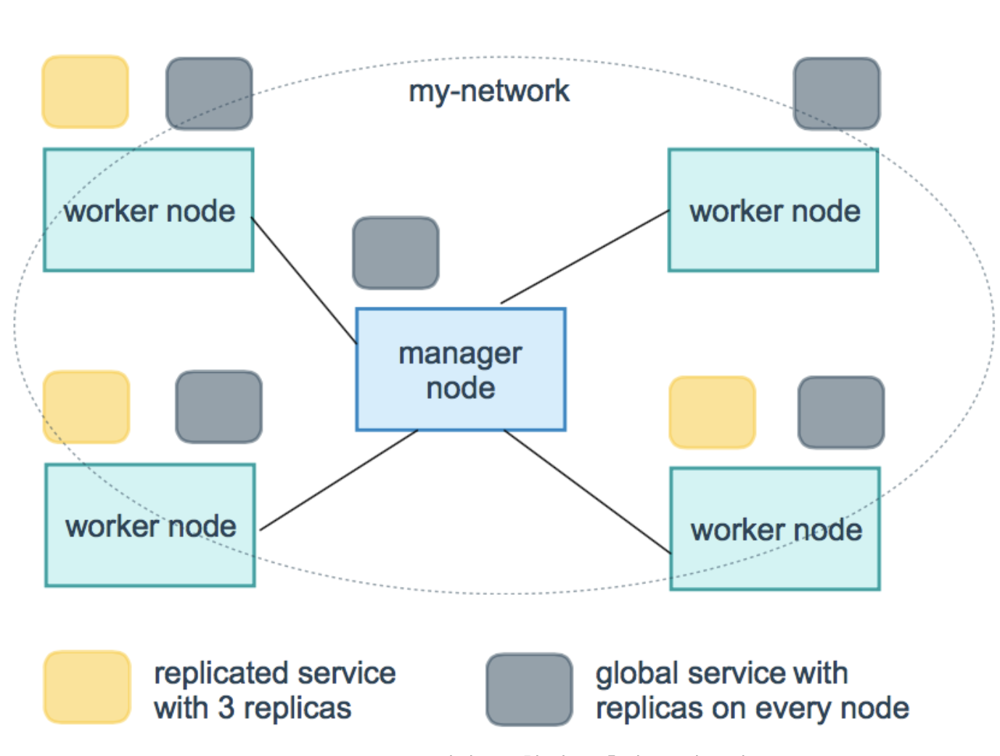
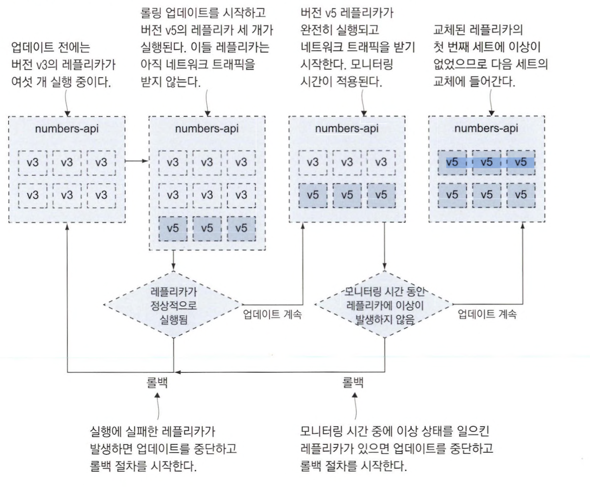
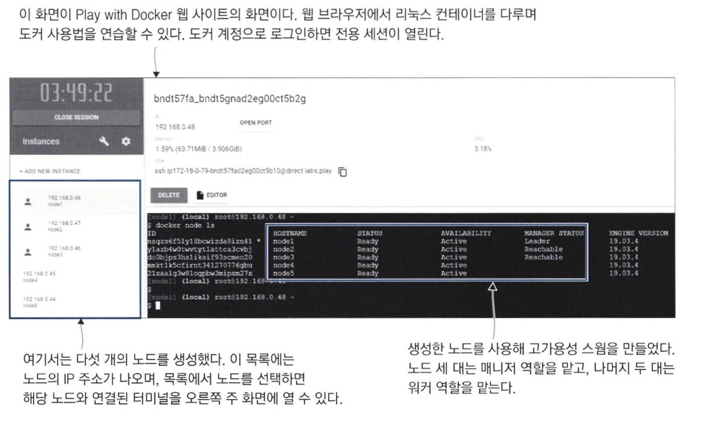
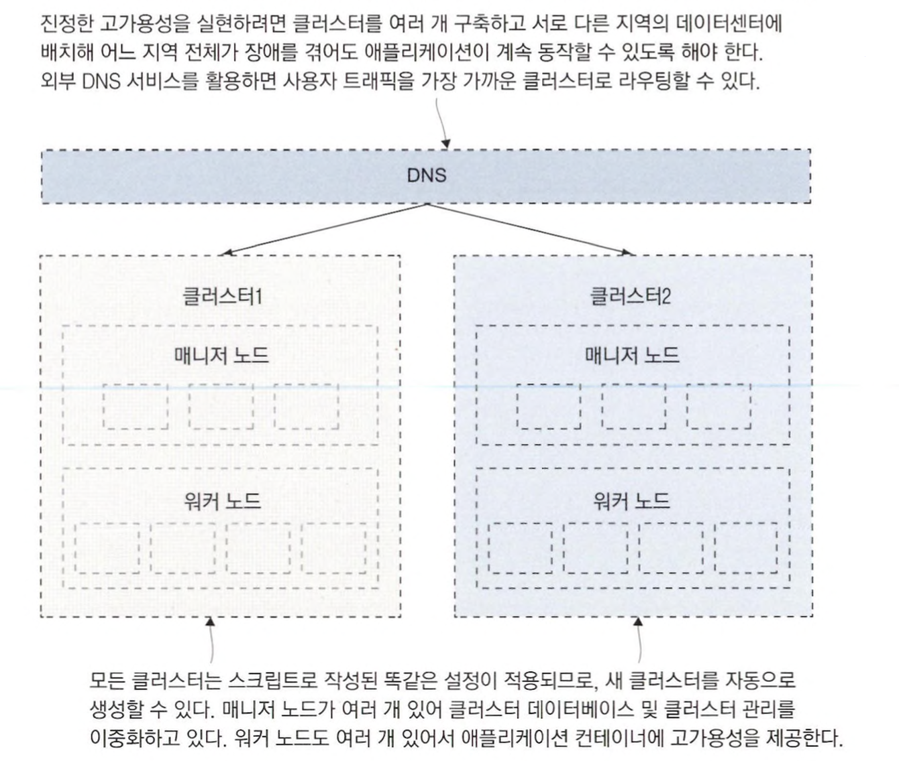

# 업그레이드와 롤백을 이용한 업데이트 자동화

## 도커를 사용한 애플리케이션 업그레이드 프로세스

도커 이미지의 배포 주기는 **애플리케이션 버전**, **의존 모듈의 업데이트**, **애플리케이션 코드를 컴파일하는데 사용 하는 SDK 업데이트** <br>
**애플리케이션이 동작하는 플랫폼의 업데이트**, **운영체제 업데이트** 등의 주기를 고려해야 한다.

애플리케이션의 신규 기능이든 의존 모듈 변경이든, 소스 코드가 조금이라도 변경될 때마다 빌드 파이프라인이 동작한다. <br>
또 매일 밤 자동 빌드를 통해 항상 최신 버전의 SDK, 런타임, 운영체제가 반영된 즉시 배포 가능한 이미지를 가질 수 있다.

애플리케이션에 변경이 없더라도 매달 새 버전을 배포해야 한다는 것은 부담스러운 일이다. <br>
하지만 주기적인 배포를 자동화하면 빌드에 신뢰감이 생기고, 다음 배포 주기를 기다리지 않고도 작업이 끝난 새 기능을 바로바로 배포에 포함시킬 수 있다.

빌드에 대한 신뢰감은 성공적인 배포가 계속돼야만 쌓을 수 있다. <br>
이 때 중요한 것은 애플리케이션 헬스 체크이고, 헬스 체크 없이는 애플리케이션이 자기 수복성을 가질 수 없고 안전한 업데이트와 롤백도 불가능하다.

<br>

### replicated mode vs global mode

- **replicated**: 필요한 만큼 복제된 태스크가 클러스터의 노드에 분배되어 할당된다. 대부분의 경우 서비스는 이 유형으로 설정되어 배포된다.
- **global**: 모든 각 노드에 하나씩의 태스크가 할당되도록 강제하는 유형이다. 쿠버네티스의 데몬셋(DaemonSet)과 같은 형태다. (*각 노드의 상태를 모니터링하는 로그 수집기 등을 배치할 때 유용*)



```yaml

numbers-web:
  ports:
    - target: 80
      published: 80
      mode: host
  deploy:
    mode: global
```

<br>
<hr>

## 운영 환경을 위한롤링 업데이트 설정

```yaml
# 롤링 업데이트 커스텀 설정의 예
numbers-api: 
  deploy:
    update_config:
      parallelism: 3
      monitor: 60s 
      failure_action: rollback
      order: start-first
```

- **parallelism**: 한 번에 교체하는 레플리카의 수. (기본값은 1)
- **monitor**: 다음 컨테이너 교체로 넘어가기 전에 새로 실행한 컨테이너의 이상 여부를 모니터링하는 시간 (기본값은 0, 이 시간을 증가시킬수록 롤링 업데이트의 신뢰성 증가)
- **failure_action**: 롤링 업데이트가 실패한 경우에 어떤 조치를 취해야 하는지를 의미 (기본값은 업데이트 중지)
- **order**: 레플리카를 교체하는 절차의 순서. (기본값은 stop-first) 레플리카를 실행할 수 있는 추가적인 시스템 자원이 있다면 start-first를 선택해 기존 레플리카를 제거하기 전에 새 레플리카를 먼저 검증하도록 하는 것이 좋다.

> parallelism은 전체 레플리카 수의 30% 정도로 설정하면 롤링 업데이트를 꽤 빠르게 진행할 수 있고 <br>
> monitor는 헬스 체크가 2~3 번 이상 진행될 수 있을 만큼 넉넉한 시간 을 지정하는 것이 좋다.

<br>
<hr>

## 서비스 롤백 설정

롤백 명령이 따로 있지는 않다. <br>
애플리케이션을 이전 상태로 되돌리는 것은 서비스 단위로 이뤄진다. <br>
대개 롤백은 자동화된 롤링 업데이트 과정에서 새로 투입한 레플리카가 모니터링 중 오류를 일으켰을 때 수행된다.

````yaml
# 업데이트 실패 시 최대한 빨리 이전 버전으로 돌아가는 롤백 설정
numbers-api:
  deploy:
    rollback_config:
      parallelism: 6
      monitor: 0s
      failure_action: continue
      order: start-first
````

> 동시 교체 레플리카 수를 6으로 지정해 이상 상태에 있는 레플리카를 한 번에 교체하고, <br>
> 교체 전략은 start-first를 적용해 기존 레플리카(새 버전) 종료를 신경 쓰지 않고 먼저 새 레플리카(구 버전) 를 실행하도록 했다. <br>
> 롤백이 실패하더라도 다음 레플리카를 교체할 것이므로 모니터링 시간도 0으로 지정했다.



<br>
<hr>

## 클러스터의 중단 시간

컨테이너 오케스트레이션 도구는 여러 대의 컴퓨터를 묶어 하나의 강력한 클러스터로 만든다. <br>
하지만 컨테이너를 실행하는 것은 각각의 컴퓨터이므로 중단 시간이 발생할 수 있다. (*디스크, 네트워크, 전원 등에 이상*) <br>



<br>

노드 중 한 대가 운영체제 업데이트 혹은 인프라 작업 등으로 인해 사용할 수 없게 됐다. <br>
이 노드에는 실행 중인 컨테이너가 있을 수도 있어서 이 컨테이너를 안전하게 종료시키고 다른 노드에서 실행한 컨테이너로 교체하고 싶다. <br>
그리고 해당 노드는 **유지 보수 모드**로 전환해 다음 재부팅 주기가 도래하기 전까지는 이 노드에서 컨테이너를 실행하지 않으려고 한다. <br>
**유지 보수 모드**를 스웜에서는 **드레인 모드**라고 한다. (*매니저 노드와 워커 노드 모두 드레인 모드로 설정 가능*)

**매니저 노드의 드레인 모드**는 계속 클러스터의 관리 그룹으로 기능하며 클러스터 DB 동기화 및 관리 API 제공도 계속하고 매니저 노드 중 리더인 리더 매니저가 될 수도 있다. <br>

### 리더 매니저란 ?

> 고가용성을 확보하려면 매니저 노드가 둘 이상 필요하다. <br>
> 하지만 스웜은 능동-수동 고가용성 모델을 따르기 때문에 클러스터를 실제로 통제하는 매니저는 하나뿐이다. 이 매니저가 바로 리더 매니저다. <br>
> 나머지 매니저 노드는 클러스터 DB의 복본을 유지하며 관리 API 요청을 처리하다가 리더 매니저가 고장을 일으키면 리더 자리를 이어받는다. <br>
> 리더 매니저 승계는 남은 매니저 노드끼리 투표를 거쳐 다수결로 결정되는데, 이 때문에 매니저 노드의 수는 항상 홀수여야 한다. <br>
> **매니저 노드 하나를 상실해 매니저 노드의 수가 짝수가 됐다면 워커 노드 중 하나를 매니저 노드로 승격시킬 수 있다.**


### 발생 가능한 시나리오

- **모든 매니저가 고장을 일으킨 경우**
  - 매니저 노드가 모두 고장을 일으켜 워커 노드만 남았다면, 애플리케이션은 그대로 잘 실행된다.
  - 하지만 서비스를 모니터링해 줄 주체가 없기 때문에 서비스 컨테이너가 이상을 일으켜도 컨테이너가 교체되지 않는다. <br>
  - 클러스터를 원 상태로 회복 하려면 매니저 노드를 복구해야 한다.
- **(리더가 아닌) 한 대를 제외한 모든 매니저 노드가 고장을 일으킨 경우**
  - 이 상태에선 클러스터의 통제권을 상실할 가능성이 있다.
  - 리더 매니저를 승계하려면 매니저 노드끼리 투표를 해야 하는 데, 다른 매니저 노드가 없으니 리더 매니저 승계가 불가능하다.
  - 남은 매니저 노드만으로 swarm init 명령에 force-new-cluster 옵션을 사용해 기존 클러스터의 태스크와 데이터를 그대로 유지하면서 강제로 해당 매니저 노드를 리더 매니저로 만들 수 있다. 그다음에는 매니저 노드를 추가로 투입해 고가용성을 회복하면 된다.
- **노드 간 레플리카를 고르게 재배치**
  - 서비스 레플리카는 클러스터에 노드를 추가해도 알아서 고르게 재배치되지 않는다.
  - 클러스터에 새로 노드를 추가해 처리 용량을 늘렸다 하더라도 서비스를 업데이트하지 않는 한, 새 노드에서는 아무 레플리카도 실행되지 않는다.
  - service update --force 명령으로 변경 사항 없이 강제로 서비스를 업데이트하면 노드마다 고르게 레플리카를 재배치할 수 있다.


<br>
<hr>

## 스웜 클러스터의 고가용성

헬스 체크는 애플리케이션 동작 상태를 확인해 이상 상태에 빠진 컨테이너를 새 컨테이너 로 교체한다. <br>
여러 개의 워커 노드는 노드 중 하나가 고장을 일으켜도 다른 컨테이너를 실행할 능력을 보존한다. <br>
여러 개의 매니저 노드는 워커 노드 모니터링 및 컨테이너 배치 능력의 여유분을 확보하는 역할을 한다.

### 여러 데이터 센터에 하나의 클러스터 구성

여러 데이터 센터에 하나의 클러스터 구성해서 고가용성을 확보할 수 있다.

> 매니저 노드는 데이터센터 A에 두고, 데이터센터 A, B. C에 워커 노드를 배치할 수도 있다. <br>
> 이럴 경우 클러스터 관리는 단순해지지만, 네트워크 지연 시간이라는 문제가 발생한다. <br>
> 만약 이 클러스터를 운영하는 중에 데이터센터 A와 B 사이에 심각한 네트워크 지연이 발생한다면 <br>
> 매니저 노드는 데이터센터 B 의 노드가 연락이 두절됐다고 판단하고 모든 컨테이너를 데이터센터 C의 워커 노드로 재배치하려 들 것이다. <br>
> 그 다음에는 서로 다른 지역에 위치한 매니저가 각자 자신이 리더 매니저라고 판단해 클러스터가 분열될 가능성이 생긴다. 

<br>

**거대한 규모의 장애에도 애플리케이션이 계속 동작해야 할 필요가 있다면 클러스터를 여러 개 구성하는 것뿐이다.**




