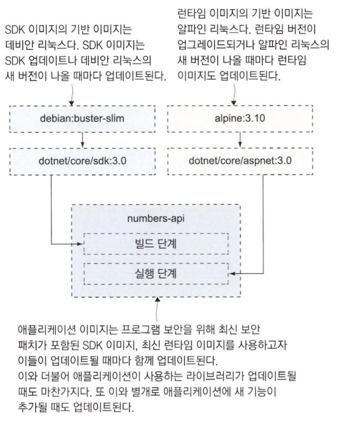
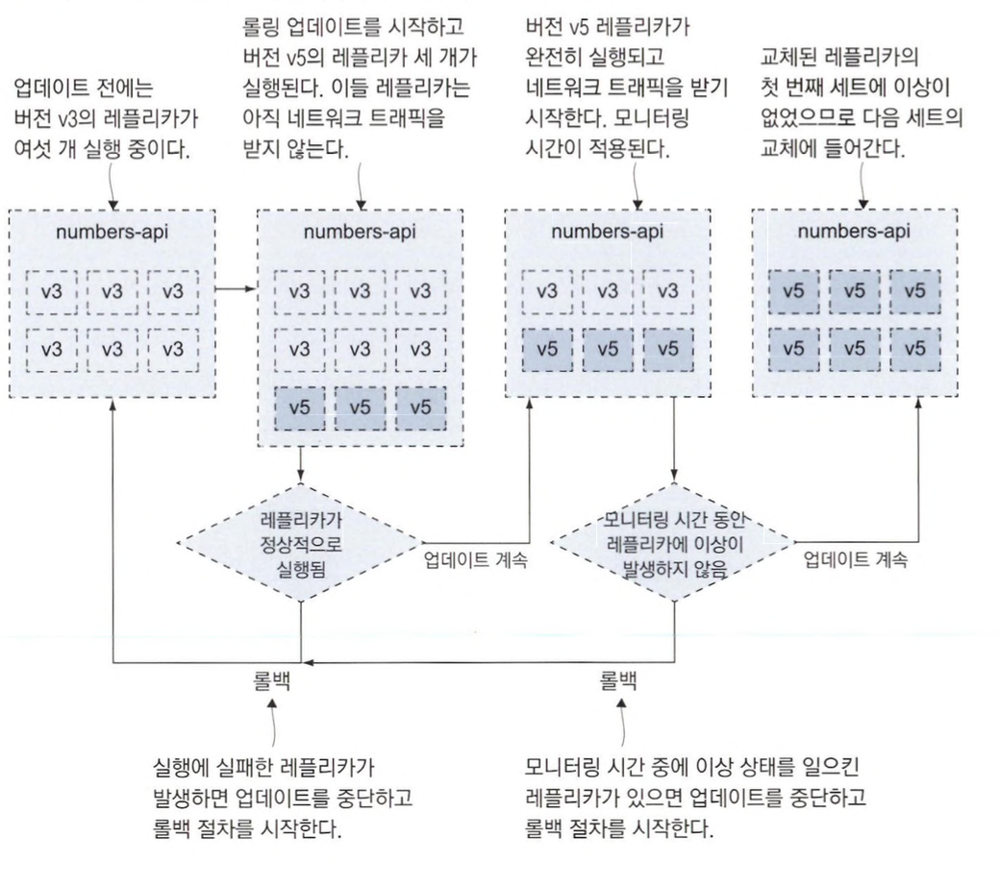
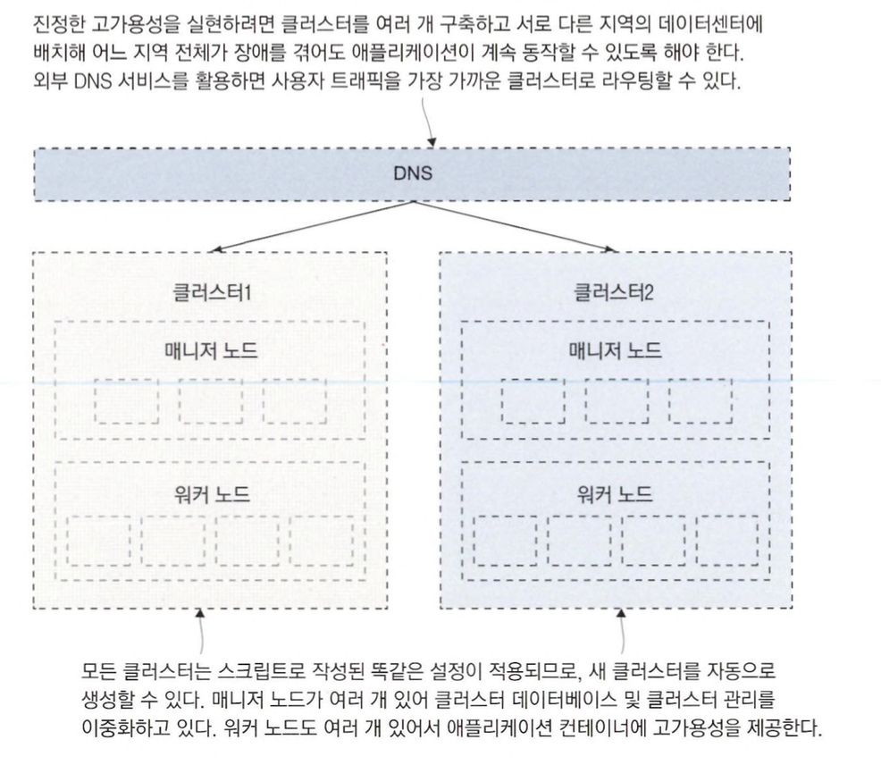

# 업그레이드와 롤백을 이용한 업데이트 자동화

## 도커를 사용한 애플리케이션 업그레이드 프로세스

### 배포 주기에서 고려해야할 4가지 사항

1. 의존 모듈의 업데이트
2. 애플리케이션 코드를 컴파일 하는데 사용하는 SDK 업데이트
3. 애플리케이션 동작하는 플랫폼의 업데이트
4. 운영체제 업데이트

다음은 닷넷 코어 애플리케이션의 여섯 가지 업데이트 주기를 정리한 것 입니다.



### 잦은 배포는 부담스러울 수 있다

애플리케이션에 배포가 잦은 경우 배포 절차에 많은 시간과 인적, 물적 자원을 소비해야하는 조직이라면 부담이 큽니다.

만약 배포과정이 자동화되어 부담이 적다면 업데이트 배포에 부담이 생기지 않고 새 기능을 바로바로 배포할 수 있게 될 것 입니다.

이런 상황에서 `성공적인 배포를 하기 위한 핵심은 헬스체크`입니다.

헬스 체크 없이는 애플리케이션이 자기 수복성을 가질 수 없고 안전한 업데이트와 롤백도 불가능합니다.

### replicated와 global

도커 스웜에서는 두 가지 유형의 서비스를 모드를 지원합니다.

- global
    - 클러스터 내의 모든 사용 가능한 노드에 서비스의 작업을 하나씩 배포합니다.
    - 즉, 노드 수 만큼 해당 서비스만큼 해당 서비스의 인스턴스가 생성됩니다.
    - 만약 노드가 추가되면, 새 노드에 작업이 자동으로 생성되고, 노드가 제거되면 그에 따른 작업도 제거됩니다.
    - 쿠버네티스의 DaemonSet과 비슷합니다.
- replicated
    - 사용자가 직접 작업수를 지정하게 합니다.
    - 어떤 노드에 서비스가 배포될지는 스케줄러가 결정합니다.

기본적으로 replicated 모드로 동작하며, global 모드로 동작하게 하기 위해서는 다음과 같이 설정해야 합니다.

```yaml
numbers-web:
    ports:
      - mode: host
        published: 80
        target: 80
    deploy:
      mode: global
```

위의 설정에서 global 모드로 설정하는 부분은 다음 두 필드입니다.

- `deploy.mode : global`
    - 해당 서비스는 한 노드에서 한 개의 컨테이너만 실행하도록 합니다.
- `ports.mode : host`
    - 해당 서비스를 인그레스 네트워크 대신 호스트의 80번 포트와 연결합니다.
    - 한 노드에 레플리카 하나만으로 무방한 가벼운 웹 애플리케이션이거나 네트워크 성능이 매우 중요해서 인그레스 네트워크 내 라우팅에 따른 오버헤드를 제거하고 싶다면 유용하게 사용할 수 있습니다.

## 운영 환경을 위한 롤링 업데이트 설정하기

### 롤링 업데이트 제어하기

도커 스웜에서 롤링 업데이트를 세세하게 제어하기 위해서 컴포즈 파일 내 deploy 항목에서 설정할 수 있습니다.

```yaml
services:
  numbers-api:
    deploy:
      update_config:
        parallelism: 3
        monitor: 60s
        failure_action: rollback
        order: start-first
```

update_config 항목의 4가지 설정을 통해 롤링 업데이트 과정을 원하는 대로 설정할 수 있습니다.

- parallelism
    - 한 번에 교체하는 레플리카의 수를 의미합니다.
    - 기본값은 1입니다.
- monitor
    - 다음 컨테이너 교체로 넘어가기 전에 새로 실행한 컨테이너의 이상 여부를 모니터링하는 시간을 의미합니다.
    - 기본값은 0이므로 헬스 체크 설정을 포함한 이미지의 경우 이 설정값을 늘려야 합니다.
    - 이 시간을 증가시키면 롤링 업데이트의 신뢰성이 증가합니다.
- failure_action
    - monitor에 설정한 시간 이내에 헬스 체크가 실패하거나 컨테이너가 실행되지 않아 롤링 업데이트가 실패한 경우에 어떤 조치를 취해야 하는지를 의미합니다.
    - 기본값은 업데이트 중지입니다.
- order
    - 레플리카를 교체하는 절차의 순서를 의미합니다.
    - stop-first가 기본값으로, 실행 중인 레플리카 수가 서비스 정의에 지정된 숫자를 넘어서지 않습니다.
    - 하지만 레플리카를 실행할 수 있는 추가적인 시스템 자원이 있다면 start-first를 선택해 기존 레플리카를 제거하기 전에 새 레플리카를 검증하는 것이 좋습니다.

## 서비스 롤백 설정하기

### 서비스 롤백 설정하기

도커 스웜에 따로 롤백명령이 없으며, 업데이트 과정에서 오류를 일으켰을때 수행됩니다.

업데이트와 마찬가지로 다음과 같이 설정하면 됩니다.

```yaml
services:
  numbers-api:
    deploy:
      rollback_config:
        parallelism: 6
        monitor: 0s
        failure_action: continue
        order: start-first
```

### 업데이트 - 롤백 과정



## 클러스터의 중단 시간

### 클러스터 중단시 조치

컨테이너 오케스트레이션 도구는 여러 대의 컴퓨터를 묶어 하나의 클러스터로 만듭니다.

하지만 `결국 실제로 컨테이너를 실행하는 것은 각각의 컴퓨터이기 때문에 중단 시간이 발생할 수 있습니다.`

이런 상황에 문제를 사전에 계획해 둔다면 클러스터가 문제를 비켜가는데 도움이 됩니다.

### 드레인 모드

도커 스웜의 드레인 모드는 `노드에 대한 관리 도구로 사용되며, 노드의 상태를 drain으로 변경`합니다.

다음 명령어를 통해 실행할 수 있습니다.

```bash
docker node update --availability drain <NODE-ID>
```

### 워커 노드와 매니저 노드의 드레인 모드

워커 노드와 매니저 노드의 드레인 모드는 약간 차이가 있습니다.

두가지 모두 현재 실행 중인 레플리카 종료되고 새로운 레플리카를 실행하지도 않는다는 점은 같습니다.

하지만 매니저 노드는 드레인 모드가 돼도 다음과 같은 기능을 지원합니다.

- 클러스터의 관리 그룹으로 기능
- 클러스터 데이터 베이스 동기화 및 관리 API를 제공
- 매니저 노드 중 리더인 리더 매니저가 될수도 있습니다.

### 리더 매니저

리더 매니저란 고가용성을 확보하려면 매니저 노드가 둘 이상 필요합니다.

하지만 스웜은 `능동-수동 고가용성 모델을 따르기 때문에 클러스터를 실제로 통제하는 매니저는 하나`뿐입니다.

이때 동작하는 매니저가 `리더 매니저`입니다.

나머지 매니저 노드는 API 요청을 처리하다가 리더 매니저가 고장을 일으키면 리더 자리를 이어받습니다.

`리더 매니저 승계는 남은 매니저 노드끼리 투표를 거쳐 다수결로 결정`됩니다.

이 때문에 `매니저 노드의 수는 항상 홀수여야 합니다.`

<aside>
💡 매니저 노드 하나를 완전히 상실해 매니저 노드의 수가 짝수가 됐다면 워커 노드 중 하나를 매니저 노드로 승격시킬 수 있습니다.
`docker node promote <NODE_ID>`

</aside>

### 스웜에서 노드를 제거하는 방법

- 매니저 노드에서 node rm 명령 사용
- 제거하고 싶은 노드에서 swarm leave 명령을 사용

### 장애가 발생했을때 시나리오

- 모든 매니저가 고장을 일으킨 경우
    - 매니저 노드가 모두 고장을 일으켜 워커 노드만 남았다면, 애플리케이션은 그대로 실행됩니다.
    - 인그레스 네트워크 및 서비스 레플리카는 워커 노드에서 매니저 노드 없이도 잘 동작하지만, 서비스를 모니터링해 줄 주체가 없기 때문에 서비스 컨테이너가 이상을 일으켜도 컨테이너가 교체되지 않습니다.
    - 클러스터를 원 상태로 회복하려면 매니저 노드를 복구해야 합니다.
- (리더가 아닌) 한 대를 제외한 모든 매니저 노드가 고장을 일으킨 경우
    - 매니저 노드가 한 대 외에는 모두 고장을 일으키고 남은 매니저 노드도 리더 매니저가 아니라면 클러스터의 통제권을 상실할 가능성이 있습니다.
    - 리더 매니저를 승계하려면 매니저 노드끼리 투표를 해야하는데, 다른 매니저 노드가 없으니 리더 매니저 승계가 불가능합니다.
    - 이 상황을 해결하기 위해서는 하나 남은 매니저에 접속하여 리더 매니저로 만들어야 합니다.
- 노드 간 레플리카를 고르게 재배치하고 싶을때
    - 서비스 레플리카는 클러스터에 노드를 추가해도 알아서 고르게 재배치되지 않습니다.
    - 클러스터에 새로 노드를 추가해 처리 용량을 늘렸다 하더라도 서비스를 업데이트하지 않는 한, 새 노드에서는 아무 레플리카도 실행되지 않습니다.
    - `service update --force` 명령으로 변경 사항 없이 강제로 서비스를 업데이트하면 노드마다 고르게 레플리카를 재배치할 수 있습니다.

## 스웜 클러스터의 고가용성

### 여러 데이터센터에 걸쳐 클러스터 구성하기

여러 지역의 데이터 센터에 걸쳐 하나의 클러스터를 구성하는 방법으로 고가용성으로 확보할 수 있습니다.

예를 들어 매니저 노드는 데이터 센터 A에 두고 데이터센터 A, B, C에 워커 노드를 배치할 수 있습니다.

하지만 이럴 경우 네트워크 지연시간이 발생할 수 있습니다.

스웜을 구성하는 노드는 서로 활발하게 통신을 주고받는데 각 데이터 센터간 네트워크 지연이 발생하면 매니저 노드가 효율적으로 컨테이너를 배치하기 힘들게 됩니다.

이런 상황에 대비해 다음과 같이 클러스터를 여러개로 구성해서 해결할 수 있습니다.


