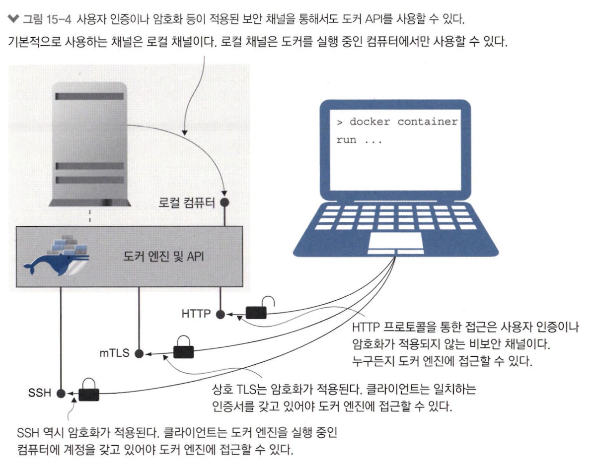
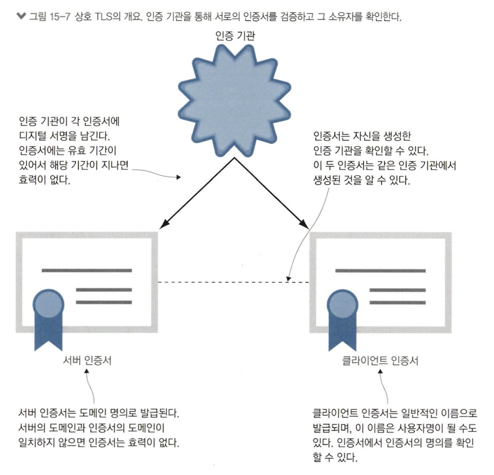
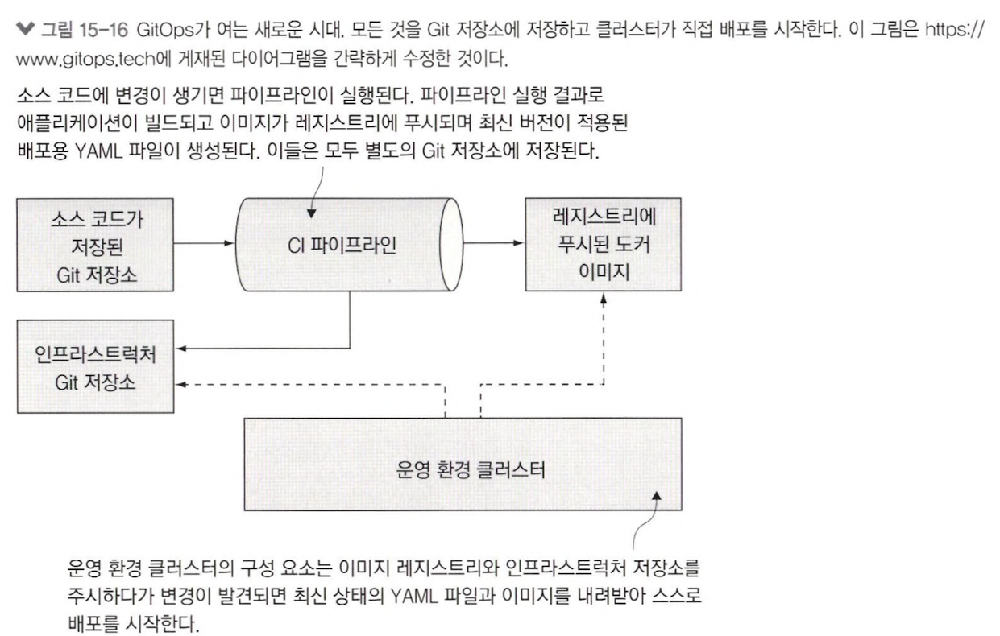

# 15장 보안 원격 접근 및 CI/CD를 위한 도커 설정

## 15.1 도커 API의 엔드포인트 형태

- 암호화되지 않은 HTTP 접근 허용 x
- 아무 인증 절차 없이 도커 엔진에 접근해 컨테이너 다룰 수 있음

#### 도커 엔진에 비보안 HTTP 접근 허용

```json
{
  "hosts": [
    "tcp://0.0.0.0:2375",      // 2375번 포트 원격 접근 허용ㅡ
    "fd://"                    // 리눅스 소켓 -> 로컬 채널 통한 접근 계속 허용
  ]
}
```

## 15.2 보안 원격 접근을 위한 도커 엔진 설정

> 도커 API 요청 받을 수 있는 채널 = `TLS(= 전송 계층 보안)`, `SSH`



- 도커 데스크탑 보안 원격 접근 설정 불가능
- 도커 데스크탑 도커 엔진 로컬 가상 머신에서 실행 &rarr; 도커 API 채널 설정할 방법 x, 위에서 설정한 HTTP 예외

### TLS 통해 도커 엔진 보안 원격 접근 설정



1. 상호 TLS 사용 위한 인증서와 키 파일 쌍 두 개 생성

- 키 파일 &rarr; 인증서 패스워드 역할
- 도커 API와 client에서 사용

2. TLS 통해 도커 엔진 접근

- 인증 기관과 클라이언트 &harr; 서버 한 쌍의 인증서 필요
- 단기 클라이언트 인증서를 통해 접근 권한 임시 부여 가능 &rarr; 인증서 관리에 대한 오버헤드 존재

3. TLS 통해 원격 접근 설정

```json
{
  "hosts": ["unix://var/run/docker.sock", "tcp://0.0.0.0:2376"],
  "tls": true,
  "tlscacert": "/diamol-certs/ca.pem",
  "tlskey": "/diamol-certs/server-key.pem",
  "tlscert": "/diamol-certs/server-cert.pem"
}
```

- 인증 기관 인증서, 클라이언트 인증서, 키 없이는 도커 엔진 명령 x
- 이전에 만들어진 인증서도 접근 허용 x

### SSH를 통해 원격 접근 설정

- 도커 명령행 도구가 SSH를 사용하여 도커 엔진 변경 필요 x
- 사용자 인증 서버가 대신 처리하여 인증서 생성 필요 x
- 도커 엔진을 실행중인 로컬에 사용자 계정 추가만 필요

## 15.3 도커 컨텍스트를 사용해 원격 엔진에서 작업하기

> 도커 컨텍스트란, 원격으로 접근할 도커 엔진을 전환할 수 있게 하는 도구

- 컨텍스트를 여러개 만들 수 있으며 원격 접근에 필요한 상세 정보 로컬에 저장
- 컨텍스트 &larr; 로컬 엔진이나 원격 엔진 전환에 필요한 모든 정보 저장
- 컨텍스트 전환 방법 : `해당 터미널 세션에만 적용되는 임시 전환` vs `다른 컨텍스트로 전환할 때까지 다른 터미널 세션에도 적용되는 영구 전환`
- `docker context use` &rarr; 새 터미널을 열거나 도커 명령 사용하는 모든 배치 해당 컨텍스트 사용
- 환경 변수 `DOCKER_CONTEXT` 정의해 오버라이드 가능

## 15.4 지속적 통합 파이프라인에 지속적 배포 추가하기

- CI 빌드 &rarr; 빌드용 서버 도커 엔진 안에서만 진행
- CD &rarr; 원격 도커 엔진에서 진행
  - 원격 호스트명 지정하여 보조 인증 수단으로 접근
  - 인증 수단 형상 관리 도구 의존 x

### CI

1. Git 서버에서 소스 코드 pull
2. Dockerfile 스크립트로 application build
3. build된 application 테스트
4. 이미지를 local registry에 push

## 15.5 도커 리소스의 접근 모델



#### 도커 엔진 보안

> 아무것도 할 수 없거나 모든 것을 할 수 있거나

- 명령행 도구와 API 사이 통신 암호화
- 허가받은 사용자만이 API 접근