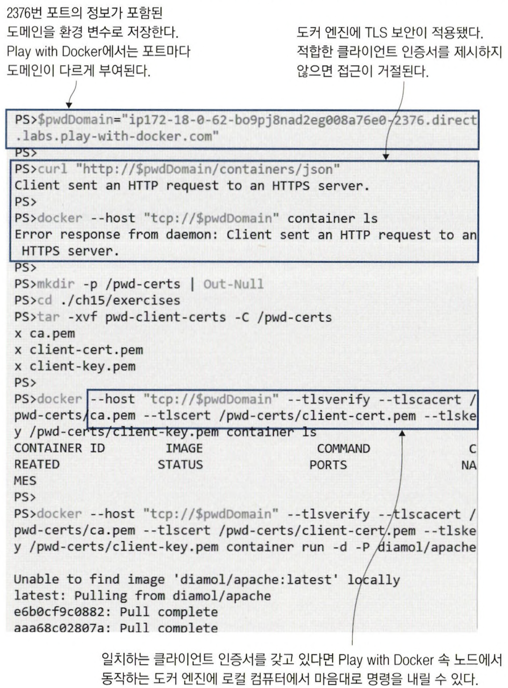

# 15장 보안 원격 접근 및 CI/CD를 위한 도커 설정

### 도커 엔진과 API 분리 시 이점

1. 다른 도구로도 도커 API 사용 가능해 컨테이너 관리 도구의 선택지가 넓어진다.
2. 로컬 컴퓨터에 있는 명령행 도구로도 원격 컴퓨터에서 실행 중인 도커 엔진 관리가 가능하다.

## 15.1 도커 API의 엔드포인트 형태

도커 엔진을 원격에서 접근할 수 있게 하려면 먼저 설정에서 명시적으로 외부 접근을 허용해야 한다.

원격 접근이 가능한 채널이 몇 가지 있으나, 그중 가장 간단한 것은 `비보안 HTTP` 를 통한 접근이다.

<aside>
⚠️ 암호화되지 않은 HTTP로 접근을 허용하는 것은 반드시 피해야 한다.

</aside>

📌 도커 엔진이 HTTP로 접근 가능하게 설정된 경우 호스트 주소만 알면 누구든지 도커 엔진을 마음대로 사용할 수 있다.


## 15.2 보안 원격 접근을 위한 도커 엔진 설정

도커에는 API가 요청을 받아들일 수 있는 채널이 두 가지 더 있다.

1. 전송 계층 보안 (TLS)
    - HTTPS 프로토콜의 디지털 인증서와 같은 방식의 암호화를 사용한다.
    - 상호 TLS를 사용하므로 서버와 클라이언트가 각각 인증서를 가진다.
2. 보안 셸 (SSH)
    - SSH로 원격 서버에 접근하려면 사용자명과 패스워드 혹인 비밀키가 필요하다.


### 상호 TLS를 이용해 도커 엔진의 보안 원격 접근 설정하기

1. 인증서와 키 파일 쌍을 두개 만든다.
2. 인증서를 배포할 컨테이너를 실행한다.
    - 두 개의 불륨이 마운트된다.
    - 다음의 파일을 노드로 복사한다.
        - 컨테이너가 갖고 있던 인증서
        - daemon.json
    
    ```bash
    # 인증서를 둘 디렉터리를 생성한다.
    mkdir -p /diamol-certs
    
    # 인증서 및 설정값을 적용할 컨테이너를 실행한다.
    docker container run -v /diamol-certs:/certs -v /etc/docker:/docker diamol/pwd-tls:server
    
    # 새로운 설정을 적용해 도커를 재시작한다.
    pkill dockerd
    dockerd &>/docker.log &
    ```
    

📌 상호 TLS의 개요. 인증 기관을 통해 서로의 인증서를 검증하고 그 소유자를 확인한다.


TLS를 통해 도커 엔진에 접근하려면 인증 기관과 한 쌍의 인증서가 필요하다. 인증서 관리에 대한 오버헤드가 존재한다.

TLS를 사용해 원격 접근이 가능하게끔 도커 엔진을 설정하려면 인증 기관 인증서, 서버 인증서 및 키의 쌍이 위치한 경로를 지정해야 한다.

```bash
{
  "hosts": ["unix:///var/run/docker.sock", "tcp://0.0.0.0:2376"],
  "tls": true,
  "tlscacert": "/diamol-certs/ca.pem",
  "tlskey": "/diamol-certs/server-key.pem",
  "tlscert": "/diamol-certs/server-cert.pem"
}
```

📌 클라이언트 인증서로는 TLS 보안이 적용된 도커 엔진에만 원격으로 접근할 수 있다.



## 15.3 도커 컨텍스트를 사용해 원격 엔진에서 작업하기

도커 컨텍스트를 사용하면 원격으로 접근할 도커 엔진을 편리하게 전환할 수 있다.

📌 컨텍스트 생성한다.

```bash
# 도커 엔진의 도메인과 인증서로 컨텍스트를 생성한다.
$ docker context create pwd-tls --docker "host=tcp://$pwdDomain,ca=/tmp/pwd-certs/ca.pem,cert=/tmp/pwd-certs/client-cert.pem,key=/tmp/pwd-certs/client-key.pem"

$ docker context ls
```

📌 환경 변수를 사용해 임시로 컨텍스트 전환한다.

- 해당 터미널 세션에서만 적용되지만, 권장되는 컨텍스트 전환 방법이다.
- 환경 변수를 이용한 컨텍스트 설정은 docker context use 명령으로 지정한 컨텍스트 설정보다 우선한다.

```bash
$ export DOCKER_CONTEXT='pwd-tls'
```

📌 context use CLI를 사용해 컨텍스트를 전환한다.

- 다른 터미널 세션까지 영향을 미치기 때문에 바람직하지 않다.

```bash
$ docker context use default
```

## 15.4 지속적 통합 파이프라인에 지속적 배포 추가하기

<aside>
⚠️ 인증 수단을 절대로 형상 관리 도구에 보관해서는 안된다.

</aside>

자동화 서버는 비밀값을 빌드 서버 내부에 저장해 파이프라인 작업에 사용한다. 이는 소스 코드 형상 관리와 인증 수단 관리를 분리하는 효과가 있다.

<aside>
💡 파이프라인에서 도커 명령행이 하는 일과 도커 컴포즈 명령행이 하는 일, 그리고 이 두가지 일을 제어하는 일을 잘 분리해 두어야 한다.

</aside>

⇒ 특정 자동화 서버에 대한 의존을 줄일 수 있고 나중에 자동화 서버를 전환할 때 도움이 된다.

- 이 세 가지 역할을 잘 분리하면, 시스템의 복잡성을 관리하는 데 도움이 된다.
- 각각의 역할에 맞는 도구를 사용함으로써 효율성을 높일 수 있다.
- 예를 들어, 개별 컨테이너를 관리할 때는 도커 명령어를 사용하고, 여러 컨테이너를 함께 관리할 때는 도커 컴포즈를 사용하며, 이러한 작업들을 조정하고 자동화하는 데는 CI/CD 파이프라인이나 배포 스크립트를 사용하는 것이 좋다.

## 15.5 도커 리소스의 접근 모델

도커 엔진의 보안은 두 가지를 의미한다.

1. 명령행 도구와 API 사이의 통신을 암호화한다.
2. 허가받은 사용자만이 API에 접근할 수 있도록 한다.

📌 쿠버네티스 - 역할 기반 접근 제어(Role-Based Access Control, RBAC)

- 사용자의 권한을 개인의 신분이나 직무에 따라 결정하는 보안 관리 방식
- 어떤 사용자가 접근할 수 있는 리소스는 무엇이고 이들 리소스에 어떤 작업을 수행할 수 있는지까지 세세히 지정할 수 있다.

📌 CI/CD 파이프라인의 주체가 바뀐 GitOps적인 접근법도 있다.

- 클러스터에서 새 빌드가 승인됐는지 여부를 파악해 업데이트를 스스로 배포한다. </br>
