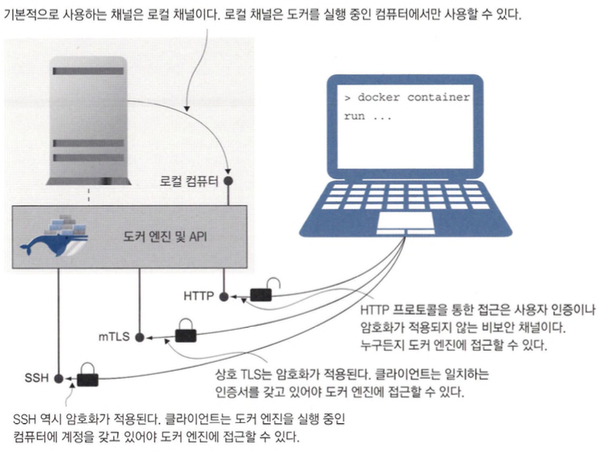
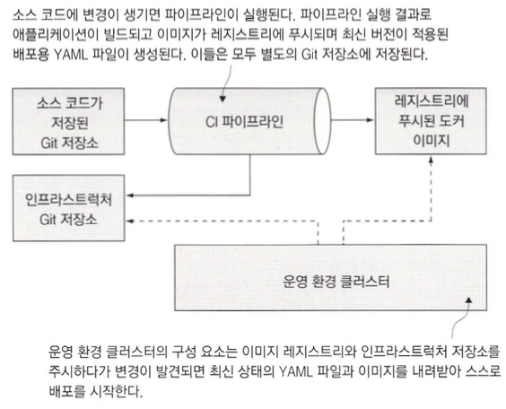

# 보안원격 접근 및 CI/CD를 위한 도커 설정

- 도커엔진과 API가 분리되어있어서 얻을수 있는 이점
  - 도커 API를 사용할 수 있 으므로 컨테이너를 관리하는 도구의 선택지가 넓어짐
  - 로컬 컴퓨터에 있는 명령행 도구로도 원격 컴퓨터에서 실행 중인 도커 엔진을 관리

## 도커 API의 엔드포인트 형태

- 도커를 비보안 http 로 접근할수 있게하는하면 안된다.

## 보안 원격 접근을 위한 도커 엔진 설정

- 도커에는 API가 요청을 받아들일 수 있는 채널
  - 전송 계층 보안(Transport Layer Securiry. TLS)
  - 보안 셸 (Secure Shell. SSH)



```shell
mkdir: /diamol-certs: Read-only file system
docker run -v ./diamol-certs:/certs -v /etc/docker:/docker diamol/pwd-tls:server
dockerd &>/docker.log &
pwdDoamin=ip172-18-0-79-cie1skogftqg00a6ocf0@direct.labs.play-with-docker.com
docker --host "tcp://$pwdDomain" container ls
```

- 인증서 설정 후 도커를 재시작하는 예제입니다.
- ssh 접속은 Play with docker 에서 제공합니다.

## 도커 컨텍스트를 사용해 원격 엔진에서 작업하기

- 도커 컨텍스트를 사용하면 원격으로 접근할 도커 엔진을 편리하게 전환할 수 있습니다.

```shell
docker context ls
```

- 현재 선택된 컨텍스트를 확인할수 있습니다.
- 운영 서버의 도커 엔진에 주기적으로 접근할 일이 없을 수도 있지만 컨테이너를 배우 면 배울수록 도커의 장점 중 하나인 쉬운 자동화의 편리함을 누리게 되고 도커 엔진에 직접 접근하는 사용자는 최고 관리자와 지속적 통합/배포 파이프라인에 사용되는 시스템 계정 외에는 필요치 않다는 것을 알게 됩니다.

## 지속적 통합 파이프라인에 지속적 배포 추가하기

- 대부분의 자동화 서버는 비밀값을 빌드 서버 내부에 저장해 파이프라인 작업에 사용합니다.(소스 코드 형상 관리와 인증 수단 관리를 분리하는 효과)

```shell
cd ch15/exercises/infrastructure
docker-compose -f ./docker-compose.yml -f ./docker-compose-linux.yml up -d
```

- git 다 안됩니다.
- 실행해보지는 못했지만 로컬서버에서 CI를 하고 원격서버에 CD를 할 수 있다는 사실을 알게되었습니다.

## 도커 리소스의 접근모델

- 도커 엔진의 보안은 두 가지
  - 명령행 도구와 API 사이의 통신을 암호화
  - 허가받은 사용자만이 API에 접근할 수 있도록 설정



- 애플리케이션 소스 코드뿐만 아니라 배포에 사용되는 YAML 파일의 버전, 인프라스트럭처 설정 스크립트까지 버전 관리의 대상이 됩니다.
