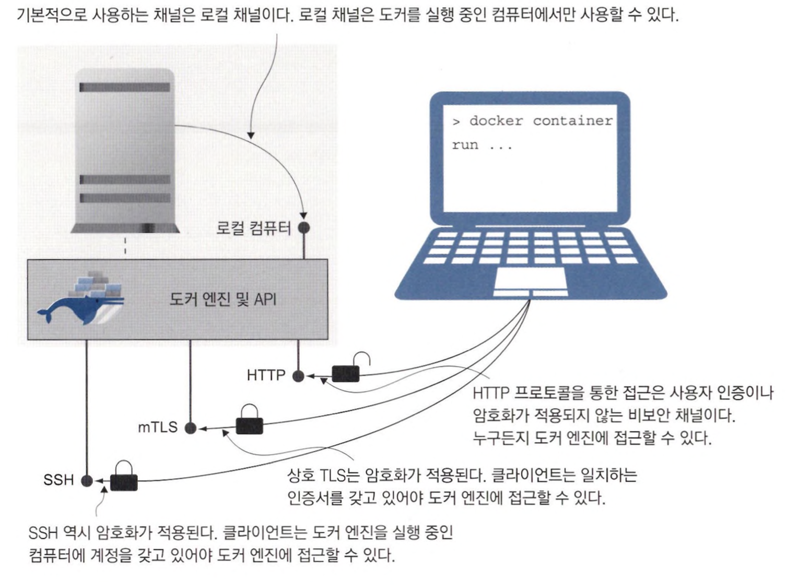

# 보안원격 접근 및 CI/CD를 위한 도커 설정

## 도커 API의 엔드포인트 형태

도커 엔진은 로컬 컴퓨터와 연결된 채널을 주시하도록 초기 설정이 돼 있고, CLI가 이 채널을 사용하기 때문에 도커 API와 통신이 가능하다. <br>
리눅스 소켓 or 윈도의 명명 파이프가 로컬 채널로 쓰이는데, 이 두 가지 모두 트래픽의 범위가 로컬 컴퓨터 내부로 제한되는 채널이다. <br>
도커 엔진을 원격에서 접근할 수 있게 하려면 먼저 설정에서 명시적으로 외부 접근을 허용해야 한다.

가장 간단한 것은 비보안 HTTP를 통한 접근이다.


> 원격에 위치한 도커 엔진을 다룰 때는 어떤 명령을 내리든 그 명령을 해당 서버의 입장에서 생각해야 한다. <br>
> 만약 컨테이너를 하나 실행하고 로컬 디스크 볼륨을 컨테이너에 마운트했다면 컨테이너에는 그 원격 서버의 디스크가 마운트된다.


<br>
<hr>

## 보안 원격 접근을 위한 도커 엔진 설정

도커에는 API가 요청을 받아들일 수 있는 채널이 두 가지 더 있다. 이 두 가지 채널 모두 보안 채널이다.

- **전송 계층 보안 (TLS)**
  - HTTPS 프로토콜의 디지털 인증서와 같은 방식의 암호화를 사용한다.
  - 도커 API는 상호 TLS를 사용하므로 서버와 클라이언트가 각각 인증서를 갖는다.
  - 서버의 인증서는 자신을 증명하고 전송되는 내용을 암호화하는데 사용되며. 클라이언트의 인증서는 자신을 증명하는데 사용된다.
- **보안 셸 (SSH)**
  - SSH로 원격 서버에 접근하려면 사용자명과 패스워드 혹은 비밀키가 필요하다.

> 상호 TLS는 더 널리 사용되는 방법이지만 인증서를 생성하고 교체하는 관리 업무에서 오버헤드가 발생한다. <br>
> SSH는 사용하는 컴퓨터에 대부분 설치돼 있는 SSH 클라이언트만 있으면 되며 접근 권한 관리가 상대적으로 쉽다.



<br>

### 전송 계층 보안 (TLS)

상호 TLS를 사용하려면 먼저 인증서와 키 파일 쌍을 두 개 만들어야 한다. <br>
키 파일은 인증서의 패스워드 역할을 하고, 하나는 도커 API가 사용하고. 다른 하나는 클라리언트에서 사용한다.


<br>

TLS를 사용해 원격 접근이 가능하게끔 도커 엔진을 설정하려면 인증 기관 인증서, 서버 인증서 및 키의 쌍이 위치한 경로를 지정해야 한다.

```json
{
  "hosts": ["unix:///var/run/docker.sock", "tcp://0.0.0.0:2376"],
  "tls": true,
  "tlscacert": "/diamol-certs/ca.pem",
  "tlskey": "/diamol-certs/server-key.pem",
  "tlscert": "/diamol-certs/server-cert.pem"
}
```

> 도커 엔진 원격 접근에 보안을 적용하면, 인증 기관 인증서. 클라이언트 인증서 및 키 없이는 <br>
> curl로 REST API를 호출하거나 도커 명령행 도구로 이 원격 도커 엔진에 명령을 내릴 수 없다. <br>
> 클라이언트 TLS 없이 API 사용을 시도하면 도커 엔진이 접근을 차단한다.

<br>

### 보안 셸 (SSH)

SSH의 장점은 도커 CLI가 표준 SSH 클라이언트를 사용하기 때문에 도커 엔진 쪽에서 설정을 변경할 필요가 없다는 점이다. <br>
사용자 인증은 서버가 대신 처리해 주기 때문에 따로 인증서를 생성할 필요도 없다. <br>
도커 엔진을 실행 중인 컴퓨터에서 원격 접속에 사용할 계정을 추가하기만 하면 된다.

<br>
<hr>

## 도커 컨텍스트를 사용해 원격 엔진에서 작업하기

host 인자의 값으로 지정해 CLI가 가리킬 원격 컴퓨터를 결정할수 있지만 사용하기 번거롭다. <br>
도커 컨텍스트를 사용하면 원격으로 접근할 도커 엔진을 편리하게 전환할 수 있다. <br>
도커 컨텍스트는 도커 CLI에서 원격 접근에 필요한 모든 상세 정보를 지정하면 생성할 수 있다.

```bash
# Play with Docker 내 도커 엔진의 도메인과 인증서로 컨텍스트를 생성한다
docker context create pwd-tls --docker "host=tcp://$pwdDomain,ca=/tmp/pwd-certs/ca.pem,cert=/tmp/pwd-certs/client-cert.pem,key=/tmp/pwd-certs/client-key.pem"

# SSH 보안을 적용한 경우
docker context create local-tls --docker "host=ssh://user@server"
```


> 컨텍스트에는 로컬 엔진이나 원격 엔진 간에 대상을 전환하기 위해 필요한 모든 정보가 들어간다. <br>
> 실습에서는 TLS 보안이 적용된 엔진이 대상이었지만, SSH 보안이 적용된 엔진에서도 호스트명과 인증서 경로 대신 <br>
> SSH 접속 문자열을 인자로 지정하면 똑같이 기능하는 컨텍스트를 만들 수 있다.

<br>

컨텍스트를 전환하는 방법은 두 가지다.

- 해당 터미널 세션에만 적용되는 임시적인 전환
- 이후 다른 컨텍스트로 다시 전환할 때까지 다른 터미널 세션에도 모두 적용되는 영구적인 전환

> 만약 주기적으로 컨텍스트를 전환해 가며 도커를 사용한다면, 기본 컨텍스트는 로컬 도커 엔진을 가리키도록 그대로 두고 <br>
> 환경 변수만을 사용해 컨텍스트를 전환하는 것이 좋다.


<br>
<hr>

## 지속적 통합 파이프 라인에 지속적 배포 추가

이제 보안이 적용된 원격 도커 엔진에 접근할 수 있게 되어서, 젠킨스 서버를 이용해 지속적 통합/배포 파이프라인을 완성할 수 있다. <br>
**지속적 배포** 단계는 테스트 환경에 애플리케이션을 배포한 후 최종 배포 인가를 받고 운영 환경까지 배포하는 단계를 말한다.

CI 빌드는 처음부터 끝까지 빌드용 서버의 도커 엔진 안에서만 진행될 수 있지만, 배포는 원격 도커 엔진에서 진행해야 할 필요가 있다. <br>
CD 파이프라인에서도 원격 서버를 가리키는 호스트명 인자를 지정하고 보안 인증 수단을 사용해 도커 및 도커 컴포즈로 명령을 내린다. <br>
**인증 수단이 어딘가 존재해야 하겠지만, 인증 수단을 절대로 형상 관리 도구에 보관해서는 안 된다.** <br>
대부분의 자동화 서버는 비밀값을 빌드 서버 내부에 저장해 파이프라인 작업에 사용한다.

<br>


> 예제에서는 도커 인증 기관 및 클라이언트 접속 관련 인증서가 이미 젠킨스에 저장되어 있다. <br>
> 이 인증서는 로컬 컴퓨터에 있던 Play with Docker 원격 접근 관련 인증서가 전달된 것으로, 파이프라인 작업에 사용된다.

<br>

```
# Jenkinsfile 
# 도커 레지스트리 도메인과 사용자 인수 테스트 및 운영 환경의 도커 엔진에 관련된 변수
environment {
  REGISTRY = "registry.local:5000"
  UAT_ENGINE = "ip172-18-0-59-bngh3ebjagqOOOddjbv0-2376.direct.labs.play-with-docker.com:80"
  PROD_ENGINE = "ip172-18-0-59-bngh3ebjagq000ddjbv0-2376.direct.labs.play-with-docker.com:80" 
}


# 수정한 코드를 Git에 푸시
git remote add ch15 http://localhost:3000/diamol/diamol.git

git commit -a -m 'Play with Docker 도메인 정보',

git push ch15


# Gogs 로그인


# http://localhost:8080/job/diainol 페이지에 접근해 Build Now 버튼을 클릭
```

> Git 서버에서 소스 코드를 받아 온 다음, 멀티 스테이지 빌드가 적용된 Dockerfile 스크립트로 애플리케이션을 빌드했다. <br>
> 빌드된 애플리케이션에 테스트를 진행하고 나서 이미지를 로컬 레지스트리에 푸시했다. <br>
> 그 뒤로 새로 추가된 배포 단계가 이어진다. <br>
> 먼저 사용자 인수 테스트용 도커 엔진에 애플리케이션을 배포한 후 사람이 사용자 인수 테스트를 승인할 때까지 잠시 대기한다.


<br>

```
# 젠킨스에 저장된 인증 수단으로 스크립트 파일에 도커 TLS 인증서 전달

# Jenkinsfile의 사용자 인수 테스트 환경 배포 단계
stage('UAT') {
  steps {
    withCredentials(
      [file(credentialsId: 'docker-ca.pem', variable: 'ca'),
      file(credentialsId: 'docker-cert.pem', variable: 'cert'),
      file(credentialsId: 'docker-key.pem', variable: 'key')]) {                    
        dir('ch15/exercises') {
          sh 'chmod +x ./ci/04-uat.bat'
          sh './ci/04-uat.bat'
          echo "Deployed to UAT"
        }
      }
  }
}
        
# 도커 컴포즈 명령 하나로만 구성된 실제 스크립트
docker-compose \
  --host tcp://$UAT_ENGINE --tlsverify \
  --tlscacert $ca --tlscert $cert —tlskey $key \
  -p timecheck-uat -f docker-compose.yml -f docker-compose-uat.yml \ 
  up -d
```

젠킨스가 저장된 인증 수단 중에서 TLS 인증서를 셸 스크립트에 제공한다.

<br>
<hr>

## 도커 리소스의 접근 모델

도커 엔진의 보안은 두 가지를 의미한다.

- CLI와 API 사이의 통신을 암호화
- 허가받은 사용자만이 API에 접근

권한을 조정하는 기능은 없다. 모든 것을 할 수 있거나 아무것도 할 수 없거나. 둘 중 하나다.

<br>

쿠버네티스에는 도커 엔터프라이즈와 마찬가지로 역할 기반 접근 제어 모델이 있어서 어떤 사용자가 접근할 수 있는 <br>
리소스는 무엇이고 이들 리소스에 어떤 작업을 수행할 수 있는지까지 세세히 지정할 수 있다.

CI/CD 파이프라인의 주체가 바뀐 GitOps적인 접근법도 있다. <br>
이 방법은 풀링 기반 모델을 사용하므로 클러스터에서 새 빌드가 승인됐는지 여부를 파악해 업데이트를 스스로 배포한다. <br>
이는 클러스터에 접근할 주체가 없으므로 인증 수단 자체가 필요 없다.


