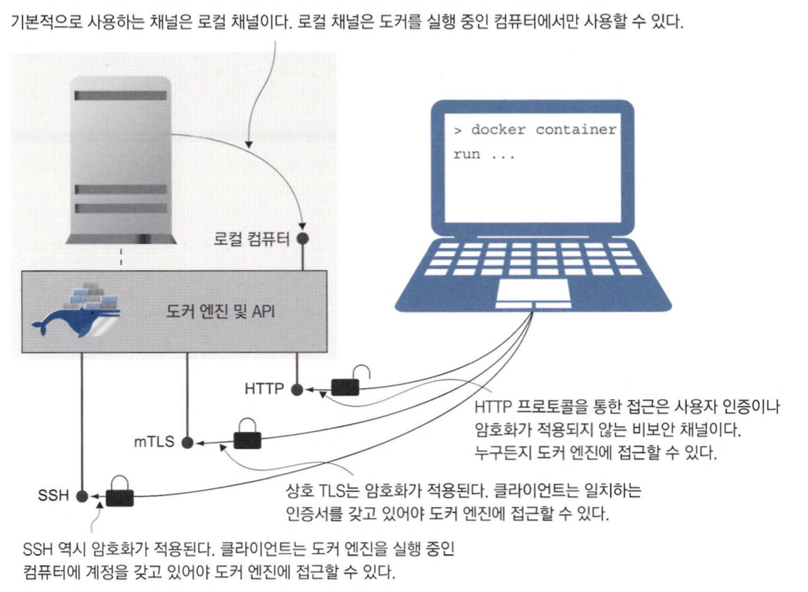

# 보안 원격 접근 및 CI/CD를 위한 도커 설정

## 도커 API 엔드포인트 형태

### 도커 엔진을 외부에서 접근하기

처음 도커를 설치할때는 도커 API와 통신하기 위해 별도의 설정을 할 필요가 없습니다.

도커 엔진은 로컬 컴퓨터와 연결된 채널을 주시하도록 초기 설정이 되어 있기 때문입니다.

도커 엔진을 원격에서 접근할 수 있게 하려면 먼저 설정에서 명시적으로 외부 접근을 허용해야 합니다.

원격 접근이 가능한 채널이 몇 가지 있으나, 그 중 가장 간단한 것은 비보안 HTTP를 통한 접근입니다.

### 암호화되지 않은 HTTP로 접근은 위험하다

암호화되지 않은 HTTP로 접근을 허용하는 것은 반드시 피해야 합니다.

그렇게 되면 일반적인 HTTP 엔드포인트를 통해 API에 접근할 수 있으므로 같은 네트워크에 연결된 사람이라면 누구든지 인증 절차 없이 도커 컨테이너를 멋대로 다룰 수 있게 됩니다.

## 보안 원격 접근을 위한 도커 엔진 설정

### 보안 채널

도커에는 API 요청을 받을 수 있는 채널이 다음과 같이 두가지 있습니다.

- 전송 계층 보안 (TLS)
    - 도커 API는 상호 TLS를 사용하여 서버와 클라이언트가 각각 인증서를 가집니다.
    - 서버의 인증서는 자신을 증명하고 전송되는 내용을 암호화하는 데 사용되며, 클라이언트의 인증서는 자신을 증명하는 데 사용됩니다.
    - TLS는 많이 사용되는 방법이지만 인증서를 생성하고 교체하는 관리 업무에서 오버헤드가 발생합니다.
- 보안 셸 (SSH)
    - SSH는 리눅스 서버에 원격 접속하는 표준 프로토콜이지만 윈도우에서도 사용 가능합니다.
    - SSH로 원격 서버에 접근하려면 사용자 명과 패스워드 혹은 비밀키가 필요합니다.
    - SSH는 클라이언트만 있으면 되며 접근 권한 관리가 상대적으로 쉽습니다.



<aside>
💡 도커 엔진에 보안 원격 접근을 설정하고 싶다면 해당 컴퓨터에 접근해야 합니다.
이로인해 도커 데스크탑은 가상 머신에서 실행되므로 보안 원격 접근을 진행할 수 없습니다.

</aside>

### 상호 TLS를 이용해 도커 엔진의 보안 원격 접근 설정하기

상호 TLS를 사용하려면 먼저 인증서와 키 파일 쌍을 두 개 만들어야 합니다.

키 파일은 인증서의 패스워드 역할을 합니다.

하나는 도커 API가 사용하고 다른 하나는 클라이언트에서 사용합니다.

<aside>
💡 테스트를 위해 Play With Docker 사이트에서 진행합니다.

</aside>

다음은 Play with Docker 사이트에서 인증서 설정을 하는 부분입니다.

```bash
# 인증서를 둘 디렉터리 생성
mkdir -p /diamol-certs

# 인증서 및 설정값을 적용할 컨테이너를 실행한다
docker container run -v /diamol-certs:/certs -v /etc/docker:/docker diamol/pwd-tls:server

# 새로운 설정을 적용해 도커를 재시작한다
pkill dockerd
dockerd &>/docker.log &
```

조금 전 실행한 컨테이너에는 Play with Docker 노드에서 만든 두개의 볼륨이 마운트 됩니다.

그리고 이 컨테이너가 갖고 있던 인증서와 daemon.json 파일을 노드로 복사합니다.

도커 엔진 설정을 반영하려면 dockerd 명령으로 도커 엔진을 재시작해야 합니다.

지금부터 도커 엔진은 TLS를 사용해 2376번 포트를 주시합니다.

이제 다음과 같이 외부 트래픽을 주시할 포트를 설정합니다.


다음은 위에서 진행한 상호 TLS 인증 과정입니다.


다음과 같은 명령으로 TLS를 이용하여 원격 접근할 수 있습니다.

```bash
docker --host "tcp://{현재 세션의 위치}" --tlsverify {인증서 위치(ca)} --tlscert {인증서 위치(cert)} --tlskey {인증서 키} 도커 명령(container ls 등)
```

### SSH를 이용해 도커 엔진에 접근하기

도커 엔진에 원격 접근하기 위해 SSH를 사용할 수도 있습니다.

SSH의 장점은 도커 명령행 도구가 표준 SSH 클라이언트를 사용하기 때문에 도커 엔진 쪽에서 설정을 변경할 필요가 없다는 점입니다.

사용자 인증은 서버가 대신 처리해 주기 때문에 따로 인증서를 생성할 필요도 없습니다.

도커 엔진을 실행 중인 컴퓨터에서 원격 접속에 사용할 계정을 추가만하면 됩니다.

<aside>
💡 SSH 접근시 간단하게 접근할 수 있다는 장점이 있지만 도커 엔진을 원격으로 사용하기 위해 서버 접근 권한을 부여하는 것은 지나칠 수 있습니다.

</aside>

## 도커 컨텍스트를 사용해 원격 엔진에서 작업하기

### 도커 컨텍스트 사용하기

TLS를 사용하는 방식의 경우 TLS 인증서의 경로까지 명령을 입력할때마다 지정해야하기 때문에 사용하기 번거롭습니다.

도커 컨텍스트를 사용하면 원격으로 접근할 도커 엔진을 편리하게 전환할 수 있습니다.

도커 컨텍스트는 도커 명령행 도구에서 원격 접근에 필요한 모든 상세 정보를 지정하면 생성할 수 있습니다.

컨텍스트는 여러 개를 만들 수도 있으며 원격 접근에 필요한 상세 정보는 모두 로컬 컴퓨터에 저장됩니다.

```bash
# TLS
docker context create pwd-tls --docker "host=tcp://{현재 위치},ca={인증서},cert={인증서},key={인증서 키}"

# SSH
docker context create local-tls --docker "host=ssh://user@server"

# 컨텍스트 목록을 확인합니다.
docker context ls
```

컨텍스트에는 로컬 엔진이나 원격 엔진 간에 대상을 전환하기 위해 필요한 모든 정보가 들어갑니다.

컨텍스트는 로컬 네트워크 상의 컴퓨터나 인터넷상의 컴퓨터도 가리킬 수 있습니다.

컨텍스트를 전환하기 위해서는 docker context use 명령을 사용할 수 있습니다.

```bash
docker context use {컨텍스트명}
```

## 지속적 통합 파이프라인에 지속적 배포 추가하기

원격에서 접속이 가능하기 때문에 빌드 서버에서 각각의 서버에 도커 명령어로 배포를 진행할 수 있습니다.

## 도커 리소스의 접근 모델

### 도커 엔진의 보안

1. 명령해 도구와 API 사이의 통신을 암호화
2. 허가받은 사용자만이 API에 접근할 수 있도록 설정

### GitOps


