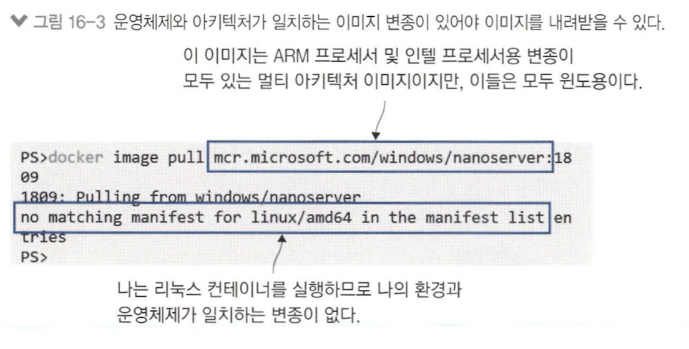
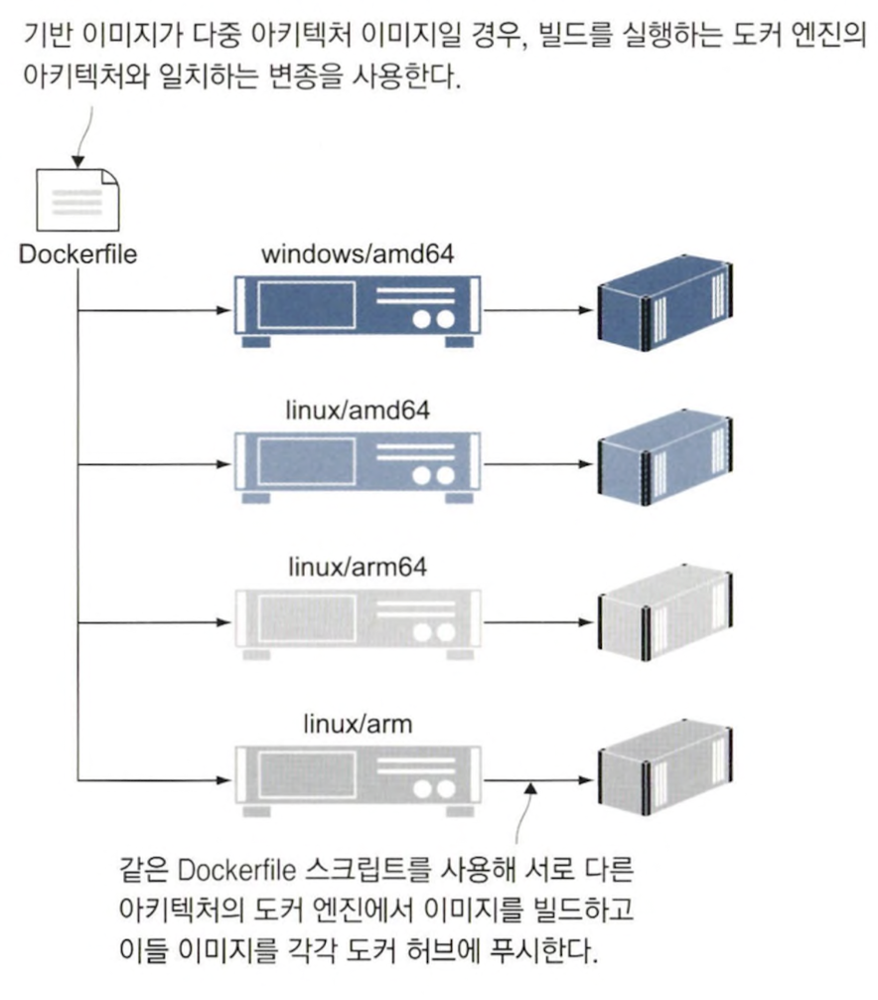
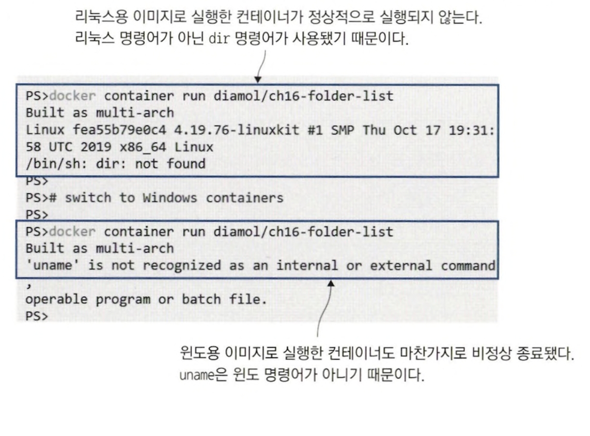
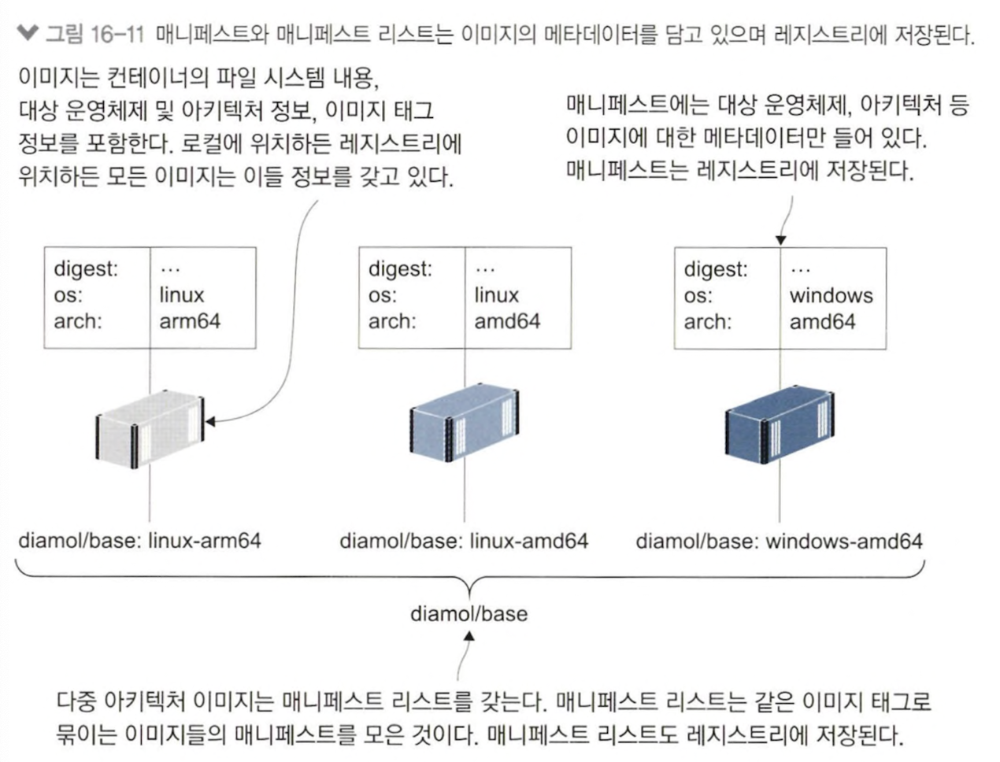

# 16장 어디서든 실행할 수 있는 도커 이미지 만들기

## 16.1 다중 아키텍처 이미지가 중요한 이유

#### 실습) 리눅스 컨테이너를 실행할 수 있는 도커 엔진을 실행한 사애에서 윈도우 이미지 내려받기

<table>
<tr>
<td>

```shell
# window nano server image 내려받기
docker image pull mcr.microsoft.com/windows/nanoserver:1809
```
</td>
<td>

</td>
</tr>
</table>

- 시스템 정보를 이용해 환경에 맞는 이미지 내려 받음
- 이미지 내려 받는 과정에서 이미지 사용할 수 있도록 layer 압축 푸는 최적화 과정도 포함
- 최적화 과정은 이미지 구조와 로컬 구조 일치해야함

## 16.2 다중 아키텍처 이미지를 만들기 위한 Dockerfile 스크립트

### 멀티 스테이지 Dockerfile 스크립트를 통해 컨테이너에서 빌드 후 패키징

> 애플리케이션에 사용된 SDK, 런타임에 원하는 아키텍쳐 지원 필요



- dockerfile 스크립트 하나로 다른 아키텍처의 컴퓨터에서 이미지 빌드하면 해당 아키텍처 이미지 생성 가능

#### 리눅스용 이미지와 윈도우용 이미지 Dockerfile 스크립트 비교

```dockerfile
# linux
FROM diamol/base:linux-arm64

WORKDIR /app
COPY file.txt .
CMD echo "Built as: linux/arm64" && \
    uname -a && \
    ls /app

# window
# escape=` -> 줄바꿈 escape 문자 \에서 `으로 변경
FROM diamol/base:windows-amd64

WORKDIR /app
COPY file.txt .

CMD echo Built as: windows/amd64 && `
    echo %PROCESSOR_ARCHITECTURE% %PROCESSOR_IDENTIFIER% && `
    dir /B C:\app
```

- 다중 아키텍처 버전 만들기 위해선 Dockerfile 스크립트 여러 개 생성

#### 다중 아키텍처 이미지 특정 플랫폼에서 제대로 실행되지 않을 수 있음



- OS에 없는 명령어가 RUN 명령어에서 사용됐다면 이미지 빌드 시점에 확인 가능
- CMD 명령어에 사용됐다면 컨테이너 실행 전까지 확인 x

## 16.3 다중 아키텍처 이미지를 레지스트리에 푸시하기

> 매니페스트란, 여러 이미지를 하나의 이미지 태그로 묶는 메타 데이터

- 다중 아키텍처 이미지를 통해 매니패스트와 함께 이미지를 레지스트리에 푸시
- 매니페스트 도커 CLI로 레지스트리 푸시
- 전체 절차 : 이미지 모두 푸시 &rarr; 매니페스트 작성 후 푸시

```shell
dockerId = '<docker 계정>'

# 이미지에 도커 계정 이름 
docker image tag diamol/ch16-folder-list:linux-amd64 "$dockerId/ch16-folder-list:linux-amd64"

# 이미지 도커 허브에 푸시
docker image push "$dockerId/ch16-folder-list" 
```



#### 다양한 이미지를 모은 manifest 생성 후 도커 허브 푸시

```shell
# manifest 이름과 포함시킬 이미지 태그 열거해 manifest 생성
docker manifest create "$dockerId/ch16-folder-list" "$dockerId/ch16-folder-list:linux-amd64" "$dockerId/ch16-folder-list:linux-arm64" "$dockerId/ch16-folder-list:linux arm"

# 생성한 manifest 도커 허브에 푸시
docker manifest push "$dockerId/ch16-folder-list"
```

- 각 로컬 os에 맞는 이미지 pull ex) intel/AMD &rarr; amd64 버전 이미지, AWS A1 &rarr; arm64

## 16.4 도커 Buildx를 사용해 다중 아키텍처 이미지 빌드하기

> [Buildx](https://gurumee92.tistory.com/311)란, docker build 명령 확장판

- docker build 명령 그대로 대체 가능 &rarr; Dockerfile 스크립트 입력받아 이미지 생성
- 크로스 플랫폼 빌드 지원
- 도커 컨텍스트와 통합돼 여러 대 서버 빌드 진행 가능 

## 16.5 개발 로드맵과 다중 아키텍처 이미지

- FROM에 다중 아키텍처 이미지 기반 이미지로 지정
- RUN, CMD에 특정 OS에서만 사용되는 명령어 사용 x
기