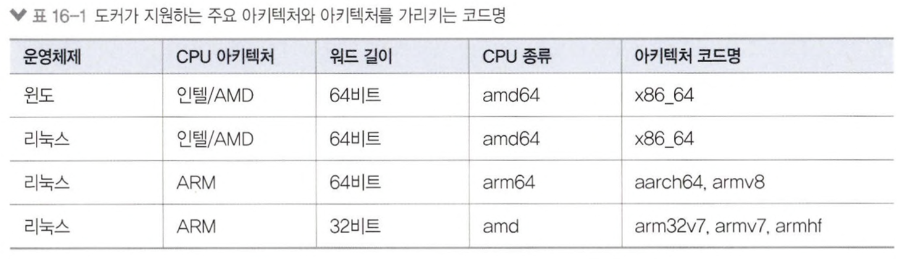
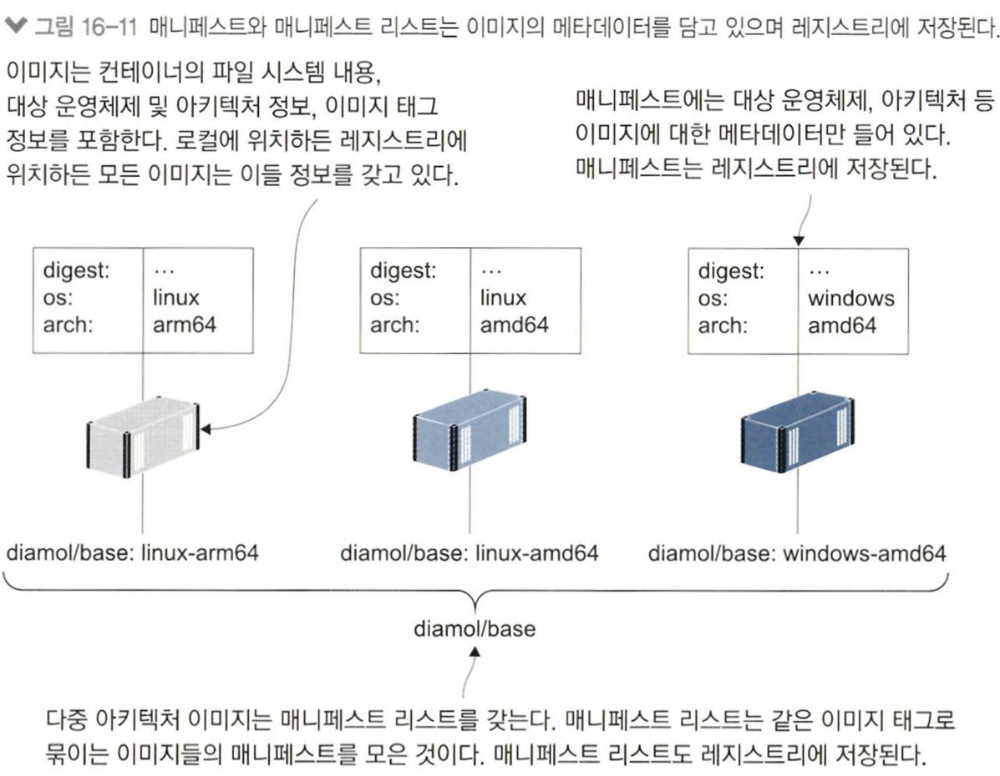
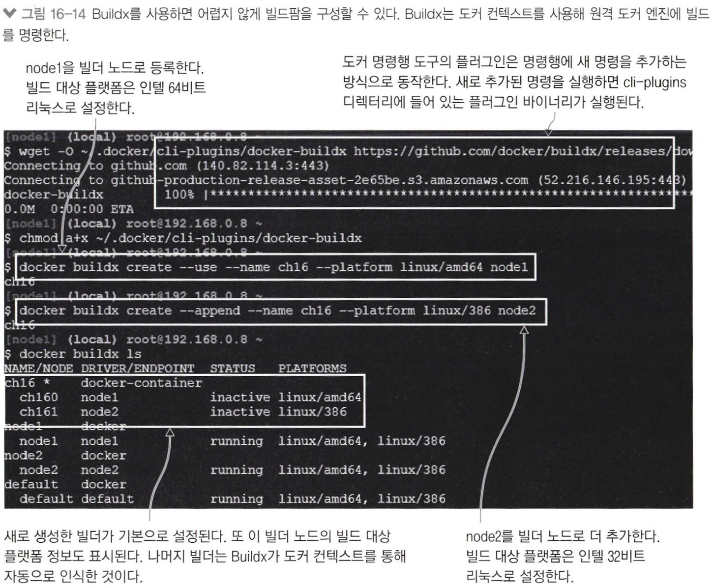

# 16장  어디서든 실행할 수 있는 도커 이미지 만들기 : 리눅스, 윈도, 인텔, ARM

`다중 아키텍처 이미지` 는 여러 개의 변종 이미지 형태로 빌드되고 레지스트리에 푸시된다. 다중 아키텍처 이미지를 내려받으려 시도하면, 도커는 현재 컴퓨터의 아키택처와 운영체제에 일치하는 변종 이미지를 받아 온다.

## 16.1 다중 아키텍처 이미지가 중요한 이유

AWS는 ARM 프로세서를 사용하는 가상머신을 제공한다.

- 인텔이나 AMD 프로세서를 사용하는 가상 머신에 비해 단가가 거의 절반이다.
- ARM 프로세서의 인스트럭션셋은 인텔과 AMD 프로세서에서 사용하는 x64 인스트럭션셋과 호환되지 않는다.

✅ 도커 데스크톱은  ARM 아키택처에서 이미지를 빌드하고 컨테이너를 실행할 수 있는 에뮬레이션 기능을 제공한다.

```bash
# 64비트 ARM 프로세서용으로 빌드
$ docker build -t diamol/ch16-whoami:linux-arm64 --platform linux/arm64 ./whoami

# 이미지 아키택처를 확인한다.
$ docker image inspect diamol/ch16-whoami:linux-arm64 -f '{{.Os}}/{{.Architecture}}'
linux/arm64

# 도커 엔진의 네이티브 아키택처와 비교한다.
$ docker info -f '{{.OSType}}/{{.Architecture}}'
linux/aarch64
```

✅ 이미지 아키텍처와 컴퓨터의 아키텍처가 일치해야만 이미지를 내려받을 수 있다.

---

## 16.2 다중 아키텍처 이미지를 만들기 위한 Dockerfile 스크립트

### 다중 아키텍처 이미지를 만들 수 있는 방법

- 멀티 스테이지 Dockerfile 스크립트를 이용해 컨테이너에서 소스 코드를 빌드하고 패키징 한다.
- 기반 이미지가 다중 아키텍처 이미지일 경우, 빌드를 실행하는 도커 엔진의 아키텍처와 일치하는 변종을 사용한다.

```
✏️ 장점
Dockerfile 하나로 다른 아키텍처의 컴퓨터에서 이미지를 빌드하면 해당 아키텍처의 이미지를 만들 수 있다.
```

### 다중 아키텍처 이미지가 원하는 아키텍처를 지원하지 않는 경우

- 각 아키텍처별로 Dockerfile을 따로 작성해 다중 아키택처 이미지를 얻을 수 있다.
- 모든 대상 운영체제에서 공통적으로 사용할 수 있는 명령어만 사용해야 한다.

### 도커가 지원하는 주요 아키텍처



---

## 16.3 다중 아키텍처 이미지를 레지스트리에 푸시하기

1. 변종 이미지를 모두 레지스트리에 푸시한다.
2. 메니페스트를 작성한다.
    - 메니페스트 : 여러 개의 변종 이미지를 하나의 이미지 태그로 묶는 메타데이터
3. 메니페스트를 푸시한다.

📌 변종 이미지를 모두 레지스트리에 푸시한다

```bash
# 이미지에 도커 계정 이름이 포함된 태그를 부여한다.
$ docker image tag diamol/ch16-folder-list:linux-amd64 "$dockerId/ch16-folder-list:linux-amd64"
$ docker image tag diamol/ch16-folder-list:linux-arm64 "$dockerId/ch16-folder-list:linux-arm64"
$ docker image tag diamol/ch16-folder-list:linux-arm "$dockerId/ch16-folder-list:linux-arm"

# 이미지를 도커 허브에 푸시한다 (해당 태그를 가진 모든 이미지가 푸시된다.
$ docker image push "$dockerId/ch16-folder-list"
```

📌 `메니페스트 리스트`를 생성한다.

- `메니페스트 리스트` : 두 개 이상의 이미지를 하나의 이미지 태그로 묶어주는 역할을 한다.

```bash
# 매니페스트 이름과 해당 매니페스트에 포함시킬 모든 이미지 태그를 열거해 매니페스트를 생성한다.
$ docker manifest create "$dockerId/ch16-folder-list" "$dockerId/ch16-folder-list:linux-amd64" "$dockerId/ch16-folder-list:linux-arm64" "$dockerId/ch16-folder-list:linux-arm" 

# 생성한 매니페스트를 도커 허브에 푸시한다.
$ docker manifest push "$dockerId/ch16-folder-list"
```



---

## 16.4 도커 Buildx를 사용해 다중 아키텍처 이미지 빌드하기

### Buildx의 특징

- 최적화된 빌드 엔진이 적용돼 빌드 성능이 뛰어나다.
- 크로스 플랫폼 빌드를 지원한다.
- 도커 컨텍스트와 통합돼 있어 한 번의 명령으로 여러 대의 서버에서 빌드를 진행할 수 있다.
- 빌드팜을 생성하고 관리하는 용도로 사용한다.

### 빌드팜 구성하기

1. 컨텍스트 생성
    - 운영 환경에서는 자동화 서버가 Buildx를 실행하는 클라이언트가 되므로 젠킨스 서버에서 컨텍스트를 생성하면 된다.
    - 원하는 대상 아키텍처별로 노드를 최소 하나씩 배치하고 각 노드를 가리키는 도커 컨텍스트를 만든다.
2. Buildx를 설치하고 설정한다.
    
    
    
3. Buildx를 사용해 각 변종 이미지를 빌드하고 푸시한다.
    - Buildx가 이미지 빌드, 푸시, 매니페스트 생성과 푸시까지 해준다.
    
    ```bash
    $ docker buildx build -t "$dockerId/ch16-folder-list-2" --platform linux/amd64,linux/386 --push .
    ```
    

---

## 16.5 개발 로드맵과 다중 아키텍처 이미지

Dockerfile 스크립트에 다음 두 가지 사항만 미리 적용해 놓는다면, 다중 아키텍처 이미지로 전환할 수 있다.

1. FROM 인스트럭션에 항상 다중 아키텍처 이미지를 기반 이미지로 지정한다.
2. RUN, CMD 인스트럭션에는 특정 운영체제에서만 사용되는 명령어를 사용하지 않는다.