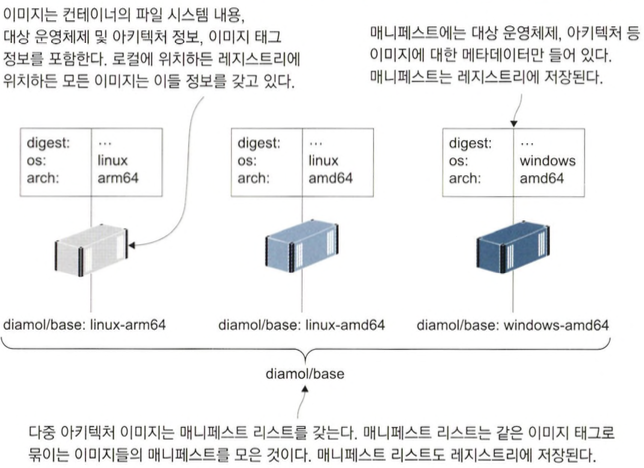

# 어디서든 실행할 수 있는도커 이미지만들기: 리눅스, 윈도, 인텔, ARM

## 다중 아키텍처 이미지가중요한 이유

- 아마존 웹 서비스는 다양한 등급의 가상 머신을 제공하는데 ARM 프로세서를 사용하는 가상머신(A1 인스턴스)은 인텔이나 AMD 프로세서를 사용하는 가상 머신에 비해 단가가 거의 절반 에 불과합니다. 하지만 인텔 프로세서용으로 개발된 애플리케이션을 ARM 프로세서용으로 빌드하는 것은 쉬운 일이 아닙니다.
- 주로 ARM 프로세서로 구동되는 IoT 장비들이 있는데 전력 효율이 좋기 떄문입니다. 전력효율 떄문에 클라우드에서의 단가도 저렴함

```shell
cd ch16/exercises
docker build -t diamol/ch16-whoami:linux-arm64 --platform linux/arm64 ./whoami
docker image inspect diamol/ch16-whoami:linux-arm64 -f '{{.Os}}/{{.Architecture}}'
docker info -f '{{.OSType}}/{{.Architecture}}'
```

- `linux/aarch64` 대상 아키텍쳐를 이미지로 빌드하고 로컬 PC 플랫폼을 확인하는 예제입니다.
- 맥북 에어 M1은 원래 ARM 아키텍쳐 사용함

## 다중 아키텍처 이미지를 만들기 위한 Dockerfile 스크립트


```shell
docker image build -t diamol/ch16-folder-list:linux-amd64 -f ./Dockerfile.linux-amd64 .
docker image build -t diamol/ch16-folder-list:linux-arm64 -f ./Dockerfile.linux-arm64 --platform linux/arm64 .
docker image build -t diamol/ch16-folder-list:linux-arm -f ./Dockerfile.linux-arm --platform linux/arm .
docker run diamol/ch16-folder-list:linux-amd64
docker run diamol/ch16-folder-list:linux-arm64
docker run diamol/ch16-folder-list:linux-arm
```

- 플랫폼별 Dockerfile 스크립트를 사용해 각 플랫폼용 이미지를 빌드해서 실행하는 예제입니다.

```shell
docker image build -t diamol/ch16-folder-list .
docker run diamol/ch16-folder-list
```

- 다중 아키텍처 이미지를 기반 이미 지로 삼았지만 리눅스, 윈도 명령어를 섞어 사용해서 모든 아키텍처에서 컨테이너가 정상적으로 동작하지 않는 예제입니다.

## 다중 아키텍처 이미지를 레지스트리에 푸시하기

- 다중 아키텍처 이미지로 만들려면 매니페스트와 함께 이들 이미지를 레지스트리에 푸시해야합니다.

```shell
export dockerld='〈내_도커허브_계정〉'
docker image tag diamol/ch16-folder-list:linux-amd64 "$dockerId/ch16-folder-list:linux-amd64"
docker image tag diamol/ch16-folder-list:linux-arm64 "$dockerId/ch16-folder-list:linux-arm64"
docker image tag diamol/ch16-folder-list:linux-arm "$dockerId/ch16-folder-list:linux-arm"
docker image push -a "$dockerId/ch16-folder-list"
```

- folder-list 애플리케이션의 변종 이미지를 푸시하는 예제입니다.

```shell
docker manifest inspect diamol/base
```

- 매니패스트 기능 확인하는 예제입니다.
- 모든 이미지는 이미 매니페스트를 하나씩 갖고 있으며 레지스트리에서 이 매니페스트에 담긴 정보를 볼 수 있습니다.



```shell
docker manifest create "$dockerId/ch16-folder-list" "$dockerId/ch16-folder-list:linux-amd64" "$dockerId/ch16-folder-list:linux-arm64" "$dockerId/ch16-folder-list:linux-arm"
docker manifest push "$dockerId/ch16-folder-list"
```

- 매니페스트를 생성 및 푸쉬하는 예제입니다.

## 도커 Buildx를 사용해 다중 아키텍처 이미지 빌드하기

- Buildx는 크로스 플랫폼 빌드를 지원하며 도커 컨텍스트와 통합되어 있기 때문에 한 번의 명령으로 여러 대의 서버에서 빌드를 진행할 docker build 명령의 확장판이라고 생각하면 됩니다. 또한 `docker build` 명령어로 빌드한 이미지에도 사용할 수 있습니다.

```shell
# play-with-docker에서 인스턴스 2개를 생성하고 1번 인스턴스에서 2번 인스턴스에 ssh접속 가능여부를 확인합니다.
node2ip=ip172-18-0-79-cigmchssnmng00cf6hh0@direct.labs.play-with-docker.com
docker context create node1 --docker "host=unix:///var/run/docker.sock"
docker context create node2 --docker "host=ssh://root@$node2ip"
docker context ls
```

- 빌드팜의 각 노드를 가리키는 도커 컨텍스트를 만드는 예제입니다.

```shell
mkdir -p ~/.docker/cli-plugins
wget -O ~/.docker/cli-plugins/docker-buildx https://github.com/docker/buildx/releases/download/v0.3.1/buildx-v0.3.1.linux-amd64
chmod a+x ~/.docker/cli-plugins/docker-buildx
docker buildx create --use --name ch16 --platform linux/amd64 node1
docker buildx create --append --name ch16 --platform linux/386 node2
docker buildx ls
```

- Buildx 플러그인을 받아서 빌더를 설정하는 예제입니다.
- docker/cli-plugins 폴더를 먼저 생성해야합니다.
- 두 아키텍처를 대상으로하는 Dockerfile 스크립트만 있으면. 이 빌드팜으로 32비트 및 64비트 아키텍처의 리눅스 이미지를 포함하는 다중 아키텍처 이미지를 빌드할 수 있습니다.

```shell
git clone https://github.com/sixeyed/diamol.git
cd diamol/ch16/exercises/folder-list-2/
dockerld='〈내_도커허브_계정〉'
docker login -u $dockerld
docker buildx build -t "$dockerId/ch16-folder-list-2" --platform linux/amd64,linux/386 --push .
```

- 예제 파일을 내려받아 buildx를 이용하여 이미지를 빌드하고 푸쉬하는 예제입니다.
- Buildx가 이미지 빌드. 푸시, 매 니페스트 생성과 푸시까지 다 알아서 해줍니다.

## 개발로드맵과 다중 아키텍처 이미지

- 다중 아키텍처 이미지의 동작 원리나 빌드 방법은 다중 아키텍처가 필요해질 수 있기 때문 배워 둘 가치가 있습니다.
