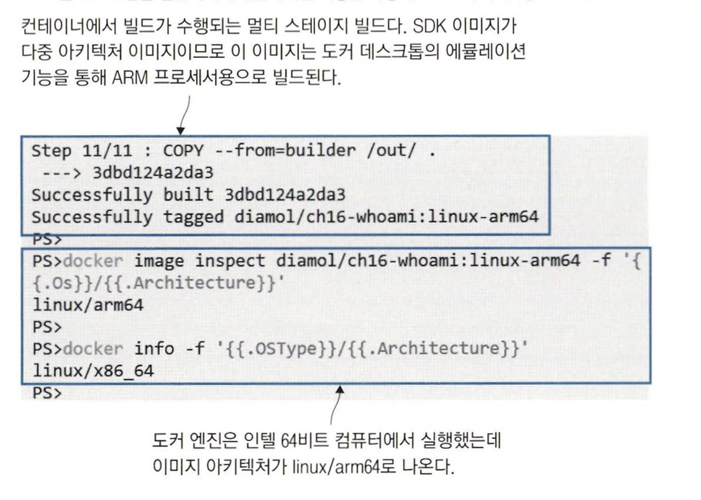
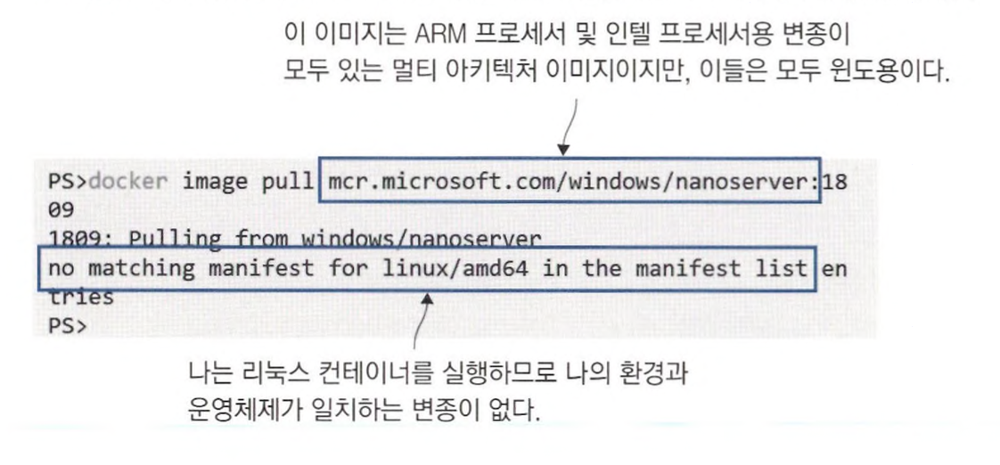
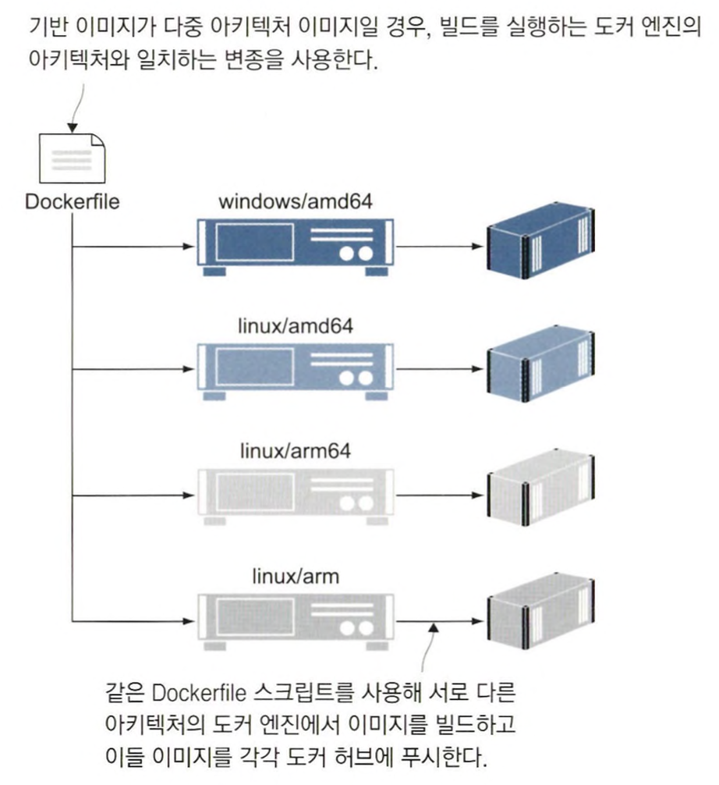
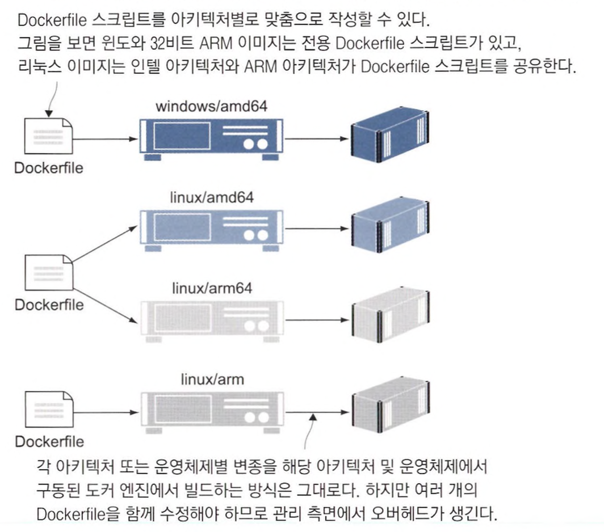
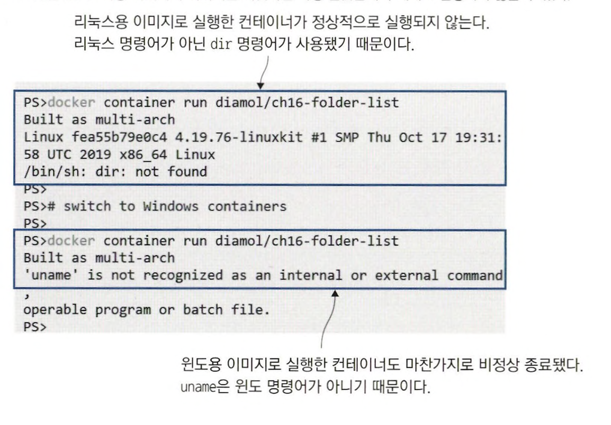
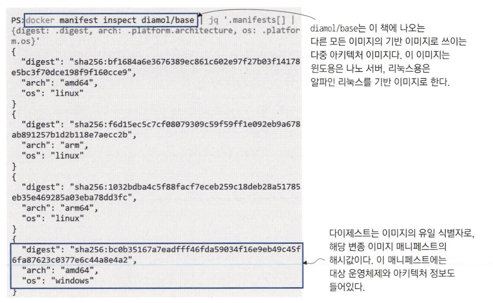
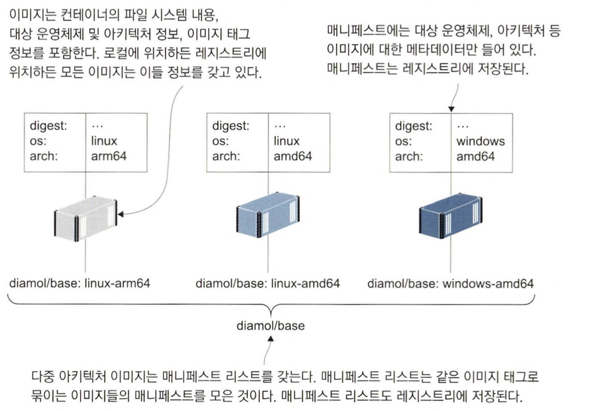
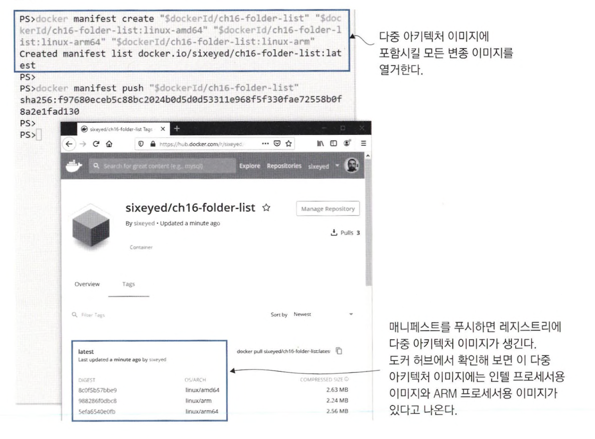
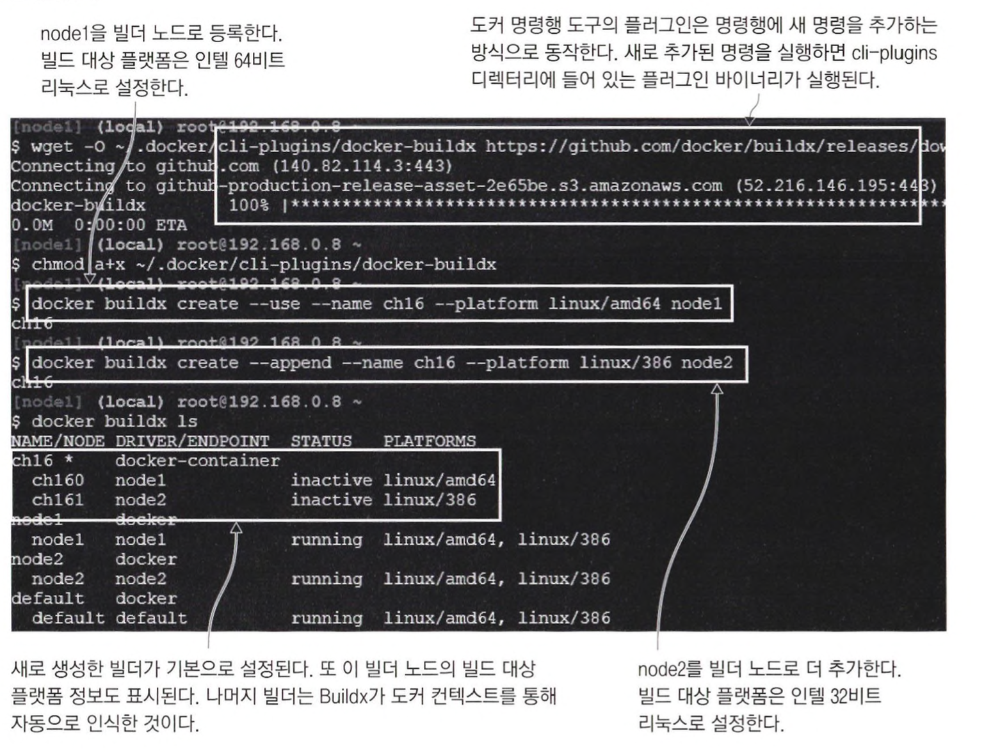
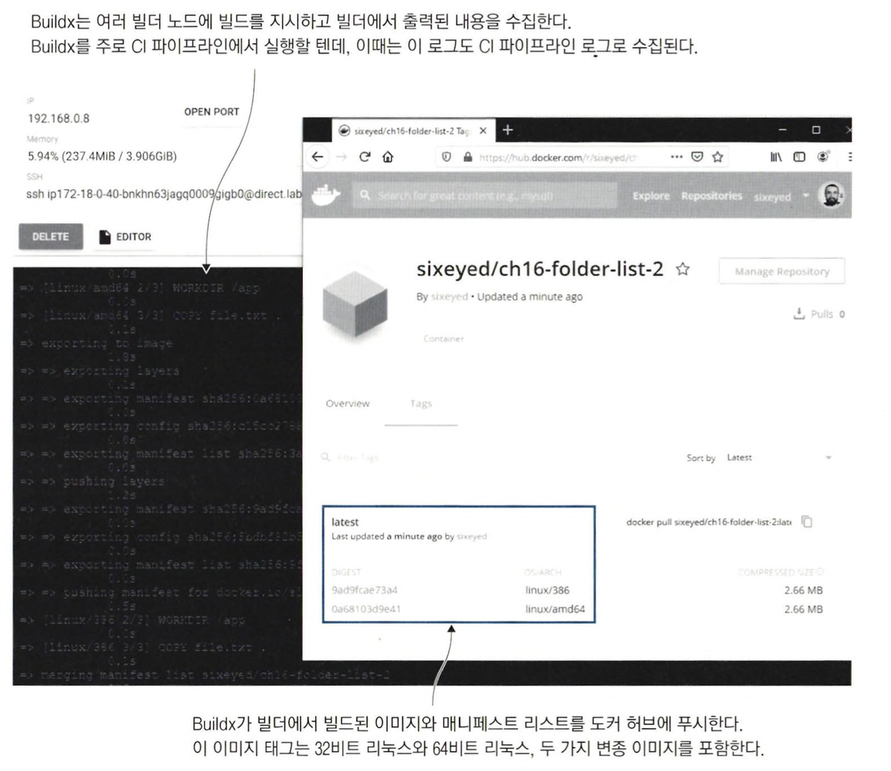

# 어디서든 실행할 수 있는도커 이미지 만들기

## 다중 아키텍처 이미지가 중요한 이유

AWS는 다양한 등급의 가상 머신을 제공하는데, 이 중에는 인텔. AMD. ARM 프로세서를 사용하는 것들도 있다. <br>
ARM 프로세서를 사용하는 가상 머신은 인텔이나 AMD 프로세서를 사용하는 가상 머신에 비해 단가가 거의 절반 정도이다. <br>
애플리케이션 운영 비용이 절반으로 감소한다면 ARM 가상 머신으로 넘어가지 않을 이유가 없지만 <br>
인텔 프로세서용으로 개발된 애플리케이션을 ARM 프로세서용으로 빌드하는 것은 쉬운 일이 아니다.

도커는 개발자의 워크플로 및 운영 환경의 빌드팜에서 이 문제를 해결해 줄 수 있다. <br>
도커 데스크탑은 ARM 아키텍처에서 이미지를 빌드하고 컨테이너를 실행할 수 있는 에뮬레이션 기능을 제공한다

<br>

```bash
# 64비트 ARM 프로세서용으로 빌드
docker build -t diamol/ch16-whoami:linux-am64 --platform linux/arm64 ./whoami

# 이미지 아키텍처를 확인
docker image inspect diamol/ch16-whoami:linux-arm64 -f '{{.0s}}/{{.Architecture}}'

# 도커 엔진의 네이티브 아키텍처와 비교
docker info -f '{{.0SType}}/{{.Architecture}}'
```



<br>

도커는 시스템 정보를 이용해 환경에 맞는 이미지를 내려받는다. <br>
이미지를 내려받는 과정에는 이미지를 곧바로 사용할 수 있도록 레이어의 압축을 푸는 최적화 과정도 포함된다. <br>
이 최적화 과정은 이미지의 아키텍처와 현재 컴퓨터의 아키텍처가 일치해야만 한다. 만약 두 아키텍처가 일치하지 않으면 이미지를 내려받을 수 없다.

```bash
docker image pull mcr.microsoft.com/windows/nanoserver:1809
```



> 현재 도커 엔진이 실행 중인 컴퓨터의 운영체제와 아키텍처를 알아낸 후 레지스트리에 이들 정보가 일치하는 이미지 변종이 있는지 확인했다. <br>
> 그러나 일치하는 변종이 없었으므로 오류가 발생했다.

<br>
<hr>

## 다중 아키텍처 이미지를 만들기 위한 Dockerfile 스크립트

다중 아키텍처 이미지를 만들 수 있는 방법은 크게 두 가지다.

<br>

### 멀티 스테이지 Dockerfile 스크립트를 이용해 컨테이너에서 소스 코드를 빌드하고 패키징

이 방법을 사용하려면 애플리케이션에 사용된 SDK나 런타임에 원하는 아키텍처를 지원해야 한다. <br>
이 방법의 장점은 Dockfile 스크립트 하나로 다른 아키텍처의 컴퓨터에서 이미지를 빌드하면 해당 아키텍처의 이미지를 만들 수 있다는 점이다.



<br>

다만 빌드에 사용된 이미지가 다중 아키텍처 이미지가 아니거나 원하는 아키텍처를 모두 지원하지 않는다면 이 방법은 사용할 수 없다. <br>
이럴 때는 Dockerfile 스크립트를 아키텍처나 운영체제별로 따로 작성해야 한다.



<br>



> 다중 아키텍처 이미지를 만들 때는 CMD 인스트럭션에 사용할 수 없는 명령어가 있는지 항상 확인해야 한다. <br>
> 운영체제에 없는 명령어가 RUN 인스트럭션에서 사용됐다면 이미지를 빌드하는 시점에 알 수 있지만, <br>
> CMD 인스트럭션에 사용됐다면 컨테이너를 실제로 실행해 보기 전에는 그 사실을 알 수 없다.

<br>
<hr>

## 다중 아키텍처 이미지를 레지스트리에 푸시하기

도커 데스크톱을 사용하면 다양한 아키텍처의 리눅스 이미지를 빌드할 수 있다. <br>
이들 이미지를 다중 아키텍처 이미지로 만들려면 매니페스트와 함께 이들 이미지를 레지스트리에 푸시해야 한다. <br>
**매니페스트란 여러 개의 변종 이미지를 하나의 이미지 태그로 묶는 메타데이터를 말한다.**  <br>
매니페스트에는 이미지 변종의 목록이 담기는데, 이들 이미지가 먼저 레지스트리에 푸시된 상태여야 한다. *(변종 이미지를 모두 푸시한 다음 매니 페스트를 작성하고 푸시)*

```bash
# 이미지에 도커 계정 이름이 포함된 태그를 부여
docker image tag diamol/ch16-folder-list:linux-amd64 "$dockerld/ch16-folder-list:linux-amd64"

docker image tag diamol/ch16-folder-list:linux-arm64 "$dockerld/ch16-folder-list:linux-arm64"

docker image tag diamol/ch16-folder-list:linux-arm "$dockerld/ch16-folder-list:linux-arm”

# 이미지를 도커 허브에 푸시
docker image push "$dockerld/ch16-folder-list"
```

<br>


```
# 기반 이미지의 매니페스트 정보를 확인
docker manifest inspect diamol/base
```




```bash
# 매니페스트 이름과 해당 매니페스트에 포함시킬 모든 이미지 태그를 열거해 매니페스트를 생성
docker manifest create "$dockerId/ch16—folder-list" "$dockerId/ch16-folder-list:linux-amd64" "$dockerId/ch16-folder-list:linux-arm64" "$dockerId/ch16-folder-list:linux—arm"

# 생성한 매니페스트를 도커 허브에 푸시
docker manifest push "$dockerId/ch16-folder-list"
```




<br>
<hr>

## 도커 Buildx를 사용해 다중 아키텍처 이미지 빌드하기

도커 빌드팜을 훨씬 쉽고 효율적으로 운영하는 방법이 하나 더 있다. (Buildx) <br>
Buildx는 docker build 명령의 확장판이라고 생각하면 되는데. 최적화된 빌드 엔진이 적용돼 빌드 성능이 뛰어나다. <br>
docker build 명령을 그대로 대체할 수 있고, 크로스 플랫폼 빌드를 지원하며 도커 컨텍스트와 통합돼 있기 때문에 한 번의 명령으로 여러 대의 서버에서 빌드를 진행할 수 있다.

Buildx는 아직 윈도 컨테이너를 지원하지 않으며 단일 파일로된 Dockerfile 스크립트만 지원한다. <br>
*아직 모든 빌드 상황에서 docker build 명령을 대체할 수는 없다*

<br>

```bash

```

빌드팜을 구성하는 과정의 첫 단계는 컨텍스트 생성이다. <br>
운영 환경에서는 자동화 서버가 Buildx를 실행하는 클라이언트가 되므로 젠킨스 서버(그 외 사용 중인 자동화 서버)에서 컨텍스트를 생성하면 된다.

원하는 대상 아키텍처별로 노드를 최소 하나씩 배치하고 각 노드를 가리키는 도커 컨텍스트를 만든다. <br>
다음에는 Buildx를 설치하고 설정하는데, Buildx는 도커 명령행 도구의 플러그인이므로 도커 데스크톱이나 도커 엔진 커뮤니티 에디션만 설치해도 함께 설치된다.




> Buildx는 여러 빌더에 Dockerfile 스크립트와 빌드 컨텍스트를 나눠 주고 빌드를 지시한 다음. 각 빌더의 로그를 수집하고 빌더에서 빌드된 이미지를 푸시한다. <br>
> 빌드 서버마다 원하는 대상 플랫폼을 지정해두면, 이들 모두에 빌드를 지시할 수 있다.

<br>

> Buildx로 빌드한 후 도커 허브에 푸시한 다중 아키텍처 이미지는 변종 이미지가 자신만의 이미지 태그를 따로 갖지 않고 다중 아키텍처 이미지의 태그 하나만 부여된다.

<br>
<hr>

## 개발 로드맵과 다중 아키텍처 이미지

IoT 장치를 지원해야 하는 프로젝트에 참여하게 되거나 클라우드 운영비를 줄여야 하는 상황이라면 다중 아키텍처가 필요해질 수 있다.

Dockerfile 스크립트에 두 가지 사항만 미리 적용해 놓는다면, 큰 어려움 없이 다중 아키텍처 이미지로 전환할 수 있다.

- FROM 인스트럭션에 항상 다중 아키텍처 이미지를 기반 이미지로 지정한다.
- RUN. CMD 인스트럭션에는 특정 운영체제에서만 사용되는 명령어를 사용하지 않는다.


