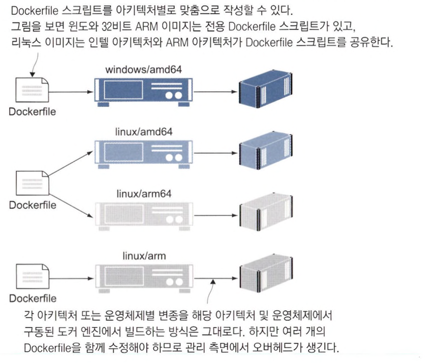

# 어디서든 실행할 수 있는 도커 이미지 만들기

## 다중 아키텍처 이미지가 중요한 이유

컴퓨터 별로 지원하는 CPU 프로세서의 종류가 다 다릅니다.

이로인해 어떤 프로세서를 사용하느냐에 따라 가격이 다른 경우들이 존재합니다.

예를 들어, AWS 같은 경우 인텔 프로세서를 사용하는 인스턴스보다 AMD 프로세서를 사용하는 인스턴스가 더 저렴합니다.

그리고 특정 프로세서에만 동작하는 프로그램들이 존재하기도 합니다.

이런 이유로 인해 여러개의 이미지의 지원이 필요합니다.

### 특정 프로세서 아키텍처로 이미지 빌드하기

다음은 ARM 프로세서로 이미지를 빌드하는 명령입니다.

```bash
# 64 비트 ARM 프로세서용으로 빌드
docker build -t diamol/ch16-whoami:linux-arm64 --platform linux/arm64 .

# 이미지 아키텍처 확인
docker image inspect diamol/ch16-whoami:linux-arm64 -f '{{.Os}}/{{.Architecture}}'
```

### 도커는 시스템 정보를 이용해 환경에 맞는 이미지를 내려받는다

도커는 이미지를 내려받는 과정에 이미지를 구성하는 레어를 내려받는 것 이외에 `곧바로 사용할 수 있도록 레이어의 압축을 푸는 최적화 과정도 포함`됩니다.

이 과정에서 `이미지의 아키텍처와 현재 아키텍처가 일치`해야합니다.

만약, 일치하지 않는 경우 이미지를 내려받을 수 조차 없습니다.

## 다중 아키텍처 이미지를 만들기 위한 Dockerfile 스크립트

다중 아키텍처 이미지를 만들 수 있는 방법은 크게 두 가지입니다.

- 멀티 스테이지 Dockerfile 스크립트를 이용해 컨테이너에서 소스 코드를 빌드하고 패키징 하는 방법
    - 이 방법을 사용하기 위해서는 애플리케이션에 사용된 SDK나 런타임에 원하는 아키텍처를 지원해야 합니다.
    - 이 방법은 Dockerfile 스크립트 하나로 다른 아키텍처의 컴퓨터에서 이미지를 빌드하면 해당 아키텍처의 이미지를 만들 수 있다는 점 입니다.
    - 빌드에 사용된 이미지가 다중 아키텍처 이미지가 아니거나 원하는 아키텍처를 모두 지원하지 않는다면 이 방법은 사용할 수 없습니다.
    

- Dockerfile을 아키텍처나 운영체제별로 작성하기
    - 아키텍처마다 원하는 대로 이미지에 변화를 주기 좋습니다.
    - Dockerfile을 아키텍처마다 작성하기 때문에 관리할 파일의 양이 늘어납니다.
    

### 아키텍처별 도커파일 빌드하기

다음은 아키텍처 별 도커 이미지를 빌드하는 예시입니다.

```bash
# 네이티브 아키텍처(인텔/AMD)로 이미지를 빌드
docker image build -t diamol/ch16-folder-list:linux-amd64 -f .Dockerfile.linux-amd64 .

# 64비트 ARM 아키텍처로 이미지를 빌드
docker image build -t diamol/ch16-folder-list:linux-arm64 -f ./Dockerfile.linux-arm64 --platform linux/arm64 .

# 32비트 ARM 아키텍처로 이미지 빌드
docker image build -t diamol/ch16-folder-list:linux-arm -f ./Dockerfile.linux-arm --platform linux/arm .
```

보통 서드파티 애플리케이션의 다중 아키텍처 버전 이미지를 만들고 싶다면 Dockerfile 스크립트를 여러 개 만드는 방법을 사용해야 합니다. (OS 버전마다 명령이 다른 등의 문제가 발생할 수 있기 때문입니다.)

## 다중 아키텍처 이미지를 레지스트리에 푸시하기

도커 이미지는 아키텍처와 상관없이 하나의 이미지로 분류되며, 아키텍처 구분은 태그로 하게 됩니다.

### 이미지의 아키텍처 확인하기

docker manifest inspect 명령을 사용하면 이미지 목록을 확인할 수 있습니다.

```bash
# docker manifest inspect {이미지}
docker manifest inspect diamol/base
```

<aside>
💡 jq 명령어를 사용하면 좀더 깔끔하게 아키텍처 정보를 확인할 수 있습니다.
`docker manifest inspect {이미지} | jq '.manifests[] | {digest: .digest, arch: .platform.architecture, os: .platform.os}'`

</aside>

```bash
{
  "digest": "sha256:c11d706f8c0530dca8b23ab645b8d865175b5b1b9fe17f235d483a626806181b",
  "arch": "amd64",
  "os": "linux"
}
{
  "digest": "sha256:251dc0254f092f2134fe308c5d60a178ab5dd4498219f077da078db0bfcd8557",
  "arch": "arm",
  "os": "linux"
}
{
  "digest": "sha256:bd5e8ce69bca67190f789625870f8130d67069c4761b36ed7ecfa6dcbc6fdfd7",
  "arch": "arm64",
  "os": "linux"
}
{
  "digest": "sha256:f483dd98e256bf8ef4e160b2021791b2cda33cd650457921ffbd6fc0b1c15638",
  "arch": "amd64",
  "os": "windows"
}
```

### 이미지와 매니페스트, 매니페스트 리스트의 관계


### 같은 이미지 이름과 태그를 가진 이미지에 다중 아키텍처 적용하기

지금까지 다중 아키텍처를 만드는 방법을 이용하여 빌드할 경우 `latest` 같은 경우 항상 아키텍처 종류가 달라질 수 있습니다.

이를 위해 이미지 및 태그에 영향받지 않기 위해서는 매니페스트를 생성한 후 도커 허브에 푸시하는 과정이 필요합니다.

다음은 다중 아키텍처들을 하나의 매니페스트로 모아 도커 허브에 푸시하는 예시입니다.

```bash
# 매니페스트 이름과 해당 매니페스트에 포함시킬 모든 이미지 태그를 열거해 매니페스트를 생성
docker manifest create "$dockerID/ch16-folder-list" "diamol/ch16-folder-list:linux-amd64" "diamol/ch16-folder-list:linux-arm64" "diamol/ch16-folder-list:linux-arm"

# 생성한 매니페스트를 도커 허브에 푸시
docker manifest push $dockerID/ch16-folder-list
```

### 빌드팜

빠르게 대상 아키텍처와 정확히 일치하는 멀티 아키텍처 이미지를 빌드하고 싶다면 빌드팜이 있어야 합니다.

빌드팜은 빌드나 테스트를 사용하는 서버의 집합을 의미합니다.

빌드팜은 서버의 집합이기 때문에 여러대의 서버에서 빌드를 진행하기 때문에 속도를 향상시킬 수 있고 서버 종류를 다양하게 가져갈 경우 멀티 아키텍처 빌드도 각각의 아키텍처에 맞는 도커 이미지를 진행할 수 있습니다.

## 도커 Buildx를 사용해 다중 아키텍처 이미지 빌드하기

### buildx

Buildx는 docker build 명령의 확장판으로 다음과 같은 특징이 있습니다.

- 최적화된 빌드 엔진이 적용돼 빌드 성능이 뛰어납니다.
- Dockerfile 스크립트를 입력받아 이미지 생성하는 과정은 docker build와 동일하기 때문에 그대로 대체할 수 있습니다.
- 크로스 플랫폼 빌드를 지원합니다.
- 도커 컨텍스트와 통합되어 있기 때문에 한 번의 명령으로 여러 대의 서버에서 빌드를 진행할 수 있습니다.

이러한 특징덕분에 다음과 같은 상황에서 유용합니다.

- 아키텍처별 다른 이미지를 생성하는 경우
- 빌드팜을 통해 이미지를 생성하고 관리하는 경우

### buildx를 이용한 여러대의 서버 빌드하기

여러대의 서버에서 동시에 각 노드로 배포하기 위해서는 각 노드를 가르키는 도커 컨텍스트를 만들어야 합니다.

<aside>
💡 도커 컨텍스트란 Docker CLI와 Docker API 사이의 인터페이스 역할을 하며, 여러 Docker 데몬을 쉽게 전환할 수 있도록 도와줍니다.

</aside>

다음은 도커 컨텍스트를 생성하는 명령입니다.

```bash
# 로컬 소켓을 가르키는 컨텍스트 생성
docker context create node1 --docker "host=unix:///var/run/docker.sock"

# SSH를 통해 외부 노드를 가리키는 컨텍스트 생성
docker context create node2 --docker "host=ssh://${외부 노드 유저}@${외부 노드 IP}"

# 컨텍스트 생성 확인을 위한 컨텍스트 목록 조회
docker context ls
```

다음은 buildx 명령을 통해 각 노드에 빌더를 생성하는 명령입니다.

```bash
# node1 빌더 생성
docker buildx create --use --name ch16 --platform linux/amd64 node1

# node2 빌더 생성
docker buildx create --append --name ch16 --platform linux/386 node2

# 빌더 목록 확인
docker buildx ls
```

buildx는 빌더로 사용 가능한 도커 컨텍스트를 찾아 컨텍스트가 가리키는 노드의 플랫폼 정보를 스스로 확인할 수도 있을 만큼 유연성이 뛰어납니다.

빌더를 생성할 때는 이렇게 buildx가 확인한 플랫폼 정보를 그대로 적용할 수도 있고, 특정 노드에 특정 플랫폼 설정을 지정하거나 강제할수도 있습니다.

다음 명령을 통해 빌더로 등록한 서버들에서 빌드를 진행하고 푸시하는 예시입니다.

```bash
docker buildx build -t "${도커 ID}/ch16-folder-list-2" --platform linux/amd64,linux/386 --push .
```

### buildx를 사용하면 좋은 상황

buildx를 사용하면 간단하게 다중 아키텍처 이미지를 빌드할 수 있습니다.

매니페스트 리스트를 따로 생성하고 직접 푸시하는 방식의 경우 다른 이미지가 많아질수록 이미지를 구별하기 어렵고 과정이 추가됩니다.

그래서 다음과 같은 상황이라면 build 명령보다 buildx를 사용하는 것이 좋을 수 있습니다.

- 다양한 하드웨어 아키텍처 또는 플랫폼을 지원해야 하는 경우
- 동일한 Dockerfile을 사용하여 동시에 빌드해야 하는 경우

## 개발 로드맵과 다중 아키텍처 이미지

### 공식이미지들의 다중 아키텍처 이미지가 적용된 시기

오픈소스가 아닌 애플리케이션의 경우 다양한 이미지를 지원하지 않을수도 있지만 클라우드 운영비를 줄이기 위해 다양한 이미지를 가질 필요가 있을 수 있습니다.

다음은 공식이미지들이 다중 아키텍처를 지원한 시기입니다.


### 다중 아키텍처를 위한 준비

Dockerfile 스크립트에 다음 두 가지 사항만 미리 적용한다면 쉽게 다중 아키텍처 이미지로 전환할 수 있습니다.

- FROM 인스트럭션에 항상 다중 아키텍처 이미지를 기반 이미지로 지정
- RUN, CMD 인스트럭션에는 특정 운영체제에서만 사용되는 명령어를 사용하지 않기