# 17장 도커 이미지 최적화하기: 보안, 용량, 속도

## 17.1 도커 이미지를 최적화하는 방법

> ```shell
> # 이미지, 컨테이너, 볼륨, 빌드 캐시 등 점유하는 디스크 용량 조회
> docker system df
> ```

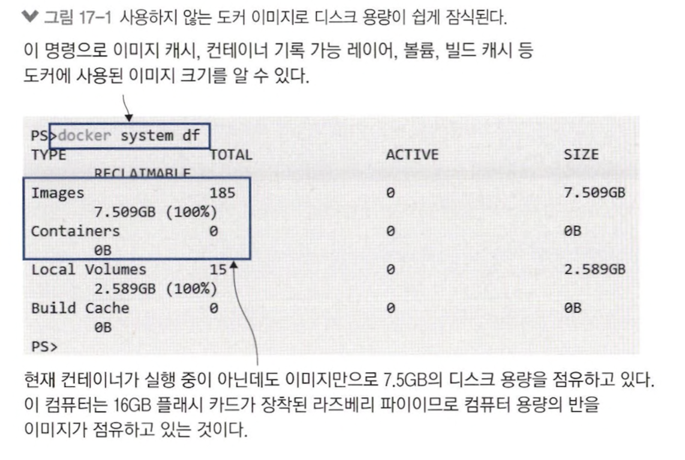

- `docker system prune` &rarr; 사용하지 않는 이미지 레이어, 빌드 캐시 비움

### 꼭 필요한 파일만 이미지에 포함

```dockerfile
# Dockerfile v1 - 전체 디렉토리 구조 이미지 복사
FROM diamol/base
CMD echo app- && ls app && echo docs- && ls docs
COPY . .

# Dockerfile v2 - 불필요한 파일 별도 삭제
FROM diamol/base
CMD echo app- && ls app && echo docs- && ls docs
COPY . .
RUN rm -rf docs
```

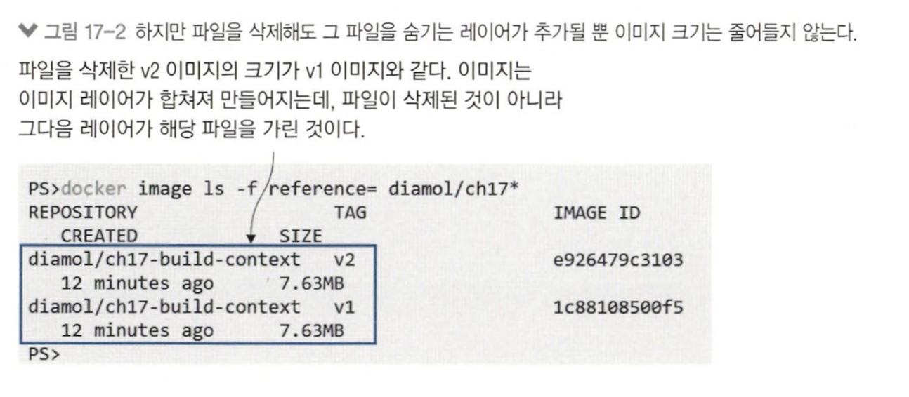

- rm 으로 삭제한 디렉토리가 실제로 삭제되지 않음
- 한번 이미지에 복사된 파일 이미지에서 제거 x
- 그 다음 레이어에서 지우더라도 파일 시스템에서 숨겨짐<br>
&rArr; 각 레이어마다 따로 최적화 필요

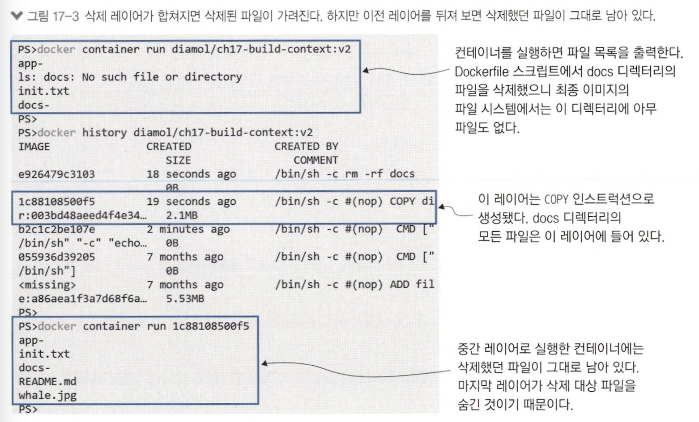

> 꼭 필요한 파일만 골라서 복사 필요

```dockerfile
FROM diamol/base
CMD echo app- && ls app && echo docs- && ls docs
COPY ./app ./app
```

## 17.2 좋은 기반 이미지를 고르는 법

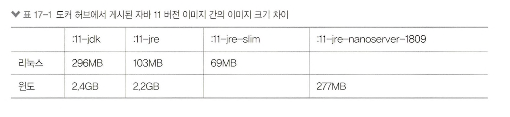

- 플랫폼마다 상이한 이미지

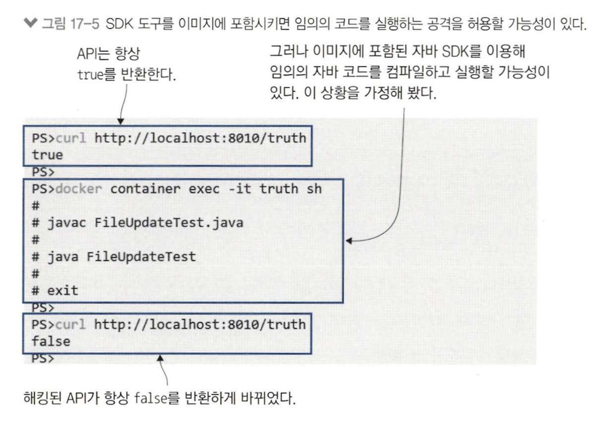

- 이미지에 방치한 불필요한 파일(= 테스트 코드)를 통해 공격 &rarr; ..?,,

### 엔코어를 통한 빌드 중 보안 검사

> 엔코어란, 오픈 소스 도커 이미지 분석 도구

```shell
# 앤코어 모든 구성 요소 실행
docker-compose up -docker

# 이미지와 Dockerfile 앤코어 분석
docker container exec anchore_engine_api_1 anchore-cli image add diamol/openjdk --dockerfile /Dockerfile

# 분석 결과 기다림
docker container exec anchore_engine_api_1 anchore-cli image wait diamol/openjdk
```

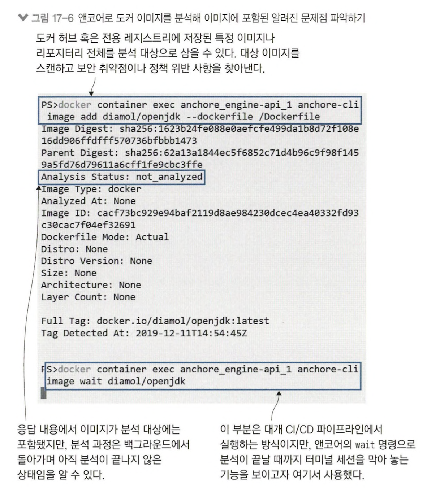

## 17.3 이미지 레이어 수와 이미지 크기는 최소한으로

```shell
# v1 apt-get 패키지 설치
docker image build -t diamol/ch17-socat:v1 .

# v2 패키지 관리자 최적화 옵션
docker image build -t diamol/ch17-socat:v2 -f Dockerfile.v2 .

# 두 이미지 크기 비교
docker image ls -f reference=diamol/ch17-socat
```

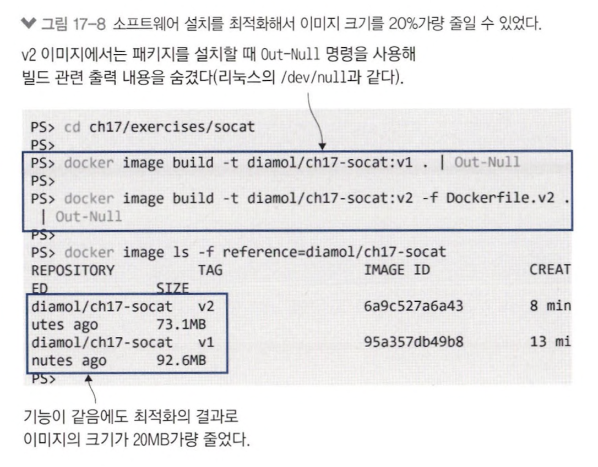

```dockerfile
# v1 apt-get
FROM debian:stretch-slim
RUN apt-get update
RUN apt-get install -y curl=7.52.1-5+deb9u9
RUN apt-get install -y socat=1.7.3.1-2+deb9u9

# v2 최적화
FROM debian:stretch-slim
RUN apt-get update \
    && apt-get install -y --no-install-recommends \
    curl=7.52.1-5+deb9u9 \
    socat=1.7.3.1-2+deb9u1 \
    && rm -rf /var/lib/apt/lists/*
```

#### 필요한 파일만 압축 해제

```shell
# v1 압축 파일 내려 받고 해제 후 불필요한 파일 제거
docker image build -t diamol/ch17-ml-dataset:v1 .

# v2 압축 파일 내려 받고 필요한 파일만 압축 해제
docker image build -t diamol/ch17-ml-dataste:v2 -f Dockerfile.v2 .

# 이미지 크기 비교
docker image ls -f reference=diamol/ch17-ml-dataset
```

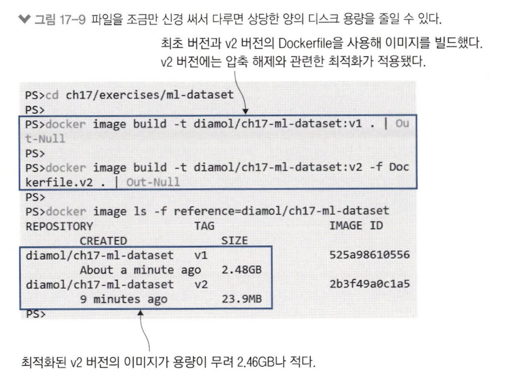

## 17.4 멀티 스테이지 빌드를 한 단계 업그레이드하기

```dockerfile
FROM diamol/base AS download
ARG DATASET_URL=https://archive.ics.uci/edu/.../url_svmlight.tar.gz
RUN wget -O dataset.tar.gz ${DATASET_URL}

FROM diamol/base AS expand
COPY --from=download dataset.tar.gz .
RUN tar xvzf dataset.tar.gz

FROM diamol/base
WORKDIR /dataset/url_svmlight
COPY --from=expand url_svmlight/Day1.svm
```

```shell
# v3 버전 이미지 끝가지 빌드
docker image build -t diamol/ch17-ml-dataset:v3 -f Dockerfile.v3 .

# download stage까지 빌드
docker image build -t diamol/ch17-ml-dataset:v3-download -f Dockerfile.v3 --target download .

# expand stage까지 빌드
docker image build -t diamol/ch17-ml-dataset:v3-expand -f Dockerfile.v3 --target expand .

# 이미지 크기 확인
docker image ls -f reference=diamol/ch17-ml-dataset:v3*
```

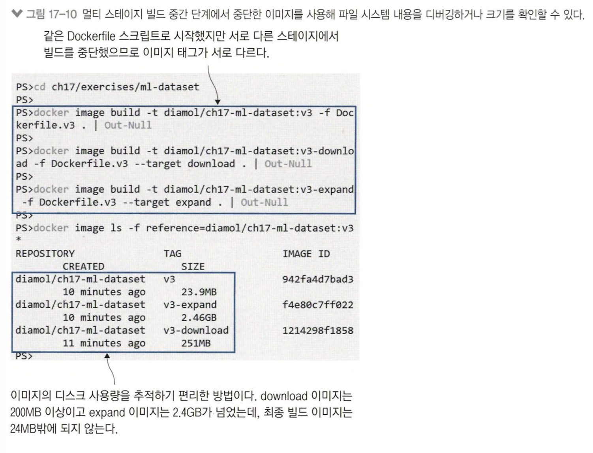

#### instruction을 잘 배열하여 빌드 시간 단축

```shell
docker image build -t diamol/ch17-jenkins:v1 .
docker image build -t diamol/ch17-jenkins:v2 -f Dockerfile.v2 .

echo 2.0 > jenkins.install.UpgradeWizard.state

# 두 이미지 재빌드 후 빌드 시간 확인
docker image build -t diamol/ch17-jenkins:v1 .
docker image build -t diamol/ch17-jenkins:v2 -f Dockerfile.v2 .
```

- 2회차 빌드에서 캐시 활용
- 10초 이상 &rarr; 1초 이내로 단축

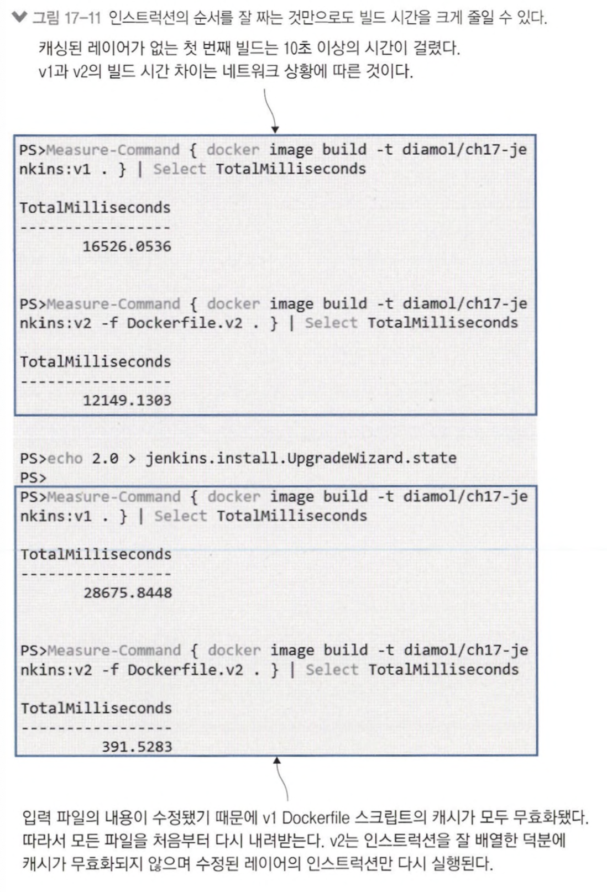

## 17.5 최적화가 중요한 이유

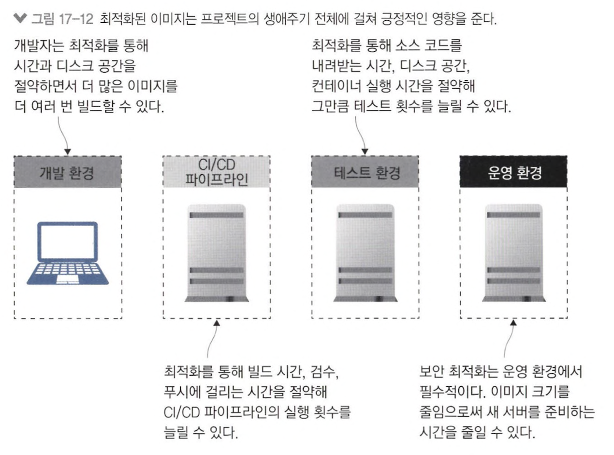

- 기반 이미지 잘 고르기
- 멀티 스테이지 빌드 적용
- 레이어 크기 최소화
- 자주 수정하는 순서대로 뒤에 오도록 배치하여 캐시 활용