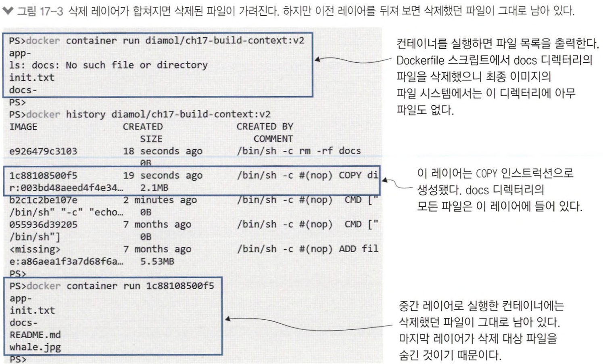
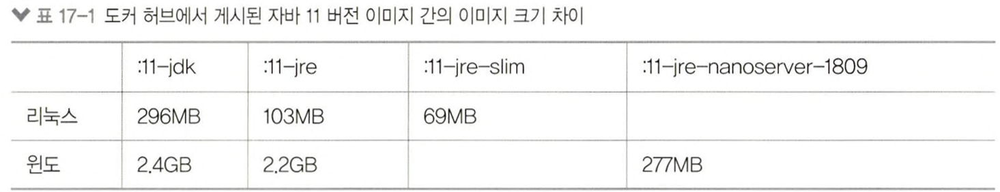
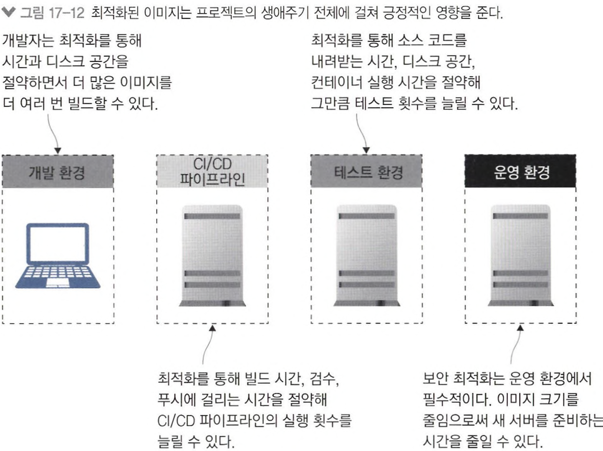

# 17장 도커 이미지 최적화하기: 보안, 용량, 속도

## 17.1 도커 이미지를 최적화하는 방법

### 꼭 필요한 파일만 이미지에 포함시키기

꼭 필요한 파일만 이미지에 포함시키는 것이 디스크 용량 절약의 첫걸음이다.

📌 한 번 이미지에 복사한 파일은 이미지에서 뺄 수 없다.

- 레이어에서 파일을 지우더라도 파일 시스템에서 숨겨질 뿐 `실제로 파일이 삭제되지는 않는다`.

<aside>
💡 다음 레이어에서 불필요한 파일을 제거해 봐야 소용이 없으며, 각 레이어마다 따로 최적화해야 한다.

</aside>



### .dockerignore 파일을 작성해 빌드 컨텍스트 크기 줄이기

.dockerignore 파일에 불필요한 디렉터리나 파일 목록을 기재하면 빌드 컨텍스트에서 이들 파일을 제외할 수 있다.

---

## 17.2 좋은 기반 이미지를 고르는 법

작은 기반 이미지로는 동작하지 않는 애플리케이션도 있겠지만, FROM 인스트럭션에서 기반 이미지를 쉽게 바꿀 수 있으므로 여러 번 테스트하며 적합한 이미지를 찾으면 된다.

⚠️  SDK도구를 이미지에 포함시키면 임의의 코드를 실행하는 공격을 허용할 가능성이 있다.



<aside>
💡 기반 이미지가 애플리케이션 실행에 필요한 모든 것을 갖춰야 하지만, 빌드에 필요한 도구를 포함시켜서는 안된다.

</aside>

### 문제 해결 방안

골든 이미지

- 직접 만든 골든 이미지는 업데이트 주기를 스스로 결정할 수 있고 골든 이미지 빌드 후에 바로 이어서 애플리케이션 빌드를 진행할 수 있다.
- 앤코어같은 서브파티 도구를 골든 이미지에 삽입해 빌드 중에 보안 검사를 할 수 있다.
    
    

---

## 17.3 이미지 레이어 수와 이미지 크기는 최소한으로

최소한의 크기와 보안성을 갖춘 기반 이미지는 애플리케이션 이미지 최적화의 전제 조건이다.

그 다음으로 할 일은 `꼭 필요한 것만 포함하는 이미지를 만드는 것` 이다.

✅ 불필요한 패키지를 제거해 패키지 목록을 정리하면 이미지 크기를 줄일 수 있다.

- 하나의 RUN 인스트럭션으로 합침으로서 레이어 수를 줄일 수 있다.

```bash
# Dockerfile - 일반적인 방식으로 APT를 사용함
FROM debian:stretch-slim

RUN apt-get update
RUN apt-get install -y curl=7.52.1-5+deb9u16
RUN apt-get install -y socat=1.7.3.1-2+deb9u1

# Dockerfile.v2 - 패키지 설치 과정을 최적화함
FROM debian:stretch-slim

RUN apt-get update \
 && apt-get install -y --no-install-recommends \
    curl=7.52.1-5+deb9u16 \
    socat=1.7.3.1-2+deb9u1 \
 && rm -rf /var/lib/apt/lists/*
```

✅ 다운로드-압축 해제-삭제까자의 단계를 모두 하나의 인스트럭션에서 수행하도록 한다.

- 데이터 파일을 복사하는 데 레이어 하나만을 사용한다.
- `필요한 파일만` 압축을 해제하여 디스크 용량을 많이 절약했다.

```docker
FROM diamol/base

ARG DATASET_URL=https://archive.ics.uci.edu/ml/machine-learning-databases/url/url_svmlight.tar.gz

WORKDIR /dataset

RUN wget -O dataset.tar.gz ${DATASET_URL} && \
    tar -xf dataset.tar.gz url_svmlight/Day1.svm && \
    rm -f dataset.tar.gz
```

---

## 17.4 멀티 스테이지 빌드를 한 단계 업그레이드하기

📌 스크립트 가독성과 이미지 최적화를 모두 고려한 멀티 스테이지 Dockerfile 스크립트

```docker
FROM diamol/base AS download
ARG DATASET_URL=https://archive.ics.uci.edu/.../url_svmlight.tar.gz
RUN wget -O dataset.tar.gz ${DATASET_URL}

FROM diamol/base AS expand
COPY --from download dataset.tar.gz .
RUN tar xvzf dataset.tar.gz

FROM diamol.base
WORKDIR /dataset/url_svmlight
COPY --from=expand url_svmlight/Day1.svm .
```

✅ 멀티 스테이지 Dockerfile 스크립트는 원하는 지점까지만 이미지를 빌드할 수 있다.

```bash
# download 스테이지까지만 빌드한다.
docker image build -t diamol/ch17-m1-dataset:v3-download -f Dockerfile.v3 --target download .
```

✅ 캐시를 잘 활용하면 소스코드를 수정할 때마다 CI/CD 파이프라인에서 시간을 낭비하지 않고도 이미지를 빌드하고 푸시할 수 있다.

- 인스트럭션을 잘 배열해 캐시가 무효화되지 않는다.
- 이미지에 패키지를 추가할 때는 정확한 버전을 명시해 실행 또는 업데이트 대상을 명확히 한다.

```bash
FROM diamol/base AS download
ARG JENKINS_VERSION="2.190.2"
RUN wget -O jenkins.war http://mirrors.jenkins.io/war-stable/${JENKINS_VERSION}/jenkins.war 

FROM diamol/base
ENV JENKINS_HOME="/data"
EXPOSE 8080
ENTRYPOINT java -Duser.home=${JENKINS_HOME} -Djenkins.install.runSetupWizard=false -jar /jenkins/jenkins.war
COPY --from=download jenkins.war /jenkins/jenkins.war
COPY ./jenkins.install.UpgradeWizard.state ${JENKINS_HOME}/%
```

---

## 17.5 최적화가 중요한 이유

- 기반 이미지 잘 고르기. 자신만의 골든 이미지를 갖출 수 있다면 이상적이다.
- 아주 간단한 애플리케이션이 아니라면 멀티 스테이지 빌드를 적용한다.
- 불필요한 패키지나 파일을 포함시키지 말고, 레이어 크기를 최소한으로 유지한다.
- Dockerfile 스크립트의 인스트럭션은 자주 수정하는 순서대로 뒤에 오도록 배치해 캐시를 최대한 활용한다.

