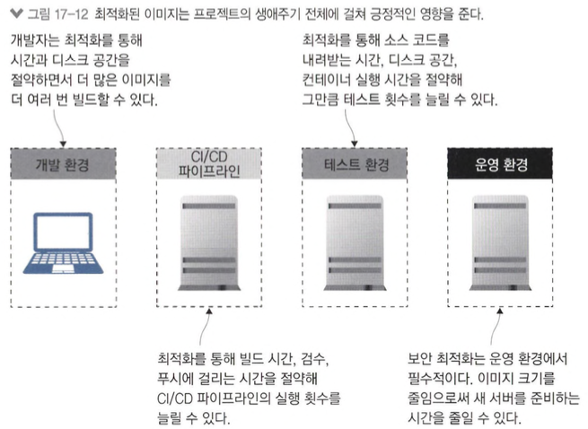

# 도커 이미지 최적화하기: 보안, 용량, 속도

## 도커 이미지를 최적화하는 방법

- 도커 이미지는 이미지끼리 레이어를 최대한 공유하기 때문에 이미지 빌드 시간. 네트워크 트래픽, 디스크 사용량을 아낄 수 있는 최적화가 잘된 포맷입니다.
- 내려받은 이미지는 명시적으로 삭제하지 않는 한 자동으로 삭제되지 않습니다.

```shell
docker system df
docker system prune
```

- docker가 얼마나 용량을 사용하고 있는지 확인하고 삭제하는 예제입니다.
- 꼭 필요한 파일만 이미지에 포함시켜야합니다.

```shell
docker image build -t diamol/ch17-build-context:v1 .
docker image build -t diamol/ch17-build-context:v2 -f ./Dockerfile.v2 .
docker image ls -f reference=diamol/ch17-build-context
```

- 그냥 빌드한 이미지와 불필요한 docs 디렉터리를 삭제하고 빌드한 이미지를 비교하는 예제입니다.
- rm 명령으로 삭제한 디렉터리 가 실제로 삭제되는 것이 아니기 때문에 v2 이미지의 크기는 vl 이미지의 크기와 차이가 없습니다.

```shell
docker run diamol/ch17-build-context:v2
docker history diamol/ch17-build-context:v2
docker run 58927ec8bc3d
```

- 캐시에 저장된 레이어로 실행한 컨테이너와 전체 이미지 컨테이너로 실행한 내용을 비교하는 예제입니다.
- 삭제 이전 레이어에서 실행한 컨테이너에 삭제했다고 생각했던 파일이 그대로 남아 있는 것을 볼 수 있습니다.

```shell
docker image build -t diamol/ch17-build-context:v3 -f ./Dockerfile.v3 .
mv rename.dockerignore .dockerignore
cat .dockerignore
docker image build -t diamol/ch17-build-context:v3 -f ./Dockerfile.v3 .
```

- 필요한 app만 COPY한 image를 빌드하는 예제입니다.

## 좋은 기반 이미지를 고르는 법

- 기반 이미지의 크기는 디스크 용량이나 네트워크 전송 시간뿐만 아니라 애플리케이션 보안과도 관련 있습니다.

  ex) curl이 설치된 운영체제 기반 이미지

- 리눅스 컨테이너일 경우 추천 이미지
  - 알파인 리눅스
  - 데비안 슬림 이미지

```shell
docker image build -t diamol/chl7-truth-app .
docker run -dp 8010:80 --name truth diamol/ch17-truth-app
curl http://localhost:8010/truth # 404 뜸
```

- java SDK가 포함된 애플리케이션을 테스트하는 예제입니다.
- 이런 이미지의 경우 공격자가 접근하여 컨테이너에서 자바코드를 컴파일해서 공격할 수 있습니다.

```shell
docker container exec -it truth sh
javac FileUpdateTest.java
java FileUpdateTest
exit
curl http://localhost:8010/truth
```

- 컨테이너에 접속하여 자바를 컴파일하고 테스트 코드를 실행하여 공격하는 예제입니다.
- 이를 통해 기반 이미지가 애플리케이션 실행에 필요한 모든 것을 갖춰야 하지만, 빌드 에 필요한 도구를 포함시켜서는 안 된다는것을 알 수 있습니다.

```shell
docker-compose up -d
docker exec anchore-engine-api-1 anchore-cli system wait
docker container cp "./openjdk/Dockerfile" anchore-engine-api-1:/Dockerfile
docker container exec anchore-engine-api-1 anchore-cli image add diamol/openjdk --dockerfile /Dockerfile
docker container exec anchore-engine-api-1 anchore-cli image wait diamol/openjdk
```


- 분석할수 없는 이미지라고 나옵니다....

```shell
docker container exec anchore-engine-api-1 anchore-cli image content diamol/openjdk java
docker container exec anchore-engine-api-1 anchore-cli image vuln diamol/openjdk all
```

- java 컴포넌트는 확인되는데 anchore는 아무것도 안나온다...

## 이미지 레이어 수와 이미지 크기는 최소한으로

```shell
docker image build -t diamol-ch17-socat:v1 .
docker image build -t diamol-ch17-socat:v2 -f Dockerfile.v2 .
docker image ls -f reference=diamol/ch17-socat
```

- 이미지 빌드 실패합니다... apt-get update 에서 실패하는걸로 보아 debian:stretch-slim 기반 이미지 문제일듯...
- 여러 개의 RUN 인스트럭션을 하나로 합치면 이미지 레이어 수가 줄어 드는 것 자체는 최적화가 아니지만 최대 레이어 수를 줄일 수 있습니다.

```shell
docker image build -t diamol/ch17-ml-dataset:v1 .
docker image build -t diamol/ch17-ml-dataset:v2 -f Dockerfile.v2 .
docker image ls -f reference=diamol/ch17-ml-dataset
```

- 압축해제에 차이를 둔 예제입니다.
- 디스크 용량이 가장 많이 절약되는 부분은 압축 파일을 삭제해서가 아니라 필요한 파일만 압축을 해제하기 때문입니다.
- 인스트럭션을 분할해 두면 중간 단계의 레이어로도 컨테이너를 실행할 수 있기 때문에 내려받은 파일을 캐시에 저장한 상태로 이후 인스트럭션을 작성할 수 있습니다.

## 멀티 스테이지 빌드를 한 단계 업그레이드하기

```shell
docker image build -t diamol/ch17-ml-dataset:v3 -f Dockerfile.v3 .
docker image build -t diamol/ch17-ml-dataset:v3-download -f Dockerfile.v3 --target download .
docker image build -t diamol/ch17-ml-dataset:v3-expand -f Dockerfile.v3 --target expand .
docker image ls -f "reference=diamol/ch17-ml-dataset:v3*"
```

- 멀티 스테이지 환경으로 최적화한 이미지를 실행하는 예제입니다.
- 멀티 스테이지을 한다고 최적화에는 전혀 손해가 없습니다.(v2 === v3 이미지 크기 동일함)

```shell
docker image build -t diamol/ch17-jenkins:v1 .
docker image build -t diamol/ch17-jenkins:v2 -f Dockerfile.v2 . #dockerfile 오류 남
echo 2.0 > jenkins.install.Upgradewizard.state
docker image build -t diamol/ch17-jenkins:v1 .
docker image build -t diamol/ch17-jenkins:v2 -f Dockerfile.v2 . #dockerfile 오류 남
```

- 캐시를 이용한 인스트럭션을 잘 배열한 멀티 스테이지 빌드가 처음에는 10초 이상이었지만 1초 이내로 단축되는것을 보여주는 예제입니다.
- 캐시를 잘 활용하면 소스 코드를 수정할 때마다 CI/CD 파이프라인에서 시간을 낭비하지 않고도 이미지를 빌드하고 푸시할 수 있습니다. RUN 인스트럭션을 사용해 내려받거나 불필요한 요소까지 캐싱하지 않도록 주의해야합니다.

## 최적화가 중요한 이유

- best practice
  - 기반 이미지 잘 고르기. 자신만의 골든 이미지를 갖출 수 있다면 이상적이다.
  - 아주 간단한 애플리케이션이 아니라면 멀티 스테이지 빌드를 적용한다.
  - 불필요한 패키지나 파일을 포함시키지 말고. 레이어 크기를 최소한으로 유지한다.
  - Dockerfile 스크립트의 인스트럭션은 자주 수정하는 순서대로 뒤에 오도록 배치해 캐시를 최대한 활용한다.


