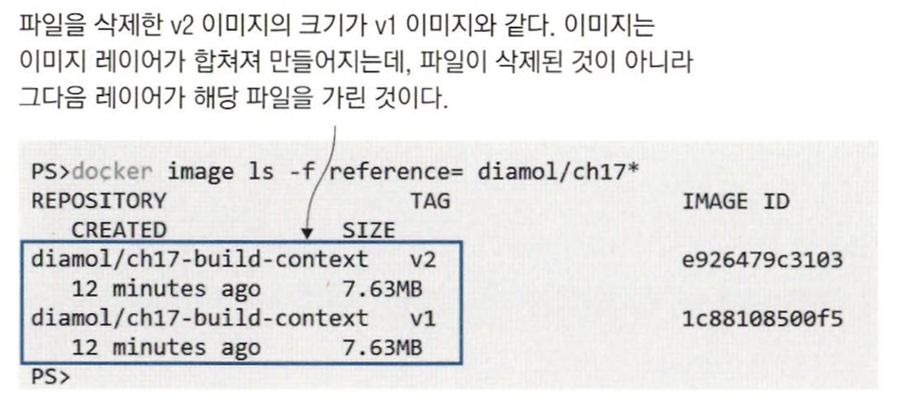
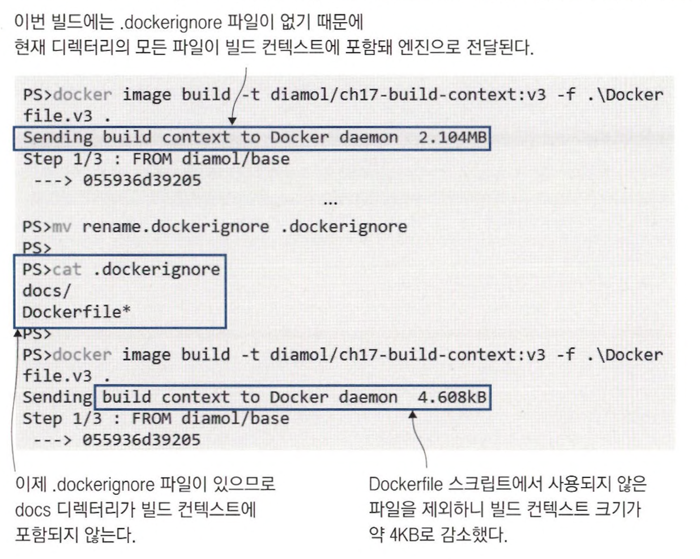
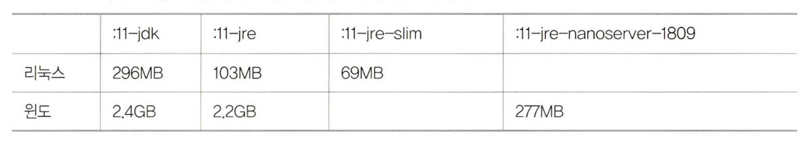
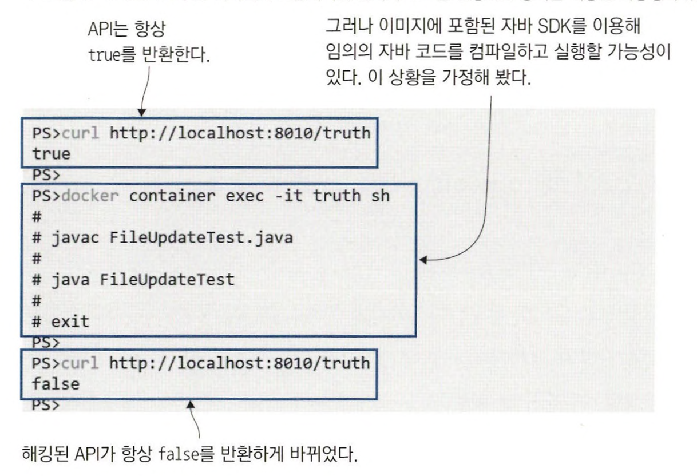
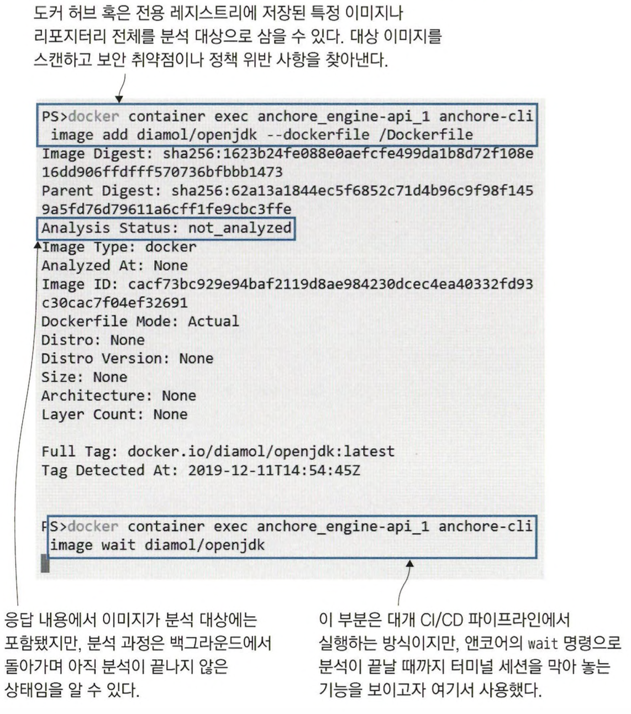
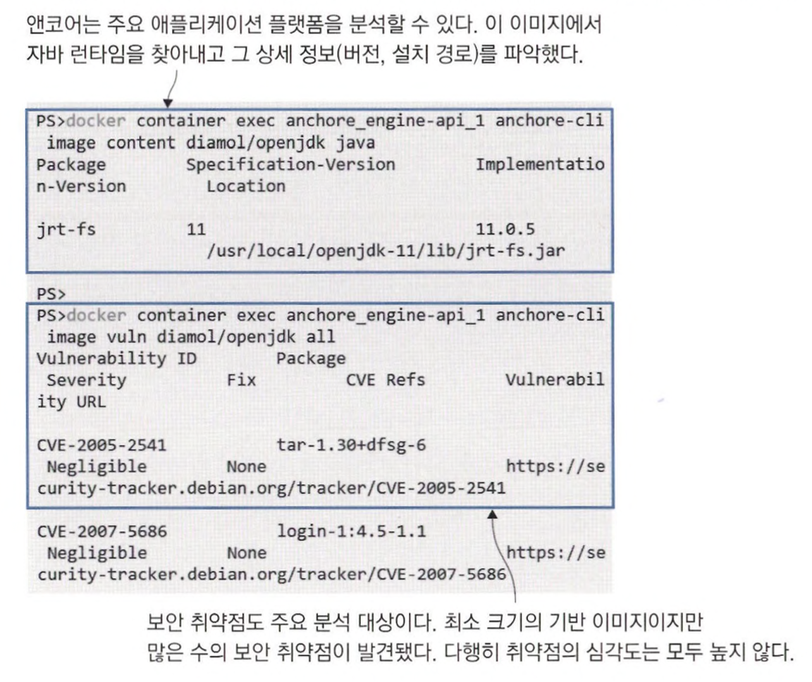
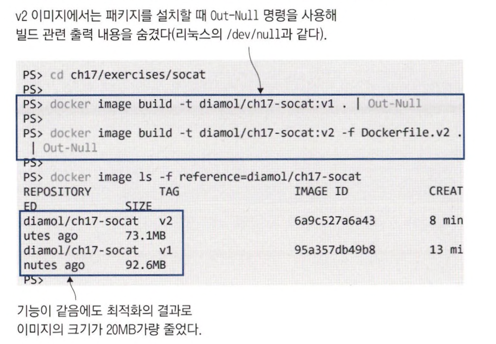
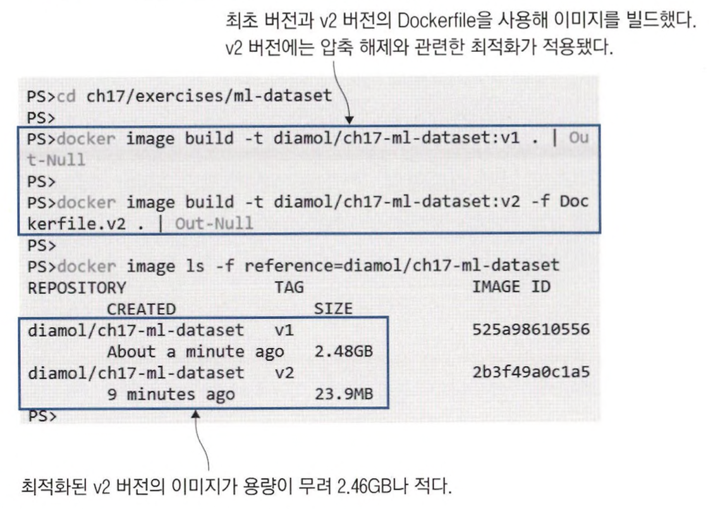
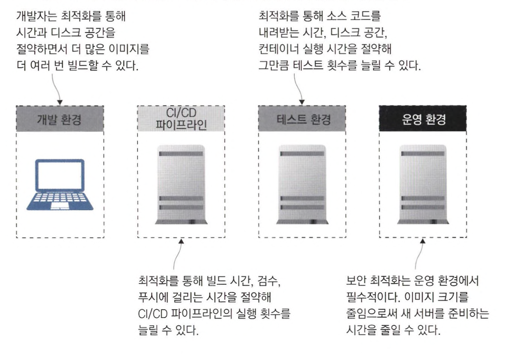

# 도커 이미지 최적화 (보안, 용량, 속도)

이미지가 최적화돼야 이미지 빌드와 배포가 빨라지고, 애플리케이션의 보안이 지켜진다. <br>


## 도커 이미지를 최적화하는 방법

애플리케이션을 업데이트하기 위해 컨테이너를 교체하면 새로운 이미지를 내려받지만 기존 이미지도 삭제되지 않고 남는다. <br>
그러다 보니 디스크 용량이 순식간에 부족해지는 경우가 많다.

```bash
# 내려받은 이미지와 컨테이너, 볼륨, 빌드 캐시 등이 점유하는 실제 디스크 용량을 알수 있다.
docker system df
```

주기적으로 **docker system prune** 명령어로 사용하지 않는 이미지 레이어나 빌드 캐시를 비워 주는 것이 좋다. <br>
예약 작업으로 이를 삭제하기도 하지만, 이미지를 잘 최적화하면 이 문제가 크게 줄어든다.

### 꼭 필요한 파일만 이미지에 포함시킨다

꼭 필요한 파일만 이미지에 포함시키는 것이 디스크 용량 절약의 첫걸음이다.

```
# v1 - 전체 디렉터리 구조를 이미지에 복사
FROM diamol/base
CMD echo app- && Is app && echo docs- && Is docs
COPY . .

# v2 - 불필요한 파일을 별도로 삭제
FROM diamol/base
CMD echo app- && Is app && echo docs- && Is docs
COPY . .
RUN rm -rf docs
```



v2에서 docs를 삭제했다고 해서 이미지 크기가 줄어들지 않았다. <br>
docs 디렉터리는 COPY 인스트럭션으로 만든 레이어에 그대로 남아 있다.

Dockerfile 스크립트의 인스트럭션 하나마다 이미지 레이어가 하나씩 생긴다. <br>
한 번 이미지에 복사된 파일은 이미지에서 뺄 수 없다. <br>
그다음 레이어에서 파일을 지우더라도 파일 시스템에서 숨겨질 뿐 실제로 파일이 삭제되지는 않는다. <br>
**각 레이어마다 따로 최적화해야 한다.**

<br>

> 애플리케이션 실행에 필요하지 않은 파일은 이미지에 복사해 서는 안 된다. <br>
> COPY 인스트럭션에서 꼭 필요한 파일만 골라 복사하는 편이 낫다.


```
# v3 - 전체 디렉터리 구조를 복사하는 대신 서브 디렉터리 app만 복사
FROM diamol/base
CMD echo app- && Is app && echo docs- && Is docs 
COPY ./app ./app
```

**이 스크립트는 실제로 이미지 크기가 줄어든다.**

하지만 더 최적화 가능하다. <br>
도커의 빌드 과정은 엔진에 빌드 컨텍스트(빌드를 실행한 디렉터리)를 압축하고, Dockerfile 스크립트를 함께 보내면서 시작된다. <br>
이 빌드 컨텍스트에는 불필요한 파일이 포함된 경우가 많은데, **.dockerignore** 파일을 이용하여 불필요한 파일을 제외할 수 있다.

```bash
docker image build -t diamol/ch17-build-context:v3 -f ./Dockerfile.v3 .

# 미리 작성해 둔 ignore 파일의 이름을 바꿔 유효하게 한다
mv rename.dockerignore .dockerignore
cat .dockerignore

docker image build -t diamol/ch17-build-context:v3 -f ./Dockerfile.v3 .
```



<br>
<hr>

## 좋은 기반 이미지 고르기

기반 이미지의 크기는 디스크 용량이나 네트워크 전송 시간뿐만 아니라 애플리케이션 보안과도 관계가 깊다.

자바 애플리케이션은 OpenJDK 공식 이미지를 기반 이미지로 많이 사용한다. <br>
설정값에 따라 다양한 태그가 부여된 자바 런타임(JRE) 과 개발자 키트(JDK) 이미지가 있다. <br>
크기가 가장 큰 OpenJDK 이미지는 자바 SDK 전체가 들어 있는데, 이는 컨테이너 침입자의 공격 수단으로 활용될 수 있다.



<br>

> 애플리케이션에 사용할 때는 크기가 작은 변종 이미지부터 검토해야 한다. <br>
> *리눅스 컨테이너에는 알파인 리눅스 or 데비안 슬림 이미지를 기반 이미지로 추천, 윈도 컨테이너는 나노 서버를 추천*




<br>

### 앤코어

앤코어같은 서드파티 도구를 골든 이미지에 삽입해 빌드 중에 보안 검사를 할 수 있다. 

대개 앤코어를 CI/CD 파이프라인에 통합해 사용한다. <br>
앤코어 분석이 끝나면 이미지에 포함된 다양하고 많은 문제점을 지적해 준다. <br>
이미지에 사용된 오픈 소스 소프트웨어의 라이센스부터 운영체제와 애플리케이션 플랫폼에 대한 상세 정보, 이미지에 포함된 바이너리 파일의 보안 문제까지 알 수 있다. <br>




<br>
<hr>

## 이미지 레이어 수와 이미지 크기는 최소한으로

소프트웨어를 설치하면 패키지 목록을 캐싱하거나 추천 패키지 등을 함께 설치하기 때문에 대부분의 경우 불필요한 요소나 설치 후 잔재가 발생한다. <br>
이런 요소까지 확실하게 통제할 수 있어야 한다.

```bash
# v1 - 평범하게 apt-get 명령으로 패키지를 설치
docker image build -t diamol/ch17-socat:v1 .

# v2 - 패키지 관리자에 최적화 옵션을 줬다
docker image build -t diamol/ch17-socat:v2 -f Dockerfile.v2 .

# 이미지 크기 비교
docker image Is -f reference=diamol/ch17-socat
```



<br>


```
# 일반적인 방식의 apt
FROM debian:stretch-slim
RUN apt-get update
RUN apt-get install -y curl=7.52.1—5+deb9u9 
RUN apt-get install -y socat=1.7.3.1-2+deb9u1

# 패키지 설치 과정 최적화
FROM debian:stretch-slim
RUN apt-get update \
    && apt-get install -y —no-install-recommends
        curl=7.52.1-5+deb9u9 \
        socat=1.7.3.1-2+deb9u1 \
    && rm -rf /var/lib/apt/
```

여러 개의 RUN 인스트럭션을 하나로 합치는 데는 또 다른 장점이 있다. <br>
이미지 레이어 수가 줄어 드는 것 자체는 최적화가 아니지만 최대 레이어 수가 제한돼 있기 때문에 여분의 레이어를 남겨 두는 것도 의미가 있고 <br>
레이어 수가 적으면 컨테이너 파일 시 스템의 내용을 추적하기도 훨씬 쉽다.

<br>


```bash
# v1 - 압축 파일을 받은 후 해제, 그 이후 불필요한 파일 제거
docker image build -t diamol/ch17-ml-dataset:v1 .

# v2 - 필요한 파일만 압축 해제
docker image build -t diamol/ch17-ml-dataset:v2 -f Dockerfile.v2 .

# 이미지 크기 비교
docker image Is -f reference=diamol/ch17-ml-dataset
```

```
# 압축 파일을 다루는 최적화
FROM diamol/base

ARG DATASET_URL=https://archive.ics.uci.edu/.../url_svmlight.tar.gz

WORKDIR /dataset

RUN wget -0 dataset.tar.gz ${DATASET_URL} && \
    tar -xf dataset.tar.gz url_svmlight/Day1.svm && \
    rm -f dataset.tar.gz
```



<br>
<hr>


## 멀티 스테이지 빌드를 한 단계 업그레이드

```
# 스크립트 가독성과 이미지 최적화를 모두 고려한 멀티 스테이지 Dockerfile 스크립트
FROM diamol/base AS download
ARG DATASET_URL=https://archive.ics.uci.edu/.../url_svmlight.tar.gz 
RUN wget -0 dataset.tar.gz ${DATASET_URL}

FROM diamol/base AS expand
COPY —from=download dataset.tar.gz . 
RUN tar xvzf dataset.tar.gz

FROM diamol/base
WORKDIR /dataset/url_svmlight
COPY --from=expand url_svmlight/Day1.svm .
```

스테이지별로 어떤 단계를 밟는 중인지 이해하기 쉬우면서도 인스트럭션을 줄이느라 복잡하게 명령어를 합칠 필요가 없다. <br>
최종적으로 빌드되는 이미지에는 앞선 단계에서 명시적으로 복사해 온 파일만이 포함되기 때문이다. <br>
원하는 지점까지만 이미지를 빌드할 수 있으므로 디버깅 편의성은 그대로 유지할 수 있다.


```bash
# 이미지 끝까지 빌드
docker image build -t diamol/ch17-ml-dataset:v3 -f Dockerfile.v3 .

# download 스테이지까지만 빌드
docker image build -t diamol/ch17-ml-dataset:v3-download -f Dockerfile.v3 --target download .

# expand 스테이지까지만 빌드
docker image build -t diamol/ch17-ml-dataset:v3-expand -f Dockerfile,v3 --target expand .
```

<br>
<hr>

## 최적화가 중요한 이유




