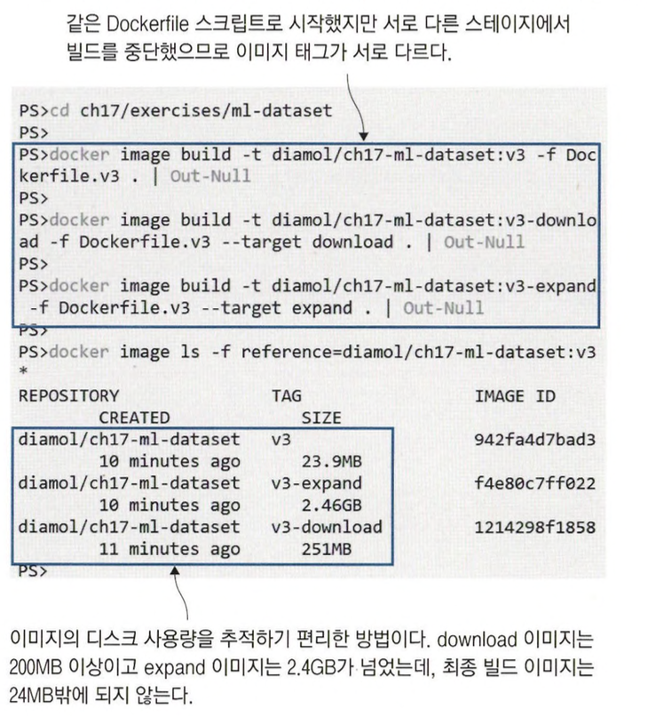
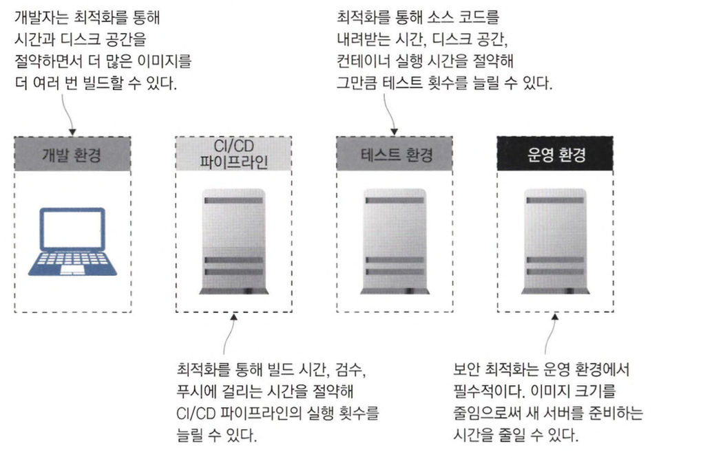

# 도커 이미지 최적화하기 : 보안, 용량, 속도

## 도커 이미지를 최적화하는 방법

### 도커 이미지는 자동으로 삭제되지 않는다

`도커 이미지는 이미지끼리 레이어를 최대한 공유`하기 때문에 이미지 빌드 시간, 네트워크 트래픽, 디스크 사용량을 아낄 수 있습니다.

하지만 `내려받은 이미지는 명시적으로 삭제하지 않는 한 자동으로 삭제되지 않습니다.`

그러므로 애플리케이션을 업데이트하기 위해 컨테이너를 교체하면 새로운 이미지를 내려받지만 기존 이미지도 삭제되지 않고 남습니다.

그러다보니 `디스크 용량이 순식간에 잠식되는 경우`가 많습니다.

다음 명령어를 사용하여 실제 디스크 용량을 알 수 있습니다.

```bash
docker system df

TYPE            TOTAL     ACTIVE    SIZE      RECLAIMABLE
Images          53        0         7.795GB   7.795GB (100%)
Containers      0         0         0B        0B
Local Volumes   85        0         10.08GB   10.08GB (100%)
Build Cache     341       0         639.3MB   639.3MB
```

이러한 이미지를 주기적으로 제거하기 위해 다음 명령어를 사용하여 사용하지 않는 이미지 레이어나 빌드 캐시를 비워주는 것이 좋습니다.

```bash
docker system prune
```

`docker system prune` 명령을 이용하는 등 직접 비워주는 방법도 있지만 이미지를 잘 최적화하면 용량 문제가 발생할 일을 크게 줄일 수 있습니다.

다음은 도커의 간단한 베스트 프랙티스를 적용하여 이미지를 최적화하는 방법입니다.

### 꼭 필요한 파일만 이미지에 포함해야 한다.

당연한 이야기 같지만, 실제로 Dockerfile을 작성해보면 사용되지 않을 이미지 파일이나 문서 파일까지 한꺼번에 포함시키는 경우가 많습니다.

꼭 필요한 파일만 이미지에 포함시키는 것이 디스크 용량의 첫 걸음입니다.

다음과 같은 도커 파일이 존재한다고 가정해봅시다.

```docker
FROM diamol/base

CMD echo app- && ls app && echo docs- && ls docs

COPY . .
```

다음은 불필요한 파일을 삭제하는 도커파일 예시입니다.

```docker
FROM diamol/base

CMD echo app- && ls app && echo docs- && ls docs

COPY . .

RUN rm -rf docs
```

여기서 불필요한 디렉터리를 삭제했으니 용량이 줄여들 것으로 기대되지만 실제로 줄어들지 않는 것을 볼 수 있습니다.

이미지는 이미지 레이어에 쌓여 만들어집니다.

docs 디렉터리는 COPY 인스트럭션으로 만든 레이어에 그대로 남아 있습니다.

그렇기 때문에 `삭제 레이어로 가려졌을 뿐 실제 이미지는 줄어들지 않습니다.`

특정 디렉터리를 복사하지 않으려면 다음과 같이 특정 폴더만 지정하여 COPY를 진행해야 합니다.

```docker
FROM diamol/base
CMD echo app- && ls app && echo docs- && ls docs
COPY ./app ./app
```

위와 같이 빌드하면 이미지 크기가 줄어들었음을 알 수 있습니다.

### .dockerignore

필요한 파일만 옮기면 도커 이미지를 최적화할 수 있지만 아직 더 최적화할 수 있는 여지가 남아있습니다.

도커의 빌드 과정은 엔진에 빌드 컨텍스트(빌드를 실행한 디렉터리)를 압축하고 Dockerfile 스크립트를 함께 보내면서 시작됩니다.

이 빌드 컨텍스트에는 불필요한 파일이 포함된 경우가 많습니다.

`.dockerignore 파일에 불필요한 디렉터리나 파일 목록을 기재하면 빌드 컨텍스트에서 이들 파일을 제외`할 수 있습니다.

.dockerignore 파일은 .gitignore 처럼 다음과 같이 필요하지 않은 파일 및 디렉터리를 적으면 됩니다.

```bash
docs/
Dockerfile*
```

## 좋은 기반 이미지를 고르는법

기반 이미지의 크기는 디스크 용량이나 네트워크 전송 시간 분만 아니라 애플리케이션 보안과도 관계가 깊습니다.

운영체제 기반 이미지가 크면 다양한 도구가 포함될 수 있기 때문입니다.

예를 들어 curl이 설치되어 있다면 애플리케이션 컨테이너에 침입한 공격자가 curl을 이용해 악의적인 소프트웨어를 내려받거나 자신의 서버로 데이터를 전송시킬 수 있습니다.

이러한 이유로 `가능한 한 작은 이미지를 사용하는 것이 좋습니다.`

### 골든 이미지로 이미지 관리하기

골든 이미지를 사용하면 작은 크기의 이미지로 애플리케이션을 만들고 여러가지 보안 패치 등을 적용할 수 있기 때문에 좀 더 안전한 이미지를 만들 수 있습니다.

예를 들어 앤코어와 같은 서드파티 도구를 `골든 이미지에 삽입해 빌드 중에 보안 검사를 할 수 있다는 것도 장점`입니다.

<aside>
💡 앤코어와 같은 보안 취약점 도구를 사용하면 베이스 이미지가 안전한지도 확인할 수 있습니다.

</aside>

## 이미지 레이어 수와 이미지 크기는 최소한으로

최소한의 크기와 보안성을 갖춘 이미지는 애플리케이션 이미지 최적화의 전제 조건입니다.

그 다음으로 할 일은 꼭 필요한 것만 포함하는 이미지를 만드는 것입니다.

간단해보이지만 소프트웨어를 설치할때 패키지 목록을 캐싱하거나 추천 패키지 등을 같이 설치하기 때문에 대부분의 경우 불필요한 요소나 설치 후 잔재가 발생합니다.

이런 요소까지 확실하게 통제하는 것이 좋습니다.

다음은 패키지 설치시 옵션을 통해 이미지를 최적화한 예시입니다.

```docker
# 일반적인 방법으로 APT 사용
FROM debian:stretch-slim

RUN apt-get update
RUN apt-get install -y curl=7.52.1-5+deb9u9
RUN apt-get install -y socat=1.7.3.1-2+deb9u1
```

```docker
# 패키지 설치 과정 최적화
FROM debian:stretch-slim

RUN apt-get update && \
		apt-get install -y --no-install-recommends \
			curl=7.52.1-5+deb9u9 \
			socat=1.7.3.1-2+deb9u1 \
			&& rm -rf /var/lib/apt/lists/*
```

위에 최적화된 코드는 패키지 설치 후 캐시를 삭제하는 단계를 하나의 RUN 인스트럭션으로 합친 것입니다.

이런 경우 다음과 같은 장점을 얻을 수 있습니다.

- 이미지 레이어 수가 줄어드는 것 자체는 최적화가 아니지만 최대 레이어 수가 제한(운영체제마다 다르지만 주로 127개)되어 있기 때문에 여분의 레이어를 남길 수 있습니다.
- 레이어 수가 적으면 파일 시스템의 내용을 추적하기 쉽습니다.

### 다운로드 - 압축 해제 - 삭제 단계를 하나의 인스트럭션에서 수행하는 것이 좋습니다.

다운로드 → 압축해제 → 삭제 단계를 하나의 단계로 관리하면 레이어에 불필요한 파일이 담기는 것을 막을 수 있어 용량 차이가 크게 날 수 있습니다.

인스트럭션을 나누면 디버깅이 편하고 빌드 캐시를 이용할 수 있어 이전에 내려받은 파일은 캐싱할 수 있습니다.

그래도 `작업이 끝난 후에는 하나의 인스트럭션으로 관리해야 이미지 최적화를 진행`할 수 있습니다.

다음은 다운로드 → 압축해제 → 삭제 단계를 하나의 단계로 관리하는 도커 파일 스크립트 예시입니다.

```docker
FROM diamol/base

ARG DATASET_URL=https://archive.ics.uci.edu/.../url_svmlight.tar.gz

WORKDIR /dataset

RUN wget -O dataset.tar.gz ${DATASET_URL} && \
		tar -xf dataset.tar.gz url_svmlight/Day1.svm && \
		rm -f dataset.tar.gz
```

## 멀티 스테이지 빌드를 한 단계 업그레이드 하기

멀티스테이지 빌드는 최종 이미지를 최적화하여 만들기 좋기 때문에 Dockerfile 스크립트는 멀티 스테이지 빌드로 작성하는 것이 좋습니다.

다음은 좀 더 최적화한 멀티 스테이지 Dockerfile 스크립트입니다.

```docker
FROM diamol/base AS download
ARG DATASET_URL=https://archive.ics.uci/edu/.../url_svmlight.tar.gz
RUN wget -O dataset.tar.gz ${DATASET_URL}

FROM diamol/base AS expand
COPY --from=download dataset.tar.gz .
RUN tar xvzf dataset.tar.gz

FROM diamol/base
WORKDIR /dataset/url_svmlight
COPY --from=expand url_svmlight/Day1.svm
```

위의 멀티 스테이지 Dockerfile은 단계 별로 어떤 단계를 진행하는지 이해하기 쉬우면서도 인스트럭션을 줄이느라 복잡하게 명령어를 합칠 필요가 없습니다.

`최종적으로 빌드되는 이미지에는 앞선 단계에서 명시적으로 복사해온 파일만이 포함`되기 때문입니다.

그럼에도 `디버깅 편의성은 그대로 유지`할 수 있습니다.

또한, Dockerfile 스크립트 역시 원하는 지점까지만 빌드할 수 있으므로 파일 시스템의 중간 상태를 확인하고 싶다면 굳이 이미지 레이어 식별자를 찾지 않아도 된다는 장점이 있습니다.

다음과 같이 명령어를 사용하면 멀티 스테이지 빌드를 특정 시점까지만 빌드할 수 있습니다.

```bash
# download 스테이지까지만 빌드 (--target 옵션 사용)
docker image build -t diamol/ch17-ml-dataset:v3-download -f Dockerfile.v3 --target downolad .
```

멀티 스테이지 빌드에서 각 단계별 용량은 다음과 같습니다.



## 최적화 베스트 프랙티스

- 기반 이미지 잘 고르기
    - 자신만의 골든 이미지를 갖출 수 있다면 이상적입니다.
- 아주 간단한 애플리케이션이 아니라면 멀티 스테이지 빌드를 적용합니다.
- 불필요한 패키지나 파일을 포함시키지 말고, 레이어 크기를 최소한으로 유지합니다.
- Dockerfile 스크립트의 인스트럭션은 자주 수정하는 순서대로 뒤에 오도록 배치해 캐시를 최대한 활용합니다.

