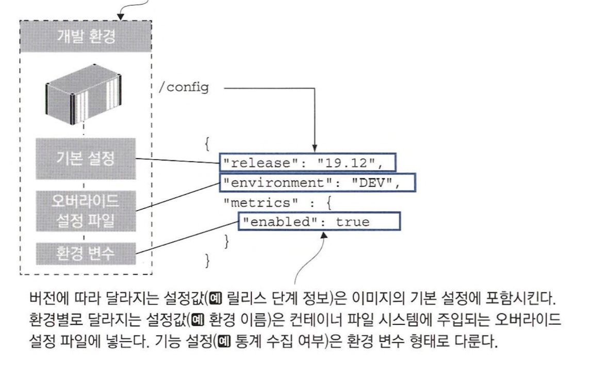

# 18장 컨테이너의 애플리케이션 설정 관리

## 18.1 다단 애플리케이션 설정

#### 설정 데이터 종류

- 버전에 따라 달라지는 설정 : 모든 환경에선 동일하지만 버전별로 달라지는 설정
- 환경에 따라 달라지는 설정 : 환경별로 달라지는 설정
- 기능 설정 : 버전별로 애플리케이션 동작을 달리하기 위한 설정



- 미리 정의된 경로에서 오버라이드 설정 파일을 읽어 설정 적용하도록 함

## 18.2 환경별 설정 패키징하기

- `appsettings.json` : 모든 환경에 공통적으로 적용되는 설정
- `appsettings.{환경 이름}.json` : 환경별로 적용되는 오버라이드 설정 파일
- 환경 변수 : 환경 이름 정의 및 오버라이드 설정

#### 테스트 환경 설정으로 실행

```shell
# default 설정으로 실행
docker container run -d -p 8083:80 diamol/ch18-todo-list

# to-do application을 테스트 환경 설정으로 실행
docker containerrun -d -p 8084:80 -e DOTNET_ENVIRONMENT=Test diamol/ch18-todo-list
```

- 첫번째 컨테이너 설정 = `appsettings.json` + `appsettings.Development.json`
- 두번째 컨테이너 설정 = `appsettings.json` + `appsettings.Test.json`
- 두 파일 모두 이미지와 함께 패키징 되어 외부 주입 필요 x

#### 오버라이드 설정 파일로 DB 접근

```shell
docker container run -d -p 8085:80 -e DOTNET_ENVIRONMENT=Production -v "$(pwd)/config/prod-local:/app/config-override" diamol/ch18-todolist
```

#### 바인드 마운트, 환경 변수 설정으로 컨테이너 실행

```shell
docker container run -d -p 8086:80 -e DOTNET_ENVIRONEMTN=Production -e release=CUSTOM -v "$(pwd)/config/prod-local:/app/config-override" diamol/ch18-todo-list
```

- 이미지에 설정 파일 모두 포함 시키는 점 검토 필요
- 서버 이름, URL, 파일 경로, 로그 수준 캐시 크기 정보 공격 가능성 존재
- 민감 정보 오버라이드 파일로 옮기기

## 18.3 런타임에서 설정 읽어 들이기

#### application 설정 by TOML

> [TOML](https://www.itworld.co.kr/tags/39697/%ED%8C%8C%EC%9D%B4%EC%8D%AC/248128)이란 json, xml과 같은 데이터 형식 중 하나

- cloud 기반 프로젝트에 널리 사용
- 가독성 &uarr;

```toml
release = "19.12"
environment = "UNKNOWN"

[metrics]
enabled = true

[apis]
[apis.image]
url = "http://iotd/image"

[apis.access]
url = "http://accesslog/access-log"
```

## 18.4 레거시 애플리케이션에 설정 전략 적용하기

#### 설정 파일 주입 전략

- 컨테이너에 지정된 오버라이드 설정 파일 조회
- 환경 변수에서 오버라이드 설정 조회
- 오버라이드 설정 파일과 환경 변수 설정 병합 &rarr; 환경 변수 값 우선
- 병합된 오버라이드 설정 컨테이너 내 대상 설정 파일에 추가


#### 오버라이드 설정 파일과 환경 변수 설정 적용해 컨테이너 실행

```shell
docker run -d -p 8091:80 -v "$(pwd)/config/dev:/config-override" -e
  CONFIG_SOURCE_PATH="/config-override/application.properties" -e
  IOTD_ENVIRONMENT="custom" diamol/ch18-image-of-the-day
```

#### 도커 컴포즈로 다양한 설정 다루기


## 18.5 유연한 설정 모델의 이점

