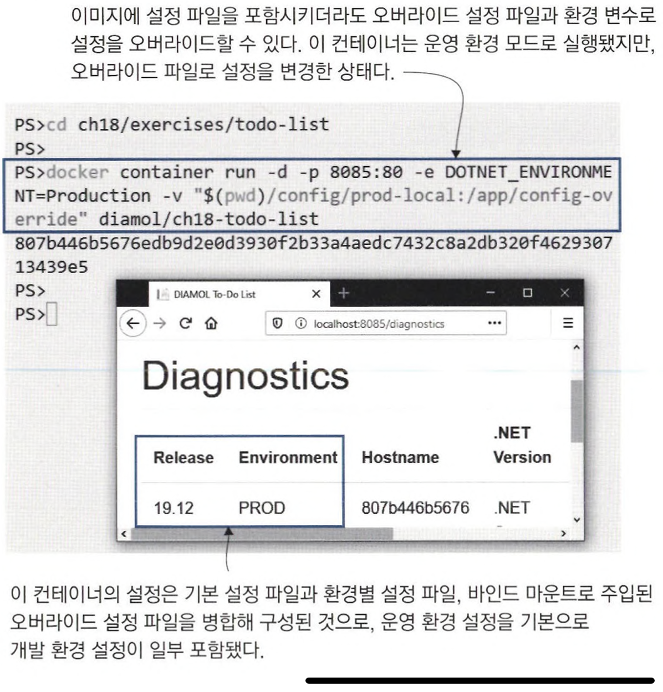
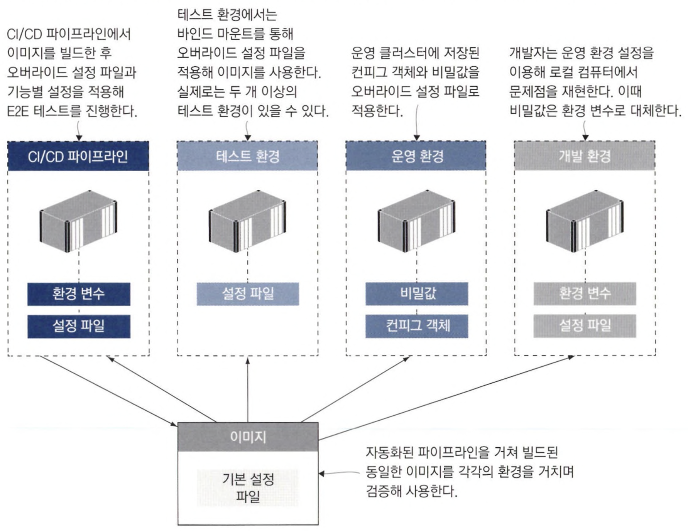

# 18장 컨테이너의 애플리케이션 설정 관리

## 18.1 다단 애플리케이션 설정

설정 데이터 종류는 주로 다음 세 가지다.

- 버전에 따라 달라지는 설정 : 모든 환경에서 동일하지만 버전별로 달라지는 설정
- 환경에 따라 달라지는 설정 : 환경별로 달라지는 설정
- 기능 설정 : 버전 별로 애플리케이션의 동작을 달리하기 위한 설정

### ✅ 설정 관리 라이브러리인 node-config를 사용하는 Node.js 애플리케이션

```bash
- config : 기본 설정으로 도커 이미지에 포함되는 설정
- config-override : 이미지에 포함되지 않지만 볼륨, 컨피그 객체, 비밀값 등을 통해 컨테이너 파일 시스템에 주입되는 설정
```

미리 정의된 경로에서 오버라이드 설정 파일을 읽어 들이도록 해두면, 어떤 경로로든 컨테이너 파일 시스템에 설정 파일을 주입하기만 하면 해당 설정을 적용할 수 있다.

📌 이미지에 포함된 기본 설정 파일, 볼륨으로 마운트된 로컬 디렉터리의 오버라이드 설정 파일, 환경 변수를 병합해 설정을 만든다.

- 이런 설정은 개발자의 워크플로를 부드럽게 유지할 수 있는 좋은 사례다.

```bash
docker container run -d -p 8082:80 -v "$(pwd)/config/dev:/app/configoverride" -e NODE_CONFIG='{\"metrics\": {\"enabled\":\"true\"}}' diamol/ch18-access-log
```

---

## 18.2 환경별 설정 패키징하기

여러 가지 애플리케이션 프레임워크에서 환경별 설정 파일을 모두 배포에 포함시킬 수 있는 기능을 제공한다.

닷넷 코어는 다음과 같은 두 파일로부터 기본 설정값을 읽어들인다.

```bash
- appsettings.json: 모든 환경에 공통적으로 적용되는 설정
- appsettings.{환경_이름}.json: 환경별로 적용되는 오버라이드 설정 파일
- 환경 변수: 환경 이름 정의 및 오버라이드 설정
```

```bash
# to-do 애플리케이션을 테스트 환경 설정으로 실행
docker container run -d -p 8084:80 -e DOTNET_ENVIRONMENT=Test diamol/ch18-todo-list
```

📌 환경을 지정해 이미지에 포함된 환경별 설정 파일을 사용하더라도 오버라이드 설정 파일을 사용할 수 있다.



---

## 18.3 런타임에서 설정 읽어 들이기

Go언어에서도 바이퍼라는 설정 모듈이 널리 쓰인다.

패키지 목록에 바이퍼를 추가하고, 코드에서 오버라이드 파일을 읽어 올 설정 디렉터리를 지정하면 된다.

```bash
- 이미지에 포함된 config 디렉터리에서 기본 설정 파일을 읽어 들인다.
- 환경별 설정 파일은 config-override 디렉터리에서 읽어 들이는데, 이 디렉터리는 이미지에서는 빈 디렉터리이며 파일 시스템 마운트로 외부에서 주입된다.
- 환경 변수는 설정 파일의 설정값을 오버라이드할 수 있다.
```

📌 TOML를 사용해 설정 파일을 쉽게 관리할 수 있다.

```bash
release = "19.12"
environment = "UNKNOWN"

[metrics]
enabled = true

[apis]

 [apis.image]
 url = "http://iotd/image"

 [apis.access]
 url = "http://accesslog/access-log"
```

📌 바이퍼의 설정에 사용되는 환경 변수의 이름을 지을 때는 다른 애플리케이션 환경 변수와의 충돌을 피하기 위해 IG라는 접두사를 붙이는 관습이 있다.

```bash
docker container run -d -p 8088:80 -v "$(pwd)/config/dev:/app/config-override" -e IG_METRICS.ENABLED=TRUE diamol/ch18-image-gallery
```

---

## 18.4 레거시 애플리케이션에 설정 전략 적용하기

컨테이너에 주입된 설정 파일을 애플리케이션의 설정 전략에 맞춰 변환하는 유틸리티 또는 스크립트를 이미지에 포함시킨다.

```bash
1. 컨테이너에 지정된 오버라이드 설정 파일을 읽어 들이기
2. 환경 변수에서 오버라이드 설정을 읽어 들이기
3. 오버라이드 설정 파일과 환경 변수 설정을 병합하기. 이때, 환경 변수 값이 우선한다.
4. 병합된 오버라이드 설정을 컨테이너 내 대상 설정 파일에 추가한다.
```

📌 Dockerfile 스크립트에서 유틸리티를 빌드하는 부분과 애플리케이션 시작 시 유틸리티를 먼저 실행하도록 한 부분이다.

- 애플리케이션 시작 로직을 수정해 실제 애플리케이션이 실행되기 전에 원하는 작업을 수행할 수 있다.
- 이 작업으로 인해 컨테이너 시작과 애플리케이션 실행 사이에 시간 간격이 생기며 컨테이너가 실패할 확률이 높아진다.
- 이에 대처할 수 있도록 항상 헬스 체크를 적용해야 한다.

```bash
FROM diamol/maven AS builder
...
RUN mvn package

# config util
FROM diamol/maven as utility-builder

WORKDIR /usr/src/utilities
COPY ./src/utilities/ConfigLoader.java .
RUN javac ConfigLoader.java

# app
FROM diamol/openjdk

EXPOSE 80
ENV CONFIG_SOURCE_PATH="" \
    CONFIG_TARGET_PATH="/app/config/application.properties"

CMD java ConfigLoader && \
    java -jar /app/iotd-service-0.1.0.jar

WORKDIR /app/config
WORKDIR /app
COPY --from=utility-builder /usr/src/utilities/ConfigLoader.class .
COPY --from=builder /usr/src/iotd/target/iotd-service-0.1.0.jar .
```

---

## 18.5 유연한 설정 모델의 이점

계층별 설정 모델은 애플리케이션의 동작은 각 환경마다 조금씩 다르게 하면서도 단일 이미지 원칙을 유지할 수 있게 해준다.

설정 모델을 적용하는 데 시간을 투자하면, 동일한 이미지로 모든 환경에서 애플리케이션을 동작시키는 결과로 보답을 받을 수 있다.

