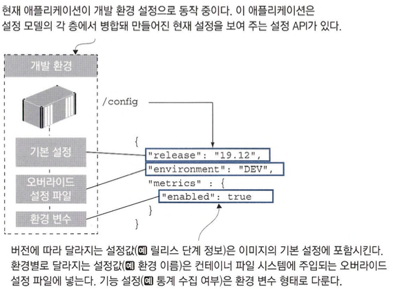
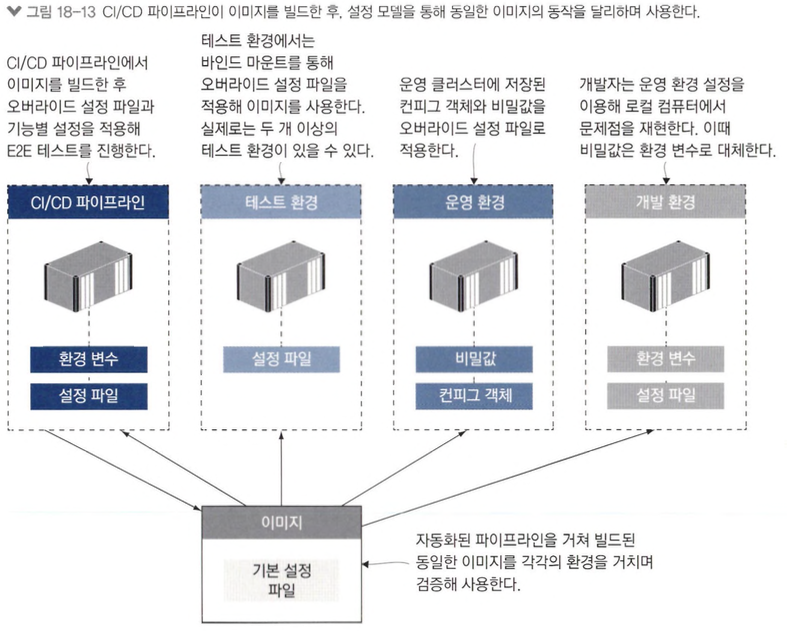

# 컨테이너의 애플리케이션 설정 관리

## 다단 애플리케이션 설정

- 설정 모델은 설정에 담긴 데이터의 구조를 반영하는데 설정 데이터의 종류는 주로 세가지입니다.
  - 버전에 따라 달라지는 설정 : 모든 환경에서 동일하지만 버전별로 달라지는 설정
  - 환경에 따라 달라지는 설정 : 환경별로 달라지는 설정
  - 기능 설정 : 버전별로 애플리케이션의 동작을 달리하기 위한 설정



```shell
docker run -dp 8080:80 diamol/ch18-access-log
docker run -dp 8081:80 -v "$(pwd)/config/dev:/app/config-override" diamol/ch18-access-log
curl http://localhost:8080/config
curl http://localhost:8081/config
```

- 예제 local.json을 주입하는 예제입니다.

```shell
docker run -dp 8082:80 -v "$(pwd)/config/dev:/app/config-override" -e NODE_CONFIG='{"metrics":{"enabled":"true"}}' diamol/ch18-access-log
curl http://localhost:8082/config
```

- 볼륨으로 마운트된 로컬 디렉터리의 오버라이드 설정 파일, 환경 변수를 병합해 만들어지는데 이런 구성은 개발자의 워크플로를 부드럽게 유지할 수 있는 좋은 사례입니다.

## 환경별 설정 패키징하기

```shell
docker run -dp 8083:80 diamol/ch18-todo-list
docker run -dp 8084:80 -e DOTNET_ENVIRONMENT=Test diamol/ch18-todo-list
```

- todo-list 애플리케이션을 각각 dev, test환경으로 실행하는 예제입니다.
- CI/CD 파이프라 인에서 설정 파일을 소스 코드로 가져와 이미지를 빌드하는 방법으로 개발과 설정 관리를 분리할 수 있습니다.
- 단점으로는 코드에 포함시킬수 없는 민감한 정보를 다룰수 없습니다.

```shell
docker run -dp 8085:80 -e DOTNET_ENVIRONMENT=Production -v "$(pwd)/config/prod-local:/app/config-override" diamol/ch18-todo-list
```

- override 설정파일로 로컬 데이터베이스를 사용하는 운영환경 컨테이너를 실행하는 예제입니다.

```shell
docker run -dp 8086:80 -e DOTNET_ENVIRONMENT=Production -e release=CUSTOM -v "$(pwd)/config/prod-local:/app/config-override" diamol/ch18-todo-list
```

- 앞선 예제와 같은 환경에 환경변수를 이용해 릴리즈를 CUSTOM으로 변경한 예제입니다.

## 런타임에서 설정 읽어 들이기

- Go lang 에서는 바이퍼라는 설정모듈이 널리쓰이는데 여기서 TOML(코드에서 편리하게 디렉터리를 지정할수 있기 때문에 JSON이나 YAML보다 가독성 면에서 좋다고함)이라는 문법으로 사용합니다.

```shell
docker run -dp 8086:80 diamol/ch18-image-gallery
curl http://localhost:8086/config
```

- 설정 변경없이 image-gallery 애플리케이션을 실행하고 config을 확인하는 예제입니다.
- 설정 API를 만들 때는 주의사항이 있습니다.
  - 전체 설정을 공개하지 않는다. 민감하지 않은 정보만 선택하되 민감한 정보는 절대 포함시키지 않는다.
  - 허가받은 사용자만이 접근할 수 있도록 엔드포인트에 보안을 설정한다.
  - 설정 API의 사용 여부를 설정 할 수 있도록 한다.

```shell
docker run -dp 8087:80 -v "$(pwd)/config/dev:/app/config-override" diamol/ch18-image-gallery
curl http://localhost:8087/config
```

- 환경별 오버라이드 설정파일을 병합해 완전한 개발 환경 설정하는 예제입니다.

```shell
docker run -dp 8088:80 -v "$(pwd)/config/dev:/app/config-override" -e IG_METRICS.ENABLED=TRUE diamol/ch18-image-gallery
curl http://localhost:8088/config
```

- 바이퍼 설정으로 컨테이너를 실행하는 예제입니다.
- IG라는 접두사는 바이퍼의 설정에 사용되는 환경 변수이름을 지을 때 다른 애플리케이션 환경변수랑 충돌나지 않게 하기 위함입니다.

## 레거시 애플리케이션에 설정 전략 적용하기

- 컨테이너에 주입된 설정 파일을 애플리케이션의 설정 전략에 맞춰 변환하는 유틸리티 또는 스크립트를 이미지에 포함시키는 방법이 있습니다.
  - 컨테이너에 지정된 오버라이드 설정 파일을 읽어 들이기
  - 환경 변수에서 오버라이드 설정을 읽어 들이기
  - 오버라이드 설정 파일과 환경 변수 설정을 병합하기. 이때. 환경 변수 값이 우선한다.
  - 병합된 오버라이드 설정을 컨테이너 내 대상 설정 파일에 추가한다.

```shell
docker run -dp 8089:80 diamol/ch18-image-of-the-day
docker run -dp 8090:80 -v "$(pwd)/config/dev:/config-override" -e CONFIG_SOURCE_PATH="/config-override/application.properties" diamol/ch18-image-of-the-day
curl http://localhost’8089/config
curl http://localhost’8090/config
```

- ch18-image-of-the-day 애플리케이션에 바인드 마운트로 주입된 오버라이드 설정파일을 적용해 실행하는 예제입니다.

```shell
docker run -dp 8091:80 -v "$(pwd)/config/dev:/config-override" -e CONFIG_SOURCE_PATH="/config-override/application.properties" -e IOTD_ENVIRONMENT="custom" diamol/ch18-image-of-the-day
curl http://localhost:8091/config
```

- 책에 저자가 만든 유틸리티를 이용한 config 주입 예쩨입니다.

```shell
docker-compose up -d
curl http://localhost:8030/config
curl http://localhost:8020/config
curl http://localhost:8010/config
```

- 도커 컴포즈를 이용해 설정을 주입하는 예제입니다.
- 도커 컴포즈 사용시 장점은 오버라이드 설정 파일의 경로만 변경 해 쉽게 환경별 설정을 바꿀 수 있다는 점입니다.

## 유연한 설정 모델의 이점



- 설정 모델을 적용하는 데 시간을 투자하면. 그림처럼 동일한 이미지로 모든 환경에서 애플리케이션을 동작시키는 결과로 확인할 수 있습니다.
