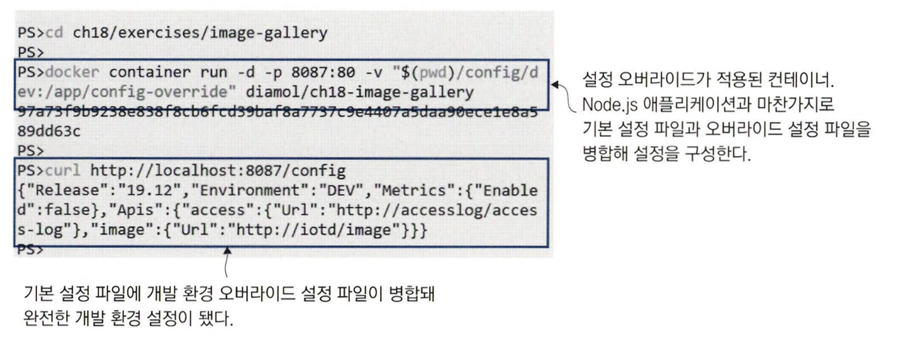
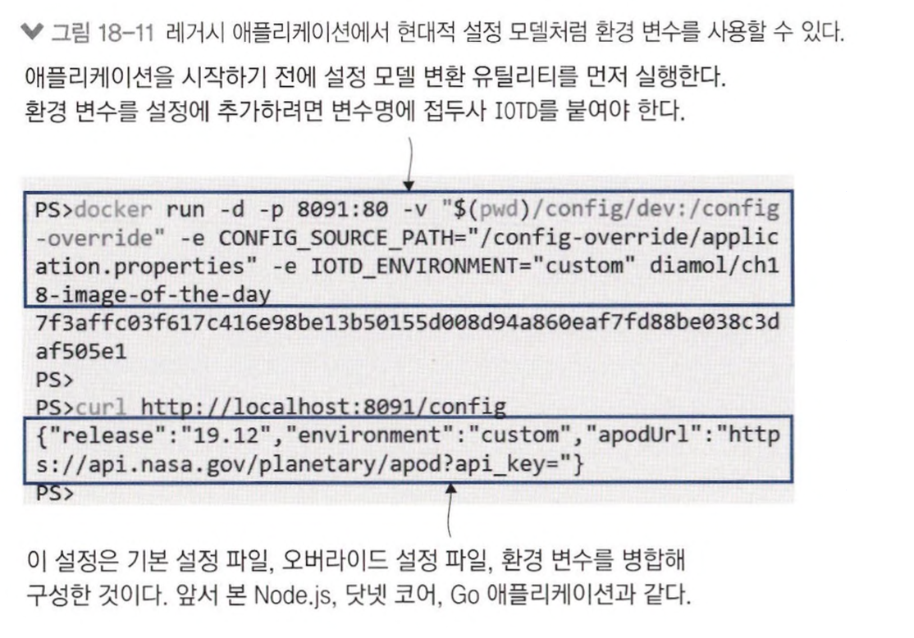

# 컨테이너의 애플리케이션 설정 관리

## 다단 애플리케이션 설정

설정 데이터의 종류는 세 가지다.

- **버전에 따라 달라지는 설정**: 모든 환경에서 동일하지만 버전별로 달라지는 설정
- **환경에 따라 달라지는 설정**: 환경별로 달라지는 설정
- **기능 설정**: 버전별로 애플리케이션의 동작을 달리하기 위한 설정


<br>

> 이미지에 포함된 기본 설정 파일, 볼륨으로 마운트된 로컬 디렉터리의 오버라이드 설정 파일, 환경 변수를 병합해 만드는 컨테이너는 <br>
> 개발자의 work flow를 부드럽게 만들어준다. 


<br>
<hr>

## 환경별 설정 패키징

여러 가지 애플리케이션 프레임워크에서 환경별 설정 파일을 모두 배포에 포함시킬 수 있는 기능을 제공한다. <br>
이 기능을 사용하면 애플리케이션을 실행할 때 환경 이름만 선택해도 해당 환경의 설정을 적용할 수 있다.

닷넷 코어는 다음과 같은 두 파일로부터 기본 설정값을 읽어 들이는 방식으로 구현돼 있다.

- **appsettings.json**: 모든 환경에 공통적으로 적용되는 설정
- **appsettings.{환경_이름}.json**: 환경별로 적용되는 오버라이드 설정 파일
- **환경 변수**: 환경 이름 정의 및 오버라이드 설정


```bash
# 기본 설정으로 실행
docker container run -d -p 8083:80 diamol/ch18-todo-list

# 테스트 환경 설정으로 실행
docker container run -d -p 8084:80 -e DOTNET_ENVIRONMENT=Test diamol/ch18-todo-list
```


설정 파일과 소스 코드를 별도의 시스템으로 관리한다면 이런 방법도 유용하다. <br>
CI/CD 파이프라인에서 설정 파일을 소스 코드로 가져와 이미지를 빌드하는 방법으로 개발과 설정 관리를 분리할 수 있다.

단점은 이미지에 포함시킬 수 없는 민감한 정보 때문에 여전히 외부에서 컨테이너에 주입해야 하는 정보가 남는다. <br>
레지스트리는 항상 외부에 노출될 위험이 있다고 가정하고 보안을 생각해야 한다.


<br>
<hr>


## 런타임에서 설정 읽어 들이기

GO 언어에서는 바이퍼라는 설정 모듈이 자주 쓰인다. <br>
패키지 목록에 바이퍼를 추가하고, 코드에서 오버라이드 파일을 읽어 올 설정 디렉터리를 지정하기만 하면 된다.

- 이미지에 포함된 config 디렉터리에서 기본 설정 파일을 읽어 들인다.
- 환경별 설정 파일은 config-override 디렉터리에서 읽어 들이는데, 이 디렉터리는 이미지에서는 빈 디렉터리며이며 파일 시스템 마운트로 외부에서 주입된다.
- 환경 변수는 설정 파일의 설정값을 오버라이드할 수 있다.


<br>

go 언어에서는 TOML이 주로 쓰인다.

```toml
release = "19.12"
environment = "UNKNOWN" 

[metrics]
enabled = true 

[apis]
[apis.image]
url = "http://iotd/image"

[apis.access]
url = "http://accesslog/access-log"
```

<br>


> 설정 API는 현재 설정 내용이 담긴 JSON 문자열을 반환한다. <br>
> 비밀값 등을 사용한 민감 정보를 API를 통해 아무나 보게 할 수는 없으니, 아래의 사항을 지켜야 한다.

- 전체 설정을 공개하지 않는다. 민감하지 않은 정보만 선택하되 민감한 정보는 절대 포함시키지 않는다.
- 허가받은 사용자만이 접근할 수 있도록 엔드포인트에 보안을 설정한다.
- 설정 API의 사용 여부를 설정할 수 있도록 한다.

<br>



<br>


<br>
<hr>

## 레거시 애플리케이션에 설정 전략 적용

레거시 애플리케이션은 환경 변수나 설정 파일 병합을 통한 설정 구성은 일반적으로 지원하지 않는다.

레거시 애플리케이션은 특정 경로에 위치한 XML 파일을 설정 파일로 사용하지만, <br>
애플리케이션 루트 디렉터리 외부에 위치한 설정 파일이나 환경 변수의 값을 설정에 도입할 수는 없다.

이를 컨테이너에 주입된 설정 파일을 애플리케이션의 설정 전략에 맞춰 변환하는 유틸리티 또는 스크립트를 이미지에 포함시켜서 해결할 수 있다.

1. 컨테이너에 지정된 오버라이드 설정 파일을 읽어 들이기
2. 환경 변수에서 오버라이드 설정을 읽어 들이기
3. 오버라이드 설정 파일과 환경 변수 설정을 병합하기. *(환경 변수 값이 우선한다.)*
4. 병합된 오버라이드 설정을 컨테이너 내 대상 설정 파일에 추가한다.

<br>

```bash
# 기본 설정으로 실행
docker container run -d -p 8089:80 diamol/ch18-image-of-the-day

# 바인드 마운트로 주입된 오버라이드 설정 파일을 적용해 실행
docker container run -d -p 809O:8O -v "$(pwd)/config/dev:/configoverride" -e CONFIG. S0URCE_PATH="/configoverride/application.properties" diamol/ch18-image-of-the-day
```


<br>

```
# 설정 변환 유틸리티의 빌드 및 실행 스크립트


FROM diamol/maven AS builder
RUN mvn package

# 설정 변환 유틸리티
FROM diamol/maven as utility-builder
WORKDIR /usr/src/utilities
COPY ./src/utilities/ConfigLoader.java . 
RUN javac ConfigLoader.java

# 애플리케이션
FROM diamol/openjdk
ENV CONFIG_SOURCE_PATH="" \
    C0NFIG_TARGET_PATH='7app/config/application.properties"
    
CMD java ConfigLoader && \
    java -jar /app/iotd-service-0.1.0.jar
    
WORKDIR /app
COPY --from=utility-builder /usr/src/utilities/ConfigLoader.class .
COPY —from=builder /usr/src/iotd/target/iotd-service-0.1.0.jar .
```

> 도커 이미지를 확장해 기존 애플리케이션에 현대적 설정 모델을 도입할 수 있다. <br>
> 애플리케이션 시작 로직을 수정해 실제 애플리케이션이 실행되기 전에 원하는 작업을 수행할 수 있다.
> 다만, 이 작업으로 인해 컨테이너 시작과 애플리케이션 실행 사이에 시간 간격이 생기며, 컨테이너가 실패할 확률도 높아진다. <br>
> 그래서 항상 헬스 체크를 적용해야 한다.



<br>
<hr>

## 유연한 설정 모델의 장점

**계층별 설정 모델은 애플리케이션의 동작은 각 환경마다 조금씩 다르게 하면서도 단일 이미지 원칙을 유지할 수 있게 해 준다.**

실무에서는 버전에 따라 달라지는 설정은 이미지에 포함시키고, <br>
환경별로 달라지는 설정은 컨테이너 플랫폼에서 제공하는 오버라이드 파일을 통해 적용하고, <br>
환경 변수를 통해 통제하는 기능별 설정도 덧붙일 수 있다.

이러한 설정 모델을 적용하면 운영 환경 이슈에 대응하기 좋다. *(로그 레벨을 낮추거나 보안상의 허점이 되는 기능을 비활성화한다거나)* <br>
또 개발자의 로컬 컴퓨터에서 운영 환경과 유사한 환경을 만들어 버그를 쉽게 재현할 수도 있다.


