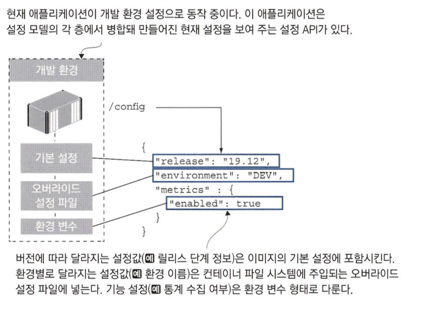
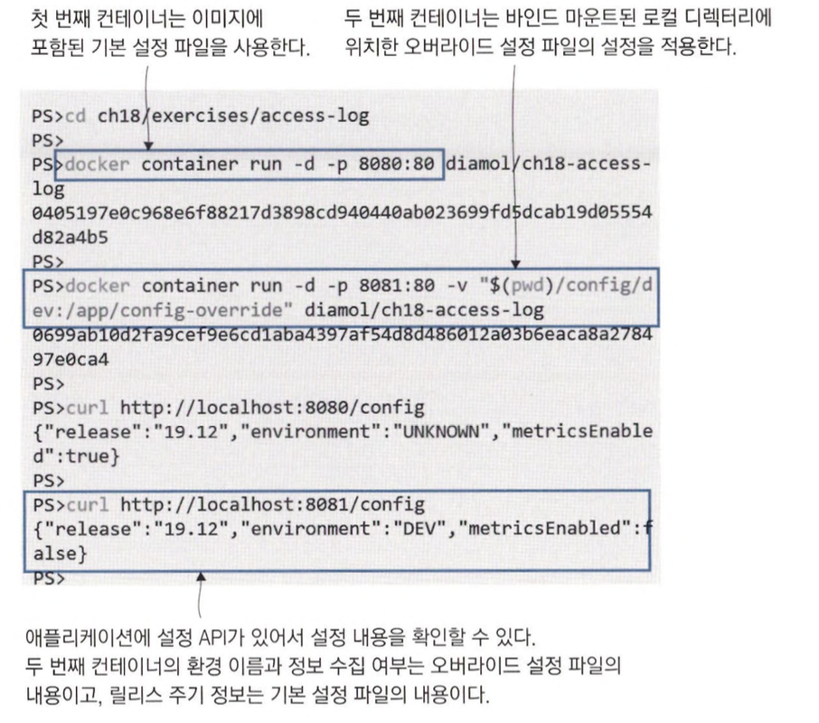
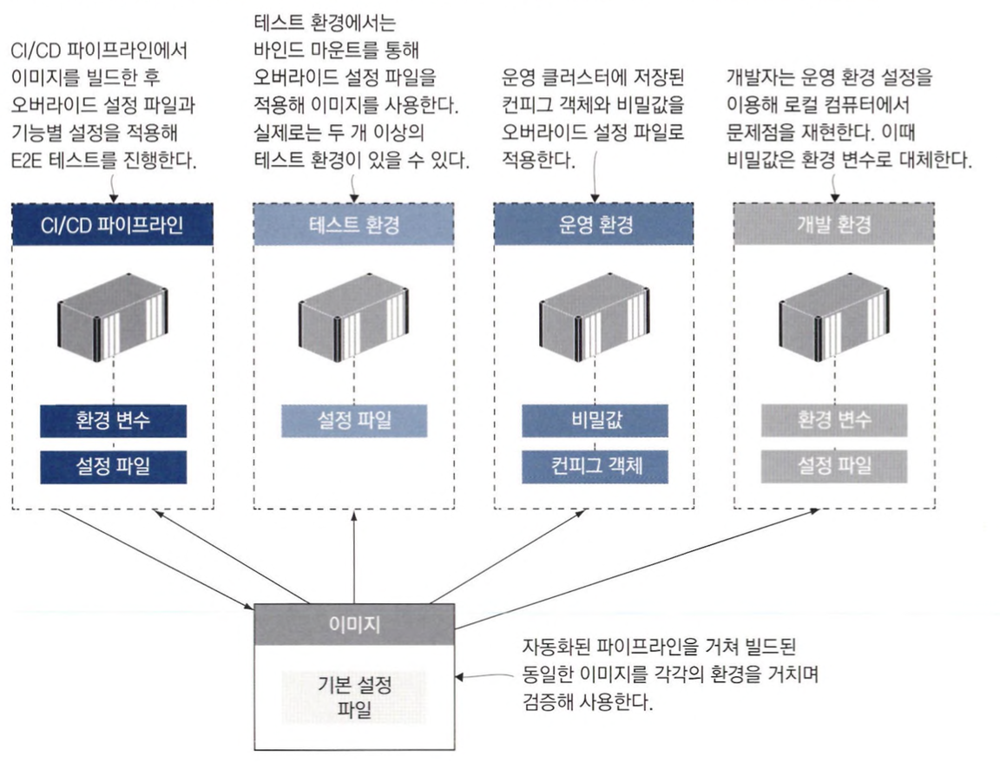

# 컨테이너의 애플리케이션 설정 관리

## 다단 애플리케이션 설정

### 설정 데이터의 종류

- 버전에 따라 달라지는 설정
    - 모든 환경에서 동일하지만 버전별로 달라지는 설정
- 환경에 따라 달라지는 설정
    - 환경별로 달라지는 설정
- 기능 설정
    - 버전 별로 애플리케이션의 동작을 달리하기 위한 설정

### 애플리케이션에 주입되는 설정 예시



오버라이드 설정 파일을 이용하면 어떤 경로로든 컨테이너 파일 시스템에 설정 파일을 주입하기만 하면 해당 설정을 적용할 수 있습니다.



## 환경별 설정 패키징하기

### 설정 파일과 소스 코드를 별도로 관리할때 장단점

- 장점
  - 개발과 설정 관리를 분리할 수 있습니다.
- 단점
  - 이미지에 포함시킬 수 없는 민감한 정보 때문에 여전히 외부에서 주입해야 할 정보가 남습니다.

### 도커 이미지에 설정 파일을 모두 포함시키는 방법

이미지에 모든 설정 파일을 포함시키는 방법은 여러 애플리케이션에서 자주 사용되는 방법이지만 다음과 같은 문제가 발생할 수 있습니다.

- 이미지에 들어가는 설정 정보들이 해커에게 유용한 정보가 될 수 있습니다.
- 모든 잠재적 민감정보를 오버라이드 파일로 옮기면 이미지에 포함시킬 수 있는 정보가 많지 않습니다.
- 설정 정보가 소스 코드 형상관리와 설정 관리로 이원화되는 문제가 발생합니다.

## 런타임에서 설정 읽어 들이기

### Viper

Go 언어 같은 경우에는 Viper라는 모듈이 많이 사용됩니다.

다음과 같은 방식으로 적용됩니다.

- 이미지에 포함된 config 디렉터리에서 기본 설정 파일을 읽어 들입니다.
- 환경별 설정 파일은 config-override 디렉터리에서 읽어 들이는데, 이 디렉터리는 이미지에서는 빈 디렉터리이며, 파일 시스템 마운트로 외부에서 주입됩니다.
- 환경 변수는 설정 파일의 설정값을 오버라이드할 수 있습니다.

### TOML

viper는 TOML이라는 형식을 사용할 수 있습니다.

TOML은 다음과 같은 장점을 가집니다.

- 간결성과 가독성
  - 구조가 간결하기 때문에 개발자가 설정을 이해하고 수정하기도 쉽고 디버깅하기도 간단합니다.
- 타입 안전성
  - 명확한 데이터 타입 시스템을 제공하기 때문에 타입 오류를 최소화할 수 있습니다.
- 계층적 구조
  - 복잡한 데이터와 설정을 표시하기 좋습니다.
- 표준화
  - 잘 정의된 명세를 가지고 있으며, 표준화된 방식으로 사용할 수 있습니다.

다음은 TOML 형식으로 사용된 애플리케이션 설정 예시입니다.

```toml
release = "19.12"
environment = "UNKNOWN"

[metrics]
enabled = true

[apis]

[apis.image]
url = "http://iotd/image"

[apis.access]
url = "http://accesslog/access-log"
```

### 설정 정보를 반환하는 API를 만들때 주의할 점

- 전체 설정을 공개하지 않는다.
  - 민감하지 않은 정보만 선택하되 민감한 정보는 절대 포함시키지 않습니다.
- 허가받은 사용자만이 접근할 수 있도록 엔드포인트에 보안을 설정한다.
- 설정 API의 사용 여부를 설정할 수 있도록 합니다

## 레거시 애플리케이션에 설정 전략 사용하기

컨테이너에 주입된 설정 파일을 애플리케이션 설정 전략에 맞춰 변환하는 유틸리티 또는 스크립트를 이미지에 포함시키는 방법입니다.

1. 컨테이너에 지정된 오버라이드 설정 파일을 읽어 들이기
2. 환경 변수에서 오버라이드 설정을 읽어 들이기
3. 오버라이드 설정 파일과 환경 변수 설정을 병합하기, 이때 환경 변수 값이 우선됨
4. 병합된 오버라이드 설정을 컨테이너 내 대상 설정 파일에 추가하기

## 유연한 설정 모델의 이점

계층별 설정 모델은 애플리케이션의 동작을 각 환경마다 조금씩 다르게하면서도 단일 이미지 원칙을 유지할 수 있게 해줍니다.

이러한 설정 모델을 통해 다음과 같은 점을 얻을 수 있습니다.

- 운영 환경 이슈에 빠르게 대응할 수 있습니다.
  - 로그로 인해 성능이 저하될 경우 로그 수준을 낮춰줄 수 있습니다.
  - 보안상의 허점이 되는 기능을 빠르게 비활성화할 수 있습니다.

