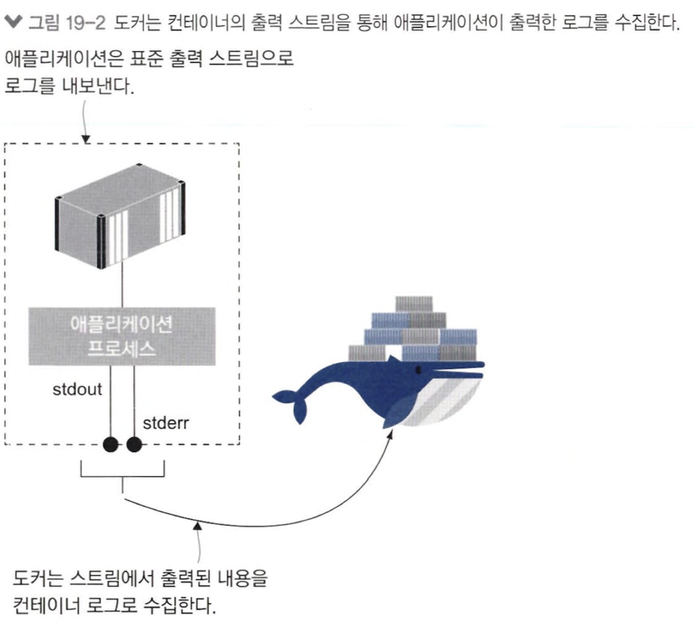
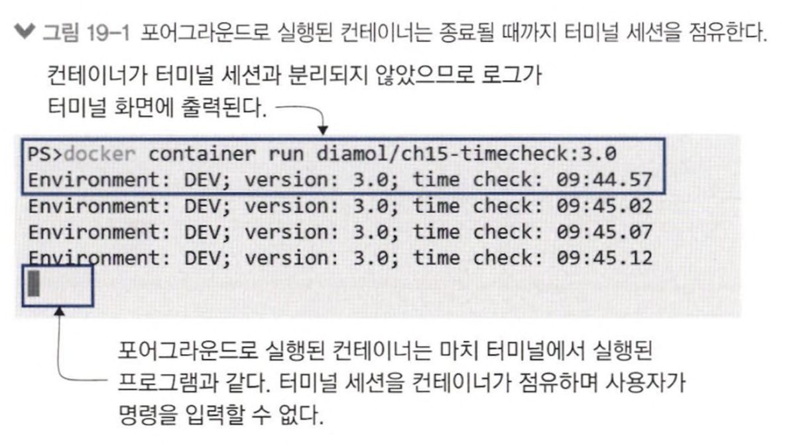
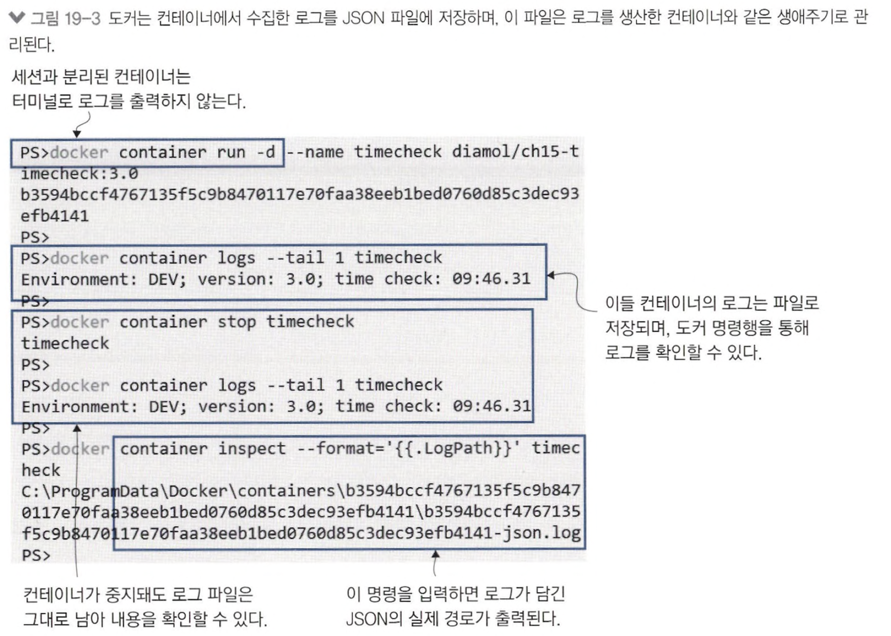
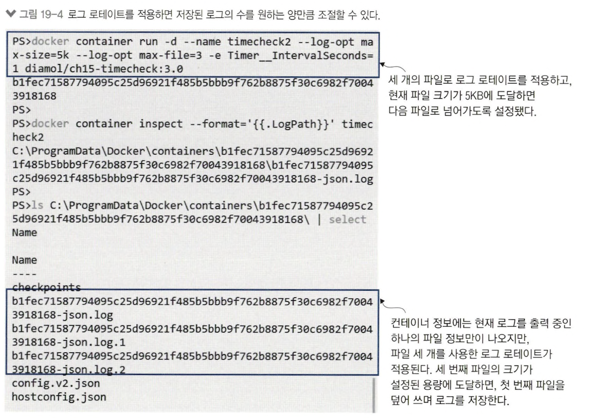
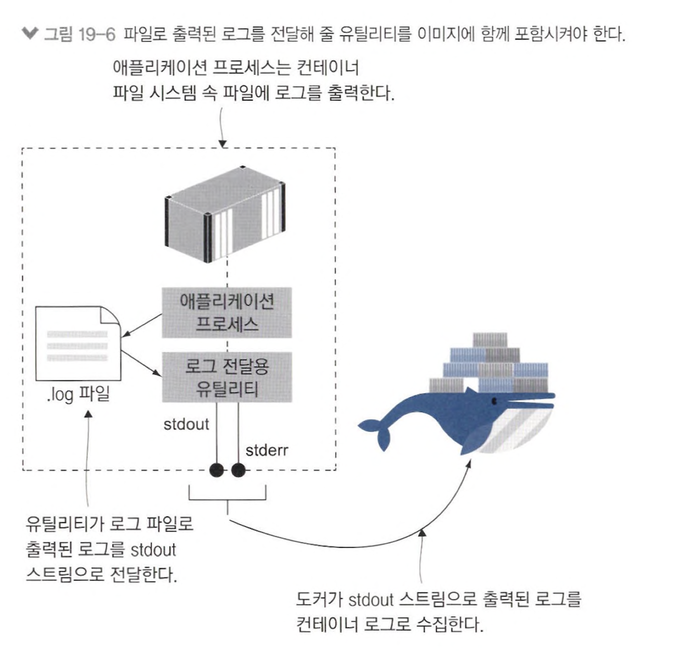
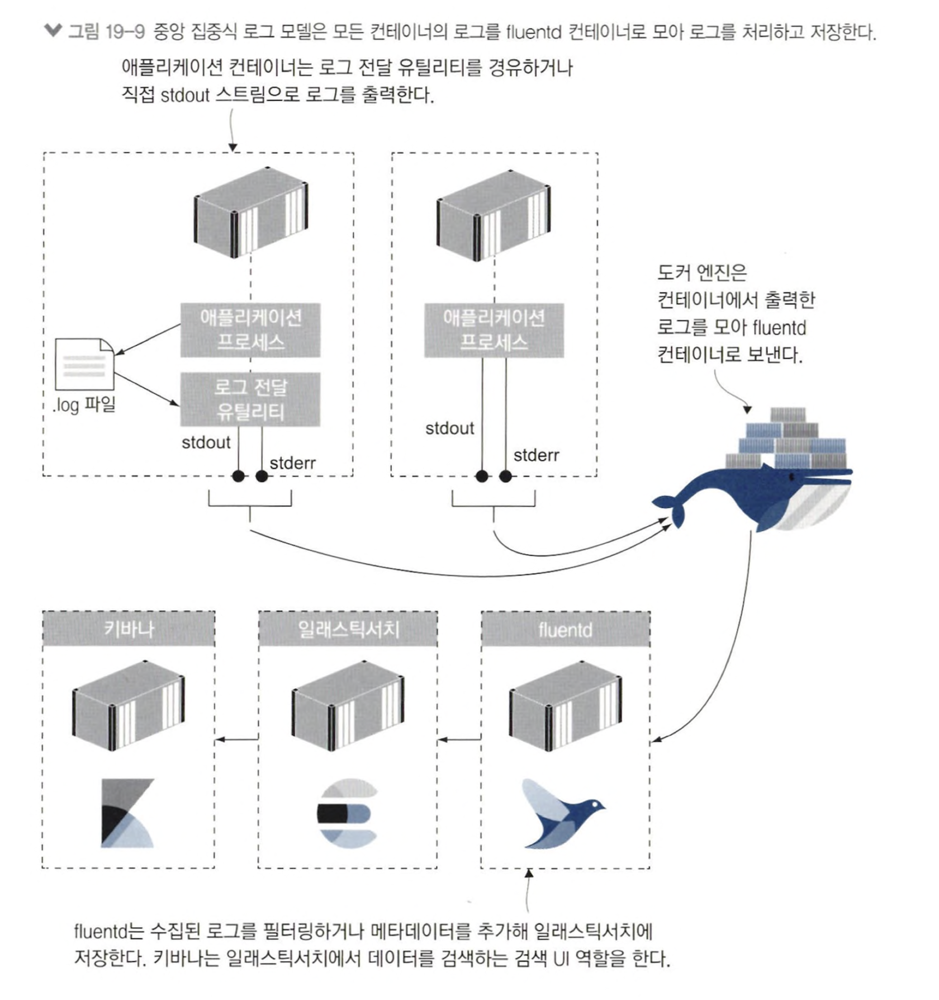
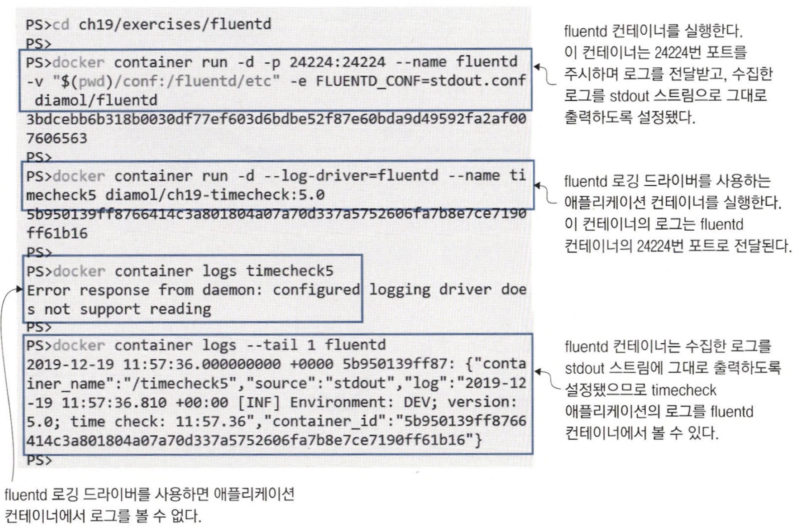
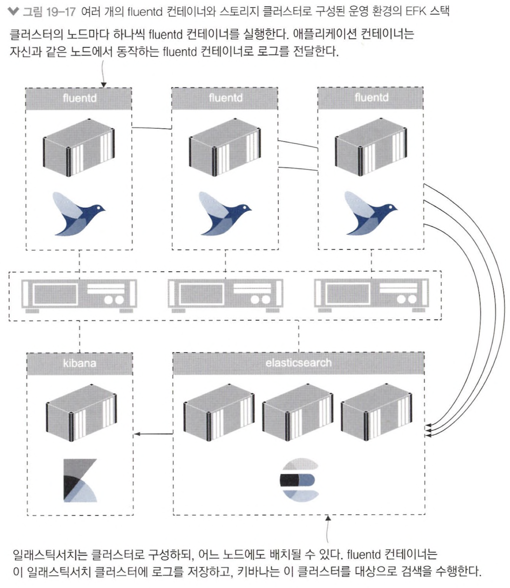

# 19장 도커를 이용한 로그 생성 및 관리

## 19.1 표준 에러 스트림과 표준 출력 스트림



- 프로세스에서 생성한 로그 stdout(= 표준 출력), stderr(= 표준 오류) 출력

```shell
# container foreground 실행
docker container run diamol/ch15-timecheck:3.0
```



- foreground로 실행되어 컨테이너 앱이 터미널 세션 점유

```shell
# container background 실행
docker container run -d --name timecheck diamol/ch15-timecheck:3.0

# container 중지 후 로그 확인
docker container stop timecheck
docker container logs --tail 1 timecheck
```



- background로 실행되어 컨테이너 앱이 터미널에 로그 출력 x
- 컨테이너 중지돼도 로그 파일 저장

```shell
docker container run -d --name timecheck2 --log-opt max-size=5k --log-opt max-file=3 -e Timer__IntervalSeconds=1 diamol/ch15-timecheck:3.0
```



- `max-size` : 최대 로그 파일 크기 5KB
- `max-file` : 3개 파일로 [log rotate](http://www.chlux.co.kr/bbs/board.php?bo_table=board02&wr_id=91&sca=OS&page=3)

## 19.2 다른 곳으로 출력된 로그를 stdout 스트림에 전달하기



## 19.3 컨테이너 로그 수집 및 포워딩하기

> fluentd로 전체 애플리케이션 로그 수집

#### ref) [다양한 로그 수집 서비스 비교 분석 (ELK, Fluentd, Datadog, Rollbar, Sentry)](https://velog.io/@thankspotato/%EB%8B%A4%EC%96%91%ED%95%9C-%EB%A1%9C%EA%B7%B8-%EC%88%98%EC%A7%91%EA%B8%B0-%EB%B9%84%EA%B5%90-%EB%B6%84%EC%84%9D-ELK-Fluentd-Datadog-Sentry)





## 19.4 로그 출력 및 로그 컬렉션 관리하기

```xml
<match gallary.access-log.**>
    @type copy
    <store>
        @type stdout
    </store>
</match>
<match gallery.**>
    @type copy
    <store>
    @type elasticsearch
...
```

- access-log 컴포넌트 필터링
- 필터링된 로그 &rarr; stdout
- 나머지 로그 &rarr; elasticsearch

## 19리.5 컨테이너의 로깅 모델

