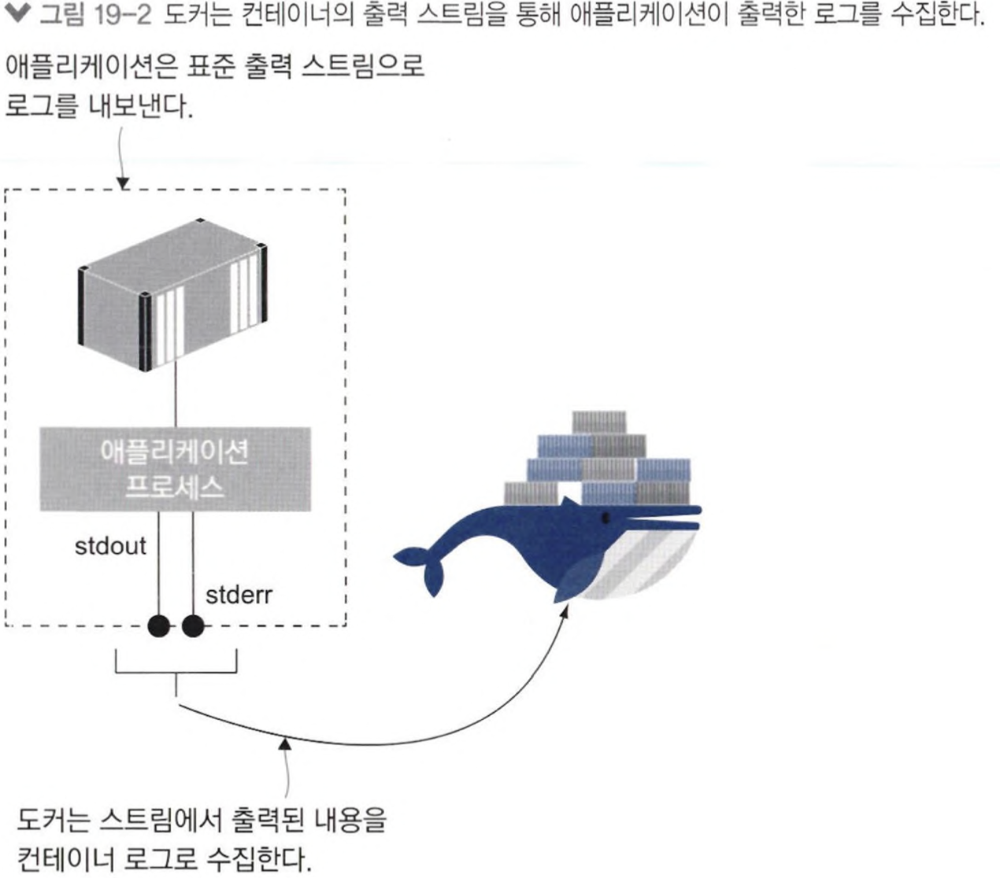
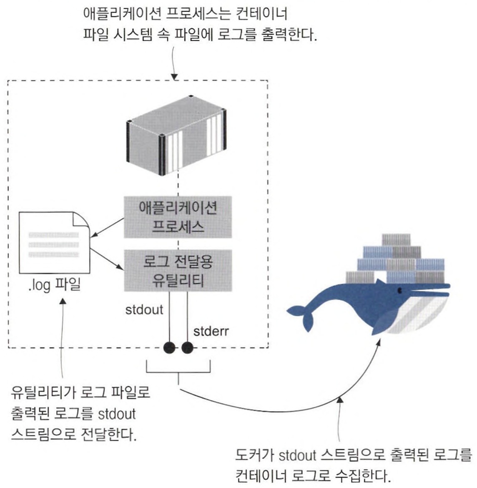
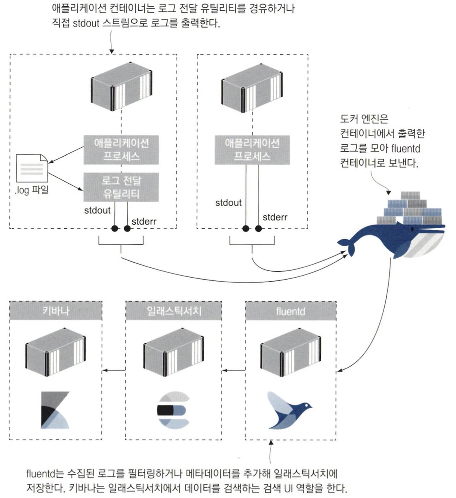
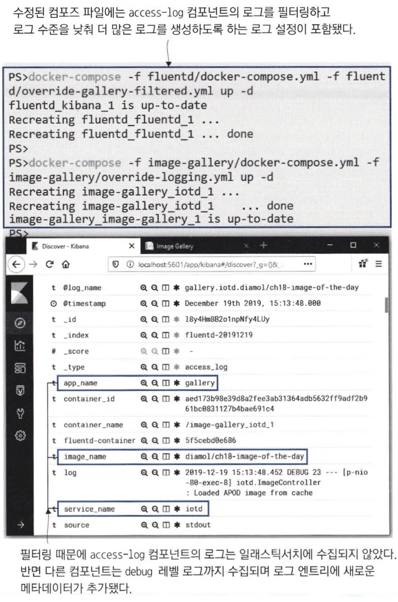
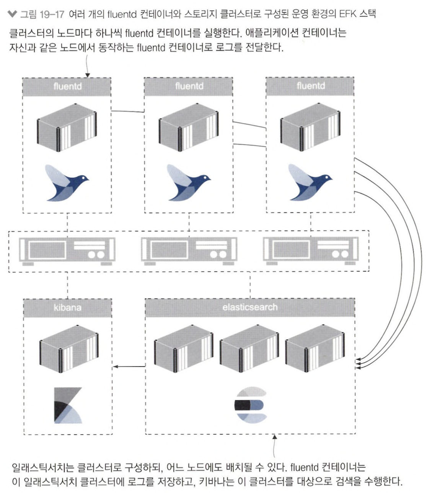

# 19장 도커를 이용한 로그 생성 및 관리

## 19.1 표준 에러 스트림과 표준 출력 스트림

컨테이너 실행 시 실행된 프로세스에서 생성된 로그 엔트리는 표준 출력(stdout) 및 표준 오류(stderr) 스트림으로 출력된다. 도커는 각 컨테이너의 stdout과 stderr 스트림을 주시하며 스트림을 통해 출력되는 내용을 수집한다.



📌 터미널 세션과 분리된 컨테이너와 종료된 컨테이너의 로그를 수집할 수 있도록 로그를 JSON 파일로도 저장한다.

- JSON 파일은 컨테이너와 동일한 생애주기를 갖는다.

```bash
$ docker container logs --tail 1 timecheck
Environment: DEV; version: 3.0; time check: 12:02.51

$ docker container inspect --format='{{.LogPath}}' timecheck
/var/lib/docker/containers/7da3349ab27ab20b0135cad7b2ed9f6c059ea4b076521e03348022b0c07f600e/7da3349ab27ab20b0135cad7b2ed9f6c059ea4b076521e03348022b0c07f600e-json.log
```

📌 로그 파일에 롤링을 적용하면 설정된 파일 용량에 도달한 후 새 파일에 로그를 다시 수집한다.

- 컨테이너별 로그 설정을 두어 별개로 로그 파일의 크기와 롤링 파일 개수를 조절할 수 있다.

```bash
$ docker container run -d --name timecheck2 --log-opt max-size=5k --log-opt max-file=3 -e Timer_IntervalSeconds=1 diamol/ch15-timecheck:3.0
c6003a73af9f2a6c7f46cb398fe73073bdc33be6b018a3ce6d1c93596c701624
```

---

## 19.2 다른 곳으로 출력된 로그를 stdout 스트림에 전달하기

다른 곳으로 출력된 로그 파일의 내용을 읽어 표준 출력으로 내보내 주는 별도의 프로세스를 컨테이너 시작 명령어에서 실행한다.



### 주의해야할 점

- 로그 전달용 유틸리티는 포어그라운드로 동작한다.
    - 이 프로세스가 종료되면 애플리케이션과 함께 컨테이너가 종료된다.
- 애플리케이션이 종료돼도 포어그라운드로 동작 중인 로그 전달 유틸리티가 계속 실행해 컨테이너도 그래도 실행된다.
- 디스크 사용 효율이 떨어진다.

📌 로그 전달 유틸리티를 사용한 애플리케이션 빌드

- tail은 로그 파일을 감시하다가 새로운 내용이 추가되면 그때마다 해당 내용을 stdout 스트림으로 전달해 컨테이너 로그로 수집되도록 하는 역할을 한다.

```bash
# 애플리케이션 이미지
FROM diamol/dotnet-runtime AS base
...
WORKDIR /app
COPY --from=builder /out/ .
COPY --from=utility /out/ .

FROM base AS linux
CMD dotnet TimeCheck.dll & dotnet Tail.dll /logs timecheck.log
```

---

## 19.3 컨테이너 로그 수집 및 포워딩하기

### 통합 로깅 계층

- `fluentd` 는 통합 로깅 계층이다.
- 다양한 곳에서 생성되는 로그를 모은다.
- 필터링과 가공을 거쳐 다시 여러 대상으로 수집된 로그를 포워딩 한다.

### fluentd 적용하기

- fluentd를 컨테이너로 실행한다.
- 다른 컨테이너에서 일반적인 JSON 파일 대신 fluentd 로깅 드라이버를 사용하도록 한다.

```bash
# 설정 파일과 표준 포트를 적용한 fluentd 컨테이너를 실행
$ docker container run -d -p 24224:24224 --name fluentd -v "$(pwd)/conf:/fluentd/etc" -e FLUENTD_CONF=stdout.conf diamol/fluentd

# fluentd 로그 드라이버가 설정된 timecheck 애플리케이션 컨테이너 실행
$ docker container run -d --log-driver=fluentd --name timecheck5 diamol/ch19-timecheck:5.0

# fluentd 컨테이너의 로그를 확인
$ docker container logs --tail 1 fluentd
2023-07-09 12:54:06.000000000 +0000 e18e3c224d83: {"container_id":"e18e3c224d833eb25924102661ad61fcc2a9b1034a64031b1b35e87547bc9ecf","container_name":"/timecheck5","source":"stdout","log":"2023-07-09 12:54:06.470 +00:00 [INF] Environment: DEV; version: 5.0; time check: 12:54.06"}
```

### fluentd란?

- 컨테이너 ID와 이름 등 메타데이터를 추가로 저장한다.
- fluentd 수집된 로그 → 중앙 데이터 스토어 (elasticsearch)
- 중앙 데이터 스토어 → 로그 검색 UI 및 기능 제공하는 키바나 (Kibana)



📌 fluentd에서 로그에 태그를 추가하려면 간단히 로깅 드라이버에 설정을 추가하면 된다.

```bash
services:
	accesslog:
		image: diamol/ch18-access-log
		logging:
			driver: "fluentd"
			options:
				tag: "gallery.access-log.{{.ImageName}}"

	iotd:
	    image: diamol/ch18-image-of-the-day
	    logging:
	      driver: "fluentd"
	      options:
	        tag: "gallery.iotd.{{.ImageName}}"			
	
	image-gallery:
	    image: diamol/ch18-image-gallery
	    logging:
	      driver: "fluentd"
	      options:
	        tag: "gallery.image-gallery.{{.ImageName}}"
```

---

## 19.4 로그 출력 및 로그 컬렉션 관리하기

로그 필터링은 fluentd 설정 파일에서 정의할 수 있다. 

- 이 방법은 애플리케이션의 핵심 로그와 있으면 좋은 정도의 로그를 분리하는 데 유용하다.

다음의 예에서 필터링된 로그는 stdout 스트림으로 출력되고, 나머지 로그는 일래스틱 서치로 전달된다.

- 이 로그 설정을 적용하면 access-log에서 생성된 로그는 첫 번째 match 블록과 태그가 일치하므로 일래스틱서치로 전달되는 대신 fluentd 컨테이너의 로그에서만 볼 수 있다.

```bash
<match gallery.access-log.**>
  @type copy
  <store>
    @type stdout
  </store>
</match>
<match gallery.**>
  @type copy
  <store>
    @type elasticsearch
    ...
  </store>
</match>
```



📌 애플리케이션 수정 없이 fluentd 설정만 수정하면 access-log 컴포넌트의 로그를 다시 앨래스틱서치에 저장할 수 있다.

- 이 방법은 일부 로그가 유실될 수 있다는 점을 유념해야 한다.
- fluentd를 새로운 설정으로 재배포 하는 동안, 컨테이너가 생성한 로그를 수집되지 못하기 때문이다.

---

## 19.5 컨테이너의 로깅 모델

도커의 로깅 모델은 매우 유연성이 뛰어나지만, 이 유연성은 애플리케이션 로그를 컨테이너 로그로 내보낼 때만 적용된다. 



어떤 조직은 애플리케이션 로그를 컨테이너 로그와 fluentd 컨테이너를 거치지 않고 바로 최종 저장소인 일래스틱서치에 저장하는 것을 선호하기도 한다.

애플리케이션이 특정 로깅 기술에 의존하게 되므로 차후 그레이로그나 스플렁크로 전환할 때 애플리케이션 수정이 불가피해진다.