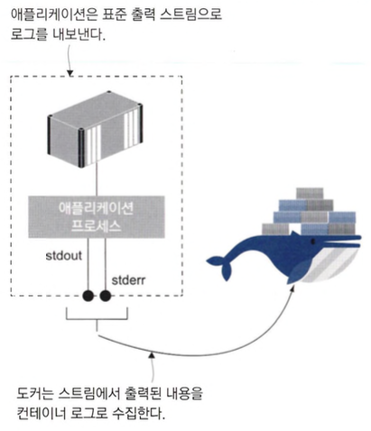
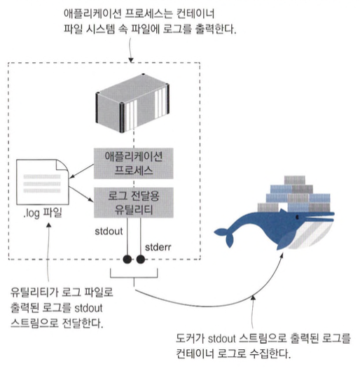
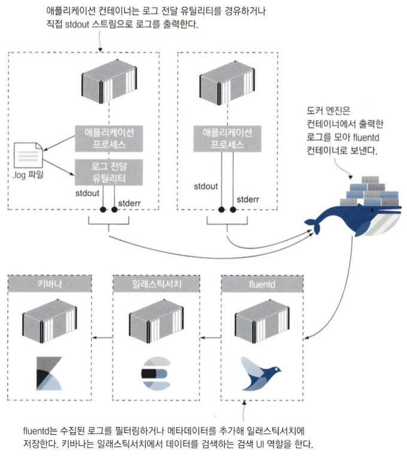
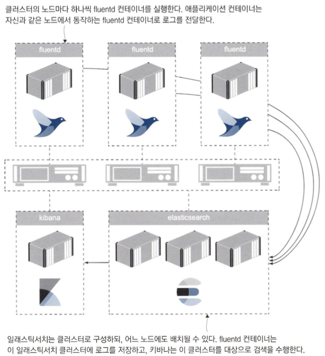

# 도커를 이용한 로그생성 및 관리

- 도커는 표준 출력 스트림을 통해 로그를 수집하기 때문에 애플리케이션의 로그가 표준 출력 스트림으로 출력되고 있는지만 확인하면 됩니다.

## 표준 에러 스트림과 표준 출력 스트림

- 실행된 프로세 스에서 생성한 로그 엔트리는 표준 출력(stdout) 및 표준 오류(stderr) 스트림으로 출력됩니다.

```shell
docker run diamol/ch15-timecheck:3.0
```

- 몇초에 한번씩 현재 시각을 stdout으로 출력하는 예제입니다.



- 터미널 세션과 분리된 컨테이너와 종료된 컨테이너의 로그를 수집할 수 있도록 로그를 JSON 파일로도 저장합니다.

```shell
docker run -d --name timecheck diamol/ch15-timecheck:3.0
docker logs --tail 1 timecheck
docker stop timecheck
docker logs --tail 1 timecheck
docker inspect --format='{{.LogPath}}' timecheck
```

- 백그라운드로 예제 컨테이너를 실행하고 로그 저장 경로를 확인하는 예제입니다.
- 도커 데스크톱으로 리눅스 컨테이너를 실행 중이라면. 도커 엔진이 별도로 관리되는 가상 머신 안에서 실행됩니다. 따라서 위 예제의 로그 파일 경로는 가상 머신 내부의 경로이므로 직접 접근할 수 없습니다.
- 기본적으로 컨테이너마다 JSON 로그 파일 하나가 생성되며 따로 설정하지 않으면 디스크용량이 찰 떄가지 파일 크기가 증가합니다.
- 로그 파일에 롤링을 적용하면 설정된 파일 용량에 도달한 후 새 파일에 로그를 다시 수집하게 됩니다.
- 최대 파일 개수를 설정해 오래된 파일부터 덮어 쓸 수도 있습니다.

```shell
docker run -d --name timecheck2 --log-opt max-size=5k --log-opt max-file=3 -e Timer_IntervalSeconds=1 diamol/ch15-timecheck:3.0
docker inspect --format='{{.LogPath}}' timecheck2
```

- 로그 파일 개수 및 크기 지정하는 예제입니다.

## 다른 곳으로 출력된 로그를 stdout 스트림에 전달하기

- 윈도 서비스 또는 리눅스 데몬, 리눅스의 syslog나 윈도의 이벤트 로그(싱크)같은 경우 컨테이너 시작 프로세스에서 출력되는 로그가 없으므로 도커가 로그를 수집하지 못합니다.

```shell
# 수정된 애플리케이션 실행하기
docker run -d --name timecheck3 diamol/ch19-timecheck:4.0
docker logs timecheck3
docker exec -it timecheck3 sh
cat /logs/timecheck.log
```

- 로그가 출력되지만 수집되지 않는 컨테이너 예제입니다.



- 로그 전달용 유틸리티는 포어그라운드로 동작하므로 이 프로세스가 종료되면 애플리케이션과 함께 컨테이너까지 종료되기 때문에 유틸리티는 오류를 일으키지 않도록 세심하게 작성해야합니다.
- 애플리케이션이 오류로 종료돼도 포어그라운드로 동작 중인 로그 전달 유틸리티가 계속 실행 중이므로 컨테이너도 그대로 실행되므로 헬스 체크를 적용하지 않는 한 컨테이너의 이상 상태를 감지할 수 없습니다.
- 이 방법은 디스크 효울이 떨어집니다.

```shell
docker container run -d --name timecheck4 diamol/ch19-timecheck:5.0
docker container logs timecheck4
docker container exec -it timecheck4 sh
cat /logs/timecheck.log
```

- 로그 전달 유틸리티를 이용한 예제입니다.

## 컨테이너 로그 수집 및 포워딩하기

- 로깅 시스템인 fluentd라는 오픈 소스가 있습니다.

```shell
docker run -dp 24224:24224 --name fluentd -v "$(pwd)/conf:/fluentd/etc" -e FLUENTD_CONF=stdout.conf diamol/fluentd
docker run -d --log-driver=fluentd --name timecheck5 diamol/ch19-timecheck:5.0
docker logs timecheck5
docker logs --tail 1 fluentd
```

- fluentd를 사용한 예제입니다.



```shell
docker-compose -f fluentd/docker-compose.yml up -d
docker run -d --log-driver=fluentd diamol/ch19-timecheck:5.0
```

- 엘라스틱서치랑 키바나를 이용한 로그 수집예제입니다. (안됨)

```shell
docker-compose -f image-gallery/docker-compose.yml up -d
```

- fluentd로 로깅하는 예제이지만 이것도 안됩니다...
- 기본 로깅 드라이버는 도커 엔진 설정으로 지정하지만, 애플 리케이션 매니페스트에서 로깅 시스템을 명시적으로 지정하는 편이 더 좋습니다.

## 로그 출력 및 로그 컬렉션 관리하기

```shell
docker-compose -f fluentd/docker-compose.yml -f fluentd/override-gallery-filtered.yml up -d
docker-compose -f image-gallery/docker-compose.yml -f image-gallery/override-logging.yml up -d
```

- 설정을 변경하여 fluentd로 로깅하는 예제이지만 이것도 안됩니다...

```shell
docker logs --tail 1 fluentd-fluentd-1
```

- fluentd로 로그 연결 확인하려했지만 retry만 출력

```shell
docker-compose -f fluentd/docker-compose.yml -f fluentd/override-gallery.yml up -d
```

- 모든 로그가 일래스틱서치에 저장하는 예제입니다.
- 새로운 설정으로 재배포하는 동안. 컨테이너가 생성한 로그가 수집되지 못하기 때문에 로그가 유실될 가능성이 있습니다.

## 컨테이너의 로깅 모델

- 애플리케이션 로그가 컨테이너 로그로 출력돼야 로그를 원하는 대로 다룰 수 있기 때문에 모든 애플리케이션 로그는 컨테이너 로그로 출력하는 것이 좋습니다.


