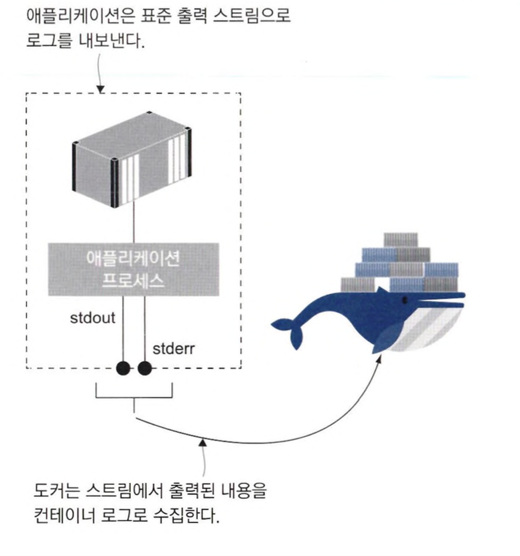
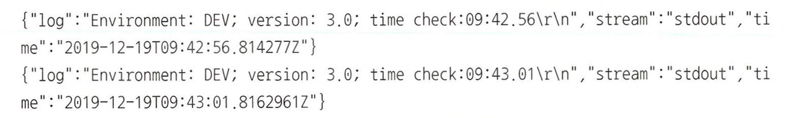
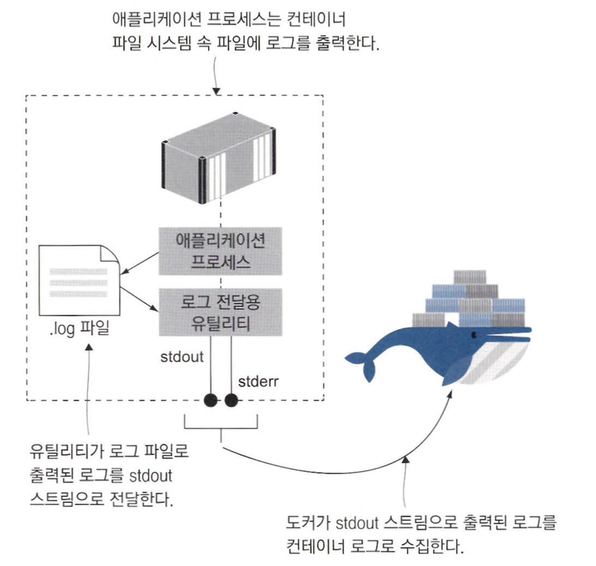
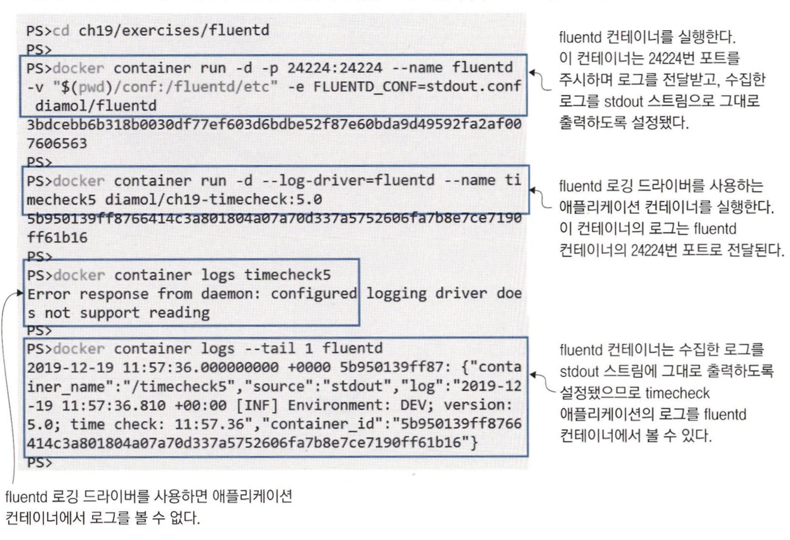
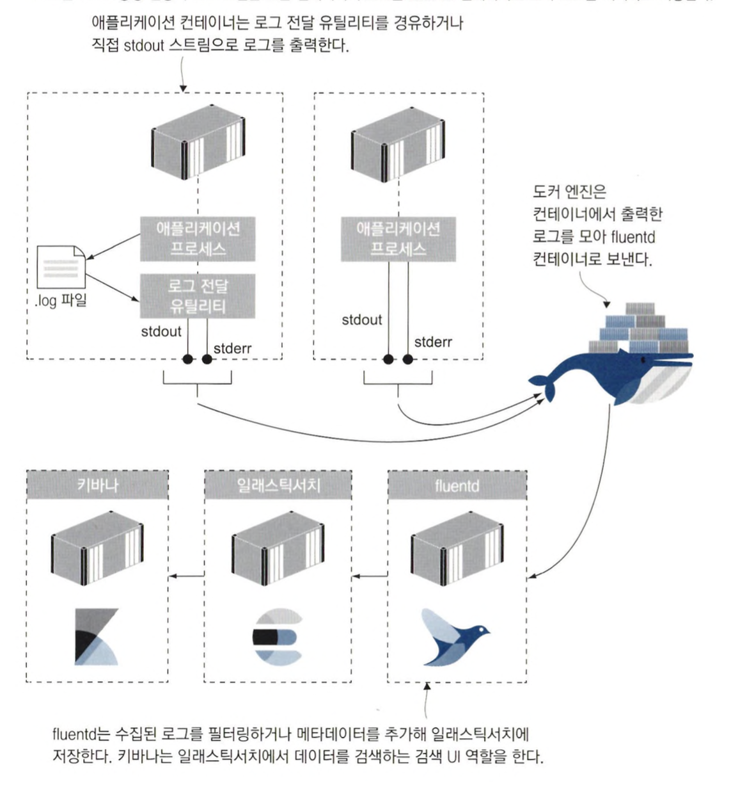
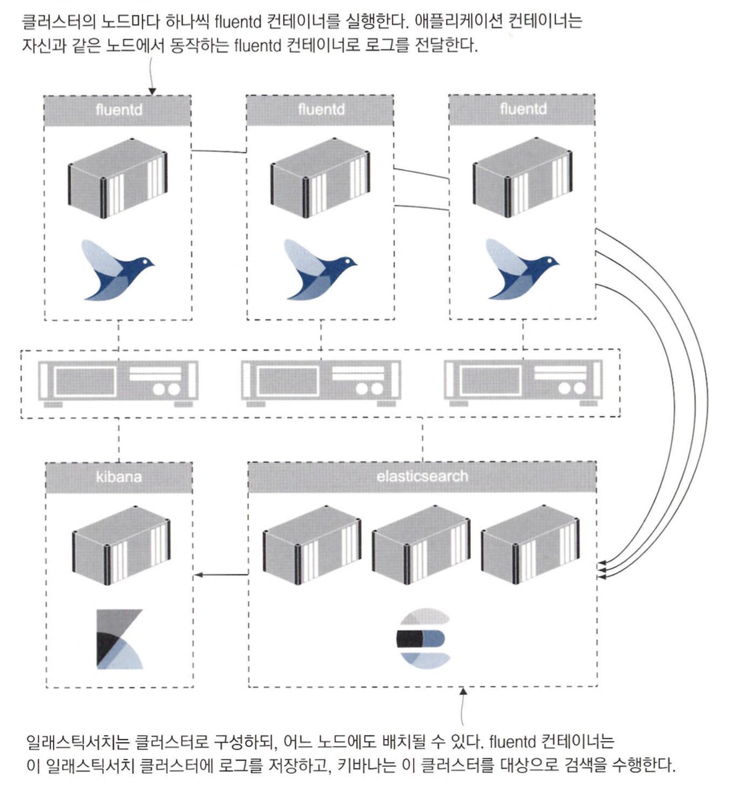

# 도커를 이용한 로그 생성 및 관리

<br>

## 표준 에러 스트림과 표준 출력 스트림

도커 이미지는 애플리케이션 바이너리 및 의존성, 그리고 컨테이너를 시작할 때 도커가 실행할 프로세스에 대한 정보 등을 담은 파일 시스템의 스냅샷이다. <br>
컨테이너를 시작할 때 실행되는 프로세스는 포어그라운드로 동작한다. *(셸 세션을 시작하고 명령을 하나 입력하는 것과 비슷)* <br>
실행된 프로세스에서 생성한 로그 엔트리는 표준 출력 및 표준 오류 스트림으로 출력된다. <br>
도커는 각 컨테이너의 stdout과 stderr 스트림을 주시하며 스트림을 통해 출력되는 내용을 수집한다.



<br>

또한, 터미널 세션과 분리된 컨테이너와 종료된 컨테이너의 로그를 수집할 수 있도록 로그를 JSON 파일로도 저장한다. <br>
*이 JSON 파일은 도커가 직접 컨테이너와 동일한 생애주기를 갖도록 관리한다.*



> 기본적으로 컨테이너마다 JSON 로그 파일 하나가 생성되며, 한 디스크 용량이 찰 때까지 이 파일의 크기가 증가한다. <br>
> 이는 설정으로 변경할 수 있으며, 도커 엔진의 설정이므로 모든 컨테이너에 적용되지만, 컨테이너별 설정도 가능하다.

<br>
<hr>

## 다른 곳으로 출력된 로그를 stdout 스트림에 전달하기

표준 로그 모델을 적용하기 어려운 애플리케이션도 있다. *(ex. 컨테이너화하더라도 출력 스트림으로 아무 내용도 출력하지 않는 애플리케이션)* <br>
리눅스의 syslog나 윈도의 이벤트 로그처럼 별도의 로그 프레임워크를 경유해 다른 곳에 로그를 생산하는 경우도 있다. <br>
이들 모두 컨테이너 시작 프로세스에서 출력되는 로그가 없으므로 도커가 로그를 수집하지 못한다.

**이런 애플리케이션에서 컨테이너 로그를 수집하려면, 로그 파일의 내용을 읽어 표준 출력으로 내보내 주는 별도의 프로세스를 컨테이너 시작 명령에서 실행하면 된다.**



이 방법의 단점으로는

- 로그 전달용 유틸리티는 포어그라운드로 동작하므로 이 프로세스가 종료되면 애플리케이션과 함께 컨테이너까지 종료되기 때문에 유틸리티는 오류를 일으키지 않도록 세심하게 작성해야 한다.
- 애플리케이션이 오류로 종료돼도 포어그라운드로 동작 중인 로그 전달 유틸리티가 계속 실행 중이므로 컨테이너도 그대로 실행된다. 따라서 헬스 체크를 적용하지 않는 한 컨테이너의 이상 상태를 감지할 수 없게 된다.
- 디스크 사용 효율이 떨어진다.


<br>

```
# 로그 전달 유틸리티를 사용한 애플리케이션 빌드

# 애플리케이션 이미지
FROM diamol/dotnet-runtime AS base
...
WORKDIR /app
COPY --from=builder /out/ . COPY --from=utility /out/ .

# 윈도 컨테이너
FROM base AS windows
CMD start /B dotnet TimeCheck.dll && dotnet Tail.dll /logs timecheck.log

# 리눅스 컨테이너
FROM base AS linux
CMD dotnet TimeCheck.dll & dotnet Tail.dll /logs timecheck.log
```

CMD 인스트럭션에서 닷넷 애플리케이션을 백그라운드로 실행하고, 닷넷 유틸리티 tail을 실행한다. <br>
tail은 로그 파일을 감시하다가 새로운 내용이 추가되면 그 때마다 해당 내용을 stdout 스트림으로 전달해 컨테이너 로그로 수집되도록 하는 역할을 한다.

<br>
<hr>

## 컨테이너 로그 수집 및 포워딩하기

통합 로깅 시스템을 도입할 때는 오픈 소스 로깅 시스템인 fluentd가 널리 쓰인다. <br>
fluentd는 통합 로깅 계층으로, 다양한 곳에서 생성되는 로그를 모으고, 필터링과 가공을 거쳐 다시 여러 대상으로 수집된 로그를 포워딩하는 역할을 한다.



> fluentd는 수집한 로그에 자체 메타데이터를 추가해 저장한다. 이 메타데이터에는 컨테이너 ID와 이름 등이 포함된다.<br>
> fluentd는 수집된 로그의 컨텍스트를 파악하기 위해 이러한 메타데이터가 필요하다. <br>
> 수집된 로그는 대개 중앙 데이터 스토어(elastic search)로 전송되고, elastic search에 로그를 저장하고 로그 검색 UI 및 기능을 제공하는 키바나(Kibanu)를 함께 사용하는 것이 일반적이다. 



<br>
<hr>

## 로그 출력 및 로그 컬렉션 관리하기

로그 필터링은 fluentd 설정 파일에서 정의할 수 있다.

```
# 로그의 태그 정보에 따라 출력 방향을 바꾸는 로그 설정
<match gallery.access-log.**> 
    @type copy
    <store>
        @type stdout 
    </store>
</match>
<match gallery.**>
    @type copy 
    <store>
        @type elasticsearch
...
```

match 블록은 해당 블록의 필터 파라미터와 태그가 일치하는 로그를 어떻게 처리할 것인지를 정의한다.

<br>
<hr>

## 컨테이너의 로깅 모델

도커의 로깅 모델은 매우 유연성이 뛰어나지만. 이 유연성은 애플리케이션 로그를 컨테이너 로그로 내보낼 때만 적용된다. <br>
애플리케이션 로그를 컨테이너 로그로 내보내려면, 애플리케이션에서 로그를 stdout 스트림에 직접 출력하는 방법과 <br>
별도의 전달 유틸리티를 경유해 stdout 스트림으로 내보내는 방법을 사용할 수 있다.

**일단 애플리케이션 로그가 컨테이너 로그로 출력돼야 로그를 원하는 대로 다룰 수 있기 때문에 모든 애플리케이션 로그는 컨테이너 로그로 출력하는 것이 좋다.**




