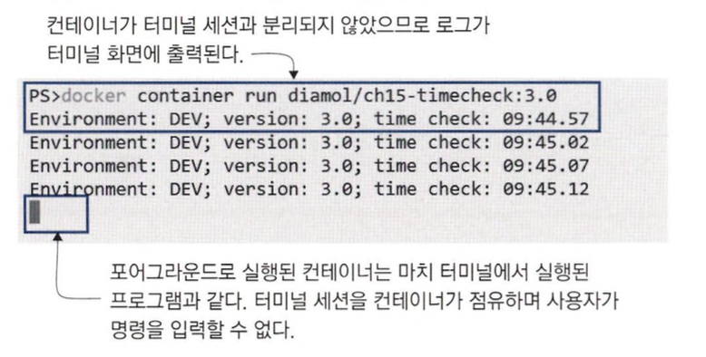
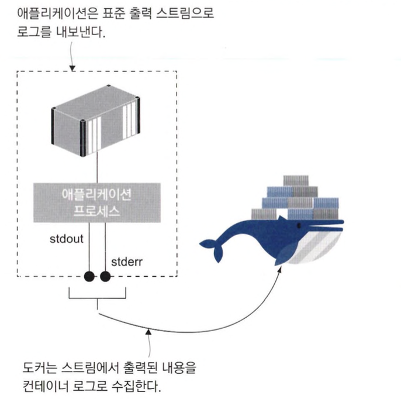
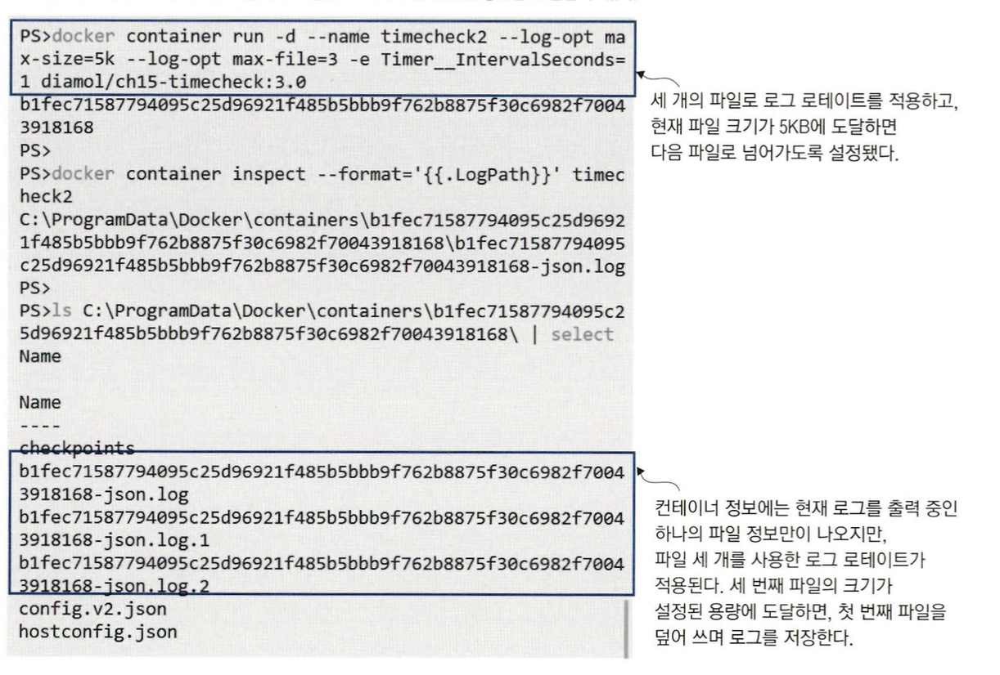
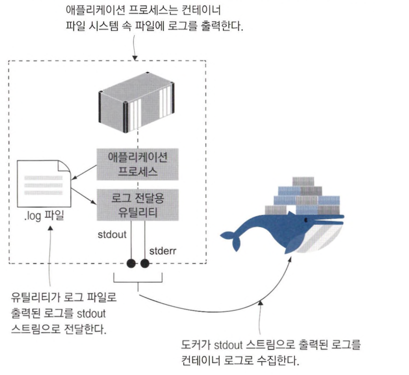
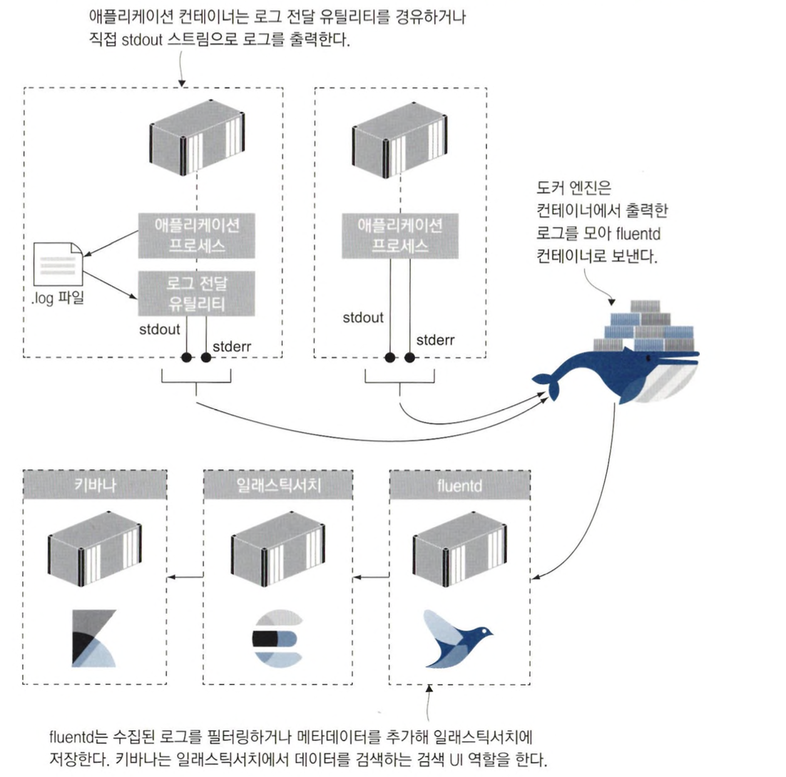
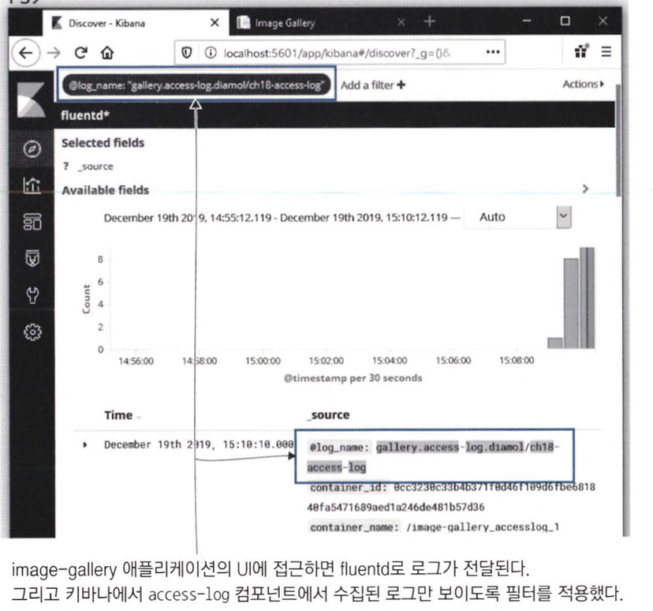
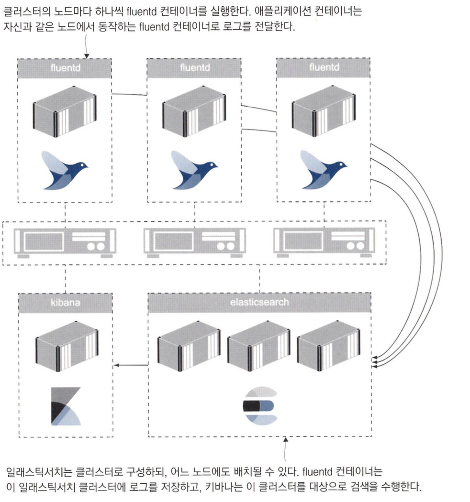

# 도커를 이용한 로그 생성 및 관리

## 표준 에러 스트림과 표준 출력 스트림

### 도커 컨테이너의 로그는 어디에 출력되는지

도커 이미지는 도커가 실행할 프로세스에 대한 정보를 담은 파일 시스템의 스냅샷 입니다.

컨테이너를 시작할 때, 기본적으로 포그라운드로 동작하게 됩니다.

`입력된 명령이 실행 중인 한 프로세스는 터미널의 입력과 출력을 통제`합니다.

실행된 프로세스에서 생성한 로그 엔트리는 표준 출력(stdout) 및 표준 오류(stderr) 스트림으로 출력됩니다 .

도커는 각 컨테이너의 stdout과 stderr 스트림을 주시하며 스트림을 통해 출력되는 내용을 수집합니다.

```bash
docker container run diamol/ch15-timecheck:3.0
```



위와 같이 런타임이 애플리케이션 로그를 출력 스트림으로 내보내면 도커가 이를 수집합니다.

다음은 애플리케이션, 출력 스트림, 도커 간의 관계를 정리한 그림입니다.



### JSON 파일로도 저장되는 로그

터미널 세션과 분리된 컨테이너와 종료된 컨테이너의 로그도 수집할 수 있도록 로그를 JSON 파일로도 저장합니다.

이 JSON 파일은 도커가 직접 컨테이너와 동일한 생애주기를 갖도록 관리합니다. (즉, 컨테이너가 제거되면 로그파일도 함께 삭제합니다.)

```bash
# 터미널 세션과 분리된 컨테이너 실행
docker container run -d --name timecheck diamol/ch15-timecheck:3.0

# 최근 로그 확인
docker container logs --tail 1 timecheck

# 컨테이너 중지 후 로그 확인
docker container stop timecheck
docker container logs --tail 1 timecheck

# 컨테이너 로그 파일 경로 확인
docker container inspect --format='{{.LogPath}}' timecheck
```

<aside>
💡 도커 데스크탑으로 리눅스 컨테이너를 실행중이라면 도커 엔진이 별도로 관리되는 가상 머신 안에서 실행되는 점에 주의해야 합니다.
출력된 로그 파일의 경로는 가상머신의 내부의 경로이므로 파일에 직접 접근할 수 없습니다.

</aside>

일반적으로 크게 신경쓰지 않아도 되지만 다음과 같은 상황일 때 JSON 로그의 형식을 고려해야 합니다.

- 매우 많은 양의 로그를 생산하는 컨테이너가 존재할 때
- 일정 기간 동안 특정 로그들을 관리할 수 있는 파일 구조로 유지해야할 때

기본적으로 컨테이너마다 JSON 로그 파일이 생성되며, 따로 설정하지 않는 한 디스크 용량이 찰 때까지 이 파일의 크기가 증가합니다.

이를 해결하기 위해 롤링을 적용하면 다음과 같이 동작하게 할 수 있습니다.

- 설정된 파일 용량에 도달하면 새 파일에 로그를 다시 수집합니다.
- 최대 파일 개수를 설정해 오래된 파일부터 덮어 쓸 수 있습니다.

이러한 설정은 도커 엔진의 설정이므로 기본적으로 모든 컨테이너에 적용됩니다. (컨테이너 별로 설정 가능)

다음은 로그 옵션을 변경하는 예시입니다.

```bash
docker container run -d --name timecheck2 --log-opt max-size=5k --log-opt max-file=3 -e Timer__IntervalSeconds=1 diamol/ch15-timecheck:3.0

docker container inspect --format='{{.LogPath}}' timecheck2
```

다음은 명령어를 실행한 결과입니다.



## 다른 곳으로 출력된 로그를 stdout 스트림에 전달하기

### 표준 로그 모델을 적용하기 어려운 경우

컨테이너화 하더라도 출력 스트림으로 아무 내용도 출력하지 않는 애플리케이션들도 존재합니다.

- 윈도우 서비스 또는 리눅스 데몬 형태로 동작하는 애플리케이션은 컨테이너 시작 프로세스와 일치하지 않는 경우
- 리눅스의 syslog나 윈도우의 이벤트 로그처럼 별도의 로그 프레임워크를 경유해 다른곳에 로그를 생산하는 경우

위와 같은 경우 컨테이너 시작 프로세스에서 출력되는 로그가 없기 때문에 도커가 로그를 수집하지 못합니다.

### 로그 파일의 내용을 읽어 표준 출력으로 전달하기

위와 같은 애플리케이션에서 로그를 수집하기 위해서는 `로그 파일의 내용을 읽어 표준 출력으로 내보내 주는 별도의 프로세스를 컨테이너 시작 명령에서 실행`하면 됩니다.



이런 경우 로그 전달 유틸리티가 포그라운드로 동작하기 때문에 이 프로세스가 종료되면 애플리케이션과 함께 컨테이너까지 종료되기 때문에 오류를 일으키지 않도록 조심해야 합니다.

반대로, 애플리케이션이 오류로 종료되더라도 포그라운드로 동작중인 유틸리티가 계속 실행 중이므로 컨테이너도 그대로 실행되게 됩니다.

따라서 헬스체크를 적용하지 않는 이상 컨테이너의 이상 상태를 감지할 수 없습니다.

그리고 파일이 계속 저장되기 때문에 디스크 사용 효율이 떨어질 수 있습니다.

### 로그 전달 유틸리티를 사용하기

다음은 로그 전달 유틸리티를 사용한 도커 파일 예제입니다.

```docker
FROM diamol/dotnet-runtime AS base
...
WORKDIR /app
COPY --from builder /out/ .
COPY --from utility /out/ .

FROM base AS linux
CMD dotnet TimeCheck.dll & dotnet Tail.dll /logs timecheck.log
```

위의 도커 파일은 닷넷 유틸리티 tail을 통해 표준 출력으로 로그를 출력하게 해줍니다.


## 컨테이너 로그 수집 및 포워딩하기

### fluentd

fluentd는 통합 로깅 시스템으로, 다양한 곳에서 생성되는 로그를 모으고 필터링과 가공을 거쳐 다시 여러 대상으로 수집된 로그를 포워딩하는 역할을 합니다.

fluentd는 수집한 로그에 자체 메타 데이터를 추가해 저장합니다.

이 메타데이터에는 컨테이너 ID와 이름 등이 포함됩니다.

<aside>
💡 fluentd는 전체 애플리케이션의 로그를 수집하는 역할을 하므로 수집된 로그의 컨텍스트를 파악하기 위해 이러한 메타데이터가 필요합니다.

</aside>

수집된 로그는 대개 중앙 데이터 스토어로 전송되며, ElasticSearch 등이 대표적입니다.

또 로그 시각화를 위해 키바나를 함께 사용하는 경우가 많습니다.

다음은 EFK(ElasticSearch, Fluentd, Kibana) 스택을 사용한 예시입니다.



### EFK 스택을 사용할 때 장점

- 키바나
    - 모든 컨테이너의 로그 중에서 특정 키워드를 포함하는 로그를 검색하거나 시간 등을 기준으로 로그를 필터링할 수 있습니다.
- 엘라스틱서치
    - 수평 확장이 매우 용이하므로 운영 환경에서 생성되는 대량의 로그를 처리하는데 적합합니다.
- Fluentd
    - 모든 컨테이너를 모아 한번에 볼 수 있게 때문에 편하게 로그를 편하게 확인할 수 있습니다.

### EFK 스택 사용 화면



### Fluentd 로그에 태그 추가하기

fluentd 로그에 태그를 추가하려면 간단히 로깅 드라이버에 설정을 추가하면 됩니다.

고정된 이름을 사용하거나 별도의 식별자를 외부에서 주입할 수 있습니다.

다음은 로그를 생성한 컴포넌트 이름과 이미지 이름을 연결한 문자열을 태그로 생성하는 예시입니다.

```yaml
service:
	accesslog:
		image: diamol/ch18-access-log
		logging:
			driver: "fluentd"
			options:
				tag: "gallery.access-log.{{.ImageName}}"

	iotd:
		image: diamol/ch18-image-of-the-day
		logging:
			driver: "fluentd"
			options:
				tag: "gallery.iotd.{{.ImageName}}"

	image-gallery:
		image: diamol/ch18-image-gallery
		logging:
			driver: "fluentd"
			options:
				tag: "gallery.image-gallery.{{.ImageName}}"
```

위와 같이 컴포넌트 이름과 이미지 이름을 연결한 태그의 경우 `애플리케이션과 컴포넌트, 정확한 버전까지 한눈에 알 수 있는 좋은 태그`입니다.

### 결론

- 중앙 집중식 로그 모델에 검색 가능한 데이터 스토어, 사용자 친화적인 검색 UI를 갖추는 것은 운영환경에서 필수적입니다.
- 기본 로깅 드라이버는 도커 엔진 설정으로 지정하지만 애플리케이션 매니페스트에서 로깅 시스템을 명시적으로 지정하는 편이 낫습니다.
- 로깅 시스템에 대한 경험이 많지 않으면 fluentd를 추천할 만합니다.
    - 개발용 단일 컴퓨터터에서 운영용 클러스터로 어렵지 않게 확장할 수 있습니다.
    - 어떤 환경에서 동일한 방법으로 사용할 수 있습니다.
    - 로그에 메타데이터를 추가하거나 필터를 적용해 로그 유형별로 저장소를 달리할 수도 있습니다.

## 로그 출력 및 로그 컬렉션 관리하기

### 로그 필터링하기

로그는 대량의 불필요한 데이터 저장과 문제 진단에 필요한 정보 확보 사이에서 필요한 정보들만 확인할 수 있어야 합니다.

도커의 유연한 로깅 모델을 이용하면 `컨테이너에서는 상세한 로그를 생산하면서 로그를 저장할 때는 필터링을 적용할 수 있어 이러한 균형을 잡는 데 어느 정도 도움`이 될 수 있습니다.

만약 더욱 상세한 로그가 필요하다면 fluentd 필터 설정만 수정하면 됩니다.

로그 필터링은 fluentd 설정 파일에서 정의할 수 있습니다.

필터링 된 로그는 stdout 스트림으로 출력되고, 나머지 로그는 엘라스틱서치로 전달하는 예시입니다.

```yaml
<match gallery.access-log.**>
	@type copy
	<store>
		@type stdout
	</store>
</match>
<match gallery.**>
	@type copy
	<store>
		@type elasticsearch
...
```

- match 블록
    - 필터 파라미터와 태그가 일치하는 로그를 어떻게 처리할 것인지 정의하는 블록입니다.


위의 설정은 access-log는 fluentd 컨테이너의 로그에서만 확인할 수 있고 나머지는 엘라스틱서치에서 확인할 수 있게 해줍니다.

이러한 방법은 `애플리케이션 핵심 로그와 있으면 좋은 정도의 로그를 분리하는데 유용`합니다.

예를 들어 성능과 관련된 가장 중요한 컴포넌트의 로그는 카프카, 사용자 로그는 엘라스틱 서치, 그외의 로그는 S3로 보내는 식으로 동작할 수 있습니다.

### 로그가 유실될 수 있는 것을 유념하자

설정 내용을 바꾸기 위해 fluentd를 새로운 설정으로 재배포하는 경우 재배포 동안 컨테이너가 생성한 로그가 수집되지 못하기 때문입니다.


도커 엔진도 그대로 동작하고 애플리케이션 컨테이너도 영향을 받지 않지만 로그를 보관할 버퍼가 없어 그대로 유실됩니다.

이를 위해 컨테이너를 재시작하는 것보다는 애플리케이션만 다시 실행하도록 하는 것이 낫습니다.

## 컨테이너의 로깅 모델

### 컨테이너의 로깅 모델 정리

- 도커의 로깅 모델
    - 유연성이 뛰어나지만, 애플리케이션 로그를 컨테이너 로그로 내보낼 때만 적용됩니다.
    - 만약 애플리케이션이 따로 로그를 출력하지 않는다면 별도의 로깅 유틸리티를 통해 stdout으로 출력해주어야 합니다.
- EFK 스택
    - 컨테이너 로그를 수집하고 편리한 검색 UI를 갖춘 중앙 집중식 데이터베이스로 저장할 수 있습니다.
    - 단일 머신에서도 무리 없이 동작하며 운영 환경에 맞춰 수평 확장하기도 쉽습니다.



### 컨테이너 로깅 모델을 선호하지 않을수도 있다

어떤 조직은 애플리케이션 로그를 컨테이너 로그와 fluentd 컨테이너를 거치지 않고 바로 최종 저장소인 엘라스틱 서치에 저장하는 것을 선호하기도 합니다.

이를 통해 약간의 처리 시간과 네트워크 트래픽에 이점을 얻을 수 있지만 유연성을 희생하게 됩니다.

또 애플리케이션이 특정 로깅 기술에 의존하게 되므로 다른 로깅 시스템으로 전환할때 수정이 불가피해집니다.

## 궁금한점

- 도커의 로깅모델이 유연성이 뛰어난 이유
    1. **다양한 로깅 드라이버 지원**: Docker는 다양한 로깅 드라이버를 지원합니다. JSON 파일, syslog, journald, gelf, fluentd, awslogs, splunk, etwlogs, gcplogs, logentries 등 다양한 형태의 로그 출력 방식을 지원하므로, 사용자의 환경과 요구사항에 맞는 로깅 시스템을 선택할 수 있습니다.
    2. **컨테이너별 로깅 설정**: Docker는 각 컨테이너마다 다른 로깅 드라이버를 설정할 수 있습니다. 이는 각기 다른 로깅 요구사항을 가진 서로 다른 어플리케이션을 동일한 Docker 환경에서 운영할 수 있게 해줍니다.
    3. **로그 레벨 설정**: Docker의 로깅 시스템은 로그 레벨(log level) 설정을 통해 필요한 로그 정보만을 수집하는 것이 가능합니다. 예를 들어, 오류 정보만을 필요로 하는 경우, 로그 레벨을 '오류(error)'로 설정하여 그 외의 정보가 로그에 포함되지 않게 할 수 있습니다.
    4. **로그 저장과 관리**: 로그 저장용량을 제한하거나 오래된 로그를 자동으로 삭제하는 등 로그의 저장과 관리를 자동화하는 기능을 제공합니다. 이를 통해 로그 데이터가 너무 많이 쌓여서 디스크 용량을 과도하게 사용하는 것을 방지할 수 있습니다.