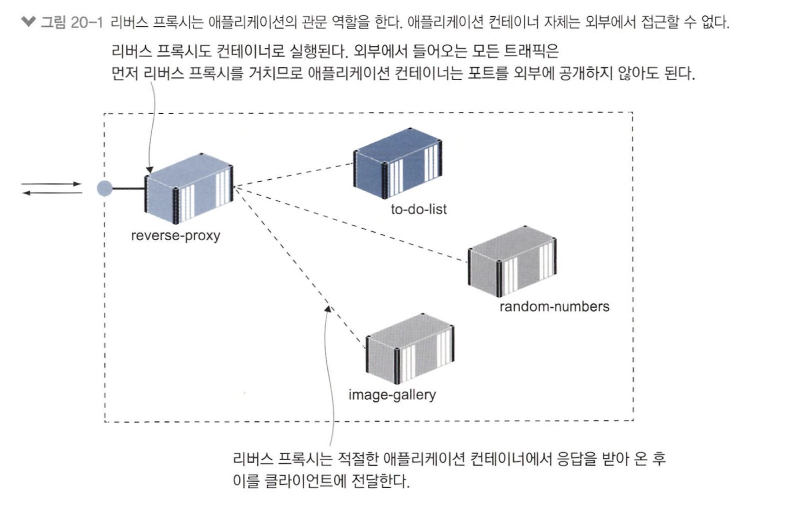

# 20장 리버스 프록시를 이용해 컨테이너 HTTP 트래픽 제어하기

# 20.1 리버스 프록시란? 

> 프록시란 네트워크 다른 구성 요소를 대신해 네트워크 트래픽 처리하는 구성 요소



- `리버스 프록시` : 포트를 외부로 공개한 유일한 컨테이너
- 외부 모든 요청 먼저 받고 그에 맞는 컨테이너로 응답 받음
- 애플리케이션 컨테이너 외부 노출 필요 x

```editorconfig
server {
    server_name whoami.local; # domain

location / {
    proxy_pass http://whoami; # contents 위치한 주소
    proxy_set_header Host $host; # host 정보를 컨텐츠 위치로 설정
    add_header X-Host $hostname; # 응답의 호스트 정보 프록시 이름으로 변경
}
}
```

- nginx 설정 파일

## 20.2 리버스 프록시의 라우팅과 SSL 적용하기

> upstream container가 lb 처리

```shell
# 애플리케이션 3개 컨테이너로 스케일링
docker-compose -f ./image-gallery/docker-compose.yml up -d --scale image-gallery=3

docker-compose -f ./nginx/docker-compose.yml restart nginx
```


```shell
# 자체 서명 인증서 생성
docker container run -v "$(pwd)/nginx/certs:/certs" -e HOST_NAME=image-gallery.localdiamol/cert-generator

# 기존 설정 파일 삭제
rm ./nginx/sites-enabled/image-gallery.local

# SSL이 포함된 사이트별 설정 파일 복사
cp ./nginx/sites-available/image-gallery-3.local ./nginx/sites-enabled/image-gallery.local

# nginx restart
docker-compose -f nginx/docker-compose.yml restart nginx
```

- `OpenSSL`로 자체 서명 인증서 생성
- nginx container에 bind mount
- SSL 적용하여 nginx 재시작
- http로 접근하면 https로 redirect

```editorconfig
server{
    server_name image-gallery.local;
    listen 80;
    return 301 https://$server_name$request_uri;
}

server {
    server_name image-gallery.local;
    listen 443 ssl;
    ssl_certificate /etc/nginx/certs/server-cert.pem;
    ssl_certificate_key /etc/nginx/certs/server-key.pem;
    ssl_protocols TLSv1 TLSv1.1 TLSv1.2;
...
```

## 20.3 프록시를 이용한 성능 및 신뢰성 개선

> nginx를 caching proxy로 사용


- application에서 받아온 컨텐츠를 local disk, memory 저장
- 이후 동일 내용 접근 시 저장된 내용 사용
- 새로운 프록시 설정에 사용자 정의 응답 헤더 `X-Cache` 포함 &rarr; 요청에 해당하는 캐시 있는지 먼저 확인
- `X-Cache: MISS` : 응답 헤더로 같은 요청이 들어온적 없다
- `X-Cache: HIT` : 응답 헤더로 같은 요청 들어온적 있다


```editorconfig
...
location = /api/image {
    proxy_pass http://iotd/image;
    proxy_set_header Host $host;
    proxy_cache SHORT;
    proxy_cache_valid 200 1m;
    ...
}

location / {
    proxy_pass http://image-gallery;
    proxy_set_header Host $host;
    proxy_cache LONG;
    proxy_cache_valid 200 6h;
    proxy_cache_use_stale error timeout invalid_header updating
                            http_500 http_502 http_503 http_504;
    ...
}
```

- `proxy_cache_use_stale` : 업스트림을 사용할 수 없을 때 유효 시간이 만료된 캐시라도 사용

## 20.5 리버스 프록시를 활용한 패턴의 이해


- domain 정보로 컨테이너 라우팅


- `msa`에서 주로 활용
- msa 일부 요소만 선택적으로 노출
- 외부에선 하나의 도메인의 애플리케이션, 내부에선 경로에 따라 서로 다른 컨테이너가 요청 처리


- `monolithic` 에서 container로 이주시킬 때 유용
- 추가 기능 컨테이너로 분할