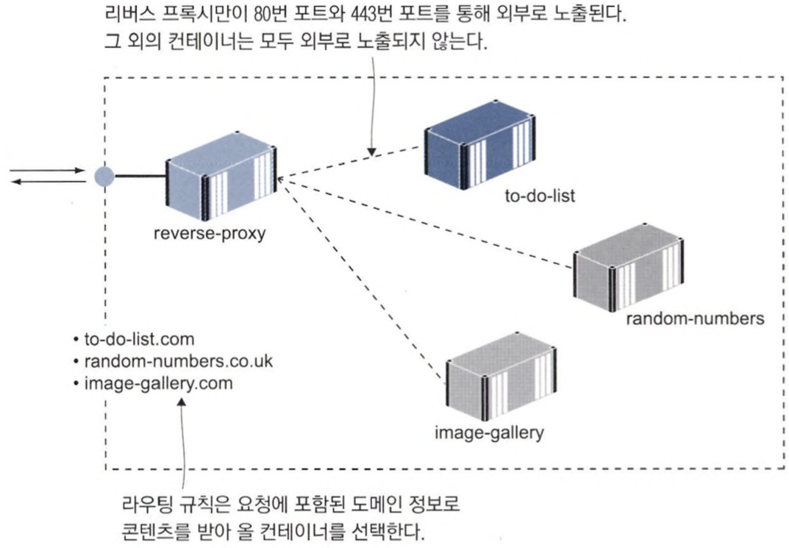

# 20장 리버스 프록시를 이용해 컨테이너 HTTP 트래픽 제어하기
## 20.1 리버스 프록시란?

- 여러 웹 애플리케이션으로 통하는 관문 역할을 수행한다.
- 애플리케이션이 응답 내용을 캐시해 두었다가 적절하게 가공해 클라이언트에게 전달한다.
- 스케일링, 업데이트, 보안 면에서 유리하다.


### 엔진엑스 프록시 설정하기

- 엔진엑스가 단순히 요청을 전달하는 매개자 역할을 한다.
- 요청을 받을 때마다 이를 처리한 컨테이너(’업스트림’)을 호출한다.
- 응답을 다시 클라이언트(’다운스트림’)로 전달한다.

```
server {
	server_name whoami.local; # 도메인

	location / {
		proxy_pass http://whoami; # 콘텐츠가 위치한 주소
		proxy_set_header Host $host; # 호스트 정보를 콘텐츠 위치로 설정
		add_header X-Host $hostname; # 응답의 호스트 정보를 프록시 이름으로 변경
	}
}
```

---

## 20.2 리버스 프록시의 라우팅과 SSL 적용하기

### 리버스 프록시에 새로운 애플리케이션을 추가하는 방법

1. 애플리케이션 컨테이너 시작
2. 사이트 설정 파일을 엔진엑스 컨테이너로 복사
3. 엔진엑스 컨테이너 재시작
    - 사이트 별 설정 파일 확인 및 업스트림 가능 여부 확인
    - 호스트명과 IP주소를 연결한 내부 라우팅 리스트 생성
        
        → 업스트림 컨테이너가 여러 개 존재하면 로드 밸런싱 처리
        

### ✅  로드 밸런싱 확인하기

- 응답 헤더에 `X-Upstream` 항목을 추가하는데, 이 항목은 엔진엑스가 응답을 받아온 컨테이너의 IP 주소가 담긴 항목이다.
- curl 호출 시, 컨테이너 IP 주소가 바뀌는 것을 볼 수 있다.


### SSL 적용하기

- 엔진엑스는 Let’s Encrypt 같은 실제 도메인 제공자나 서비스에서 발급한 실제 인증서를 설정에 포함할 수 있다.
- HTTP 80번 포트 주시 → 301 응답 → 클라이언트 HTTPS 리다이렉트

```
server {
    server_name image-gallery.local;
    listen 80;
	return 301 https://$server_name$request_uri;
}

server {
	server_name  image-gallery.local;
	listen 443 ssl;

	ssl_certificate        /etc/nginx/certs/server-cert.pem;
	ssl_certificate_key    /etc/nginx/certs/server-key.pem;
	ssl_session_cache      shared:SSL:10m;
	ssl_session_timeout    20m;
	ssl_protocols          TLSv1 TLSv1.1 TLSv1.2;

	...        
}
```

---

## 20.3 프록시를 이용한 성능 및 신뢰성 개선

엔진엑스를 캐싱 프록시로 사용한다.


### ✅ 캐싱 프록시의 장점

1. 요청 처리 시간 단축
2. 애플리케이션을 오가는 트래픽 감소

### 📌 X-Cache Header


- proxy_cache_use_table : 업스트림 사용 불가 시, 유효 기간 만료된 캐시라도 사용한다.

```
location = /api/image {
        proxy_pass             http://iotd/image;
        proxy_set_header       Host $host;
        proxy_cache            SHORT;
        proxy_cache_valid      200  1m;
        add_header             X-Cache $upstream_cache_status;
        add_header             X-Proxy $hostname;         
        add_header             X-Upstream $upstream_addr;
    }

    location / {
        proxy_pass             http://image-gallery;
        proxy_set_header       Host $host;
        proxy_cache            LONG;
        proxy_cache_valid      200  6h;
        proxy_cache_use_stale  error timeout invalid_header updating
                               http_500 http_502 http_503 http_504;
        add_header             X-Cache $upstream_cache_status;
        add_header             X-Proxy $hostname;         
        add_header             X-Upstream $upstream_addr;
    }
```

---

## 20.4 클라우드 네이티브 리버스 프록시

도커 엔진과 연결된 컨테이너는 이미지 푸시 외에도 도커 API의 애플리케이션 질의를 통해 다른 컨테이너에 대한 정보를 얻을 수 있다.

클라우드 네이티브 리버스 프록시 도구인 트래픽이 이런 식으로 동작한다.

트래픽을 사용해 프록시를 적용하려면 애플리케이션별로 설정 파일을 따로 둘 필요 없이 컨테이너에 레이블을 추가하기만 하면 된다.

### 트래픽의 장점

`동적 설정` 을 구성할 수 있다.

- 트래픽이 새로운 컨테이너를 모니터링하기 때문에 트래픽 실행 전에 모든 애플리케이션을 실행해두지 않아도 된다.


### 트래픽의 동작 과정

- 엔트리포인트 : 외부에서 들어오는 트래픽을 주시하는 포트
- 라우터 : 인입된 요청을 배정할 컨테이너를 결정하는 규칙. 호스트명, 경로 등으로 돼 있다.
- 서비스 : 실제 콘텐츠를 제공하는 업스트림 컨포넌트
- 미들웨어 : 라우터와 서비스 사이에서 서비스에 전달되는 요청을 변경하는 역할을 한다.

### 트래픽 설정 예시

📌 컨테이너 레이블을 이용한 트래픽 자동 설정

```
services:
	whoami:
		labels:
			- "traefik.enable=true"
			- "traefik.http.routers.whoami.rule=Host('whoami.local')"
```


### 스티키 세션

`무상태` 는 아무 컨테이너 요청을 처리할 수 있으므로, 수평 확장 시 성능 향상은 물론 로드밸런싱 효과를 극대화할 수 있다.

기존 애플리케이션은 상태가 있는 구성 요소를 많이 포함하고 있어 컨테이너로 이주하려면 같은 사용자의 요청은 같은 컨테이너로 계속 라우팅해야 한다.

📌 스티키 세션 설정 방법

```
services:
  whoami:
    labels:
      - "traefik.enable=true"
      - "traefik.http.routers.whoami.rule=Host(`whoami.local`)"
      - "traefik.http.services.whoami.loadBalancer.sticky=true"
      - "traefik.http.services.whoami.loadbalancer.sticky.cookie.name=whoami_cookie"
      - "traefik.http.services.whoami.loadbalancer.sticky.cookie.httpOnly=true"
```

스티키 세션을 활성화하면, 클라이언트에 컨테이너를 식별할 수 있는 `쿠키` 가 부여되므로 해당 사용자의 요청을 계속 컨테이너로 라우팅한다.

---

## 20.5 리버스 프록시를 활용한 패턴의 이해

1. 한 클러스터에서 각각 다른 도메인 이름을 갖는 여러 개의 애플리케이션을 호스팅하는 패턴
    
    
    
2. 마이크로서비스 아키택처의 일부 요소를 외부로 노출시키는 패턴
    
    
    
3. 리버스 프록시가 모놀리식 설계를 가려 주어 애플리케이션을 점진적으로 여러 개의 서비스로 분할해 갈 수 있다.
    
    