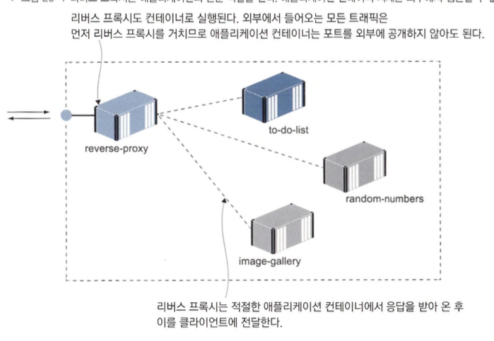
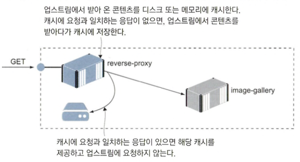
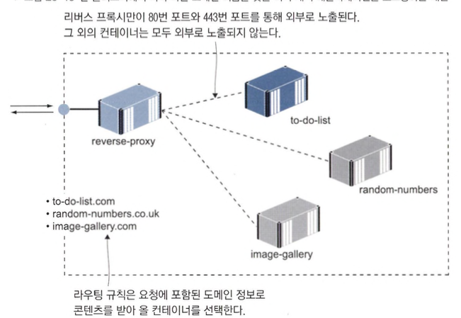
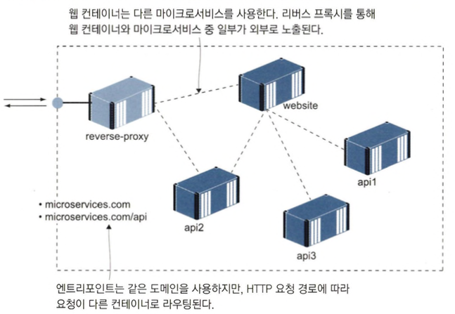
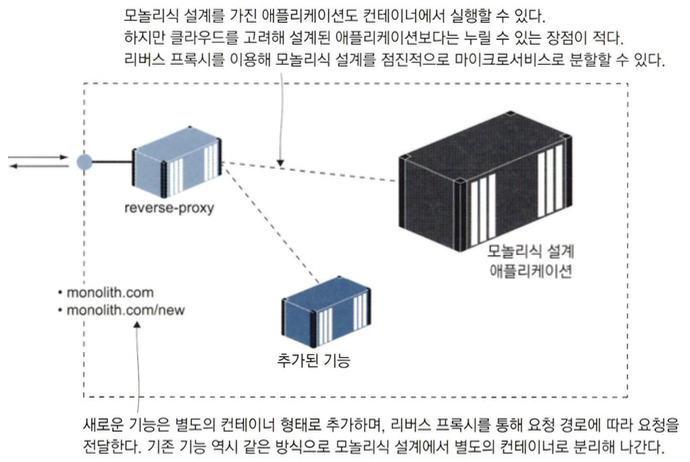

# 리버스 프록시를 이용해 컨테이너 HTTP 트래픽 제어하기

## 리버스 프록시란?

- 네트워크에서 말하는 프록시는 네트워크상의 다른 구성 요소를 대신해 네트워크 트래픽을 처리하는 네트워크 구성 요소로 허용된 사이트인지 확인하거나 캐시용으로 사용합니다.



```shell
docker network create ch20
docker-compose -f nginx/docker-compose.yml -f nginx/override-linux.yml up -d
```

- certs 폴더 없어서 생성하면 컨테이너는 실행되나 localhost 접근 안됨(ngix m1 호환성 문제인듯)

```shell
echo $'\n127.0.0.1 whoami.local' | sudo tee -a /etc/hosts
docker-compose -f whoami/docker-compose.yml up -d
cp ./nginx/sites-available/whoami.local ./nginx/sites-enabled/
docker-compose -f nginx/docker-compose.yml restart nginx
```

- `http://whoami.local` 접속하면 된다는데 안됨... ping은 날라감

```shell
echo $'\n127.0.0.1 api.numbers.local' | sudo tee -a /etc/hosts
docker-compose -f numbers/docker-compose.yml up -d
cp ./nginx/sites-available/api.numbers.local ./nginx/sites-enabled/
docker-compose -f nginx/docker-compose.yml restart nginx
```

- `http://api.numbers.local/` 접속하면 된다는데 안됨... ping은 날라감
- 리버스프록시는 모든 애플리케이션 트래픽이 경유하게 할수 있으므로 설정의 중심역할이 가능하며 애플리케이션 컨테이너와도 분리할 수 있는 장점이 있습니다.

## 리버스 프록시의 라우팅과 SSL 적용하기

- 엔진엑스를 재시작할 때 사이트별 설정 파일을 모두 읽은 다음 해당 설정의 업스트림이 모두 접근 가능한지 확인을 거치기 때문에
  애플리케 이션 컨테이너를 시작 -> 사이트 설정 파일을 엔진엑스 컨테이너에 복사 -> 엔진엑스 컨테 이너를 재시작으로 하는것이 좋습니다.(업스트림 중 하나라도 접근이 불가능하면 엔진엑스 종료)

```shell
echo $'\n127.0.0.1 image-gallery.local' | sudo tee -a /etc/hosts
docker-compose -f ./image-gallery/docker-compose.yml up -d --scale image-gallery=3
cp ./nginx/sites-available/image-gallery.local ./nginx/sites-enabled/
docker-compose -f ./nginx/docker-compose.yml restart nginx
curl -i --head http://image-gallery.local
```

- image-gallery를 3개 띄우고 로드 밸런싱 역할을 엔진엑스가 처리해주는 예제입니다.

```shell
rm ./nginx/sites-enabled/image-gallery.local
cp ./nginx/sites-available/image-gallery-2.local ./nginx/sites-enabled/image-gallery.local
docker-compose -f ./nginx/docker-compose.yml restart nginx
curl -i http://image-gallery.local/api/image
```

- 같은 도메인을 가진 컨테이너 간에도 선택적으로 컨테이너를 노출시키는 예제입니다.
- 위 예제는 애플리케이션 스택의 일부분만 노출시키고 싶을 때 매우 유용한 패턴

```shell
docker container run -v "$(pwd)/nginx/certs:/certs" -e HOST_NAME=image-gallery.local diamol/cert-generator
rm ./nginx/sites-enabled/image-gallery.local
cp ./nginx/sites-available/image-gallery-3.local ./nginx/sites-enabled/image-gallery.local
docker-compose -f nginx/docker-compose.yml restart nginx
```

- ssl 설정하는 예제입니다.
- `https://image-gallery.local`에 접속하면 자체 서명 인증서는 신뢰할 수 없다는 경고 메시지가 나오는데 Advanced 버튼을 눌러무시하고 진행하면 됩니다.

## 프록시를 이용한 성능 및 신뢰성 개선



- 캐싱 프록시는 요청을 처리하는 시간을 줄일 수 있고 애플리케이션을 오가는 트래픽을 줄일 수 있습니다.

```shell
rm ./nginx/sites-enabled/image-gallery.local
cp ./nginx/sites-available/image-gallery-4.local ./nginx/sites-enabled/image-gallery.local
docker-compose -f ./nginx/docker-compose.yml restart nginx
curl -i --head --insecure https://image-gallery.local
curl -i --head --insecure https://image-gallery.local
```

- 처음 요청에는 `X-Cache: MISS` 나오는데 캐시된게 없다는 뜻이고 두번쨰 요청에는 `X-Cache: HIT`라고 캐시적중을 의미하는 내용이 나옵니다.

```shell
curl -s --insecure https://image-gallery.local
curl -s --insecure https://image-gallery.local/api/image
docker rm -f $(docker container ls -f name="image-gallery-image-gallery-*" -q)
curl -i --head --insecure https://image-gallery.local
docker rm -f image-gallery-iotd-1
curl -i --head --insecure https://image-gallery.local/api/image
```

- 캐시 후 컨테이너가 제가되면 어떻게 되는지 보여주는 예제입니다.
- 캐시가 6시간인 웹컨테이너는 컨테이너가 내려가도 캐시된 내용을 리턴하지만 캐시가 1분인 API는 502를 리턴하는것을 볼수 있습니다.

## 클라우드 네이티브 리버스 프록시

- 클라우드 네이티브 리버스 프록시 도구인 트래픽을 소개하는데 장점으로는 애플리케이션 설정이 변경돼도 트래픽을 재시작할 필요가 없습니다.

```shell
docker-compose -f traefik/docker-compose.yml -f traefik/override-linux.yml up -d
```

- `http://localhost:8080`에 접속하면 화면을 확인할 수 있습니다.
- 트래픽의 동작 과정
  - 엔트리포인트 : 외부에서 들어오는 트래픽을 주시하는 포트로 컨테이너의 공개 포트가 매핑
  - 라우터 : 인입된 요청을 배정할 컨테이너를 결정하는 규칙
  - 서비스 : 실제 콘텐츠를 제공하는 업스트림 컴포넌트
  - 미들웨어 : 라우터와 서비스 사이에서 서비스에 전달되는 요청을 변경하는 역할

```shell
docker-compose -f whoami/docker-compose.yml -f whoami/override-traefik.yml up -d
curl -i http://whoami.local
```

- 트래픽을 사용한 예쩨입니다.
- `http://localhost:8080/dashboard/#/http/routers/whoami@docker` 에서 라우터 정보를 확인할수 있습니다.

```shell
docker-compose -f image-gallery/docker-compose.yml -f image-gallery/override-traefik.yml up -d
curl --head http://image-gallery.local
curl -i  http://image-gallery.local/api/image
```

- `http://image-gallery.local/api/image`요청을 미들웨어가 `http://iotd/image` 변환하여 제공합니다.

```shell
docker-compose -f image-gallery/docker-compose.yml -f image-gallery/override-traefik-ssl.yml up -d
curl -i --head --insecure https://image-gallery.local
curl --insecure https://image-gallery.local/api/image
```

- 트래픽의 자동 설정 과정에서 포함되므로 자체 서명 인증서를 생성하거나 복사할 필요가 없습니다.
- 트래픽에 캐시 기능은 없습니다.(Traefik Enterprise를 사용하면 HTTP 캐시 미들웨어를 활용하여 라우터에 캐싱을 추가가능)

```shell
docker-compose -f whoami/docker-compose.yml -f whoami/override-traefik.yml up -d --scale whoami=3
curl -c c.txt -b c.txt http://whoami.local
curl -c c.txt -b c.txt http://whoami.local
docker-compose -f whoami/docker-compose.yml -f whoami/override-traefik-sticky.yml up -d --scale whoami=3
curl -c c.txt -b c.txt http://whoami.local
curl -c c.txt -b c.txt http://whoami.local
```

- 사용자의 요청을 같은 컨테이너로 계속 라우팅하는것을 스티키 세션이라고합니다. 위 예제는 스티키 세션 예제입니다.

### 리버스 프록시를 활용한 패턴의 이해

- 클라이언트 요청에 포함된 호스트명을 통해 HTTP 혹은 HTTPS로 제공되는 애플리케이션에서 정확한 콘텐츠를 제공하는 패턴



- 애플리케이션이 여러 개의 컨테이너에 걸쳐 실행되는 마이크로서비스 아키텍처



- 모놀리식(monolithic) 설계를 가진 애플리케이션을 컨테이너로 이주시킬 때 특히 유용한 패턴



- 하나의 클러스터 안에서 여러 개의 도메 인과 연결된 모놀리식 설계 애플리케이션과 마이크로서비스를 리버스 프록시를 이용해 함께 서비 스하는 것도 가능합니다.
