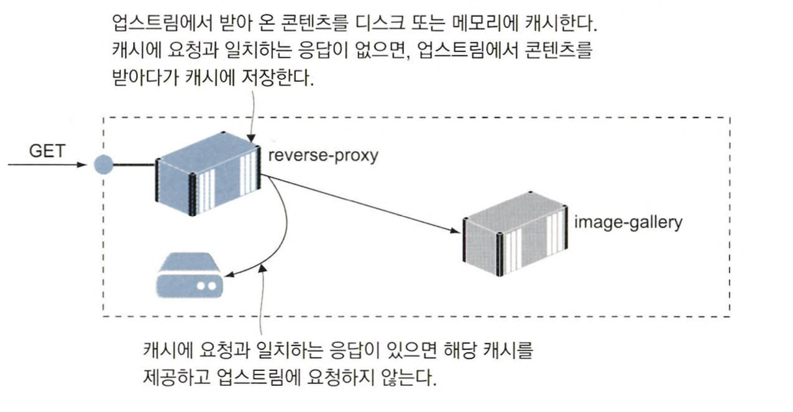
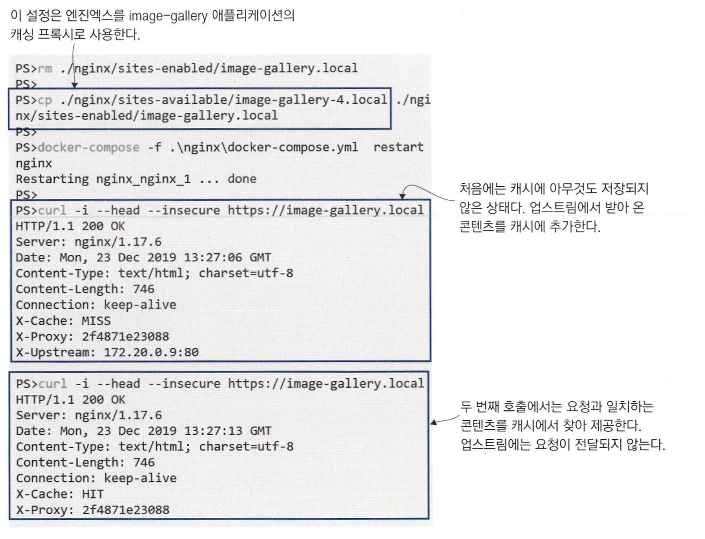

# 리버스 프록시를 이용해 컨테이너 HTTP 트래픽 제어하기

<br>

## 리버스 프록시란 ?

리버스 프록시는 여러 웹 애플리케이션으로 통하는 관문 역할을 한다. <br>
모든 트래픽은 리버스 프록시를 거치며 해당 트래픽이 어떤 애플리케이션에서 출발한 것인지 판단한디-. <br>
또한, 애플리케이션의 응답 내용을 캐시해 두었다가 적절하게 가공해 클라이언트에게 전달하기도 한다.


> 리버스 프록시는 포트를 외부로 공개한 유일한 컨테이너다. 외부에서 들어오는 모든 요청을 먼저 받고 그에 맞는 컨테이너로부터 응답을 받아 온다. <br>
> 리버스 프록시 덕분에 모든 애플리케이션 컨테이너는 외부에 노출될 필요가 없어서 스케일링, 업데이트, 보안 면에서 유리하다. 


<br>

같은 포트를 통해 여러 개의 애플리케이션을 호스팅하려면 이들을 먼저 구별할 수 있어야 하는데, 대개 도메인이 이 역할을 한다. <br>
예를 들어, http://blog.sixeyd.com에 접속을 시도하면 웹 브라우저가 보내는 HTTP 요청의 헤더에 Host=blog.sixeyed.com이라는 정보가 들어간다. <br>
엔진엑스는 이 헤더의 호스트 정보로 해당 요청을 처리할 사이트의 설정 파일을 찾는다.

```
server {
    server_name whoami.local; # 도메인
    
    location / {
        proxy_pass http://whoami; # 콘텐츠가 위치한 주소
        proxy_set_header Host $host; # 호스트 정보를 콘텐츠 위치로 설정 
        add_header X-Host $hostname; # 응답의 호스트 정보를 프록시 이름으로 변경
    } 
}
```

> 리버스 프록시는 웹 사이트뿐 아니라 HTTP로 제공되는 콘텐츠, REST API, 그 외 유형의 트래픽(TCP/IP나 gRPC)도 가능한 경우가 있다. <br>
> 요청을 받을 때마다 이를 처리할 컨테이너(업스트림)를 호출하고, 응답을 다시 클라이언트(다운스트림)로 전달한다. <br>
> 업스트림에 해당하는 애플리케이션에 이상이 발생하면 엔진엑스는 실패 응답을 다운스트림에 전달한다.

<br>
<hr>

## 리버스 프록시의 라우팅과 SSL 적용하기

위에서 애플리케이션 컨테이너를 시작하고, 사이트 설정 파일을 엔진엑스 컨테이너에 복사한 다음, 엔진엑스 컨테이너를 재시작했다. <br>
이 순서가 중요한 이유는 엔진엑스를 재시작할 때 사이트별 설정 파일을 모두 읽은 다음 해당 설정의 업스트림이 모두 접근 가능한지 확인을 거치기 때문이다. <br>
업스트림에 모두 접근이 가능하다면, 그다음에는 호스트명과 IP 주소를 연결한 내부 라우팅 리스트를 만든다. <br>
업스트림 컨테이너가 여러 개 존재한다면 이들 간의 로드 밸런싱까지 처리해 준다.


<br>

엔진엑스 라우팅 기능을 이용하면 같은 도메인을 가진 컨테이너 간에도 선택적으로 컨테이너를 노출시킬 수 있다. <br>
애플리케이션 스택의 일부분만 노출시키고 싶을 때 매우 유용한 패턴이며, 여러 개의 컴포넌트를 하나의 도메인 아래에 묶어 내고 싶을 때도 유용하다.


<br>

애플리케이션이 HTTPS 사이트로 돼 있다면 이를 위한 설정과 인증서가 어딘가에 위치 해야 한다. <br>
엔진엑스는 Let’s Encrypt 같은 실제 도메인 제공자나 서비스에서 발급한 실제 인증서를 설정에 포함할 수 있다. <br>
*하지만 운영 외 환경에서는 자체 서명 인증서를 만들어 사용해도 된다.*

```bash
# 자체 서명 인증서 생성하기
docker container run -v "$(pwd)/nginx/certs:/certs" -e HOST_NAME=image-gallery.local diamol/cert-generator

# 기존 설정 파일 삭제
rm ./nginx/sites-enabled/image-gallery.local

# SSL이 포함된 사이트별 설정 파일 복사
cp ./nginx/sites-available/image-gallery-3.local ./nginx/sites-enabled/image-gallery. local

# 엔진엑스 재시작
docker-compose -f nginx/docker-compose.yml restart nginx
```

- 처음 실행한 컨테이너는 OpenSSL이라는 도구를 사용해 자체 서명 인증서를 생성
- 이 인증서를 로컬 컴퓨터의 certs 디렉터리로 복사
- 디렉터리는 엔진엑스 컨테이너에 바인드 마운트
- image-gallery 애플리케이션의 설정 파일을 SSL이 적용된 파일로 교체하고 엔진엑스를 재시작

```
# HTTP 연결을 리다이렉트하는 HTTPS 사이트 설정
server {
    server_name image-gallery.local;
    listen 80;
    return 301 https://$server_name$request_uri;
}

server {
    server_name image-gallery.local; 
    listen 443 ssl;
    ssl_certificate /etc/nginx/certs/server-cert.pern;
    ssl_certificate_key /etc/nginx/certs/server-key.pem;
    ssl_protocols TLSvl TLSv1.1 TLSv1.2;
    ...
```

<br>
<hr>

## 프록시를 이용한 성능 및 신뢰성 개선

엔진엑스를 캐싱 프록시로 사용하면 애플리케이션 성능을 개선할 수 있다. <br>
애플리케이션에서 받아 온 콘텐츠를 로컬 디스크나 메모리에 저장해 두었다가 이후 같은 콘텐츠에 대한 요청이 들어오면 업스트림에 콘텐츠를 요청하지 않고 저장된 것을 사용하는 것이다.



캐싱 프록시의 장점은

- 요청을 처리하는 시간을 줄일 수 있다.
- 애플리케이션을 오가는 트래픽을 줄일 수 있다.

<br>



**캐시 사용은 세세하게 설정할 수 있다.**

```
location = /api/image {
    proxy_pass http://iotd/image;
    proxy_set_header Host $host;
    proxy_cache SHORT;
    proxy_cache_valid 200 1m;
    ...
}

location / {
    proxy_pass http://image-gallery;
    proxy_set_header Host $host;
    proxy_cache LONG;
    proxy_cache_valid 200 6h;
    proxy_cache_use_stale error timeout invalid_header updating
                          http_500 http_502 http_503 http_504;
    ...
}
```

<br>
<hr>

## 클라우드 네이티브 리버스 프록시

도커 엔진과 연결된 컨테이너는 이미지 푸시 외에도 도커 API의 애플리케이션 질의를 통해 다른 컨테이너에 대한 정보를 얻을 수 있다. <br>
클라우드 네이티브 리버스 프록시 도구인 트래픽이 이런 식으로 동작한다. <br>
트래픽을 사용해 프록시를 적용하려면 애플리케이션별로 설정 파일을 따로 둘 필요 없이 컨테이너에 레이블을 추가하기만 하면 된다.

트래픽 등과 같은 컨테이너용 프록시의 가장 큰 장점은 동적 설정을 구성할 수 있다는 점이다. <br>
트래픽이 새로운 컨테이너를 모니터링하기 때문에 트래픽 실행 전에 모든 애플리케이션을 실행해두지 않아도 된다. <br>
또 애플리케이션 설정이 변경돼도 트래픽을 재시작할 필요가 없다.


<br>

트래픽의 동작 과정

- **엔트리포인트**: 외부에서 들어오는 트래픽을 주시하는 포트. 이 포트와 컨테이너의 공개 포트가 매핑된다.
- **라우터**: 인입된 요청을 배정할 컨테이너를 결정하는 규칙.
- **서비스**: 실제 콘텐츠를 제공하는 업스트림 컴포넌트.
- **미들웨어**: 라우터와 서비스 사이에서 서비스에 전달되는 요청을 변경하는 역할. 요청에 포함된 경로 또는 헤더를 변경하거나 인증을 강제할 수 있다.

> 트래픽의 경우, 캐시를 지원하지 않는다. *(캐싱 프록시를 적용하려면 엔진엑스를 사용해야 한다.)* <br>
> SSL 지원은 트래픽이 좋다. 인증서 제공 서비스와 통합이 잘돼 있기 때문에 Let’s Encrypt 서비스를 통해 자동으로 인증서가 갱신된다.

<br>

라우팅, 로드 밸런싱, SSL 적용은 리버스 프록시의 주요 기능이다. <br>
트래픽을 사용하면 이 기능을 컨테이너 레이블을 이용한 자동 설정을 통해 적용할 수 있다.

<br>
<hr>

## 리버스 프록시를 활용한 패턴의 이해

### 첫 번째 패턴

클라이언트 요청에 포함된 호스트명을 통해 HTTP 혹은 HTTPS로 제공되는 애플 리케이션에서 적확한 콘텐츠를 제공하는 패턴.


### 두 번째 패턴

한 애플리케이션이 여러 개의 컨테이너에 걸쳐 실행되는 마이크로서비스 아키텍처에서 주로 활용된다. <br>
HTTP 요청의 경로를 이용해 마이크로서비스의 요소 중 일부만을 선택적으로 노출한다. <br>
**외부에서 보면 애플리케이션은 하나의 도메인을 갖지만, 경로에 따라 서로 다른 컨테이너가 요청을 처리하는 구조다.**


### 세 번째 패턴

모놀리식 설계를 가진 애플리케이션을 컨테이너로 이주시킬 때 유용한 패턴. <br>
리버스 프록시를 두어 모놀리식 설계를 가진 애플리케이션의 프론트 엔드 역할을 맡기고, 이후 추가되는 기능은 컨테이너로 분할한다. 


