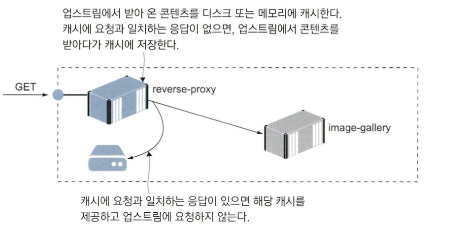

# 리버스 프록시를 이용해 컨테이너 HTTP 트래픽 제어하기

## 리버스 프록시란?

네트워크에서 말하는 프록시는 `네트워크상의 다른 구성 요소를 대신해 네트워크 트래픽을 처리하는 네트워크 구성요소`를 말합니다.

예를 들어 다음과 같은 경우 등이 해당됩니다.

- 요청을 가로채 허용된 사이트인지 확인하는 경우
- 빠른 속도를 위해 접근하려는 사이트의 캐시를 제공하는 경우

리버스 프록시도 이처럼 웹 애플리케이션에 가기 전에 거치는 관문 역할을 합니다.

모든 트래픽은 리버스 프록시를 거치며 해당 트래픽이 어떤 애플리케이션에서 출발한 것인지 판단합니다.

또한, 애플리케이션의 응답 내용을 캐시해 두었다가 적절하게 가공해 클라이언트에게 전달하기도 합니다.

다음은 컨테이너에서 동작하는 리버스 프록시를 나타낸 것입니다.


리버스 프록시는 포트를 외부로 공개한 유일한 컨테이너로, 외부에서 들어오는 모든 요청을 먼저 받고 그에 맞는 컨테이너로부터 응답을 받아 옵니다.

리버스 프록시 덕분에 모든 애플리케이션 컨테이너는 외부에 노출될 필요가 없습니다.

그만큼 스케일링, 업데이트, 보안 면에서 유리합니다.

### 컨테이너 기술에서의 리버스 프록시

리버스 프록시가 새로운 기술은 아니지만 컨테이너 혁명과 함께 중요성이 매우 커졌습니다.

리버스 프록시를 경량 컨테이너로 실행하게 되면서 모든 환경에서 동일한 프록시 설정을 사용할 수 있게 되었습니다.

### 엔진엑스를 활용한 리버스 프록시

리버스 프록시를 구성할때 대표적으로 nginx(엔진엑스)를 많이 사용합니다.

엔진엑스는 빠르고 가볍다는 장점을 통해 프록시를 구성할때 많이 사용하게 됩니다.

엔진엑스를 리버스 프록시로 동작하게 하기 위해서는 설정 파일을 추가해야합니다.

다음은 엔진엑스 설정 파일 예시입니다.

```yaml
server {
	server_name whoami.local # 도메인

	location / {
		proxy_pass http://whoami; # 콘텐츠가 위치한 주소
		proxy_set_header HOST $host; # 호스트 정보를 콘텐츠 위치로 설정
		add_header X-Host $hostname; # 응답의 호스트 정보를 프록시 이름으로 변경 
	}
}
```

### 리버스 프록시의 대상은 웹 사이트만이 아니다

HTTP로 제공되는 컨텐츠라면 무엇이든 대상이 될 수 있습니다.

물론 그 외의 트래픽(일반 TCP/IP 나 gRPC 등)도 가능한 경우가 있습니다.

엔진엑스는 이때 단순히 요청을 전달하는 매개자 역할을 하게 됩니다.

요청을 받을때마다 이를 처리할 컨테이너를 호출하고, 그 응답을 다시 클라이언트로 전달하게 됩니다.

업스트림에 해당하는 애플리케이션에 이상이 발생하면 엔진엑스는 실패 응답을 다운 스트림에 전달합니다.

### 리버스 프록시로 얻을 수 있는 장점

리버스 프록시를 구성함으로써 다음의 장점을 얻을 수 있습니다.

- 모든 애플리케이션 트래픽은 프록시를 경유하므로 설정의 중심 역할을 할 수 있습니다.
- 인프라 스트럭쳐 수준의 사항을 애플리케이션 컨테이너와 분리할 수 있습니다.

## 리버스 프록시의 라우팅과 SSL 적용하기

### 리버스 프록시를 통한 로드밸런싱

엔진엑스는 업스트림 컨테이너가 여러개 존재한다면 이들 간의 로드밸런싱 처리가 가능합니다.

다음은 로드밸런싱을 처리하는 예제입니다.

```bash
echo $'\n127.0.0.1 image-gallery.local' | sudo tee -a /etc/hosts

# 애플리케이션을 세 개의 컨테이너로 스케일링해 실행
dockerc-compose -f ./image-gallery/docker-compose.yml up -d --scale image-gallery=3

# 사이트 설정 파일을 엔진엑스 설정 파일 디렉터리에 복사하고 엔진엑스 재시작
cp ./nginx/sites-available/image-gallery.local ./nginx/sites-enabled/

docker-compose -f ./nginx/docker-compose.yml restart nginx

# 웹 애플리케이션에 접근
curl -i --head http://image-gallery.local
```

다음은 엔진엑스 설정 파일의 내용입니다.

```bash
server {
    server_name image-gallery.local;

    location / {
        proxy_pass             http://image-gallery;
        proxy_set_header       Host $host;
        add_header             X-Proxy $hostname;         
        add_header             X-Upstream $upstream_addr;
    }
}
```

여기서 응답헤더에 X-Upstream 항목을 추가하는데 이 항목은 엔진엑스가 응답을 받아 온 컨테이너의 IP 주소가 담긴 항목입니다.

이는 도커 컨테이너의 IP 대역입니다.

curl로 웹 애플리케이션을 호출해보면 엔진엑스가 로드밸런싱을 적용해 매번 호출되는 컨테이너의 IP 주소가 바뀌는 것을 볼 수 있습니다.

### 리버스 프록시를 통해 선택적으로 컨테이너 노출시키기

다음과 같이 설정 파일을 변경하고 재배포하면 경로에 따라 선택적으로 컨테이너를 노출 시킬 수 있습니다.

```bash
server {
    server_name image-gallery.local;

    location = /api/image {
        proxy_pass             http://iotd/image;
        proxy_set_header       Host $host;
        add_header             X-Proxy $hostname;         
        add_header             X-Upstream $upstream_addr;
    }

    location / {
        proxy_pass             http://image-gallery;
        proxy_set_header       Host $host;
        add_header             X-Proxy $hostname;         
        add_header             X-Upstream $upstream_addr;
    }        
}
```

### 리버스 프록시를 사용하여 HTTPS 적용하기

리버스 프록시를 이용하면 HTTPS를 적용할 수도 있습니다.

엔진엑스는 Let’s Encrypt와 같은 실제 도메인 제공자나 서비스에서 발급한 실제 인증서를 설정에 포함할 수 있습니다.

하지만 운영 외 환경에서는 자체 서명 인증서를 만들어 사용해도 됩니다.

다음은 자체 서명 인증서를 생성한 후 리버스 프록시를 적용하는 예제입니다.

```bash
# 자체 서명 인증서 생성하기
docker container run -v "$(pwd)/nginx/certs:/certs" -e HOST_NAME=image-gallery.local diamol/cert-generator

# 기존 설정 파일 삭제
rm ./nginx/sites-enabled/image-gallery.local

# SSL이 포함된 사이트별 설정 파일 복사
cp ./nginx/sites-available/image-gallery-3.local ./nginx/sites-enabled/image-gallery.local

#엔진엑스 재시작
docker-compose -f nginx/docker-compose.yml restart nginx
```

다음은 HTTPS 설정을 위한 nginx 설정 파일입니다.

```bash
server {
    server_name image-gallery.local;
    listen 80;
	return 301 https://$server_name$request_uri;
}

server {
	server_name  image-gallery.local;
	listen 443 ssl;

	ssl_certificate        /etc/nginx/certs/server-cert.pem;
	ssl_certificate_key    /etc/nginx/certs/server-key.pem;
	ssl_session_cache      shared:SSL:10m;
	ssl_session_timeout    20m;
	ssl_protocols          TLSv1 TLSv1.1 TLSv1.2;

	ssl_prefer_server_ciphers on;
	ssl_ciphers 'EECDH+AESGCM:EDH+AESGCM:AES256+EECDH:AES256+EDH';

	add_header  Strict-Transport-Security "max-age=31536000" always;

    location = /api/image {
        proxy_pass             http://iotd/image;
        proxy_set_header       Host $host;
        add_header             X-Proxy $hostname;         
        add_header             X-Upstream $upstream_addr;
    }

    location / {
        proxy_pass             http://image-gallery;
        proxy_set_header       Host $host;
        add_header             X-Proxy $hostname;         
        add_header             X-Upstream $upstream_addr;
    }        
}
```

인증서와 키 파일 쌍은하나의 도메인에 한해서만 유효하므로 애플리케이션 하나마다 인증서와 키 파일 세트가 필요합니다.

인증서와 키 파일은 민감한 정보이므로 운영 환경에서는 비밀값 형태로 클러스터에 저장됩니다.

HTTPS를 적용하지 않으면, 애플리케이션 컨테이너 설정과 인증서 관리부담이 그만큼 줄어들며 개발자는 단순 HTTP 버전으로 테스트를 진행할 수 있습니다.

## 프록시를 이용한 성능 및 신뢰성 개선

### 엔진엑스를 캐싱 프록시로 사용하기

엔진엑스는 고성능 HTTP 서버로 정적 HTML 콘텐츠나 단일 페이지 애플리케이션을 제공하는데 활용할 수 있습니다.

컨테이너 하나만으로도 초당 수천건의 요청을 처리할 수 있습니다.

이를 활용하여 엔진엑스를 캐싱 프록시로 사용할 수있습니다.

애플리케이션에서 받아온 콘텐츠를 로컬 디스크나 메모리에 저장해 두었다가 이후 콘텐츠에 대한 요청이 들어오면 업스트림에 콘텐츠를 요청하지 않고 저장된 것을 사용하는 것입니다.



### 캐싱 프록시의 장점

1. 요청을 처리하는 시간을 줄일 수 있습니다.
2. 애플리케이션을 오가는 트래픽을 줄일 수 있으므로 그만큼 같은 인프라 스트럭처로 더 많은 요청을 처리할 수 있습니다.

인증 쿠키가 포함된 요청은 캐싱하지 않도록 하면 개인화된 콘텐츠를 캐시에서 어렵지 않게 제외할 수 있습니다.

### 캐싱 프록시 설정하기

다음은 캐싱 프록시로 설정하는 예시입니다.

```bash
# 현재 설정 파일
rm ./nginx/sites-enabled/image-gallery.local

# 새로운 설정 파일을 복사하고 엔진엑스를 재시작
cp ./nginx/sites-available/image-gallery-4.local ./nginx/sites-enabled/image-gallery.local

docker-compose -f ./nginx/docker-compose.yml restart nginx

# 애플리케이션에 접근
curl -i --head --insecure https://image-gallery.local
curl -i --head --insecure https://image-gallery.local

```

다음은 엔진엑스 설정 파일입니다.

```bash
server {
    server_name image-gallery.local;
    listen 80;
	return 301 https://$server_name$request_uri;
}

server {
	server_name  image-gallery.local;
	listen 443 ssl;
    
    gzip  on;    
    gzip_proxied any;

	ssl_certificate        /etc/nginx/certs/server-cert.pem;
	ssl_certificate_key    /etc/nginx/certs/server-key.pem;
	ssl_session_cache      shared:SSL:10m;
	ssl_session_timeout    20m;
	ssl_protocols          TLSv1 TLSv1.1 TLSv1.2;

	ssl_prefer_server_ciphers on;
	ssl_ciphers 'EECDH+AESGCM:EDH+AESGCM:AES256+EECDH:AES256+EDH';

	add_header  Strict-Transport-Security "max-age=31536000" always;

    location = /api/image {
        proxy_pass             http://iotd/image;
        proxy_set_header       Host $host;
        proxy_cache            SHORT;
        proxy_cache_valid      200  1m;
        add_header             X-Cache $upstream_cache_status;
        add_header             X-Proxy $hostname;         
        add_header             X-Upstream $upstream_addr;
    }

    location / {
        proxy_pass             http://image-gallery;
        proxy_set_header       Host $host;
        proxy_cache            LONG;
        proxy_cache_valid      200  6h;
        proxy_cache_use_stale  error timeout invalid_header updating
                               http_500 http_502 http_503 http_504;
        add_header             X-Cache $upstream_cache_status;
        add_header             X-Proxy $hostname;         
        add_header             X-Upstream $upstream_addr;
    }        
}
```

새로운 프록시 설정에서는 사용자 정의 응답 헤더인 X-Cache가 포함되며 다음과 같이 동작합니다.

1. 요청에 해당하는 캐시가 있는지 먼저 확인합니다.
2. 요청이 일치하는 캐시가 없다면 응답 헤더에 이전에 같은 요청이 들어온 적이 없다는 의미인 X-Cache: MISS가 나옵니다.
3. X-Upstream 헤더에 콘텐츠를 제공한 컨테이너의 IP주소가 담깁니다.
4. 같은 요청을 반복하면, 그 다음 응답은 캐시에서 제공됩니다.
    - 헤더에 X-Cache: HIT, X-Upstream이 존재하지 않는 응답이 반환됩니다.

다음은 실행 결과입니다.


### proxy_cache_use_stale를 이용한 신뢰성 개선하기

엔진엑스 설정 중에 proxy_cache_use_stale 항목을사용하면 업스트림을 사용할 수 없을 때 유효 시간이 만료된 캐시라도 사용하라는 의미입니다.

만료된 캐시 콘텐츠라도 제공할 수 있다면 애플리케이션 컨테이너가 장애를 일으켜도 애플리케이션이 서비스를 제공할 수 있습니다.

이 방법은 일시적인 장애나 업데이트로 인한 롤백의 영향을 회피하는 유용한 수단이 됩니다.

### 엔진엑스를 이용하여 효율적인 통신하기

엔진엑스는 앞서 알아본 내용 이외에도 다음과 같은 설정으로 효율적인 통신을 할 수 있습니다.

- HTTP 응답에 Gzip 압축 적용
- 클라이언트 캐시 헤더 추가 등 여러 용도로 활용해 사용자가 체감하는 성능을 개선하고 애플리케이션 컨테이너의 부담을 경감할 수 있습니다.

## 클라우드 네이티브 리버스 프록시

### 트래픽(Traefik)

클라우드 네이티브 도구인 트래픽을 사용하면 컨테이너에 레이블만 추가하면 스스로 설정과 라우팅 맵을 구성하게 할 수 있습니다.

트래픽과 같은 컨테이너용 프록시에 가장 큰 장점은 동적 설정을 구성할 수 있다는 점입니다.

트래픽이 새로운 컨테이너를 모니터링하기 때문에 트래픽 실행 전에 모든 애플리케이션을 실행해 두지 않아도 됩니다.

트래픽은 다음과 같은 특징을 가집니다.

1. **동적인 환경에 적응:** 트래픽은 시작할 때 설정 파일을 읽지 않고 런타임 중에 구성을 변경할 수 있습니다. 이는 클라우드 네이티브 환경에서 필요한 능력입니다.
2. **자동 서비스 발견:** 쿠버네티스, 도커, 래치 등의 인프라스트럭처에 대한 네이티브 지원을 통해 트래픽은 새로운 서비스를 자동으로 감지하고 트래픽을 해당 서비스로 라우팅합니다.
3. **HTTP/2, WebSocket, GRPC 지원:** 트래픽은 이러한 최신 프로토콜들을 지원하며, 이들을 통해 애플리케이션은 보다 효과적으로 커뮤니케이션을 수행할 수 있습니다.
4. **Let's Encrypt와 함께 원활한 HTTPS 지원:** 트래픽은 Let's Encrypt를 사용하여 자동으로 SSL/TLS 인증서를 발급하고 관리할 수 있습니다.
5. **미들웨어 지원:** 트래픽은 다양한 미들웨어를 지원하여 사용자가 HTTP 트래픽을 조작하고 관리할 수 있도록 합니다. 예를 들어, 회로 차단기, 로드밸런싱, 인증, 커스텀 헤더 추가 등의 기능이 있습니다.
6. **메트릭 및 트레이싱:** 프로메테우스, 데이터독, 인스타나 등의 모니터링 도구를 지원하고, 분산 트레이싱을 위해 자이프킨과 오픈트레이싱을 지원합니다.

### 트래픽의 구성요소

트래픽은 다음과 같은 요소들이 존재합니다.

- 엔트리 포인트
    - 외부에서 들어오는 트래픽을 주시하는 포트입니다. 이 포트와 컨테이너의 공개 포트가 매핑됩니다.
- 라우터
    - 인입된 요청을 배정할 컨테이너를 결정하는 규칙입니다. HTTP 라우터 규칙은 호스트명, 경로 등으로 돼 있습니다.
- 서비스
    - 실제 콘텐츠를 제공하는 업스트림 컴포넌트입니다.
- 미들웨어
    - 라우터 서비스 사이에서 서비스에 전달되는 요청을 변경하는 역할을 합니다. 요청에 포함된 경로 또는 헤더를 변경하거나 인증을 강제할 수 있습니다.

우선 클라이언트 요청과 이를 처리할 서비스를 연결하는 규칙을 정의해 라우터를 만들면 기본적인 설정을 충족합니다.

다음은 트래픽에 자동 설정을 위한 설정입니다.

```bash
services:
	whoami:
		labels:
			- "traefik.enable=true" # 자동설정 허용
			- "traefik.http.routers.whoami.rule=Host(`whoami.local`)" # 연결 요청할 호스트명
```

### 엔진엑스와 트래픽

트래픽을 사용하면 자동으로 리버스 프록시 기능을 수행할 수 있다는 장점이 있지만 엔진엑스와 달리 캐싱을 할 수 없습니다.

### 스티키 세션

애플리케이션을 만들때 최대한 많은 부분을 무상태로 만드는 것이 좋습니다.

무상태로 만들면 아무 컨테이너에서나 요청을 처리할 수 있으므로 수평 확장시 성능 향상 및 로드 밸런싱 효과를 극대화할 수 있습니다.

기존 애플리케이션은 상태가 있는 구성 요소를 많이 포함할 수 있기 때문에 같은 컨테이너로 계속 라우팅이 필요할 수 있습니다.

이 때 필요한 것이 바로 스티키 세션입니다.

스티키 세션을 활성화하면 클라이언트에 컨테이너를 식별할 수 있는 쿠키가 부여되므로 해당 사용자의 요청을 계속 같은 컨테이너로 라우팅할 수 있습니다.


## 리버스 프록시를 활용한 패턴의 이해

### 호스트명을 통해 HTTP 혹은 HTTPS로 제공되는 애플리케이션에서 정확한 콘텐츠 제공하기


### HTTP 요청의 경로를 이용해 마이크로서비스의 요소 중 일부만을 선택적으로 노출하기


### 모놀리식 설계를 가진 애플리케이션을 점진적으로 컨테이너로 이주시키기

