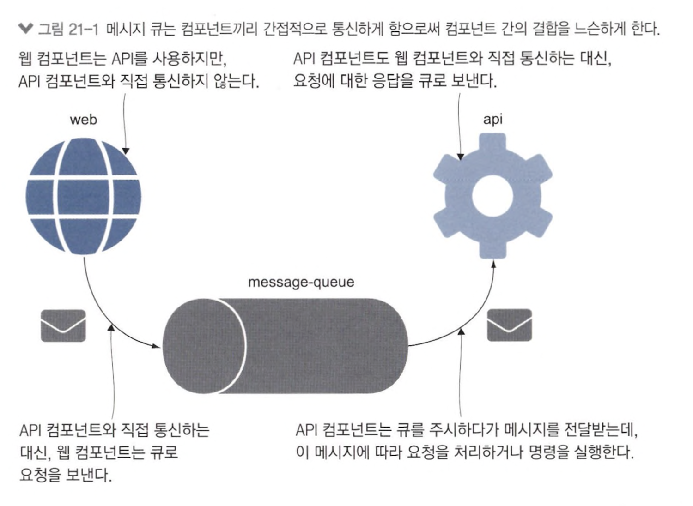

# 21장 메시지 큐를 이용한 비동기 통신

> ref) message vs event,  [회원시스템 이벤트기반 아키텍처 구축하기](https://techblog.woowahan.com/7835/)

<table>
<tr>
<td align="center">message</td><td align="center">event</td>
</tr>
<tr>
<td>

</td>
<td>

</td>
</tr>
</table>

## 21.1 비동기 메시징이란?

## 21.2 클라우드 네이티브 메시지 큐 사용하기

- application &harr; DB monolithic 구조에선 요청이 완료될 때까지 접속 유지 필요
- 사용자가 많아지면 DB max connection 초과 가능 
- 메시지 큐 도입 &rarr; DB 서버의 커넥션 수보다 훨씬 많은 메세지 처리 가능 + 접속 지속 시간 &darr; 

## 21.3 메시지 수신 및 처리

> message handler란, 큐를 구독하는 컴포넌트

- message queue buffer 역할하여 scaling 용이

- message handler &rarr; message consume하여 처리

- message handler scale-out 하여 round-robin load balancing
- 코드 수정 없이 처리 용량 &uarr; 

## 21.4 메시지 핸들러로 기능 추가하기

> `event-driven architecture`란, 이벤트를 통해 다른 구성 요소에 자신의 현재 상태 알리는 방식

- 이벤트 발행 로직을 변경 없이 이벤트 처리 로직 변경 가능
- 앱 간 느슨한 결합

- 서로 다른 처리가 각각의 컨테이너에서 동작
- UI가 처리 끝나길 기다릴 필요 x
- 처리 시간이 달라도 사용자 경험 영향 x
- 아무리 사용자 많더라도 지연 시간 고정

## 21.5 비동기 메시징 패턴 이해하기

> `pub-sub` pattern

- publisher가 메세지를 사용하는 주체나 처리 방안, 처리 끝나는 시점 알 방법 x 
&rArr; `request-response` pattern 고안

- message queue message 전달 후 응답 기다림
- handler &rarr; message 처리 이후 응답 message queue 전달
- queue &rarr; message client에 전달

- `fire-and-forget` : 클라이언트가 명령 메세지 보내고 응답 기다리지 않는 패턴
- `scatter-gather` : 구독자에 메세지 보낸 다음 응답 모아오는 패턴