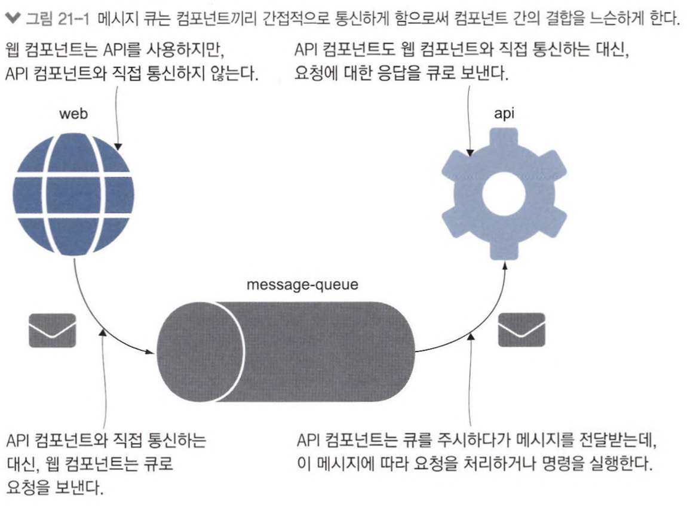
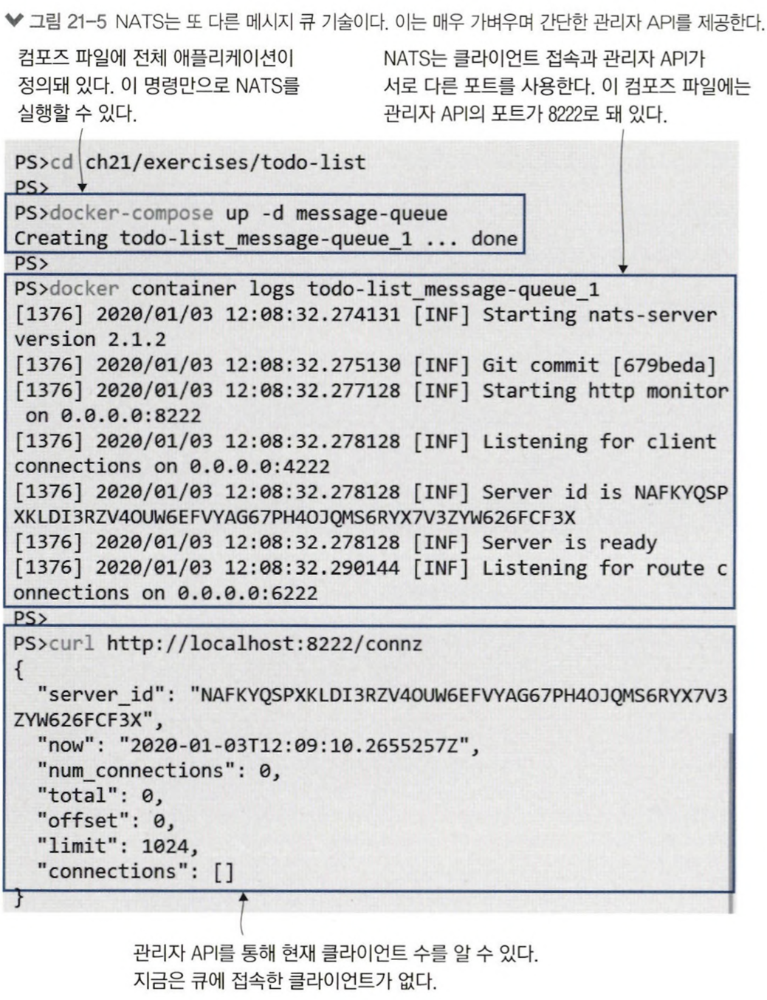
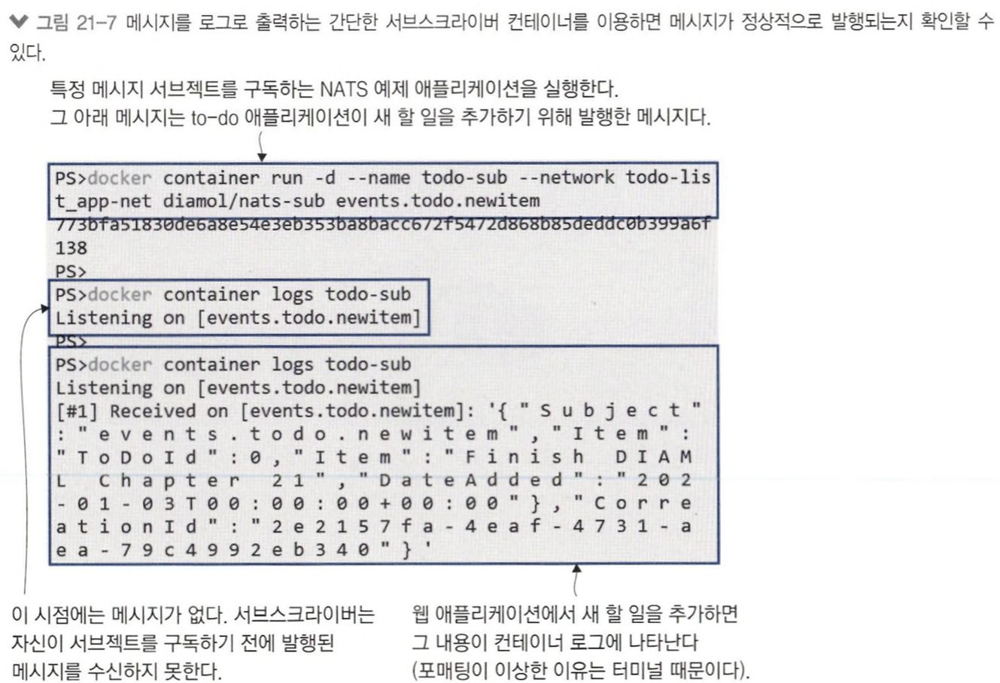
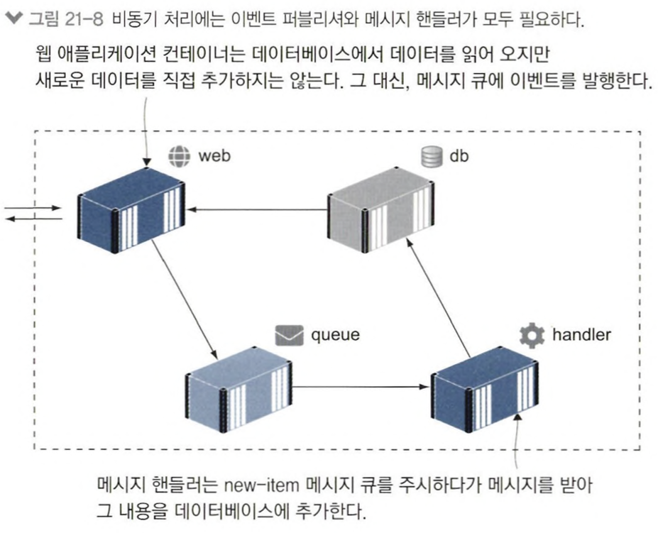
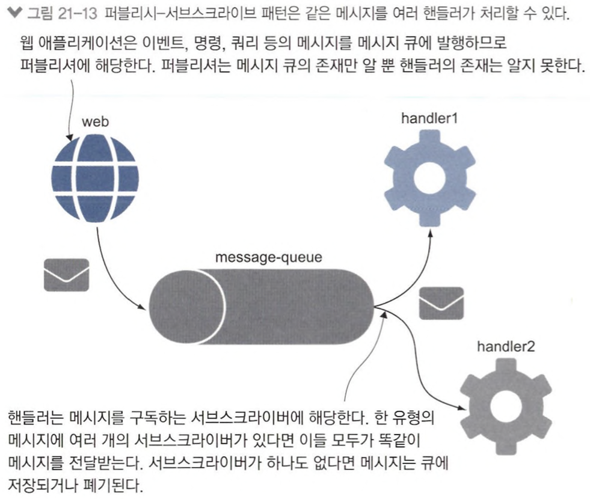
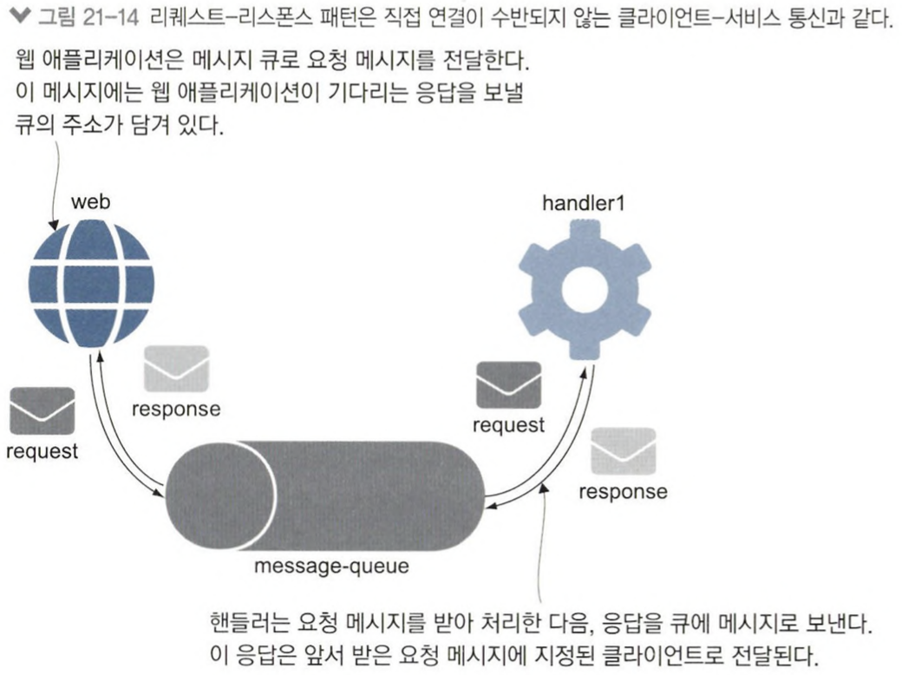

# 21장 메시지 큐를 이용한 비동기 통신

## 21.1 비동기 메시징이란?

비동기 통신을 적용하면 클라이언트와 서버 사이에 계층이 하나 끼어든다.

- 클라이언트 → 큐 → 서버
- 서버 → 큐 → 클라이언트
- 이메일과 유사



### 레디스 실행 결과 확인

- publisher - 메시지를 보내는 컴포넌트
- subscriber - 메시지를 받는 컴포넌트
- 다양한 시스템이 메시지 큐를 이용할 수 있으므로 `channel` 을 나눠 메시지 구분

```
# 레디스 클라이언트를 백그라운드로 실행해 메시지 전달
$ docker run -d --name publisher --network ch21 diamol/redis-cli -r 50 -i 5 PUBLISH channel21 ping
Unable to find image 'diamol/redis-cli:latest' locally
latest: Pulling from diamol/redis-cli
29e5d40040c1: Already exists 
7c7050d23898: Already exists 
8982b178d819: Already exists 
8dcb1ec76457: Already exists 
8469b26dc9af: Already exists 
9626a3379caa: Already exists 
Digest: sha256:a283368e12ef711268ea70086e3152bb3198c960811b9371abec8358660bdcf6
Status: Downloaded newer image for diamol/redis-cli:latest
fa22e7f460de6da1a167be0c713736cc159fb4a989f28c0bd34ef31760fdd25e

# 메시지가 보내지는지 로그를 통해 확인한다.
$ docker logs publisher
0
0
```

---

## 21.2 클라우드 네이티브 메시지 큐 사용하기

### NATS

- CNCF에서 관리하는 프로젝트
- 메시지를 메모리에 저장해 속도가 매우 빠름
    
    → 컨테이너끼리 통신에 적합하다.
    


### 데드레터 큐 (DLQ)

메시지가 큐에 전달됐는데 이 큐를 구독하는 서브스크라이버가 없는 상황이라면, DLQ에 메시지를 저장해둔다.

- 레디스, NATS는 모두 메시지를 수산할 서브스크라이버가 없다면 해당 메시지를 그대로 버린다.
    
    → 서브스크라이버는 자신이 구독을 시작한 후 발생된 메시지만 수신할 수 있다.
    


---

## 21.3 메시지 수신 및 처리

큐를 구독하는 컴포넌트를 메시지 핸들러라고 한다.

to-do 애플리케이션에는 새 할 일 이벤트 메시지를 처리해 데이터를 데이터베이스에 추가하는 역할을 해 줄 메시지 핸들러가 필요하다.



📌 이 아키택처는 스케일링이 용이하다.

- 메시지 큐가 급증하는 부하의 버퍼와 같은 역할을 한다.
- 사용자가 아무리 많아도 동시에 데이터 추가를 위해 들어오는 SQL 연결은 메시지 핸들러 개수로 제한된다.

## 비동기 메시징의 일관성

모든 메시지의 처리가 끝나면 애플리케이션의 데이터의 상태가 정확해지는데, 그 이전 시점에는 일관성이 깨질 수 있다.

### 해결 방법

`push model` : 모든 처리가 완료되고 데이터가 갱신됐음을 의미하는 이벤트를 기다렸다가 그에 맞춰 화면을 리프레시 한다.

---

## 21.4 메시지 핸들러로 기능 추가하기

### 이벤트 지향 아키택처

- 애플리케이션이 모든 일을 즉각 동기적으로 처리하는 대신 이벤트를 통해 다른 구성 요소에 자신의 현재 상태를 알리는 방식
- 이벤트를 발행하는 로직을 변경하지 않고도 이벤트 처리 로직을 바굴 수 있어 애플리케이션의 구성 요소 간 결합도를 느슨하게 하는 효과가 있다.

---

## 21.5 비동기 메시징 패턴 이해하기

### publish-subscribe 패턴

subscriber가 퍼블리시된 메시지를 구독하는 형태

- 이 패턴에서는 퍼블리셔가 메시지를 사용한 것이 누구고, 어떻게 처리하며, 언제 처리가 끝나는지 알 방법이 없다.



### request-response 패턴

1. 클라이언트가 메시지 큐에 메시지를 전달하고 응답을 기다린다.
2. 핸들러는 요청 메시지를 처리한 다음 응답 메시지를 메시지 큐에 보낸다.
3. 큐는 다시 이 메시지를 클라이언트에 전달한다.

