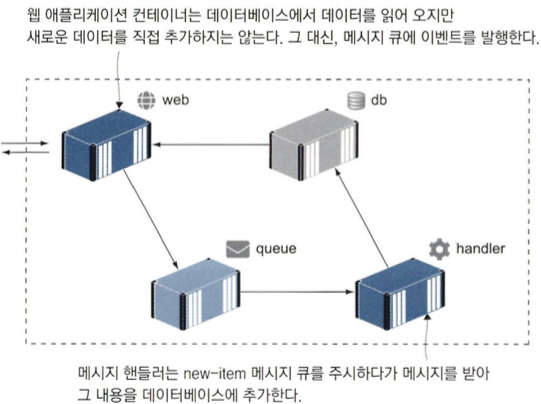
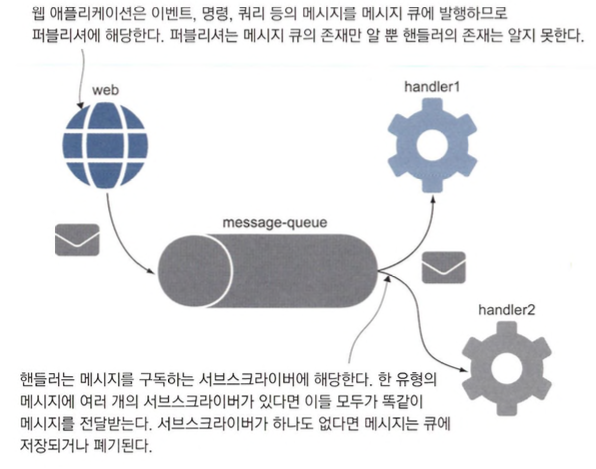
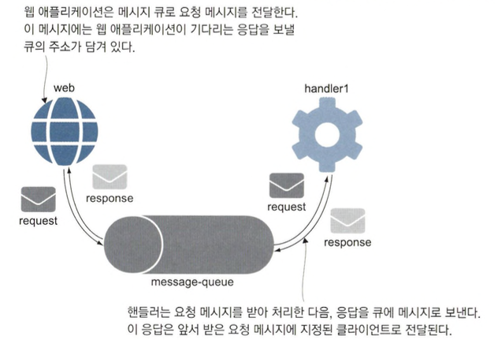

# 메시지 큐를 이용한 비동기 통신

- 메시지 큐는 컴포넌트끼리 직접 메시지를 주고받는 방식과 비교해 컴포넌트 간의 결합을 느슨하게 하는 효과가 있습니다.

## 비동기 메시징이란?

- 클라이언트가 서버에 요청할 것이 생기면, 서버에 직접 요청을 보내는 대신 큐에 요청, 서버는 큐를 주시하다 가 메시지를 수신하고 처리하고 처리가 끝나면 서버는 응답 메시지를 큐로 보냅니다. 클라이언트는 큐를 주시하며 서버가 보낸 메시지를 수신합니다.
- 경량 컨테이너에서 메시지 큐를 실행하면 애플리케이션마다 별도의 전용 메시지 큐를 둘 수 있습니다.

```shell
docker network create ch21
docker container run -d --name redis --network ch21 diamol/redis
docker container logs redis --tail 1
```

- redis 컨테이너를 실행하는 예제입니다.

```shell
docker run -d --name publisher --network ch21 diamol/redis-cli -r 50 -i 5 PUBLISH channel21 ping
docker logs publisher
```

- 메시지를 publish하는 예제입니다.
- 메시지 큐 환경에서 모든 컴포넌트는 메시지 큐의 클라이언트가 되는데 메시지를 보내는 컴포넌트는 publisher, 받는 컴포넌트는 subscriber라고합니다.

```shell
docker run -it --network ch21 --name subscriber diamol/redis-cli SUBSCRIBE channel21
```

- subscribe하는 컨테이너 실행 예제입니다.

## 클라우드 네이티브 메시지 큐 사용하기

```shell
docker-compose up -d message-queue
docker logs todo-list-message-queue-1
curl http://localhost:8222/connz
```

- NATS(큐 기술) 컨테이너를 실행하는 예제입니다.

```shell
docker-compose up -d todo-web todo-db
```

- todo app이고 `http://localhost:8080/`로 접속가능합니다.
- 메시지 큐 시스템은 메시지가 큐에 전달됐는데 이 큐를 구독하는 서브스크라이버가 없는 상황이 발생하면. 관리자가 대신 처리할 수 있도록 데드-레터 큐에 이 메시지를 모아 두거나 해당 큐에 서브스크라이버가 생길 때까지 메시지를 저장해 두는 방법을 사용하기도 합니다.

```shell
docker run -d --name todo-sub --network todo-list_app-net diamol/nats-sub events.todo.newitem
docker logs todo-sub
```

- `http://localhost:8080/`접속하여 할일추가 후 `docker logs todo-sub`로 조회하는 예제입니다.

### 메시지 수신 및 처리



- 큐를 구독하는 컴포넌트를 메시지 핸들러부릅니다.
- 이 아키텍처는 메시지 큐가 급증하는 부하의 버퍼와도 같은 역할을 하기 때문에 스케일링이 용이합니다.

```shell
docker-compose up -d save-handler
docker logs todo-list-save-handler-1
```

- 메시지 핸들러를 추가한 예제입니다.(컨테이너 실행시 컨테이너 내부 에러발생)

```shell
docker-compose up -d --scale save-handler=3
docker logs todo-list-save-handler-2
docker-compose logs --tail=1 save-handler
```

- 메시지 핸들러를 늘려서 SQL커넥션 풀을 늘리지 않는 예시입니다.

## 메시지핸들러로 기능 추가하기

- 새로운 메시지 핸들러의 그룹을 만들고 모든 메시지를 수 신하도록 하되 이벤트 처리를 다르게 하는 방식으로 새 기능을 추가할 수 있습니다.

```shell
docker-compose -f docker-compose.yml -f docker-compose-audit.yml up -d --scale save-handler=3
docker logs todo-list-save-handler-1
```

- 로그 찍으면 에러나옵니다....

```shell
docker-compose -f docker-compose.yml -f docker-compose-audit.yml -f docker-compose-api.yml up -d todo-api
curl http://localhost:8081/todo -d '{"item":"홍보 비디오 촬영"}' -H 'Content-Type: application/json'
docker logs todo-list-todo-api-1
```

- `8081`포트로 새 할일 추가 API가 있는 컴포즈 오버라이드 파일을 실행하는 예제입니다.
- 비동기 메시징을 사용하면 스케일링과 업데이트가 쉬운 유연한 애플리케이션을 만들 수 있습니다.

## 비동기 메시징 패턴 이해하기

- pub-sub 패턴



- request-response 패턴



- fire-ancl-forget 패턴

  클라이언트가 요청이 아닌 명령 메시지를 보내고 응답은 기다리지 않는 패턴

- scatter-gather 패턴

  여러 서브스크라이버에 메시지를 보낸 다음 이들로부터 응답을 모아 오는 패턴
