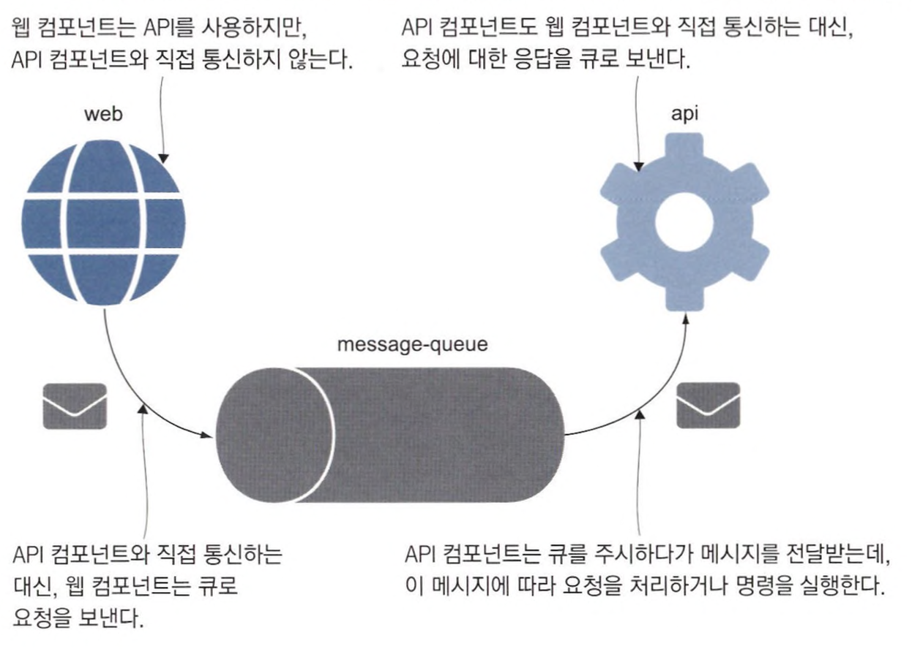
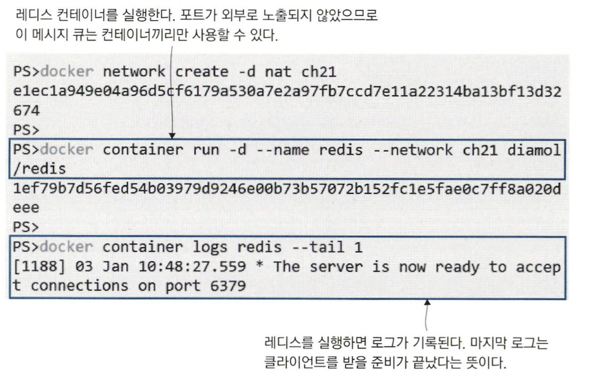
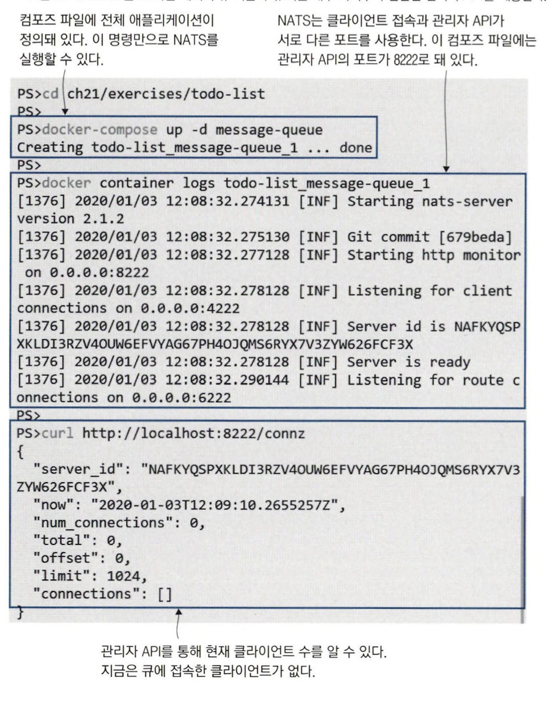
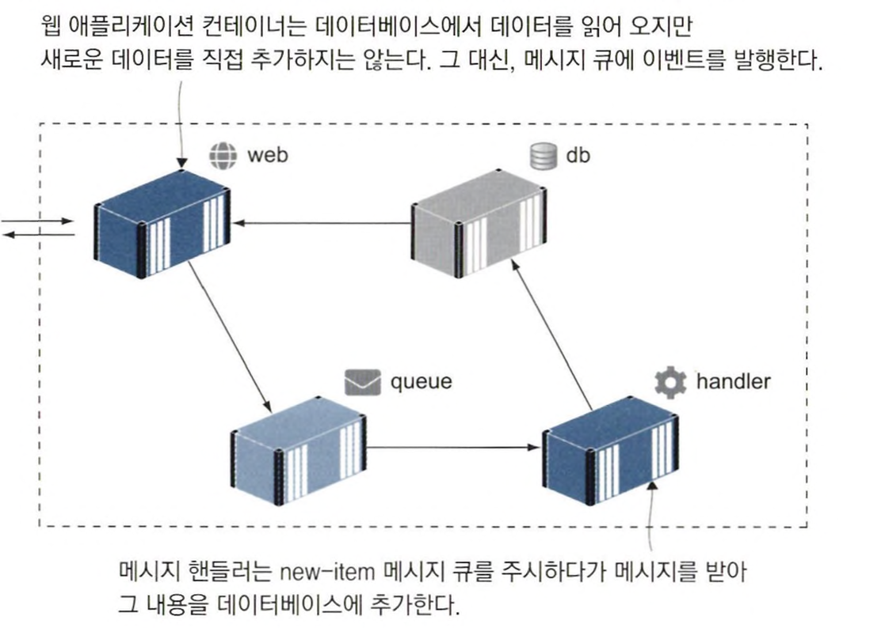
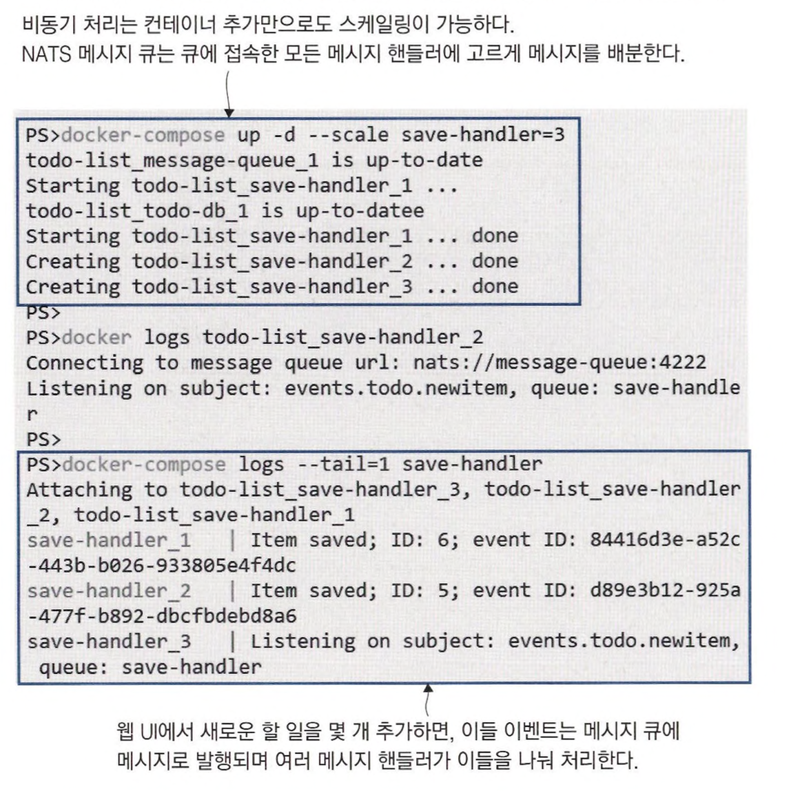
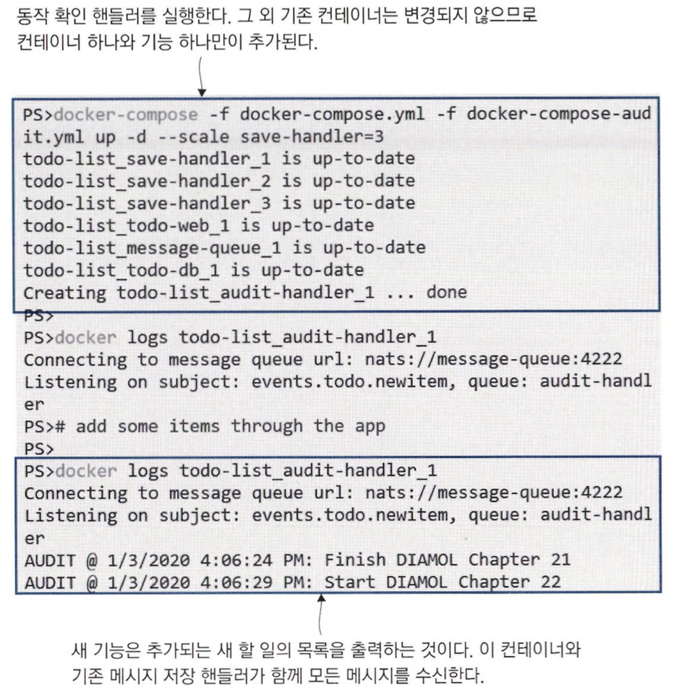
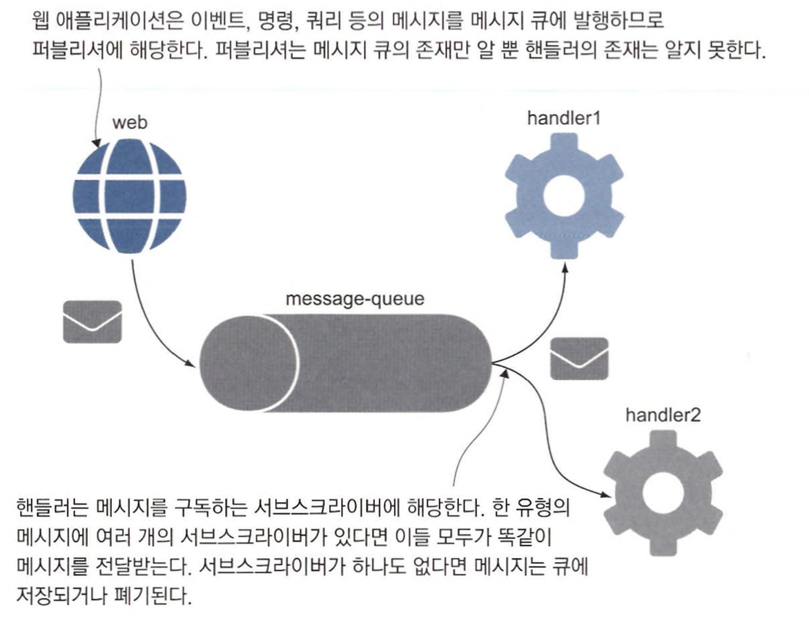
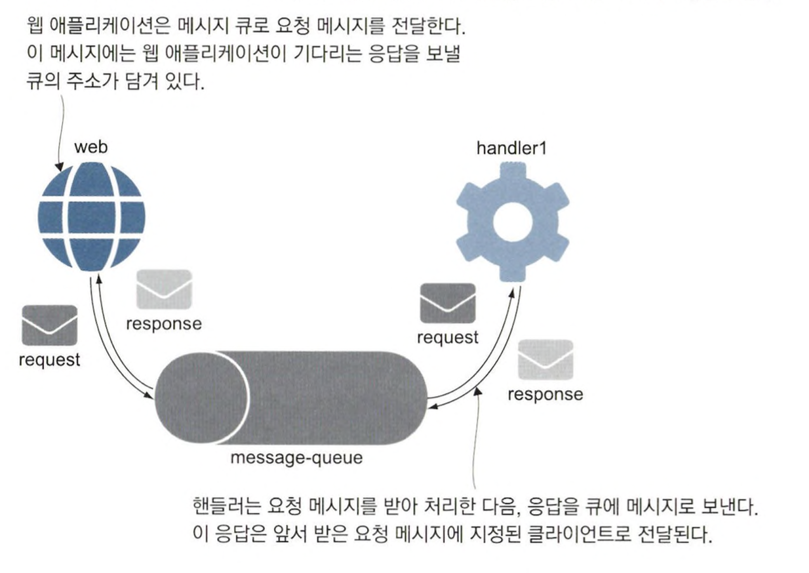

# 메시지 큐를 이용한 비동기 통신

 

## 비동기 메시징이란 ?

비동기 통신을 적용하면 클라이언트와 서버 사이에 계층이 하나 끼어든다. 클라이언트가 서버에 요청할 것이 생기면, 서버에 직접 요청을 보내는 대신 큐에 요청을 보낸다.   
서버는 큐를 주시하다가 메시지를 수신하고 처리한다. 처리가 끝나면 서버는 응답 메시지를 큐로 보낸다.

이는 서버가 다운되거나 기능이 완전하지 않을 때도 서버의 기능이 회복될 때까지 메시지는 메시지 큐에 대기하며,  
응답 처리 시간이 오래 걸리더라도 클라이언트나 메시지 큐에는 아무 영향을 미치지 못한다.

> 큐를 제공하는 기술의 신뢰성이 매우 뛰어나야 하고. 이러한 큐 기술의 사용료가 너무 비싸기 때 문에 테스트 환경까지 동일하게 도입할 수 없으므로  
> 운영 환경과 테스트 환경의 괴리를 견디거나 개발 환경 또는 테스트 환경에서는 큐 자체를 생략해야 한다는 문제들이 있다.  
> 도커를 사용하면 오픈 소스 큐 시스템을 도입해 이러한 문제를 해결할 수 있다.

 

메시지 큐는 우리가 직접 종료시킬 때까지 계속 동작하는 서버다.  
레디스 서버는 6379번 포트를 주시하며, 이 주소를 통해 서버와 클라이언트가 메시지를 주고받는다.

 

## 클라우드 네이티브 메시지 큐 사용하기

컴포넌트 간의 모든 통신이 동기적으로 이뤄지면, *(DB와 애플리케이션 서버)*  
웹 애플리케이션이 쿼리를 보내거나 데이터를 추가하려면 데이터베이스 서버에 접속해 요청이 완료될 때까지 접속을 유지해야 한다.  
이는 확장성이 좋지 못해 사용자가 많아지면 데이터베이스 서버의 최대 커넥션 수를 초과하고 애플리케이션이 오류를 일으킬 것이다.

이런 상황에 메시지 큐를 도입하면 성능과 확장성을 함께 개선할 수 있다.  
큐는 데이터베이스 서버의 커넥션 수보다 훨씬 많은 수의 퍼블리셔를 처리할 수 있으며, 필요한 접속의 지속시간도 훨씬 짧다.  

> 여기선 큐 기술인 NATS 사용해 봄  
> NATS는 메시지를 메모리에 저장해서, 속도가 매우 빠르고 컨테이너끼리의 통신에 적합하다.

 

> 비동기 메시징에서 발생하는 사이드 이펙트 중 **결과적 일관성(eventual consistency)** 이라는 것이 있다.  
> 모든 메시지의 처리가 끝나면 애플리케이션 데이터의 상태가 정확해지는데, 그 이전 시점에는 일관성이 깨질 수 있다.  
> 웹 애플리케이션이 ‘모든 메시지의 처리가 끝남’을 의미하는 이벤트를 기다렸다가 그에 맞춰 화면을 리프레시하면 된다.

 

메시지 핸들러의 수를 늘려 SQL 커넥션 풀의 수를 늘리지 않고도 증가하는 부하에 대응할 수 있다.  
NATS는 라운드 로빈 방식의 로드 밸런싱을 통해 서브스크라이버에 메시지를 분배할 수 있다.  
*메시지 핸들러를 여러 개 만들면 로드 밸런싱이 적용돼 스케일링이 간편하다.*

 

## 메시지 핸들러로 기능 추가하기

새 기능을 추가하는 가장 쉬운 방법은 새로운 메시지 핸들러의 그룹을 만들고 모든 메시지를 수신하도록 하되 이벤트 처리를 다르게 하는 것이다.  

> 이제 사용자가 새 할 일을 추가하면 두 가지 처리가 함께 일어난다.  
> 웹 UI가 이들 처리가 끝나기를 기다릴 필요가 없으므로 서로 처리 시간이 달라도 사용자 경험에 영향을 미치지 않는다.

 

## 비동기 메시징 패턴 이해하기

### pub-sub 패턴

서브스크라이버(0개 이상)가 퍼블리시된 메시지를 구독하는 형태

### req-res 패턴

pub-sub 패턴은 퍼블리셔가 메시지 를 사용하는 것이 누구이고, 어떻게 처리하며, 언제 처리가 끝나는지를 알 방법이 없다.  
req-res 패턴은 클라이언트가 메시지 큐에 메시지를 전달하고 응답을 기다린다.  
핸들러는 요청 메시지를 처리한 다음 응답 메시지를 메시지 큐에 보내고, 큐는 다시 이 메시지를 클라이언트에 전달한다.

