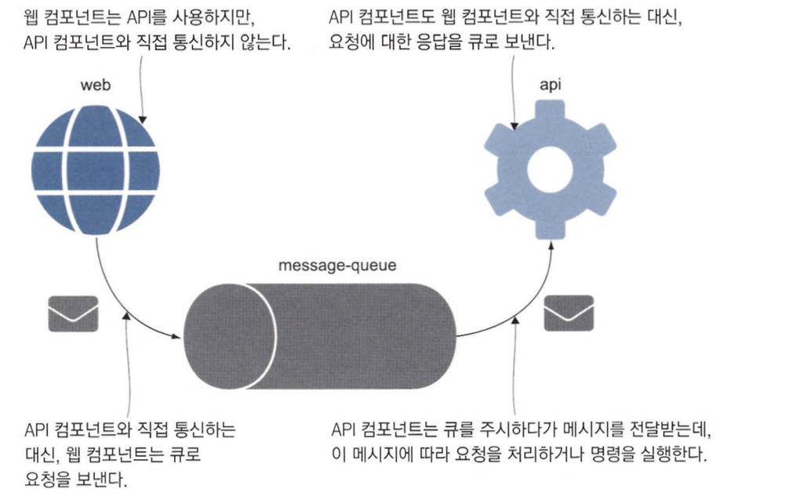
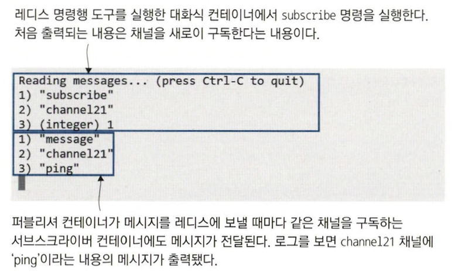
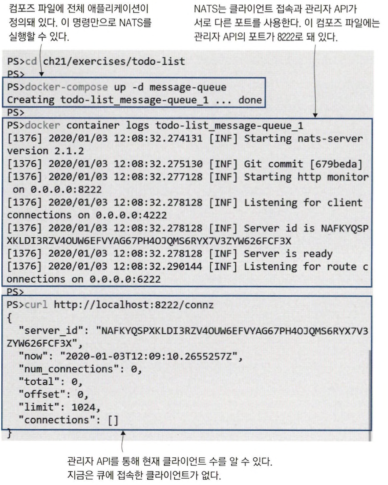
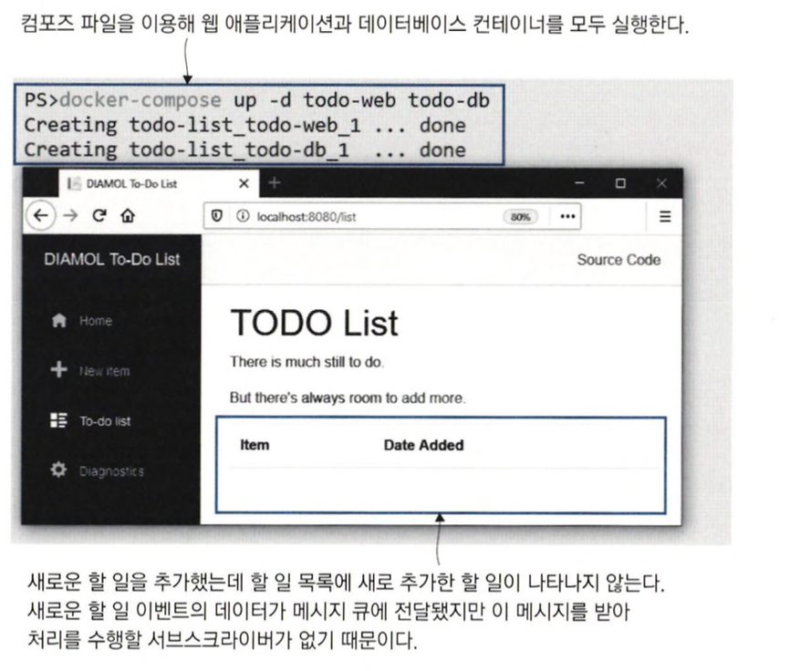
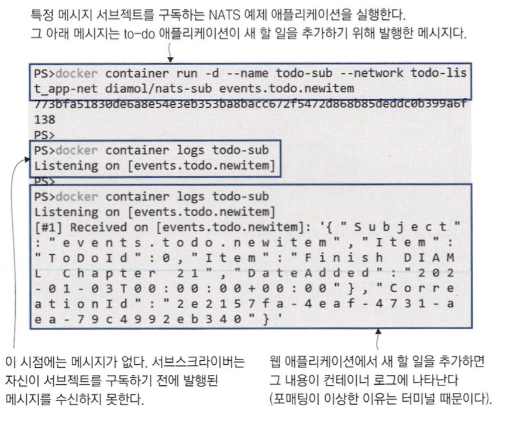
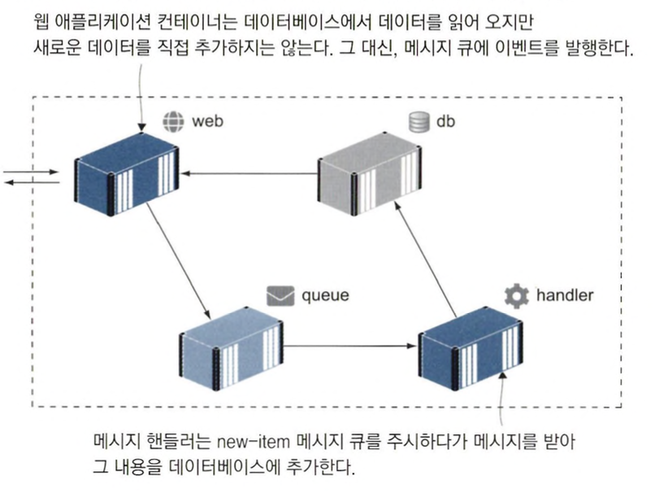
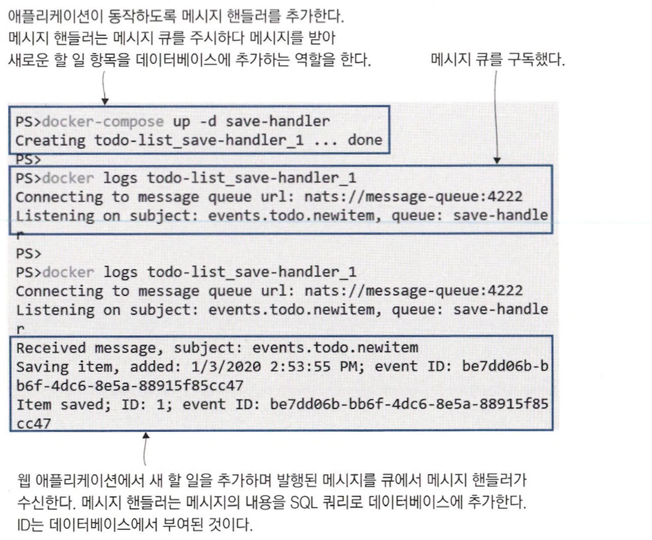
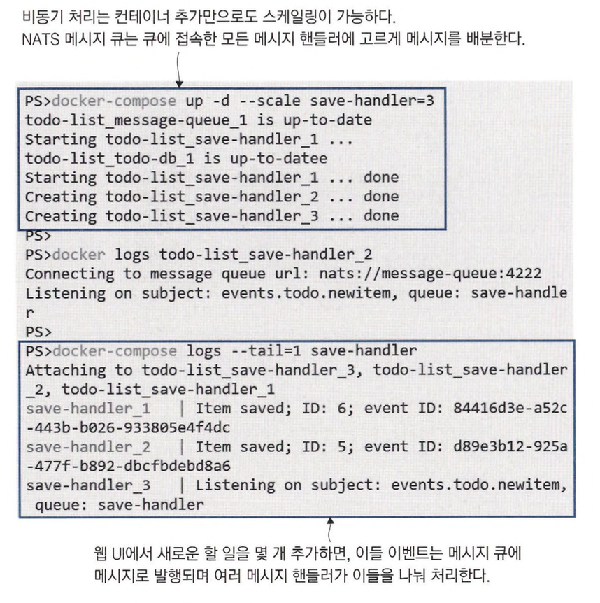
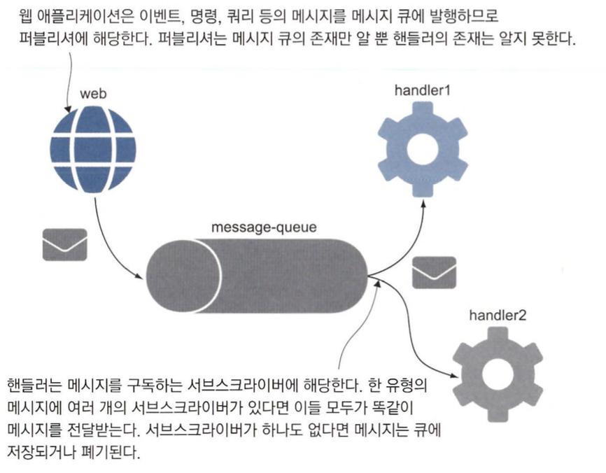
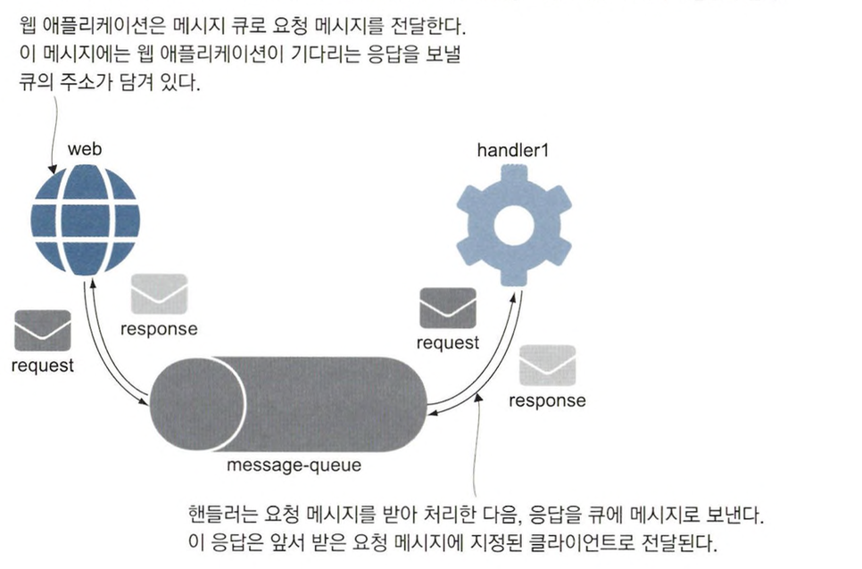

# 메세지 큐를 이용한 비동기 통신

## 비동기 메시징이란?

### 동기적 통신

소프트웨어의 컴포넌트는 대개 동기적으로 통신합니다.

이는 클라이언트가 서버에 접속하고 요청을 보내고, 서버의 응답을 기다린 다음 접속을 종료하는 전체 과정이 동기적으로 이루어진다는 뜻입니다.

동기적 통신을 하는 경우 다음과 같은 상황에서 문제가 발생할 수 있습니다.

- 서버가 다운된 경우
- 응답 처리에 오랜 시간이 걸리는 경우
- 네트워크 수준에서 접속에 실패한 경우 클라이언트가 이를 파악해야 재요청을 보낼 수 있음

이런 예외를 처리하기 위해서는 애플리케이션 코드에 복잡한 로직이 필요할 수 있습니다.

### 비동기 통신 적용하기

비동기 통신을 적용하려면 클라이언트와 서버 사이에 계층이 하나 끼어듭니다.

클라이언트가 서버에 요청할 것이 생기면 서버에 직접 요청을 보내는 대신 큐에 요청을 보냅니다.

서버는 큐를 주시하다가 메시지를 수신하고 처리합니다.

다음은 비동기 메시징 통신 과정을 나타낸 그림입니다.



통합 아키텍처를 설기할 때 메시징은 아주 매력적이지만 몇가지 문제가 존재합니다.

- 큐를 제공하는 기술의 신뢰성이 뛰어나야 한다.
- 큐 기술의 사용량이 비싸다

도커를 사용하면 엔터프라이즈급 안정성을 갖춘 오픈 소스 큐 시스템을 도입해 이러한 문제를 해결할 수 있습니다.

경량 컨테이너에서 메시지 큐를 실행하면 애플리케이션 마다 별도의 전용 메시지 큐를 둘 수 있습니다.

또한, 모든 환경에서 동일하게 도입할 수 있게 됩니다.

### 레디스를 큐로 사용하기

레디스를 활용하여 비동기 메시지큐를 구현할 수 있습니다.

다음은 레디스 컨테이너를 띄우는 과정입니다.

```bash
# 도커 네트워크 생성하기
docker network create ch21

# 레디스 서버 실행하기
docker container run -d --name redis --network ch21 diamol/redis

# 서버가 정상적으로 실행됐는지 확인하기
docker container logs redis --tail 1

```

클라이언트가 메시지를 보내려면 큐에 접속해야 합니다.

다음은 레디스에 접속하여 메시지를 전달하는 예제입니다.

```bash
# 레디스 클라이언트를 백그라운드로 실행해 메시지를 전달한다
docker run -d --name publisher --network ch21 diamol/redis-cli -r 50 -i 5 PUBLISH channel21 ping

# 메시지가 보내지는지 로그를 통해 확인한다
docker logs publisher 
```

해당 명령을 실행시키면 컨테이너가 백그라운로 실행되며 5초에 한번씩 실행됩니다.

### 퍼블리셔와 서브스크라이버

메시지 큐 환경에서 모든 컴포넌트는 클라이언트가 됩니다.

클라이언트들은 사용하는 방식에 따라 다음과 같이 부르게 됩니다.

- 퍼블리셔(Publisher)
    - 메지를 보내는 컴포넌트
- 서브스크라이버(Subscriber)
    - 메시지를 받는 컴포넌트

이에 다양한 시스템이 메시지 큐를 이용할 수 있기 때문에 채널을 나눠 메시지를 구분하게 됩니다.

다음은 채널을 구독(subscribe)하는 예시입니다.

```bash
# 대화식 컨테이너를 실행해 채널을 구독하면
# 5초마다 한 번씩 메시지를 전달받는다
docker run -it --network ch21 --name subscriber diamol/redis-cli SUBSCRIBE channel21
```

다음은 채널을 구독하고 있을때 메시지가 전달되었을 때의 예시입니다.



### 비동기 통신을 통해 성능과 확장성 개선하기

메시지 큐를 이용한 비동기 통신의 경우 메시지 전달자와 수신자의 결합을 느슨하게 하는 방법으로 애플리케이션의 성능과 확장성을 개선할 수 있습니다.

## 클라우드 네이티브 메시지큐 사용하기

### NATS

NATS는 CNCF에서 관리하는 프로젝트로, 높은 완성도와 신뢰도를 바탕으로 널리 쓰이고 있습니다.

NATS는 메시지를 메모리에 저장하며, 속도가 매우 빠르고 컨테이너 간의 통신에 적합합니다.

다음은 NATS를 사용하는 간단한 예제입니다.

```bash
# 실습 디렉터리로 이동
cd ch21/exercises/todo-list

# 메시지 큐 컨테이너 실행
docker-compose up -d message-queue

# 로그 확인하기
docker container logs todo-list_message-queue_1

# 현재 메시지 큐의 클라이언트 수 확인하기
curl http://localhost:8222/connz
```

위의 명령을 실행하면 접속 수 API를 호출했을 때 연결된 클라이언트의 수를 알려주는 JSON 문서를 반환합니다.

다음은 실행한 결과입니다.



NATS에 메시지를 추가하기 위해 닷넷 코어에 다음에 코드를 추가할 수 있습니다.

```csharp
public void AddToDo(ToDo todo)
{
	MessageQueue.Publish(new NewItemEvent(todo));
	_NewTasksCounter.Inc();
}
```

### NATS Subject

NATS는 채널 개념이 없으며, 대신에 모든 메시지에는 서브젝트가 부여됩니다.

이 서브젝트를 통해 메시지의 유형을 구분하며, 서브젝트에 원하는 명명 규칙을 적용할 수 있습니다.

```csharp
// 예시
events.todo.newitem
```

이를 통해 서브스크라이버는 각자 자신이 관심이 있다면 해당 서브젝트를 구독하면 됩니다.

다음과 같이 구독하지 않으면 애플리케이션을 실행하더라도 데이터를 볼 수 없게 됩니다.



### 메시지큐에 전달됐는데 큐를 구독하는 서브스크라이버가 없는 경우

메시지 큐에서 메시지가 전달됐을 때 서브스크라이버가 없는 경우 보통 다음과 같이 처리하게 됩니다.

- 관리자가 처리할 수 있도록 데드레터 큐에 메시지를 모아둔다.
- 메시지를 모아 두거나 해당 큐에 서브스크라이버가 생길 때 까지 메시지를 저장해 두는 방법을 사용합니다.
- 그대로 메시지를 삭제한다.

레디스와 NATS의 경우 서브스크라이버가 없으면 해당 메시지를 그대로 버리는 방식을 취합니다.

그러므로, 레디스 또는 NATS는 구독한 시점 이후부터 발행된 메시지만 수신할 수 있습니다.

### NATS 서브스크라이버 등록하기

다음은 NATS 서브스크라이버를 등록하는 컨테이너를 실행하는 예제입니다.

```bash
# 'events.todo.newitem' 서브젝트 메시지를
# 수신하는 서브스크라이버 실행
docker container run -d --name todo-sub --network todo-list_app-net diamol/nats-sub events.todo.newitem

# 서브 스크라이버의 컨테이너 로그 확인
```

이제 메시지를 발행하면 다음과 같이 구독한 서브스크라이버는 메시지를 수신할 수 있게 됩니다.



## 메시지 수신 및 처리

### 메시지 핸들러

큐를 구독하는 컴포넌트를 메시지 핸들러라고 합니다.

대게 메시지의 종류마다 이를 처리하는 메시지 핸들러가 하나씩 필요합니다.

다음은 메시지큐를 이용하는 애플리케이션의 아키텍처를 간략하게 그린 그림입니다.



이러한 아키텍처는 메시지 큐가 금증하는 부하의 버퍼와도 같은 역할을 하기 때문에 스케일링이 용이 합니다.

웹 컨테이너가 수백 개 있더라도 메시지 핸들러 컨테이너는 열 개면 충분합니다.

메시지 핸들러라는 그룹으로 묶어 두고 돌아가면서 큐에 들어온 메시지를 처리하게 하면 됩니다.

메시지는 한 번에 하나씩 처리하므로 사용자가 아무리 많더라도 메시지 핸들러의 개수만큼 SQL 연결이 이루어지게 됩니다.

메시지는 큐에 저장된 상태로 자신의 차례를 기다리고 시간이 지남에 따라 정상적으로 저장되게 됩니다.

다음은 핸들러 컨테이너를 실행하는 명령입니다.

```bash
# 메시지 핸들러 컨테이너 시작
docker-compose up -d save-handler

# 컨테이너 로그 확인
docker logs todo-list_save-handler_1

# 웹 브라우저에서 http://localhost:8080에 접근해 새로운 할 일 추가

# 이벤트가 잘 처리되는 확인
docker logs todo-list_save-handler_1
```

애플리케이션이 다시 잘 동작하는 것을 볼 수 있습니다.



### 결과적 일관성

작업은 잘 처리되지만 작업이 완료되는데 약간의 시간이 발생하게 됩니다.

비동기 메시징에서 발생하는 이러한 부수 효과를 결과적 일관성이라고 부릅니다.

모든 메시지의 처리가 끝나면 애플리케이션 데이터의 상태가 정확해지는데, 그 이전 시점에는 일관성이 깨질 수 있습니다.

이를 해결하기 위해 웹 애플리케이션이 모든 메시지의 처리를 끝내고 할 일 목록이 갱신 됐음을 의미하는 이벤트를 기다렸다가 그에 맞춰 화면을 리프레시하면 됩니다.

이러한 모델은 풀링모델보다 훨씬 효율적으로 동작하게 됩니다.

### 메시지 핸들러를 추가하여 부하 대응하기

큐를 사용할때 메시지 핸들러를 추가하면 메시지 부하에도 대응할 수 있게 됩니다.

다음은 hanlder를 추가하기 위해 컨테이너를 생성하는 명령입니다.

```bash
docker-compose up -d --scale save-handler=3
```

메시지가 처리되는 것을 보면 각각의 컨테이너가 처리하고 있는 것을 볼 수 있습니다.



## 메시지 핸들러로 기능 추가하기

### 이벤트 지향 아키텍처

지금까지 애플리케이션의 아키텍처를 메시지 큐를 이용하여 이벤트 지향 아키텍처로 변경하는 과정을 경험했습니다.

이벤트 지향 아키텍처는 애플리케이션이 모든 일을 즉각 동기적으로 처리하는 대신 이벤트를 통해 다른 구성 요소에 자신의 현재 상태를 알리는 방식을 말합니다.

이벤트를 발행하는 로직을 변경하지 않고도 이벤트 처리 로직을 바꿀 수 있으므로 애플리케이션의 구성 요소 간 결합도를 느슨하게 하는 효과가 있습니다.

지금은 이벤트를 한 가지만 사용하지만, 이것만으로도 기존 애플리케이션을 변경하지 않고 새 기능을 추가할 수 있는 유연성을 갖추고 있습니다.

### 메시지 핸들러를 이용하여 새 기능 추가하기

현재 아키텍처에서 새 기능을 추가하는 가장 쉬운 방법은 새로운 메시지 핸들러의 그룹을 만들고 모든 메시지를 수신하도록 하되 이벤트 처리를 다르게 하는 것 입니다.

데이터베이스에 데이터를 저장하는 역할을 하는 기존 메시지 핸들러와 달리, 새로운 메시지 핸들러는 데이터를 엘라스틱서치에 저장해 키바나에서 그 내용을 검색하게 할 수 도 있습니다.

이렇게 기능을 추가하면 기존 컨테이너는 수정이 일어나지 않고 신규 기능에 대한 컨테이너만 실행시키면 되기 때문에 배포할 때 부담이 크게 낮아집니다.

## 비동기 메시지 패턴 이해하기

### 도커를 이용하여 진입장벽 낮추기

비동기 메시징은 고급 주제이지만, 도커를 이용해 진입 장벽을 상당히 낮출 수 있습니다.

메시지 큐를 컨테이너로 실행하고 이벤트를 발행하는 애플리케이션을 빠르게 프로토타이핑할 수 있기 때문입니다.

### pub/sub 패턴

현재까지 애플리케이션 구성할때 사용한 비동기 메시징 패턴은 pub/sub(퍼블리시-서브스크라이브) 패턴입니다.

이 패턴은 서브스크라이버가 퍼블리시된 메시지를 구독하는 형태입니다.



상황에 따라서 pub/sub 패턴이 적합하지 않을 수 있습니다.

이 패턴에서는 퍼블리셔가 메시지를 사용하는 것이 누구이고 어떻게 처리하며 언제 끝나는지 알 수 있는 방법이 없습니다.

### 리퀘스트-리스폰스 패턴

이를 해결할 수 있는 패턴이 리퀘스트-리스폰스 패턴입니다.

이 패턴에서는 클라이언트가 메시지 큐에 메시지를 전달하고 응답을 기다립니다.

핸들러는 요청 메시지를 처리한 다음 응답메시지를 메시지 큐에 보내고 큐는 다시 클라이언트에 전달하게 됩니다.

이 패턴은 과부하를 일으키지 않는 핸들러와 클라이언트가 기다리는 동안 다른 작업을 할 수 있다는 비동기 메시징의 장점을 그대로 유지하면서도 일반적인 동기 서비스 호출을 대체할 수 있습니다.

